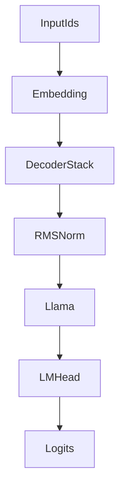

# Llama Graph Modules Plan

## Context

- The Python reference defines the expected tensor layout for attention and uses explicit Q/K/V projections + SDPA. The C++ modules should match these shapes and semantics.
```36:44:wrappers/python/nntile/model/llama_attention.py
    Input/output shapes follow the NNTile convention:
        x: (hidden_size, seq_len, batch)
        y: (hidden_size, seq_len, batch)
```


## Plan

- **Expand graph op surface to cover Llama needs.**
  - Update [`include/nntile/graph/logical_graph.hh`](include/nntile/graph/logical_graph.hh) to add attribute structs needed for new ops (e.g., `TransposeAttrs{ndim}`, `SliceAttrs{axis, alpha, beta}`, `CopyIntersectionAttrs{src_offset,dst_offset}`), and extend `OpAttrs` accordingly.
  - Add logical builders in [`include/nntile/graph/logical_graph_ops.hh`](include/nntile/graph/logical_graph_ops.hh) + [`src/graph/logical_graph_ops.cc`](src/graph/logical_graph_ops.cc) for operations used by Llama/RMSNorm/SDPA: `transpose`, `rope`, `rope_backward`, `add_slice_inplace`, `sum_slice`, `sumprod_slice/fiber`, `multiply_slice/fiber`, `mask_scalar`, `maxsumexp`, `softmax_inplace`, `copy_intersection`, and `flash_sdpa_fwd/bwd`.
  - Implement compiled executors in [`include/nntile/graph/compiled_graph_ops.hh`](include/nntile/graph/compiled_graph_ops.hh) + [`src/graph/compiled_graph_ops.cc`](src/graph/compiled_graph_ops.cc) and wire them into [`src/graph/compiled_graph.cc`](src/graph/compiled_graph.cc) (execute switch + `validate_operation_data_types`). Ensure flash SDPA validation only allows `FP16`/`BF16` and that mask dtype checks align with flash/vanilla paths.

- **Add core module building blocks in C++.**
  - Create module classes under [`include/nntile/module/`](include/nntile/module/) and [`src/module/`](src/module/) for `Embedding`, `RMSNorm`, `Add`, `Multiply`, `Silu` (or a generic activation with SiLU mode), and `Sdpa` (vanilla + flash). Mirror the Python layer semantics from `wrappers/python/nntile/layer/*` (especially `embedding.py`, `rms_norm.py`, `add.py`, `multiply.py`, `sdpa.py`).
  - Follow existing patterns from [`include/nntile/module/linear.hh`](include/nntile/module/linear.hh) and [`src/module/linear.cc`](src/module/linear.cc) for parameter registration and forward/backward graph construction.

- **Introduce KV-cache helpers for graph-time caching.**
  - Add a small cache utility (e.g., [`include/nntile/module/kv_cache.hh`](include/nntile/module/kv_cache.hh) + [`src/module/kv_cache.cc`](src/module/kv_cache.cc)) mirroring Python’s `KVCache`/`KVCacheStorage` behavior.
  - Define cache tensors with max length and use `copy_intersection` ops with explicit offsets to append new K/V slices. Document that cache offsets are fixed per graph build (i.e., rebuild graph per decode step if `cache_length` changes).

- **Implement Llama modules (graph-based).**
  - Add [`include/nntile/module/llama_config.hh`](include/nntile/module/llama_config.hh) for configuration (ports of `LlamaConfigNNTile`).
  - Implement [`include/nntile/module/llama_attention.hh`](include/nntile/module/llama_attention.hh) + [`src/module/llama_attention.cc`](src/module/llama_attention.cc) with Q/K/V projections, transpose to head layout, RoPE, KV repeat (`add_slice_inplace`), SDPA (flash if enabled and dtype is FP16/BF16; otherwise vanilla), and output projection.
  - Implement [`include/nntile/module/llama_mlp.hh`](include/nntile/module/llama_mlp.hh) + [`src/module/llama_mlp.cc`](src/module/llama_mlp.cc) with gate+SiLU, up-proj, elementwise multiply, down-proj.
  - Implement [`include/nntile/module/llama_decoder.hh`](include/nntile/module/llama_decoder.hh) + [`src/module/llama_decoder.cc`](src/module/llama_decoder.cc) with RMSNorm → attention → residual add → RMSNorm → MLP → residual add.
  - Implement [`include/nntile/module/llama.hh`](include/nntile/module/llama.hh) + [`src/module/llama.cc`](src/module/llama.cc) for embedding + decoder stack + final RMSNorm and [`include/nntile/module/llama_causal.hh`](include/nntile/module/llama_causal.hh) + [`src/module/llama_causal.cc`](src/module/llama_causal.cc) for LM head.
  - Export new headers via [`include/nntile/module.hh`](include/nntile/module.hh).

- **Tests + build wiring.**
  - Add unit tests in [`tests/module`](tests/module) to cover shape validation, dtype gating for flash SDPA, and a small graph build for LlamaAttention/Decoder.
  - Add graph op tests in [`tests/graph`](tests/graph) for new logical/compiled ops (transpose, rope, SDPA building blocks, copy_intersection offsets).
  - Update [`tests/module/CMakeLists.txt`](tests/module/CMakeLists.txt), [`src/CMakeLists.txt`](src/CMakeLists.txt), and [`include/CMakeLists.txt`](include/CMakeLists.txt) for new sources/headers.

## Architecture sketch


