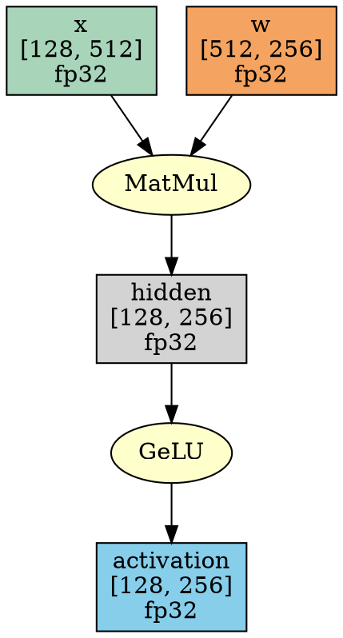
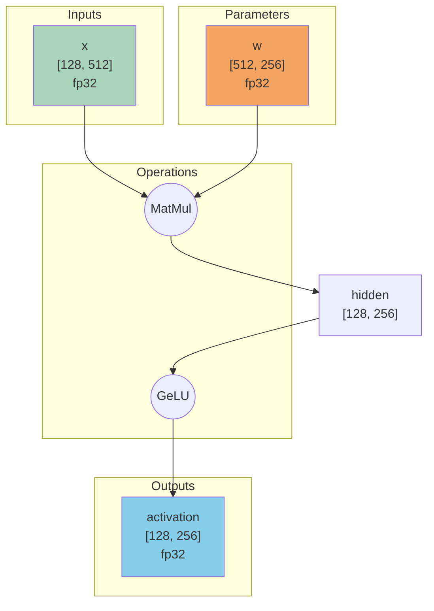

# NNTile 2.0 Architecture Design Plan

## Executive Summary

This document outlines the development plan for NNTile version 2.0, which introduces a **high-level computational graph abstraction** that enables automatic tensor distribution (FSDP/DDP-like functionality), task placement control, and multi-node distributed execution. The goal is to transform NNTile from a low-level tiled tensor framework into a production-ready distributed deep learning system while preserving the efficiency of the StarPU runtime.

---

## 1. Current Architecture Analysis

### 1.1 Existing Layer Structure

The current NNTile implementation consists of four abstraction layers:

| Layer | Location | Purpose | Current State |
|-------|----------|---------|---------------|
| **Kernel** | `src/kernel/` | Raw computational functions (CPU/CUDA) | ✅ Well-implemented |
| **StarPU** | `src/starpu/` | Task submission with data handles | ✅ Functional but lacks placement hints |
| **Tile** | `src/tile/` | Wrapper for single-tile operations | ⚠️ Largely redundant |
| **Tensor** | `src/tensor/` | Operations on tiled/distributed tensors | ⚠️ MPI disabled, manual distribution |
| **Python** | `wrappers/python/` | High-level layers, models, pipeline | ✅ Functional for single-node |

### 1.2 Identified Limitations

1. **MPI Support Disabled**: The `config.hh` file contains fake MPI functions:
   ```cpp
   static int starpu_mpi_world_size() { return 1; }
   static int starpu_mpi_world_rank() { return 0; }
   ```

2. **Manual Tensor Distribution**: Users must explicitly specify tile distribution vectors:
   ```cpp
   std::vector<int> tile_distr(grid.nelems, 0);  // All tiles on node 0
   ```

3. **No Task Placement Control**: StarPU decides task placement without hints from NNTile.

4. **Redundant Tile Layer**: Tensor-level routines bypass tile-level and call starpu-level directly:
   ```cpp
   // In tensor/gelu.cc - calls starpu directly
   starpu::gelu.submit<std::tuple<T>>(tile_traits.nelems, src_tile_handle, dst_tile_handle);
   ```

5. **No High-Level Graph Abstraction**: Users must manually handle tiling, distribution, and execution order.

---

## 2. NNTile 2.0 Architecture Vision

### 2.1 New Architectural Layers

```
┌─────────────────────────────────────────────────────────────────────────────┐
│                         Python User API (nntile.nn)                         │
├─────────────────────────────────────────────────────────────────────────────┤
│                    High-Level Graph (NEW - nntile.graph)                    │
│  ┌────────────┐  ┌────────────┐  ┌────────────┐  ┌────────────────────────┐ │
│  │ComputeGraph│  │DistStrategy│  │ TensorSpec │  │ ExecutionPolicy        │ │
│  │   (DAG)    │  │ (FSDP/DDP) │  │(ShapeHints)│  │(Node/Worker Assignment)│ │
│  └────────────┘  └────────────┘  └────────────┘  └────────────────────────┘ │
├─────────────────────────────────────────────────────────────────────────────┤
│                       Tensor Level (Enhanced)                               │
│     - Accepts ExecutionContext with node/worker hints                       │
│     - Automatic tile-to-node mapping based on DistStrategy                  │
├─────────────────────────────────────────────────────────────────────────────┤
│                       StarPU Level (Enhanced)                               │
│     - Extended submit() with execution_node and execution_worker params     │
│     - Task priority hints, worker binding support                           │
├─────────────────────────────────────────────────────────────────────────────┤
│                          Kernel Level (Unchanged)                           │
└─────────────────────────────────────────────────────────────────────────────┘
```

### 2.2 Core Design Principles

1. **Graph-First Design**: Define computation as a DAG before execution
2. **Declarative Distribution**: Specify distribution strategy (DDP/FSDP/TP) at model level
3. **Automatic Tiling**: Derive optimal tile shapes from tensor specs and hardware
4. **Explicit Placement**: Allow fine-grained control over task-to-node/worker mapping
5. **Backward Compatibility**: Existing code should work with minimal changes

---

## 3. Tile-Level Layer: Keep and Refactor

### 3.1 Decision: **Keep Tile-Level**

The tile-level layer provides important architectural benefits:

1. **Runtime Abstraction**: Enables future support for alternative runtime systems (e.g., TaskFlow, HPX) by isolating StarPU-specific code
2. **Single-Tile Testing**: Clean interface for unit testing and debugging individual tile operations
3. **Conceptual Clarity**: Maintains clear separation between single-tile and distributed tensor operations
4. **Validation Boundary**: Natural place for tile-specific invariant checks

### 3.2 Refactoring Goals

#### 3.2.1 Keep C++ Source Files

Both **tile-level and runtime-level** (formerly starpu-level) keep their `.cc` source files:

**Rationale:**
- Overhead is negligible (does not interfere with actual computations in tasks)
- Maintains clear separation of interface and implementation
- Faster incremental builds (changes don't trigger full recompilation)
- Easier debugging with clear compilation units

#### 3.2.2 Runtime Abstraction Layer

Rename and restructure `starpu/` to a generic `runtime/` layer with pluggable backends:

**New Directory Structure:**
```
src/
├── kernel/              # Unchanged - CPU/CUDA implementations
├── runtime/             # NEW - Runtime abstraction layer
│   ├── backend.cc       # Abstract backend interface
│   ├── task_handle.cc   # Abstract task handle
│   ├── data_handle.cc   # Abstract data handle
│   ├── starpu/          # StarPU backend implementation
│   │   ├── backend.cc
│   │   ├── gelu.cc
│   │   ├── gemm.cc
│   │   └── ...
│   ├── taskflow/        # Future: TaskFlow backend
│   │   └── ...
│   └── serial/          # Future: Serial/debug backend
│       └── ...
├── tile/                # Unchanged - uses runtime:: interface
└── tensor/              # Unchanged - uses tile:: or runtime::

include/nntile/
├── kernel/              # Unchanged
├── runtime/             # NEW - Runtime-agnostic headers
│   ├── backend.hh       # Abstract backend interface
│   ├── task_handle.hh   # Abstract task handle
│   ├── data_handle.hh   # Abstract data handle
│   ├── codelet.hh       # Abstract codelet definition
│   ├── gelu.hh          # Runtime-agnostic operation interface
│   ├── gemm.hh
│   └── ...
│   ├── starpu/          # StarPU-specific headers
│   │   ├── backend.hh
│   │   └── ...
│   └── taskflow/        # Future
├── tile/                # Uses runtime:: namespace
└── tensor/              # Uses runtime:: or tile::
```

#### 3.2.2 Task Handle Return for Proper Blocking

**Problem with current approach:**
```cpp
// Current: waits for ALL tasks - too broad!
template<typename T>
void gelu(const Tile<T> &src, const Tile<T> &dst) {
    gelu_async<T>(src, dst);
    starpu_task_wait_for_all();  // BAD: blocks unrelated tasks
}
```

**Solution:** Return a task handle wrapper that allows waiting on the specific task.

### 3.3 StarPU Task Waiting Mechanism

StarPU provides `starpu_task_wait(struct starpu_task *task)` to wait for a specific task. However, the current `starpu_task_insert()` API doesn't return the task handle.

**Correct approach:** Use explicit task creation:

```cpp
// Instead of starpu_task_insert(), use:
struct starpu_task *task = starpu_task_create();
task->cl = &codelet;
task->handles[0] = src.get();
task->handles[1] = dst.get();
task->cl_arg = args;
task->cl_arg_size = sizeof(*args);
task->detach = 0;  // IMPORTANT: makes task waitable

int ret = starpu_task_submit(task);
// Now we can call: starpu_task_wait(task);
```

### 3.4 Task Handle Wrapper Design

```cpp
namespace nntile::starpu {

//! RAII wrapper for StarPU task handle
class TaskHandle {
private:
    struct starpu_task *task_ = nullptr;
    bool detached_ = false;

public:
    //! Construct from raw StarPU task
    explicit TaskHandle(struct starpu_task *task) : task_(task) {}
    
    //! Move-only semantics
    TaskHandle(TaskHandle&& other) noexcept 
        : task_(other.task_), detached_(other.detached_) {
        other.task_ = nullptr;
    }
    TaskHandle& operator=(TaskHandle&& other) noexcept {
        if (this != &other) {
            wait();  // Wait for current task before reassignment
            task_ = other.task_;
            detached_ = other.detached_;
            other.task_ = nullptr;
        }
        return *this;
    }
    
    //! No copy
    TaskHandle(const TaskHandle&) = delete;
    TaskHandle& operator=(const TaskHandle&) = delete;
    
    //! Destructor waits if not detached
    ~TaskHandle() {
        if (task_ && !detached_) {
            wait();
        }
    }
    
    //! Wait for this specific task to complete
    void wait() {
        if (task_) {
            starpu_task_wait(task_);
            task_ = nullptr;  // Task is freed after wait
        }
    }
    
    //! Detach task (fire-and-forget, StarPU manages lifetime)
    void detach() {
        detached_ = true;
        task_ = nullptr;
    }
    
    //! Check if task is complete without blocking
    bool is_complete() const {
        if (!task_) return true;
        return starpu_task_finished(task_) != 0;
    }
    
    //! Get raw handle (use with caution)
    struct starpu_task* get() const { return task_; }
    
    //! Check if handle is valid
    explicit operator bool() const { return task_ != nullptr; }
};

//! Collection of task handles for batch waiting
class TaskGroup {
private:
    std::vector<TaskHandle> tasks_;

public:
    void add(TaskHandle&& task) {
        tasks_.push_back(std::move(task));
    }
    
    //! Wait for all tasks in this group
    void wait_all() {
        for (auto& task : tasks_) {
            task.wait();
        }
        tasks_.clear();
    }
    
    //! Wait for any one task to complete, return its index
    size_t wait_any() {
        while (true) {
            for (size_t i = 0; i < tasks_.size(); ++i) {
                if (tasks_[i].is_complete()) {
                    tasks_[i].wait();  // Finalize
                    return i;
                }
            }
            // Brief yield to avoid busy-spinning
            starpu_do_schedule();
        }
    }
    
    size_t size() const { return tasks_.size(); }
    bool empty() const { return tasks_.empty(); }
};

} // namespace nntile::starpu
```

### 3.5 Updated StarPU-Level Submit Interface

```cpp
namespace nntile::starpu {

template<typename T>
class Gelu<std::tuple<T>> {
public:
    Codelet codelet;
    
    //! Submit task and return handle for optional waiting
    TaskHandle submit(Index nelems, Handle src, Handle dst,
                      const TaskExecutionHints& hints = {}) 
    {
        // Allocate arguments
        args_t *args = (args_t *)std::malloc(sizeof(*args));
        args->nelems = nelems;
        
        // Create task explicitly (not starpu_task_insert)
        struct starpu_task *task = starpu_task_create();
        task->cl = &codelet;
        task->detach = 0;  // Make waitable
        task->destroy = 1; // Auto-destroy after completion
        
        // Set data handles
        task->handles[0] = src.get();
        task->handles[1] = dst.get();
        task->modes[0] = STARPU_R;
        task->modes[1] = STARPU_W;
        task->nbuffers = 2;
        
        // Set codelet arguments
        task->cl_arg = args;
        task->cl_arg_size = sizeof(*args);
        task->cl_arg_free = 1;  // Auto-free args
        
        // Apply execution hints
        if (hints.target_node >= 0) {
            task->execute_on_a_specific_worker = 1;
            task->workerid = hints.target_worker;  // Or map node to worker
        }
        if (hints.priority != 0) {
            task->priority = hints.priority;
        }
        
        // Submit
        int ret = starpu_task_submit(task);
        if (ret != 0) {
            throw std::runtime_error("Error in gelu task submission");
        }
        
        return TaskHandle(task);
    }
};

} // namespace nntile::starpu
```

### 3.6 Updated Tile-Level Interface

```cpp
namespace nntile::tile {

//! Async tile-wise GeLU - returns task handle
template<typename T>
inline starpu::TaskHandle gelu_async(const Tile<T> &src, const Tile<T> &dst) {
    // Validation
    if (src.nelems != dst.nelems) {
        throw std::runtime_error("Tile size mismatch in gelu");
    }
    // Submit and return handle
    return starpu::gelu.submit<std::tuple<T>>(src.nelems, src.handle, dst.handle);
}

//! Blocking tile-wise GeLU - waits only for THIS task
template<typename T>
inline void gelu(const Tile<T> &src, const Tile<T> &dst) {
    auto task = gelu_async<T>(src, dst);
    task.wait();  // Wait for this specific task only!
}

} // namespace nntile::tile
```

### 3.7 Usage Patterns

```cpp
// Pattern 1: Fire-and-forget (async)
auto task = tile::gelu_async(src, dst);
task.detach();  // Don't wait

// Pattern 2: Wait immediately (blocking)
tile::gelu(src, dst);  // Blocks until THIS task completes

// Pattern 3: Batch submission then wait
runtime::TaskGroup group;
for (int i = 0; i < n_tiles; ++i) {
    group.add(tile::gelu_async(src[i], dst[i]));
}
group.wait_all();  // Wait for all tasks in this group

// Pattern 4: Pipeline with dependencies
auto task1 = tile::gelu_async(a, b);
auto task2 = tile::relu_async(b, c);  // Runtime handles dependency via data handles
task2.wait();  // Waiting for task2 implicitly waits for task1 due to data dependency

// Pattern 5: Tensor-level collecting tasks (for future synchronization)
template<typename T>
runtime::TaskGroup gelu_async(const Tensor<T>& src, const Tensor<T>& dst) {
    runtime::TaskGroup tasks;
    for (Index i = 0; i < src.grid.nelems; ++i) {
        auto task = runtime::gelu.submit<std::tuple<T>>(...);
        tasks.add(std::move(task));
    }
    return tasks;  // Caller can wait or let destructor wait
}
```

---

## 3.8 Runtime Abstraction Layer Design

### 3.8.1 Design Goals

1. **Runtime Agnostic Interface**: Tile-level and tensor-level code should not know which runtime is being used
2. **Compile-Time Selection**: Choose runtime at build time for zero-overhead dispatch
3. **Runtime Selection** (Optional): Choose runtime at initialization for maximum flexibility
4. **Extensibility**: Easy to add new backends (TaskFlow, HPX, serial/debug)

### 3.8.2 Backend Selection Strategies

#### Option A: Compile-Time Selection (Recommended Default)

```cmake
# CMakeLists.txt
option(NNTILE_RUNTIME_STARPU "Use StarPU runtime" ON)
option(NNTILE_RUNTIME_TASKFLOW "Use TaskFlow runtime" OFF)
option(NNTILE_RUNTIME_SERIAL "Use Serial runtime (debug)" OFF)

# Only one can be enabled
if(NNTILE_RUNTIME_STARPU)
    add_compile_definitions(NNTILE_RUNTIME=starpu)
    add_subdirectory(src/runtime/starpu)
elseif(NNTILE_RUNTIME_TASKFLOW)
    add_compile_definitions(NNTILE_RUNTIME=taskflow)
    add_subdirectory(src/runtime/taskflow)
endif()
```

**Pros**: Zero overhead, direct function calls, dead code elimination
**Cons**: Must recompile to switch runtimes

#### Option B: Runtime Selection via Polymorphism

```cpp
// At initialization
nntile::runtime::set_backend(nntile::runtime::BackendType::StarPU);
// or
nntile::runtime::set_backend(nntile::runtime::BackendType::TaskFlow);
```

**Pros**: Single binary works with multiple runtimes, useful for testing/benchmarking
**Cons**: Virtual call overhead (negligible for task submission)

#### Option C: Hybrid Approach (Recommended)

- **Default**: Compile-time selection for production (Option A)
- **Optional**: Build with `NNTILE_RUNTIME_DYNAMIC=ON` for runtime selection (Option B)

```cmake
option(NNTILE_RUNTIME_DYNAMIC "Enable runtime backend selection" OFF)

if(NNTILE_RUNTIME_DYNAMIC)
    add_compile_definitions(NNTILE_RUNTIME_DYNAMIC)
    # Build all enabled backends
    add_subdirectory(src/runtime/starpu)
    add_subdirectory(src/runtime/taskflow)
endif()
```

### 3.8.3 Abstract Interface Design

#### Backend Interface

```cpp
// include/nntile/runtime/backend.hh
namespace nntile::runtime {

//! Supported backend types
enum class BackendType {
    StarPU,
    TaskFlow,
    Serial,  // For debugging/testing
    Auto     // Auto-detect best available
};

//! Abstract backend interface
class Backend {
public:
    virtual ~Backend() = default;
    
    //! Initialize the runtime
    virtual void init(int argc, char* argv[]) = 0;
    
    //! Shutdown the runtime
    virtual void shutdown() = 0;
    
    //! Get backend type
    virtual BackendType type() const = 0;
    
    //! Get number of workers (CPUs + GPUs)
    virtual int num_workers() const = 0;
    
    //! Get number of CPU workers
    virtual int num_cpu_workers() const = 0;
    
    //! Get number of GPU workers
    virtual int num_gpu_workers() const = 0;
    
    //! Wait for all submitted tasks
    virtual void wait_for_all() = 0;
    
    //! Pause task submission
    virtual void pause() = 0;
    
    //! Resume task submission
    virtual void resume() = 0;
    
    //! Factory for creating data handles
    virtual std::unique_ptr<DataHandle> create_data_handle(size_t size) = 0;
    virtual std::unique_ptr<DataHandle> create_data_handle(void* ptr, size_t size) = 0;
};

//! Global backend access
Backend& get_backend();
void set_backend(BackendType type);
void set_backend(std::unique_ptr<Backend> backend);

} // namespace nntile::runtime
```

#### Data Handle Interface

```cpp
// include/nntile/runtime/data_handle.hh
namespace nntile::runtime {

//! Data access modes
enum class AccessMode {
    Read,
    Write,
    ReadWrite,
    Reduce
};

//! Abstract data handle interface
class DataHandle {
public:
    virtual ~DataHandle() = default;
    
    //! Get raw pointer (backend-specific)
    virtual void* raw_handle() = 0;
    virtual const void* raw_handle() const = 0;
    
    //! Get data size in bytes
    virtual size_t size() const = 0;
    
    //! Acquire data for CPU access
    virtual void* acquire(AccessMode mode) = 0;
    
    //! Release data after CPU access
    virtual void release() = 0;
    
    //! Invalidate cached data
    virtual void invalidate() = 0;
    
    //! Hint that data won't be used soon
    virtual void wont_use() = 0;
    
    //! Unregister handle
    virtual void unregister() = 0;
    
    //! MPI-related (optional, may be no-op for some backends)
    virtual int mpi_get_rank() const { return 0; }
    virtual void mpi_transfer(int dst_rank, int src_rank) {}
    virtual void mpi_flush() {}
};

//! Convenient typed wrapper
template<typename T>
class TypedDataHandle : public DataHandle {
public:
    T* acquire_typed(AccessMode mode) {
        return static_cast<T*>(acquire(mode));
    }
};

} // namespace nntile::runtime
```

#### Task Handle Interface

```cpp
// include/nntile/runtime/task_handle.hh
namespace nntile::runtime {

//! Abstract task handle interface
class TaskHandle {
public:
    virtual ~TaskHandle() = default;
    
    //! Wait for task completion
    virtual void wait() = 0;
    
    //! Check if task is complete (non-blocking)
    virtual bool is_complete() const = 0;
    
    //! Detach task (don't wait on destruction)
    virtual void detach() = 0;
    
    //! Get raw handle (backend-specific)
    virtual void* raw_handle() = 0;
};

//! Owning task handle (RAII)
class TaskHandleOwner {
private:
    std::unique_ptr<TaskHandle> handle_;
    bool detached_ = false;

public:
    explicit TaskHandleOwner(std::unique_ptr<TaskHandle> h) : handle_(std::move(h)) {}
    
    TaskHandleOwner(TaskHandleOwner&&) = default;
    TaskHandleOwner& operator=(TaskHandleOwner&&) = default;
    TaskHandleOwner(const TaskHandleOwner&) = delete;
    TaskHandleOwner& operator=(const TaskHandleOwner&) = delete;
    
    ~TaskHandleOwner() {
        if (handle_ && !detached_) {
            handle_->wait();
        }
    }
    
    void wait() { if (handle_) handle_->wait(); }
    bool is_complete() const { return !handle_ || handle_->is_complete(); }
    void detach() { detached_ = true; }
    TaskHandle* get() { return handle_.get(); }
};

//! Task group for batch operations
class TaskGroup {
private:
    std::vector<TaskHandleOwner> tasks_;

public:
    void add(TaskHandleOwner task) {
        tasks_.push_back(std::move(task));
    }
    
    void wait_all() {
        for (auto& task : tasks_) {
            task.wait();
        }
        tasks_.clear();
    }
    
    size_t size() const { return tasks_.size(); }
};

} // namespace nntile::runtime
```

#### Codelet Interface

```cpp
// include/nntile/runtime/codelet.hh
namespace nntile::runtime {

//! CPU function signature
using CpuFunc = void (*)(void* buffers[], void* cl_args);

//! CUDA function signature
using CudaFunc = void (*)(void* buffers[], void* cl_args);

//! Abstract codelet definition
struct CodeletDef {
    std::string name;
    CpuFunc cpu_func = nullptr;
    CudaFunc cuda_func = nullptr;
    uint32_t (*footprint)(void* cl_args) = nullptr;
    
    bool can_run_on_cpu() const { return cpu_func != nullptr; }
    bool can_run_on_cuda() const { return cuda_func != nullptr; }
};

//! Abstract codelet interface (registered with backend)
class Codelet {
public:
    virtual ~Codelet() = default;
    
    //! Get codelet definition
    virtual const CodeletDef& definition() const = 0;
    
    //! Get raw backend-specific codelet
    virtual void* raw_codelet() = 0;
};

//! Codelet registry
class CodeletRegistry {
public:
    static CodeletRegistry& instance();
    
    //! Register a codelet definition
    void register_codelet(const std::string& name, const CodeletDef& def);
    
    //! Get codelet for current backend
    Codelet& get_codelet(const std::string& name);
    
private:
    std::unordered_map<std::string, CodeletDef> definitions_;
    std::unordered_map<std::string, std::unique_ptr<Codelet>> codelets_;
};

} // namespace nntile::runtime
```

#### Operation Submission Interface

```cpp
// include/nntile/runtime/gelu.hh
namespace nntile::runtime {

//! Execution hints for task placement
struct ExecutionHints {
    int target_node = -1;      // -1 = any
    int target_worker = -1;    // -1 = any
    int priority = 0;
    bool prefetch = true;
};

//! GELU operation - runtime agnostic interface
template<typename T>
class GeluOp {
public:
    //! Submit GELU task
    static TaskHandleOwner submit(
        Index nelems,
        DataHandle& src,
        DataHandle& dst,
        const ExecutionHints& hints = {}
    );
};

//! Convenience global instance
template<typename T>
inline TaskHandleOwner gelu_submit(Index nelems, DataHandle& src, DataHandle& dst,
                                    const ExecutionHints& hints = {}) {
    return GeluOp<T>::submit(nelems, src, dst, hints);
}

} // namespace nntile::runtime
```

### 3.8.4 StarPU Backend Implementation

```cpp
// include/nntile/runtime/starpu/backend.hh
namespace nntile::runtime::starpu {

class StarPUBackend : public Backend {
public:
    void init(int argc, char* argv[]) override;
    void shutdown() override;
    BackendType type() const override { return BackendType::StarPU; }
    int num_workers() const override;
    int num_cpu_workers() const override;
    int num_gpu_workers() const override;
    void wait_for_all() override;
    void pause() override;
    void resume() override;
    std::unique_ptr<DataHandle> create_data_handle(size_t size) override;
    std::unique_ptr<DataHandle> create_data_handle(void* ptr, size_t size) override;
};

class StarPUDataHandle : public DataHandle {
private:
    starpu_data_handle_t handle_;
    
public:
    explicit StarPUDataHandle(starpu_data_handle_t h) : handle_(h) {}
    
    void* raw_handle() override { return handle_; }
    const void* raw_handle() const override { return handle_; }
    
    size_t size() const override {
        return starpu_variable_get_elemsize(handle_);
    }
    
    void* acquire(AccessMode mode) override {
        starpu_data_access_mode smode;
        switch (mode) {
            case AccessMode::Read: smode = STARPU_R; break;
            case AccessMode::Write: smode = STARPU_W; break;
            case AccessMode::ReadWrite: smode = STARPU_RW; break;
            default: smode = STARPU_RW;
        }
        starpu_data_acquire(handle_, smode);
        return starpu_variable_get_local_ptr(handle_);
    }
    
    void release() override {
        starpu_data_release(handle_);
    }
    
    // ... other methods
};

class StarPUTaskHandle : public TaskHandle {
private:
    struct starpu_task* task_;
    
public:
    explicit StarPUTaskHandle(struct starpu_task* t) : task_(t) {}
    
    void wait() override {
        if (task_) {
            starpu_task_wait(task_);
            task_ = nullptr;
        }
    }
    
    bool is_complete() const override {
        return task_ == nullptr || starpu_task_finished(task_);
    }
    
    void detach() override {
        task_ = nullptr;
    }
    
    void* raw_handle() override { return task_; }
};

} // namespace nntile::runtime::starpu
```

```cpp
// src/runtime/starpu/gelu.cc
namespace nntile::runtime {

template<typename T>
TaskHandleOwner GeluOp<T>::submit(
    Index nelems,
    DataHandle& src,
    DataHandle& dst,
    const ExecutionHints& hints
) {
    // Get StarPU-specific handles
    auto src_handle = static_cast<starpu_data_handle_t>(src.raw_handle());
    auto dst_handle = static_cast<starpu_data_handle_t>(dst.raw_handle());
    
    // Get codelet
    auto& codelet = CodeletRegistry::instance().get_codelet("gelu_" + type_name<T>());
    auto* starpu_cl = static_cast<struct starpu_codelet*>(codelet.raw_codelet());
    
    // Allocate arguments
    struct args_t { Index nelems; };
    auto* args = new args_t{nelems};
    
    // Create task
    struct starpu_task* task = starpu_task_create();
    task->cl = starpu_cl;
    task->handles[0] = src_handle;
    task->handles[1] = dst_handle;
    task->cl_arg = args;
    task->cl_arg_size = sizeof(*args);
    task->cl_arg_free = 1;
    task->detach = 0;
    task->destroy = 1;
    
    // Apply hints
    if (hints.target_worker >= 0) {
        task->execute_on_a_specific_worker = 1;
        task->workerid = hints.target_worker;
    }
    task->priority = hints.priority;
    
    // Submit
    int ret = starpu_task_submit(task);
    if (ret != 0) {
        throw std::runtime_error("Failed to submit gelu task");
    }
    
    return TaskHandleOwner(std::make_unique<starpu::StarPUTaskHandle>(task));
}

// Explicit instantiations
template class GeluOp<fp32_t>;
template class GeluOp<fp64_t>;
// ...

} // namespace nntile::runtime
```

### 3.8.5 Future TaskFlow Backend (Sketch)

```cpp
// include/nntile/runtime/taskflow/backend.hh
namespace nntile::runtime::taskflow {

class TaskFlowBackend : public Backend {
private:
    tf::Executor executor_;
    tf::Taskflow taskflow_;
    
public:
    void init(int argc, char* argv[]) override {
        // Initialize with hardware concurrency
    }
    
    void shutdown() override {
        executor_.wait_for_all();
    }
    
    // ... implement other methods
};

class TaskFlowTaskHandle : public TaskHandle {
private:
    tf::Future<void> future_;
    
public:
    void wait() override {
        future_.wait();
    }
    
    bool is_complete() const override {
        return future_.wait_for(std::chrono::seconds(0)) == std::future_status::ready;
    }
    
    // ...
};

} // namespace nntile::runtime::taskflow
```

### 3.8.6 Compile-Time Backend Selection (Zero Overhead)

For compile-time selection, use type aliases and conditional compilation:

```cpp
// include/nntile/runtime/current_backend.hh
namespace nntile::runtime {

#if defined(NNTILE_RUNTIME_STARPU)
    using CurrentBackend = starpu::StarPUBackend;
    using CurrentDataHandle = starpu::StarPUDataHandle;
    using CurrentTaskHandle = starpu::StarPUTaskHandle;
#elif defined(NNTILE_RUNTIME_TASKFLOW)
    using CurrentBackend = taskflow::TaskFlowBackend;
    using CurrentDataHandle = taskflow::TaskFlowDataHandle;
    using CurrentTaskHandle = taskflow::TaskFlowTaskHandle;
#else
    #error "No runtime backend selected"
#endif

// Direct function calls (no virtual dispatch)
inline CurrentBackend& backend() {
    static CurrentBackend instance;
    return instance;
}

} // namespace nntile::runtime
```

### 3.8.7 Runtime Backend Selection (Optional)

When `NNTILE_RUNTIME_DYNAMIC` is defined:

```cpp
// include/nntile/runtime/dynamic_backend.hh
namespace nntile::runtime {

#ifdef NNTILE_RUNTIME_DYNAMIC

//! Factory for creating backends
std::unique_ptr<Backend> create_backend(BackendType type) {
    switch (type) {
        case BackendType::StarPU:
            return std::make_unique<starpu::StarPUBackend>();
        case BackendType::TaskFlow:
            return std::make_unique<taskflow::TaskFlowBackend>();
        case BackendType::Serial:
            return std::make_unique<serial::SerialBackend>();
        case BackendType::Auto:
            // Prefer StarPU if available, then TaskFlow, then Serial
            #ifdef NNTILE_HAS_STARPU
                return std::make_unique<starpu::StarPUBackend>();
            #elif defined(NNTILE_HAS_TASKFLOW)
                return std::make_unique<taskflow::TaskFlowBackend>();
            #else
                return std::make_unique<serial::SerialBackend>();
            #endif
        default:
            throw std::runtime_error("Unknown backend type");
    }
}

//! Global backend storage
class BackendManager {
private:
    std::unique_ptr<Backend> backend_;
    
public:
    static BackendManager& instance() {
        static BackendManager mgr;
        return mgr;
    }
    
    void set(BackendType type) {
        backend_ = create_backend(type);
    }
    
    void set(std::unique_ptr<Backend> b) {
        backend_ = std::move(b);
    }
    
    Backend& get() {
        if (!backend_) {
            backend_ = create_backend(BackendType::Auto);
        }
        return *backend_;
    }
};

inline Backend& get_backend() {
    return BackendManager::instance().get();
}

inline void set_backend(BackendType type) {
    BackendManager::instance().set(type);
}

#endif // NNTILE_RUNTIME_DYNAMIC

} // namespace nntile::runtime
```

### 3.8.8 Tile-Level Using Runtime Abstraction

```cpp
// include/nntile/tile/gelu.hh
namespace nntile::tile {

template<typename T>
runtime::TaskHandleOwner gelu_async(const Tile<T>& src, const Tile<T>& dst) {
    // Validation
    if (src.nelems != dst.nelems) {
        throw std::runtime_error("Tile size mismatch in gelu");
    }
    
    // Submit via runtime-agnostic interface
    return runtime::gelu_submit<T>(src.nelems, src.handle(), dst.handle());
}

template<typename T>
void gelu(const Tile<T>& src, const Tile<T>& dst) {
    gelu_async<T>(src, dst).wait();
}

} // namespace nntile::tile
```

### 3.8.9 Summary: Choosing Selection Strategy

| Scenario | Recommendation |
|----------|----------------|
| Production deployment | Compile-time (zero overhead) |
| Development/testing | Runtime selection for flexibility |
| Benchmarking runtimes | Runtime selection to compare |
| Library distribution | Build multiple variants or dynamic |

**Default recommendation**: Compile-time selection with StarPU, with optional `NNTILE_RUNTIME_DYNAMIC` for testing.

---

## 4. Detailed Component Design

### 4.1 High-Level Graph API Design

#### 4.1.1 Graph Construction Approaches: Analysis

There are several approaches to building computational graphs. We analyze each with pros, cons, and usage examples.

---

##### Approach A: Implicit Graph (PyTorch Style)

Operations execute immediately, building the graph implicitly through automatic differentiation tape.

**How it works:**
- Tensors carry gradient information
- Operations record themselves onto a tape when executed
- Backward pass replays the tape in reverse

**Example Usage:**
```python
import nntile

# Initialize
nntile.init()

# Create tensors - they exist immediately
x = nntile.tensor([seq_len, batch_size, embed_dim], dtype="fp32")
w = nntile.parameter([embed_dim, hidden_dim], dtype="fp32", requires_grad=True)

# Operations execute immediately, graph recorded implicitly
y = nntile.matmul(x, w)          # Executes NOW, records to tape
z = nntile.gelu(y)               # Executes NOW, records to tape
loss = nntile.sum(z)             # Executes NOW, records to tape

# Backward traverses recorded tape
loss.backward()                   # Replays operations in reverse

# Gradients available
print(w.grad)
```

**Pros:**
| Advantage | Description |
|-----------|-------------|
| Intuitive | Matches imperative programming mental model |
| Dynamic shapes | Easy to handle variable-length sequences |
| Debugging | Can inspect intermediate values at any point |
| Familiarity | PyTorch users already know this pattern |
| Control flow | Python if/for naturally become part of graph |

**Cons:**
| Disadvantage | Description |
|--------------|-------------|
| No ahead-of-time optimization | Can't optimize full graph before execution |
| Distribution difficulty | Hard to analyze graph for FSDP/DDP partitioning |
| Repeated tracing | Must re-record tape for each forward pass |
| Memory overhead | Must keep all intermediate tensors for backward |
| No tiling analysis | Can't determine optimal tiling before execution |

---

##### Approach B: Explicit Graph with Deferred Execution (cuDNN Frontend Style)

Graph is fully constructed first, then compiled/instantiated, then executed.

**How it works:**
- Create symbolic tensor nodes (no data yet)
- Define operations as graph edges
- Compile graph with specific configuration (tiling, distribution)
- Execute compiled graph with actual data

**Example Usage:**
```python
import nntile
from nntile.graph import Graph, TensorSpec, DistributionStrategy

nntile.init()

# Phase 1: Define graph structure (no computation)
graph = Graph("transformer_block")

# Declare symbolic tensors
x = graph.input(TensorSpec([seq_len, batch_size, embed_dim], dtype="fp32"), name="input")
w = graph.parameter(TensorSpec([embed_dim, hidden_dim], dtype="fp32"), name="weight")

# Define operations (symbolic, no execution)
y = graph.matmul(x, w)           # Returns TensorNode, no computation
z = graph.gelu(y)                # Returns TensorNode, no computation
out = graph.output(z, name="output")

# Phase 2: Configure and compile
compiled = CompiledGraph.compile(
    graph,
    num_nodes=8,
    tiling=TilingStrategy.auto_tiling(),
    configure_distribution=lambda pg: DistributionPreset.apply_fsdp(pg, 8)
)

# Phase 3: Execute with actual data
compiled.set_input("input", input_data)
compiled.set_parameter("weight", weight_data)
compiled.execute()
result = compiled.get_output("output")

# Can re-instantiate with different configuration
compiled_ddp = CompiledGraph.compile(
    graph, num_nodes=8,
    configure_distribution=lambda pg: DistributionPreset.apply_ddp(pg, 8)
)
```

**Pros:**
| Advantage | Description |
|-----------|-------------|
| Full graph visibility | Can analyze entire computation before execution |
| Optimization opportunities | Dead code elimination, fusion, scheduling |
| Distribution planning | Can partition tensors optimally for FSDP/DDP |
| Tiling analysis | Determine optimal tile sizes based on full graph |
| Reusable definition | Same graph, multiple instantiations |
| Memory planning | Allocate exact memory needed, plan reuse |

**Cons:**
| Disadvantage | Description |
|--------------|-------------|
| Less intuitive | Two-phase (define, then execute) mental model |
| Dynamic shapes harder | Must handle shape variability explicitly |
| Debugging complexity | Can't easily inspect intermediate values |
| Boilerplate | More code to set up graph structure |

---

##### Approach C: Lazy Tensor / Tracing JIT (PyTorch 2.0 / JAX Style)

Hybrid approach: write eager code, but trace it into a graph for optimization.

**How it works:**
- Operations are recorded but not immediately executed
- Graph is built lazily as operations are called
- Explicit "sync point" triggers compilation and execution
- Can re-trace when shapes change

**Example Usage:**
```python
import nntile
from nntile import lazy

nntile.init()

# Mark tensors as lazy
x = lazy.tensor([seq_len, batch_size, embed_dim], dtype="fp32")
w = lazy.parameter([embed_dim, hidden_dim], dtype="fp32")

# Operations are recorded, not executed
y = lazy.matmul(x, w)            # Recorded
z = lazy.gelu(y)                 # Recorded
loss = lazy.sum(z)               # Recorded

# Explicit sync triggers compilation and execution
loss.sync()                       # Compile + Execute everything

# Or use context manager
with lazy.trace() as trace:
    y = lazy.matmul(x, w)
    z = lazy.gelu(y)

# Compile traced graph for multiple nodes
compiled = trace.compile(num_nodes=8)
compiled.execute()
```

**Pros:**
| Advantage | Description |
|-----------|-------------|
| Familiar syntax | Looks like eager code |
| Optimization possible | Full graph available at sync point |
| Flexibility | Can mix lazy and eager operations |
| Gradual adoption | Easy to convert existing code |

**Cons:**
| Disadvantage | Description |
|--------------|-------------|
| Implicit graph boundaries | Unclear when graph ends |
| Re-tracing overhead | May re-trace on shape changes |
| Hidden complexity | Debugging traced vs eager execution differs |
| Limited control | Less explicit control over compilation |

---

##### Approach D: Functional Transformations (JAX Style)

Pure functions transformed by decorators for autodiff, distribution, etc.

**How it works:**
- Define computation as pure functions
- Apply transformations (grad, vmap, pmap) as decorators
- Transformations compose and are explicit

**Example Usage:**
```python
import nntile
from nntile import functional as F
from nntile.transforms import grad, distribute, jit

nntile.init()

# Define pure function
def forward(params, x):
    y = F.matmul(x, params['w'])
    z = F.gelu(y)
    return F.sum(z)

# Transform for gradients
grad_fn = grad(forward, argnums=0)  # Gradient w.r.t. params

# Transform for distribution
dist_forward = distribute(forward, num_nodes=8)

# Transform for JIT compilation
fast_forward = jit(forward)

# Compose transformations
fast_grad = jit(grad(forward))

# Use
params = {'w': nntile.randn([embed_dim, hidden_dim])}
x = nntile.randn([seq_len, batch_size, embed_dim])

loss = fast_forward(params, x)
grads = fast_grad(params, x)
```

**Pros:**
| Advantage | Description |
|-----------|-------------|
| Composable | Transformations stack cleanly |
| Explicit | Clear what each transformation does |
| Functional purity | Easier to reason about, parallelize |
| Powerful abstractions | vmap for batching, pmap for parallelism |

**Cons:**
| Disadvantage | Description |
|--------------|-------------|
| Different paradigm | Requires functional programming mindset |
| State management | Must explicitly thread state through functions |
| Learning curve | Unfamiliar to PyTorch users |
| Less flexible | Harder to do imperative control flow |

---

##### Approach E: Multi-Stage Graph (Recommended for NNTile)

Combines explicit graph with multiple instantiation stages.

**How it works:**
1. **Logical Graph**: Define operations and tensor relationships
2. **Physical Graph**: Apply tiling and distribution decisions
3. **Executable Graph**: Bind to actual memory and runtime

This separation allows the same logical graph to have multiple physical realizations.

**Example Usage:**
```python
import nntile
from nntile.graph import LogicalGraph, PhysicalGraph, ExecutableGraph
from nntile.graph import TensorSpec, OpSpec, DistributionStrategy, TilingStrategy

nntile.init(mpi=True)

# ═══════════════════════════════════════════════════════════════
# Stage 1: Logical Graph (what to compute)
# ═══════════════════════════════════════════════════════════════
logical = LogicalGraph("transformer_layer")

# Declare logical tensors (shapes only, no tiling/distribution)
x = logical.input(
    TensorSpec(shape=[seq_len, batch_size, embed_dim], dtype="fp32"),
    name="input"
)
wq = logical.parameter(
    TensorSpec(shape=[embed_dim, embed_dim], dtype="fp32"),
    name="W_query"
)
wk = logical.parameter(
    TensorSpec(shape=[embed_dim, embed_dim], dtype="fp32"),
    name="W_key"
)
wv = logical.parameter(
    TensorSpec(shape=[embed_dim, embed_dim], dtype="fp32"),
    name="W_value"
)
wo = logical.parameter(
    TensorSpec(shape=[embed_dim, embed_dim], dtype="fp32"),
    name="W_out"
)

# Define operations (logical, no tiling decisions)
q = logical.matmul(x, wq, name="query_proj")
k = logical.matmul(x, wk, name="key_proj")
v = logical.matmul(x, wv, name="value_proj")
attn = logical.scaled_dot_product_attention(q, k, v, name="attention")
out = logical.matmul(attn, wo, name="output_proj")
out = logical.add(out, x, name="residual")  # Residual connection

output = logical.output(out, name="output")

# Graph analysis available
print(f"Operations: {logical.num_operations()}")
print(f"Parameters: {logical.num_parameters()}")
print(f"FLOPs: {logical.estimate_flops()}")

# ═══════════════════════════════════════════════════════════════
# Stage 2: Physical Graph (how to tile and distribute)
# ═══════════════════════════════════════════════════════════════

# Option A: FSDP - shard parameters across all nodes
physical_fsdp = PhysicalGraph(logical, num_nodes=8)
physical_fsdp.set_tiling(TilingStrategy.auto_tiling(target_tile_bytes=64*1024*1024))
# Distribute parameter tiles round-robin across nodes
for param_name in ["W_query", "W_key", "W_value", "W_out"]:
    physical_fsdp.set_tensor_distribution(
        param_name, 
        TileDistribution.round_robin(8)
    )
physical_fsdp.compile()

# Option B: DDP style - parameters distributed by batch dimension
physical_ddp = PhysicalGraph(logical, num_nodes=8)
physical_ddp.set_tiling(TilingStrategy.auto_tiling(target_tile_bytes=64*1024*1024))
# Each node owns tiles for its portion of the batch
DistributionPreset.apply_ddp(physical_ddp, num_nodes=8)
physical_ddp.compile()

# Option C: Tensor Parallel - shard hidden dimension across nodes
physical_tp = PhysicalGraph(logical, num_nodes=8)
physical_tp.set_tiling(TilingStrategy.manual({
    "input": [seq_tile, batch_tile, embed_tile],
    "W_query": [embed_tile, embed_tile // 8],  # 8 tiles along output dim
    "W_key": [embed_tile, embed_tile // 8],
    "W_value": [embed_tile, embed_tile // 8],
    "W_out": [embed_tile // 8, embed_tile],
}))
# Distribute weight tiles: each node owns one column/row slice
for param_name in ["W_query", "W_key", "W_value"]:
    physical_tp.set_tensor_distribution(
        param_name,
        TileDistribution.block_along_dim(grid_shape=[1, 8], dim=1, num_nodes=8)
    )
physical_tp.compile()

# Compare memory usage
print(f"FSDP memory per node: {physical_fsdp.memory_on_node(0) / 1e9:.2f} GB")
print(f"DDP memory per node: {physical_ddp.memory_on_node(0) / 1e9:.2f} GB")
print(f"TP memory per node: {physical_tp.memory_on_node(0) / 1e9:.2f} GB")

# ═══════════════════════════════════════════════════════════════
# Stage 3: Executable Graph (bind to runtime and execute)
# ═══════════════════════════════════════════════════════════════

# Create executable from physical graph
exe = ExecutableGraph(physical_fsdp)

# Load parameters (distributed according to physical graph)
exe.load_parameters("checkpoint.pt")

# Or initialize randomly
exe.init_parameters("xavier_uniform")

# Bind input data
exe.bind_input("input", input_tensor)

# Execute forward pass
exe.execute()

# Get output
output = exe.get_output("output")

# Execute backward pass (if gradients needed)
exe.bind_output_grad("output", output_grad)
exe.backward()

# Access gradients
w_query_grad = exe.get_parameter_grad("W_query")

# ═══════════════════════════════════════════════════════════════
# Advanced: Dynamic shape handling
# ═══════════════════════════════════════════════════════════════

# For variable sequence lengths, use symbolic dimensions
logical_dynamic = LogicalGraph("transformer_dynamic")
x_dyn = logical_dynamic.input(
    TensorSpec(
        shape=["seq_len", batch_size, embed_dim],  # "seq_len" is symbolic
        dtype="fp32"
    ),
    name="input"
)
# ... define operations ...

# Specialize for specific shapes
physical_512 = PhysicalGraph(logical_dynamic, shape_bindings={"seq_len": 512})
physical_1024 = PhysicalGraph(logical_dynamic, shape_bindings={"seq_len": 1024})
```

**Pros:**
| Advantage | Description |
|-----------|-------------|
| Clear separation | Logical vs physical vs executable clearly delineated |
| Multiple instantiations | Same logical graph, different physical realizations |
| Distribution flexibility | Try FSDP, DDP, TP with same graph definition |
| Memory planning | Know exact memory per device before execution |
| Optimization opportunities | Full graph visible at each stage |
| Reusability | Logical graph is a reusable template |

**Cons:**
| Disadvantage | Description |
|--------------|-------------|
| More complex API | Three stages instead of one |
| Boilerplate | More setup code required |
| Learning curve | New concepts (logical vs physical) to learn |

---

#### 4.1.2 Recommendation: Multi-Stage Explicit Graph (Approach E)

**Rationale:**

1. **Distribution Experimentation**: The primary goal is to try different instantiations (FSDP, DDP, TP). Multi-stage approach makes this natural - same logical graph, different physical graphs.

2. **Tiling Decisions**: NNTile's core value is efficient tiling. Separating logical shape from physical tiling allows:
   - Automatic tiling based on hardware
   - Manual override for specific tensors
   - Comparison of tiling strategies

3. **Memory Planning**: With explicit physical graph, we can:
   - Compute exact memory per device before execution
   - Reject infeasible configurations early
   - Plan tensor reuse and offloading

4. **StarPU Integration**: StarPU expects a task graph. Explicit graph maps naturally to StarPU's model.

5. **Backward Compatibility**: Existing tensor/tile code can be used inside `ExecutableGraph` - no rewrite needed.

---

#### 4.1.3 Detailed Multi-Stage Graph Design

#### 4.1.4 Core Data Structures

##### Mixed Precision: Explicit Casts Only (No Implicit Conversion)

**Design Principle**: All dtype conversions must be explicit. Operations with mismatched dtypes fail at graph construction time.

```cpp
namespace nntile::graph {

//! Data types supported
enum class DataType {
    FP16, BF16, FP32, FP64,
    FP32_FAST_TF32, FP32_FAST_FP16, FP32_FAST_BF16,
    INT32, INT64, BOOL
};

class LogicalGraph {
public:
    //! Explicit cast operation - the ONLY way to change dtype
    TensorNode& cast(TensorNode& input, DataType target_dtype, const std::string& name = "");
    
    //! All operations REQUIRE matching dtypes
    //! This will throw if a.dtype != b.dtype
    TensorNode& matmul(TensorNode& a, TensorNode& b, ...);  // Requires same dtype
    TensorNode& add(TensorNode& a, TensorNode& b, ...);     // Requires same dtype
    // etc.
};

} // namespace nntile::graph
```

**Rationale for No Implicit Casts**:
1. **Predictability**: User knows exactly where precision changes
2. **Performance visibility**: Casts have cost, should be explicit
3. **Debugging**: Easy to trace precision issues
4. **Optimization**: Compiler can see all casts and potentially fuse/eliminate them

**Mixed Precision Pattern**:

```python
graph = LogicalGraph("mixed_precision_forward")

# Inputs and parameters in their native dtypes
x = graph.tensor(TensorSpec([batch, seq, embed], FP16), "x", external=True)
w = graph.tensor(TensorSpec([embed, hidden], FP32), "w", persistent=True)  # Master weight

# Explicit cast for computation
w_fp16 = graph.cast(w, FP16, name="w_fp16")

# Compute in FP16
h = graph.matmul(x, w_fp16, name="hidden")  # Both FP16, OK

# Accumulation in FP32
h_fp32 = graph.cast(h, FP32, name="h_fp32")
# ... further FP32 accumulation ...

# This would FAIL at graph construction:
# h_bad = graph.matmul(x, w)  # Error: FP16 vs FP32 mismatch!
```

**Tile-Level Dtype (Simplified)**:

Since all casts are explicit, each tensor has a single dtype. Heterogeneous precision is achieved through explicit cast operations, not through per-tile dtype specifications.

```cpp
struct TensorSpec {
    std::vector<Dimension> shape;
    DataType dtype;  // Single dtype for entire tensor (all tiles)
    // ...
};
```

If truly heterogeneous tile dtypes are needed (rare), use separate tensors and concat:

```python
# Rare case: different dtypes for different regions
tile_fp32 = graph.tensor(TensorSpec([edge_size, dim], FP32), "edge_tile")
tile_fp16 = graph.tensor(TensorSpec([main_size, dim], FP16), "main_tile")
# Process separately, concat results if needed
```

##### TensorSpec - Logical Tensor Specification

```cpp
//! Dimension can be concrete or symbolic
using Dimension = std::variant<Index, std::string>;

//! Tensor role in computation
enum class TensorRole {
    Input,       // Fed from outside
    Output,      // Produced for outside consumption
    Parameter,   // Trainable weight
    Buffer,      // Intermediate activation
    Constant     // Fixed value
};

//! Logical tensor specification (no tiling/distribution info yet)
struct TensorSpec {
    std::vector<Dimension> shape;  // Can mix concrete and symbolic dims
    DataType dtype;                // Single dtype (explicit casts required for conversion)
    TensorRole role;
    std::string name;
    bool requires_grad = false;
    
    // Constructors
    TensorSpec(std::vector<Index> shape, DataType dtype, std::string name = "")
        : shape(shape.begin(), shape.end()), dtype(dtype), name(name) {}
    
    TensorSpec(std::vector<Dimension> shape, DataType dtype, std::string name = "")
        : shape(shape), dtype(dtype), name(name) {}
    
    // Queries
    Index ndim() const { return shape.size(); }
    bool has_symbolic_dims() const;
    std::vector<std::string> symbolic_dim_names() const;
    
    // Create concrete spec by binding symbolic dims
    TensorSpec bind(const std::map<std::string, Index>& bindings) const;
    
    // Compute number of elements (only if fully concrete)
    std::optional<Index> nelems() const;
};

} // namespace nntile::graph
```

##### TensorNode - Node in Logical Graph

```cpp
namespace nntile::graph {

//! Unique identifier for nodes
using NodeId = uint64_t;

//! Forward declarations
class OpNode;
class LogicalGraph;

//! A tensor node in the logical graph
class TensorNode {
    friend class LogicalGraph;
    friend class OpNode;
    
private:
    NodeId id_;
    TensorSpec spec_;
    LogicalGraph* graph_;
    
    // Edges
    OpNode* producer_ = nullptr;           // Op that creates this tensor
    std::vector<OpNode*> consumers_;       // Ops that use this tensor
    
public:
    TensorNode(NodeId id, TensorSpec spec, LogicalGraph* graph);
    
    // Accessors
    NodeId id() const { return id_; }
    const TensorSpec& spec() const { return spec_; }
    const std::string& name() const { return spec_.name; }
    DataType dtype() const { return spec_.dtype; }
    const std::vector<Dimension>& shape() const { return spec_.shape; }
    
    // Graph queries
    bool is_input() const { return spec_.role == TensorRole::Input; }
    bool is_output() const { return spec_.role == TensorRole::Output; }
    bool is_parameter() const { return spec_.role == TensorRole::Parameter; }
    OpNode* producer() const { return producer_; }
    const std::vector<OpNode*>& consumers() const { return consumers_; }
    
    // Fluent API for building graph (returns new TensorNode)
    TensorNode& matmul(TensorNode& other, bool trans_a = false, bool trans_b = false);
    TensorNode& add(TensorNode& other);
    TensorNode& gelu();
    TensorNode& relu();
    TensorNode& softmax(int axis = -1);
    TensorNode& layer_norm(TensorNode& gamma, TensorNode& beta, float eps = 1e-5f);
    // ... more operations
};

} // namespace nntile::graph
```

##### OpNode - Operation Node in Logical Graph

```cpp
namespace nntile::graph {

//! Operation types
enum class OpType {
    // Elementwise
    Add, Sub, Mul, Div, Gelu, Relu, Silu, Tanh, Sigmoid, Sqrt, Pow,
    // Reductions
    Sum, Mean, Max, Min, Softmax, LogSumExp,
    // Linear algebra
    MatMul, BatchedMatMul,
    // Normalization
    LayerNorm, RMSNorm, BatchNorm,
    // Attention
    ScaledDotProductAttention,
    // Data movement
    Transpose, Reshape, Slice, Concat, Gather, Scatter,
    // Special
    Embedding, EmbeddingBackward,
    // Optimizer operations
    AdamStep, SGDStep
};

//! Operation attributes (varies by op type)
struct OpAttributes {
    // MatMul
    bool trans_a = false;
    bool trans_b = false;
    
    // Reduction/Normalization
    int axis = -1;
    float epsilon = 1e-5f;
    
    // Attention
    bool causal_mask = false;
    float dropout = 0.0f;
    
    // Generic
    std::map<std::string, std::variant<int, float, bool, std::string>> extra;
};

//! An operation node in the logical graph
class OpNode {
    friend class LogicalGraph;
    
private:
    NodeId id_;
    OpType type_;
    OpAttributes attrs_;
    LogicalGraph* graph_;
    
    // Edges
    std::vector<TensorNode*> inputs_;
    std::vector<TensorNode*> outputs_;
    
public:
    OpNode(NodeId id, OpType type, OpAttributes attrs, LogicalGraph* graph);
    
    // Accessors
    NodeId id() const { return id_; }
    OpType type() const { return type_; }
    const OpAttributes& attributes() const { return attrs_; }
    
    // Graph structure
    const std::vector<TensorNode*>& inputs() const { return inputs_; }
    const std::vector<TensorNode*>& outputs() const { return outputs_; }
    
    // Analysis
    std::string name() const;  // Human-readable name
    Index estimate_flops() const;  // FLOPs for this operation
};

} // namespace nntile::graph
```

##### LogicalGraph - Stage 1: What to Compute

```cpp
namespace nntile::graph {

//! Logical graph - defines computation without physical decisions
class LogicalGraph {
private:
    std::string name_;
    std::vector<std::unique_ptr<TensorNode>> tensor_nodes_;
    std::vector<std::unique_ptr<OpNode>> op_nodes_;
    
    // Special node lists
    std::vector<TensorNode*> inputs_;
    std::vector<TensorNode*> outputs_;
    std::vector<TensorNode*> parameters_;
    
    // Node ID counter
    NodeId next_id_ = 0;
    
    // Helper to create nodes
    TensorNode& create_tensor(TensorSpec spec);
    OpNode& create_op(OpType type, OpAttributes attrs,
                      std::vector<TensorNode*> inputs,
                      std::vector<TensorSpec> output_specs);

public:
    explicit LogicalGraph(const std::string& name = "");
    
    // ═══════════════════════════════════════════════════════════
    // Tensor Creation
    // ═══════════════════════════════════════════════════════════
    
    //! Declare an input tensor
    TensorNode& input(const TensorSpec& spec, const std::string& name = "");
    
    //! Declare a trainable parameter
    TensorNode& parameter(const TensorSpec& spec, const std::string& name = "");
    
    //! Declare a constant tensor
    TensorNode& constant(const TensorSpec& spec, const std::string& name = "");
    
    //! Mark a tensor as output
    TensorNode& output(TensorNode& tensor, const std::string& name = "");
    
    // ═══════════════════════════════════════════════════════════
    // Operations
    // ═══════════════════════════════════════════════════════════
    
    // Elementwise
    TensorNode& add(TensorNode& a, TensorNode& b, const std::string& name = "");
    TensorNode& mul(TensorNode& a, TensorNode& b, const std::string& name = "");
    TensorNode& gelu(TensorNode& x, const std::string& name = "");
    TensorNode& relu(TensorNode& x, const std::string& name = "");
    TensorNode& silu(TensorNode& x, const std::string& name = "");
    
    // Linear algebra
    TensorNode& matmul(TensorNode& a, TensorNode& b,
                       bool trans_a = false, bool trans_b = false,
                       const std::string& name = "");
    
    // Normalization
    TensorNode& layer_norm(TensorNode& x, TensorNode& gamma, TensorNode& beta,
                           float eps = 1e-5f, const std::string& name = "");
    TensorNode& rms_norm(TensorNode& x, TensorNode& gamma,
                         float eps = 1e-5f, const std::string& name = "");
    
    // Attention
    TensorNode& scaled_dot_product_attention(
        TensorNode& q, TensorNode& k, TensorNode& v,
        bool causal = false, float dropout = 0.0f,
        const std::string& name = "");
    
    // Data movement
    TensorNode& transpose(TensorNode& x, std::vector<int> perm,
                          const std::string& name = "");
    TensorNode& reshape(TensorNode& x, std::vector<Dimension> new_shape,
                        const std::string& name = "");
    
    // Embedding
    TensorNode& embedding(TensorNode& indices, TensorNode& table,
                          const std::string& name = "");
    
    // ═══════════════════════════════════════════════════════════
    // Analysis
    // ═══════════════════════════════════════════════════════════
    
    //! Get topological order of operations
    std::vector<OpNode*> topological_order() const;
    
    //! Get all tensor nodes
    const std::vector<std::unique_ptr<TensorNode>>& tensors() const;
    
    //! Get all operation nodes
    const std::vector<std::unique_ptr<OpNode>>& operations() const;
    
    //! Query methods
    size_t num_operations() const { return op_nodes_.size(); }
    size_t num_tensors() const { return tensor_nodes_.size(); }
    size_t num_parameters() const { return parameters_.size(); }
    const std::vector<TensorNode*>& inputs() const { return inputs_; }
    const std::vector<TensorNode*>& outputs() const { return outputs_; }
    const std::vector<TensorNode*>& parameters() const { return parameters_; }
    
    //! Estimate total FLOPs (forward pass)
    Index estimate_flops() const;
    
    //! Estimate memory for activations (in bytes, single precision)
    Index estimate_activation_memory() const;
    
    //! Estimate memory for parameters (in bytes)
    Index estimate_parameter_memory() const;
    
    //! Check if graph has symbolic dimensions
    bool has_symbolic_dims() const;
    
    //! Get all symbolic dimension names
    std::set<std::string> symbolic_dim_names() const;
    
    // ═══════════════════════════════════════════════════════════
    // Serialization
    // ═══════════════════════════════════════════════════════════
    
    //! Save graph to file (JSON or binary)
    void save(const std::string& path) const;
    
    //! Load graph from file
    static LogicalGraph load(const std::string& path);
    
    // ═══════════════════════════════════════════════════════════
    // Visualization
    // ═══════════════════════════════════════════════════════════
    
    //! Export to DOT format (Graphviz)
    std::string to_dot(const VisualizationOptions& opts = {}) const;
    
    //! Export to Mermaid format (renders in GitHub markdown)
    std::string to_mermaid(const VisualizationOptions& opts = {}) const;
    
    //! Export to JSON for custom visualizers
    std::string to_json(bool pretty = true) const;
    
    //! Render graph to image file (requires Graphviz installed)
    void render(const std::string& path, const std::string& format = "svg") const;
    
    //! Display in Jupyter notebook (Python only)
    // void display() const;  // Implemented in Python wrapper
};

//! Visualization options
struct VisualizationOptions {
    // Node display
    bool show_shapes = true;           // Show tensor shapes
    bool show_dtypes = true;           // Show data types
    bool show_tensor_names = true;     // Show tensor names
    bool show_op_names = true;         // Show operation names
    
    // Grouping
    bool group_by_prefix = false;      // Group nodes by name prefix (e.g., "layer_0_")
    
    // Coloring
    bool color_by_role = true;         // Different colors for input/param/buffer/output
    bool color_by_dtype = false;       // Different colors for fp32/fp16/etc.
    
    // Layout
    enum class Direction { TopToBottom, LeftToRight };
    Direction direction = Direction::TopToBottom;
    
    // Filtering
    std::set<std::string> hide_tensors;  // Tensor names to hide
    std::set<OpType> hide_ops;           // Op types to hide
    bool hide_constants = false;         // Hide constant tensors
    
    // Detail level
    enum class DetailLevel { Minimal, Normal, Detailed };
    DetailLevel detail = DetailLevel::Normal;
};

} // namespace nntile::graph
```

##### PhysicalGraph - Stage 2: How to Tile and Distribute

**StarPU Ownership Model**: Each tile (DataHandle) has exactly one owning node. StarPU automatically handles data transfers when tasks on other nodes need the data.

```cpp
namespace nntile::graph {

//! Tiling specification for a tensor (supports non-uniform tiling)
struct TilingSpec {
    std::vector<DimensionTiling> dim_tilings;
    
    // Computed properties
    std::vector<std::vector<Index>> tile_boundaries;  // Per dimension
    std::vector<Index> grid_shape;                     // Number of tiles per dim
    Index num_tiles;
    
    //! Get shape of specific tile
    std::vector<Index> tile_shape(const std::vector<Index>& tile_index) const;
    
    //! Get linear tile index from multi-dimensional index
    Index linear_index(const std::vector<Index>& tile_index) const;
    
    // Factory methods
    static TilingSpec uniform(const std::vector<Index>& tile_shape);
    static TilingSpec from_boundaries(const std::vector<std::vector<Index>>& boundaries);
    static TilingSpec load_balanced(const std::vector<Index>& shape,
                                     const DevicePerformanceProfile& profile);
};

//! Distribution: simply maps each tile to its owning node
//! StarPU handles all data movement automatically
struct TileDistribution {
    //! tile_linear_index -> owning_node_id
    std::vector<int> tile_owners;
    
    //! Get owner of a tile
    int owner(Index tile_idx) const { return tile_owners[tile_idx]; }
    
    //! Get all tiles owned by a node
    std::vector<Index> tiles_on_node(int node_id) const;
    
    //! Get number of tiles on a node
    Index num_tiles_on_node(int node_id) const;
    
    // Factory methods for common patterns
    
    //! Round-robin distribution
    static TileDistribution round_robin(Index num_tiles, int num_nodes);
    
    //! Block distribution (contiguous tiles per node)
    static TileDistribution block(Index num_tiles, int num_nodes);
    
    //! Block distribution along specific dimension
    static TileDistribution block_along_dim(
        const std::vector<Index>& grid_shape,
        int dim,
        int num_nodes
    );
    
    //! Custom mapping
    static TileDistribution custom(std::vector<int> owners);
    
    //! Load-balanced based on tile sizes and node performance
    static TileDistribution load_balanced(
        const TilingSpec& tiling,
        const std::vector<Index>& tensor_shape,
        const DevicePerformanceProfile& profile
    );
};

//! Physical tensor = logical tensor + tiling + tile ownership
struct PhysicalTensor {
    TensorNode* logical;
    TilingSpec tiling;
    TileDistribution distribution;
    
    // Analysis
    Index memory_on_node(int node_id) const;
    Index total_memory() const;
};

//! Physical operation - which node executes each output tile
//! Rule: task executes on the node that owns the output tile
struct PhysicalOp {
    OpNode* logical;
    
    //! For each output tile, execution info
    struct TileTask {
        Index output_tile_idx;
        int execute_on_node;      // Usually = output tile owner
        int preferred_worker = -1; // -1 = any worker on node
        int priority = 0;
    };
    std::vector<TileTask> tile_tasks;
};

//! Physical graph - logical graph + physical decisions
class PhysicalGraph {
private:
    LogicalGraph* logical_;
    std::map<std::string, Index> shape_bindings_;  // Symbolic dim bindings
    
    // Physical decisions
    std::map<NodeId, PhysicalTensor> tensor_physical_;
    std::map<NodeId, PhysicalOp> op_physical_;
    
    // Strategy
    int num_nodes_;
    TilingStrategy tiling_strategy_;
    
    // Computed
    bool compiled_ = false;
    Index total_memory_ = 0;
    std::map<int, Index> memory_per_node_;

public:
    //! Create physical graph from logical graph
    PhysicalGraph(LogicalGraph& logical,
                  int num_nodes,
                  const std::map<std::string, Index>& shape_bindings = {});
    
    // ═══════════════════════════════════════════════════════════
    // Configuration
    // ═══════════════════════════════════════════════════════════
    
    //! Set tiling strategy
    void set_tiling(const TilingStrategy& strategy);
    
    //! Override tiling for specific tensor
    void set_tensor_tiling(const std::string& name, const TilingSpec& spec);
    
    //! Override tile distribution for specific tensor
    void set_tensor_distribution(const std::string& name, const TileDistribution& dist);
    
    //! Set default distribution pattern for tensors by role
    void set_parameter_distribution(TileDistribution::Pattern pattern);
    void set_activation_distribution(TileDistribution::Pattern pattern);
    
    // ═══════════════════════════════════════════════════════════
    // Compilation
    // ═══════════════════════════════════════════════════════════
    
    //! Compile physical decisions (tiling, distribution, scheduling)
    void compile();
    
    //! Check if compiled
    bool is_compiled() const { return compiled_; }
    
    // ═══════════════════════════════════════════════════════════
    // Analysis (available after compile)
    // ═══════════════════════════════════════════════════════════
    
    //! Memory per node (bytes)
    Index memory_on_node(int node_id) const;
    
    //! Maximum memory across all nodes
    Index max_memory_per_node() const;
    
    //! Total memory (sum across nodes)
    Index total_memory() const;
    
    //! Get physical tensor info
    const PhysicalTensor& physical_tensor(const std::string& name) const;
    
    //! Get physical op info
    const PhysicalOp& physical_op(const OpNode& op) const;
    
    //! Estimate data movement (bytes transferred between nodes)
    Index estimate_communication() const;
    
    //! Export tiling/distribution decisions for debugging
    std::string dump_physical_plan() const;
};

} // namespace nntile::graph
```

##### ExecutableGraph - Stage 3: Bind to Runtime and Execute

```cpp
namespace nntile::graph {

//! Executable graph - physical graph bound to actual memory and runtime
class ExecutableGraph {
private:
    PhysicalGraph* physical_;
    
    // Actual tensor storage (maps to runtime::DataHandle)
    std::map<NodeId, std::unique_ptr<runtime::DataHandle>> data_handles_;
    
    // Execution state
    enum class State { Uninitialized, Ready, Executing, Completed };
    State state_ = State::Uninitialized;
    
    // Task handles for async execution
    runtime::TaskGroup tasks_;

public:
    //! Create executable from physical graph
    explicit ExecutableGraph(PhysicalGraph& physical);
    
    ~ExecutableGraph();
    
    // ═══════════════════════════════════════════════════════════
    // Initialization
    // ═══════════════════════════════════════════════════════════
    
    //! Initialize parameters with specific initializer
    void init_parameters(const std::string& initializer);  // "zeros", "xavier", etc.
    
    //! Load parameters from checkpoint file
    void load_parameters(const std::string& path);
    
    //! Save parameters to checkpoint file
    void save_parameters(const std::string& path);
    
    // ═══════════════════════════════════════════════════════════
    // Input/Output Binding
    // ═══════════════════════════════════════════════════════════
    
    //! Bind input data (copies data into internal storage)
    void bind_input(const std::string& name, const void* data, size_t size);
    
    //! Bind input from numpy array (Python interface)
    void bind_input_numpy(const std::string& name, /* numpy array */);
    
    //! Bind input from existing tensor (zero-copy if possible)
    void bind_input_tensor(const std::string& name, const tensor::Tensor<auto>& t);
    
    //! Get output data (copies data out)
    void get_output(const std::string& name, void* data, size_t size);
    
    //! Get output as new tensor
    template<typename T>
    tensor::Tensor<T> get_output_tensor(const std::string& name);
    
    // ═══════════════════════════════════════════════════════════
    // Execution
    // ═══════════════════════════════════════════════════════════
    
    //! Execute graph (async)
    void execute_async();
    
    //! Execute graph (blocking)
    void execute();
    
    //! Wait for all operations to complete
    void synchronize();
    
    //! Clear non-persistent tensors (free memory for next iteration)
    void clear_buffers();
    
    // ═══════════════════════════════════════════════════════════
    // Advanced
    // ═══════════════════════════════════════════════════════════
    
    //! Access underlying data handle (for advanced use)
    runtime::DataHandle& data_handle(const std::string& tensor_name);
    
    //! Get execution statistics
    struct ExecutionStats {
        double execution_time_ms;
        Index bytes_transferred;
        Index flops_executed;
    };
    ExecutionStats get_stats() const;
};

} // namespace nntile::graph
```

#### 4.1.5 Graph Visualization

##### DOT Output Example

```python
graph = LogicalGraph("simple_mlp")
x = graph.tensor(TensorSpec([128, 512]), "x", external=True)
w = graph.tensor(TensorSpec([512, 256]), "w", requires_grad=True, persistent=True)
h = graph.matmul(x, w, name="hidden")
y = graph.gelu(h, name="activation")
graph.mark_output(y, "output")

print(graph.to_dot())
```

Output:


Render with: `dot -Tsvg graph.dot -o graph.svg`

##### Mermaid Output Example

```python
print(graph.to_mermaid())
```

Output (renders directly in GitHub/GitLab markdown):


##### Python Visualization Integration

```python
# In Jupyter notebook
graph.display()  # Renders inline SVG

# Save to file
graph.render("model.svg")
graph.render("model.png")
graph.render("model.pdf")

# With options
opts = VisualizationOptions(
    show_shapes=True,
    group_by_prefix=True,  # Groups "layer_0_*", "layer_1_*", etc.
    direction="LR"  # Left to right
)
graph.render("model_detailed.svg", options=opts)

# Interactive visualization (if using web-based viewer)
graph.to_json()  # Export for D3.js or similar
```

##### Visualization Color Scheme

| Tensor Role | Color | Hex |
|-------------|-------|-----|
| Input | Green | `#a8d5ba` |
| Parameter | Orange | `#f4a460` |
| Constant | Purple | `#dda0dd` |
| Buffer | Gray | `#d3d3d3` |
| Output | Blue | `#87ceeb` |
| Gradient | Red | `#f08080` |

| Node Type | Shape |
|-----------|-------|
| Tensor | Rectangle |
| Operation | Ellipse |
| Subgraph | Dashed box |

---

#### 4.1.6 Tile Ownership Assignment

**StarPU Model**: Each tile has one owner node. StarPU handles data movement.

The high-level distribution strategies (DDP, FSDP, etc.) are implemented by choosing appropriate tile ownership patterns.

```cpp
namespace nntile::graph {

//! Pattern for distributing tiles across nodes
namespace TileDistribution {
    enum class Pattern {
        RoundRobin,     // Tile i goes to node (i % num_nodes)
        Block,          // Contiguous blocks of tiles per node
        BlockAlongDim,  // Block along specific dimension
        LoadBalanced,   // Based on tile sizes and node performance
        Custom          // User-specified
    };
}

//! High-level distribution presets (syntactic sugar over tile ownership)
struct DistributionPreset {
    //! DDP: Parameters on all nodes (each node owns copy), data tiles distributed
    static void apply_ddp(PhysicalGraph& pg, int num_nodes) {
        // Parameters: each node owns tiles for its data partition
        // Activations: distributed by batch dimension
        pg.set_parameter_distribution(TileDistribution::block_along_dim(
            /*dim=*/0, num_nodes));  // Shard along batch
        pg.set_activation_distribution(TileDistribution::block_along_dim(
            /*dim=*/-1, num_nodes));  // Shard along batch (last dim typically)
    }
    
    //! FSDP: Parameters sharded across nodes
    static void apply_fsdp(PhysicalGraph& pg, int num_nodes) {
        // Parameters: tiles distributed across nodes
        pg.set_parameter_distribution(TileDistribution::round_robin(num_nodes));
        // Activations: also distributed
        pg.set_activation_distribution(TileDistribution::round_robin(num_nodes));
    }
    
    //! Tensor parallel: shard specific dimension
    static void apply_tensor_parallel(PhysicalGraph& pg, int num_nodes, int shard_dim) {
        pg.set_parameter_distribution(TileDistribution::block_along_dim(
            shard_dim, num_nodes));
        pg.set_activation_distribution(TileDistribution::block_along_dim(
            shard_dim, num_nodes));
    }
};

} // namespace nntile::graph
```

**Key Insight**: All distribution strategies ultimately reduce to "which node owns which tile". StarPU's runtime handles:
- Data transfer when a task needs non-local data
- Caching of remote data
- Coherency

**Example Usage**:

```python
# Create physical graph
pg = PhysicalGraph(logical_graph, num_nodes=8)
pg.set_tiling(TilingStrategy.auto_tiling())

# Option 1: Use preset
DistributionPreset.apply_fsdp(pg, num_nodes=8)

# Option 2: Fine-grained control
# Distribute weight tiles round-robin
pg.set_tensor_distribution("W_query", TileDistribution.round_robin(8))
pg.set_tensor_distribution("W_key", TileDistribution.round_robin(8))

# Distribute activation tiles along batch dimension
pg.set_tensor_distribution("hidden", TileDistribution.block_along_dim(
    grid_shape=[4, 8, 2],  # Tile grid shape
    dim=1,                  # Batch dimension
    num_nodes=8
))

pg.compile()
```

#### 4.1.7 TilingStrategy Class

```cpp
namespace nntile::graph {

//! Tiling constraint for a specific dimension
struct DimTilingConstraint {
    enum class Type {
        Auto,           // Let the system decide
        Fixed,          // Use exact tile size
        Multiple,       // Tile size must be multiple of this
        Divisor,        // Tile size must divide this evenly
        Full,           // No tiling (tile = full dimension)
        Shard           // Tile across devices (for distribution)
    };
    
    Type type = Type::Auto;
    Index value = 0;  // Meaning depends on type
};

//! Tiling constraints for a tensor
struct TensorTilingConstraints {
    std::string tensor_name;
    std::map<int, DimTilingConstraint> dim_constraints;  // dim_idx -> constraint
    
    // Convenience setters
    TensorTilingConstraints& dim(int idx, DimTilingConstraint::Type type, Index value = 0) {
        dim_constraints[idx] = {type, value};
        return *this;
    }
    
    TensorTilingConstraints& full_dim(int idx) {
        return dim(idx, DimTilingConstraint::Type::Full);
    }
    
    TensorTilingConstraints& shard_dim(int idx) {
        return dim(idx, DimTilingConstraint::Type::Shard);
    }
    
    TensorTilingConstraints& fixed_dim(int idx, Index tile_size) {
        return dim(idx, DimTilingConstraint::Type::Fixed, tile_size);
    }
};

//! Overall tiling strategy
class TilingStrategy {
private:
    enum class Mode { Auto, Manual, Constrained };
    Mode mode_;
    
    // Auto mode settings
    Index target_tile_bytes_ = 64 * 1024 * 1024;  // 64 MB default
    Index min_tile_size_ = 64;
    Index max_tile_size_ = 8192;
    
    // Manual mode settings
    std::map<std::string, std::vector<Index>> manual_tilings_;
    
    // Constrained mode settings
    std::vector<TensorTilingConstraints> constraints_;

public:
    //! Auto tiling - system determines tile sizes
    static TilingStrategy auto_tiling(
        Index target_tile_bytes = 64 * 1024 * 1024,
        Index min_tile_size = 64,
        Index max_tile_size = 8192
    ) {
        TilingStrategy s;
        s.mode_ = Mode::Auto;
        s.target_tile_bytes_ = target_tile_bytes;
        s.min_tile_size_ = min_tile_size;
        s.max_tile_size_ = max_tile_size;
        return s;
    }
    
    //! Manual tiling - user specifies exact tile sizes
    static TilingStrategy manual(
        const std::map<std::string, std::vector<Index>>& tilings
    ) {
        TilingStrategy s;
        s.mode_ = Mode::Manual;
        s.manual_tilings_ = tilings;
        return s;
    }
    
    //! Constrained tiling - auto with constraints
    static TilingStrategy constrained(
        const std::vector<TensorTilingConstraints>& constraints,
        Index target_tile_bytes = 64 * 1024 * 1024
    ) {
        TilingStrategy s;
        s.mode_ = Mode::Constrained;
        s.constraints_ = constraints;
        s.target_tile_bytes_ = target_tile_bytes;
        return s;
    }
    
    //! Compute tile shapes for all tensors in graph
    std::map<std::string, std::vector<Index>> compute_tilings(
        const LogicalGraph& graph,
        const DistributionStrategy& dist
    ) const;
};

} // namespace nntile::graph
```

#### 4.1.8 ExecutionPolicy Class

```cpp
struct ExecutionPolicy {
    // Task placement preferences
    enum class PlacementStrategy {
        AUTO,           // Let StarPU decide
        OWNER_COMPUTES, // Task runs where output data lives
        AFFINITY_BASED, // Consider data locality
        EXPLICIT        // User specifies mapping
    };
    
    PlacementStrategy placement = PlacementStrategy::OWNER_COMPUTES;
    
    // Worker binding
    bool bind_to_gpu = true;
    std::vector<int> preferred_gpus;  // Empty = use all
    
    // Task priority
    int base_priority = 0;
    
    // Memory management
    bool enable_offloading = false;
    float offload_threshold = 0.8;  // Offload when GPU memory > 80%
    
    // Execution hints for StarPU
    bool enable_commute = false;    // Allow commutative task reordering
    bool prefetch_data = true;
};
```

### 4.2 Graph API Comparison Summary

| Aspect | Implicit (PyTorch) | Explicit (cuDNN) | Lazy (JAX) | Functional | **Multi-Stage (Recommended)** |
|--------|-------------------|------------------|------------|------------|-------------------------------|
| Ease of use | ⭐⭐⭐⭐⭐ | ⭐⭐⭐ | ⭐⭐⭐⭐ | ⭐⭐⭐ | ⭐⭐⭐⭐ |
| Optimization | ⭐⭐ | ⭐⭐⭐⭐⭐ | ⭐⭐⭐⭐ | ⭐⭐⭐⭐ | ⭐⭐⭐⭐⭐ |
| Distribution | ⭐⭐ | ⭐⭐⭐⭐ | ⭐⭐⭐ | ⭐⭐⭐⭐ | ⭐⭐⭐⭐⭐ |
| Tiling control | ⭐ | ⭐⭐⭐⭐ | ⭐⭐ | ⭐⭐⭐ | ⭐⭐⭐⭐⭐ |
| Dynamic shapes | ⭐⭐⭐⭐⭐ | ⭐⭐ | ⭐⭐⭐⭐ | ⭐⭐⭐⭐ | ⭐⭐⭐ |
| Memory planning | ⭐⭐ | ⭐⭐⭐⭐⭐ | ⭐⭐⭐ | ⭐⭐⭐ | ⭐⭐⭐⭐⭐ |
| Debugging | ⭐⭐⭐⭐⭐ | ⭐⭐⭐ | ⭐⭐⭐ | ⭐⭐⭐ | ⭐⭐⭐⭐ |
| Reusability | ⭐⭐ | ⭐⭐⭐⭐⭐ | ⭐⭐⭐ | ⭐⭐⭐⭐ | ⭐⭐⭐⭐⭐ |

**Recommendation**: Multi-Stage Explicit Graph (Approach E) provides the best balance for NNTile's goals of experimenting with different distribution strategies while maintaining full control over tiling decisions.

---

### 4.3 Enhanced Runtime Level (formerly StarPU Level)

#### 4.3.1 Extended Submit Interface

Current signature:
```cpp
void Gelu<std::tuple<T>>::submit(Index nelems, Handle src, Handle dst);
```

Enhanced signature:
```cpp
struct TaskExecutionHints {
    int target_node = -1;           // -1 = any node
    int target_worker = -1;         // -1 = any worker
    int priority = 0;
    bool prefetch_inputs = true;
    std::vector<Handle> prefetch_handles;  // Additional handles to prefetch
};

void Gelu<std::tuple<T>>::submit(
    Index nelems, 
    Handle src, 
    Handle dst,
    const TaskExecutionHints& hints = {}
);
```

#### 4.3.2 Implementation Changes

In `src/starpu/gelu.cc`:
```cpp
template<typename T>
void Gelu<std::tuple<T>>::submit(
    Index nelems,
    Handle src,
    Handle dst,
    const TaskExecutionHints& hints
) {
    args_t *args = (args_t *)std::malloc(sizeof(*args));
    args->nelems = nelems;
    
    // Build task insertion arguments
    std::vector<int> task_args;
    task_args.push_back(STARPU_R);
    task_args.push_back(reinterpret_cast<int>(src.get()));
    task_args.push_back(STARPU_W);
    task_args.push_back(reinterpret_cast<int>(dst.get()));
    task_args.push_back(STARPU_CL_ARGS);
    task_args.push_back(reinterpret_cast<int>(args));
    task_args.push_back(sizeof(*args));
    
    // Add execution hints if specified
    if (hints.target_node >= 0) {
        task_args.push_back(STARPU_EXECUTE_ON_NODE);
        task_args.push_back(hints.target_node);
    }
    if (hints.target_worker >= 0) {
        task_args.push_back(STARPU_EXECUTE_ON_WORKER);
        task_args.push_back(hints.target_worker);
    }
    if (hints.priority != 0) {
        task_args.push_back(STARPU_PRIORITY);
        task_args.push_back(hints.priority);
    }
    
    task_args.push_back(0);  // Terminator
    
    int ret = starpu_task_insert(&codelet, /* variadic from task_args */);
    if(ret != 0) {
        throw std::runtime_error("Error in gelu task submission");
    }
}
```

### 4.4 Enhanced Tensor Level

#### 4.4.1 Execution Context

```cpp
struct ExecutionContext {
    int mpi_rank;
    int mpi_size;
    DistributionStrategy dist_strategy;
    ExecutionPolicy exec_policy;
    
    // Get target node for a tile based on distribution strategy
    int get_tile_node(const TensorTraits& tensor, Index tile_idx) const;
    
    // Get target worker for a tile
    int get_tile_worker(const TensorTraits& tensor, Index tile_idx) const;
    
    // Build execution hints for a tile
    TaskExecutionHints get_hints(const TensorTraits& tensor, Index tile_idx) const;
};
```

#### 4.4.2 Enhanced Tensor Operations

Current signature:
```cpp
template<typename T>
void gelu_async(const Tensor<T> &src, const Tensor<T> &dst);
```

Enhanced signature:
```cpp
template<typename T>
void gelu_async(
    const Tensor<T> &src, 
    const Tensor<T> &dst,
    const ExecutionContext& ctx = ExecutionContext::default_context()
);
```

Implementation:
```cpp
template<typename T>
void gelu_async(const Tensor<T> &src, const Tensor<T> &dst, const ExecutionContext& ctx) {
    // Validation
    if(dst.ndim != src.ndim) {
        throw std::runtime_error("dst.ndim != src.ndim");
    }
    // ... shape checks ...
    
    int mpi_rank = ctx.mpi_rank;
    for(Index i = 0; i < src.grid.nelems; ++i) {
        auto src_tile_handle = src.get_tile_handle(i);
        auto dst_tile_handle = dst.get_tile_handle(i);
        int dst_tile_rank = ctx.get_tile_node(dst, i);
        
        // Transfer data to target node
        src_tile_handle.mpi_transfer(dst_tile_rank, mpi_rank);
        
        // Execute only on destination node
        if(mpi_rank == dst_tile_rank) {
            auto tile_traits = src.get_tile_traits(i);
            auto hints = ctx.get_hints(dst, i);
            starpu::gelu.submit<std::tuple<T>>(
                tile_traits.nelems, 
                src_tile_handle,
                dst_tile_handle,
                hints
            );
        }
        dst_tile_handle.mpi_flush();
    }
}
```

---

## 5. Python API Design

### 5.1 Graph Builder API

```python
# nntile/graph/__init__.py

class ComputeGraph:
    def __init__(self, name: str = ""):
        self._nodes = []
        self._ops = []
        self._dist_strategy = None
        self._exec_policy = None
    
    def input(self, shape: List[int], dtype: str = "fp32", name: str = "") -> TensorNode:
        """Declare an input tensor."""
        
    def parameter(self, shape: List[int], dtype: str = "fp32", name: str = "") -> TensorNode:
        """Declare a trainable parameter."""
        
    def constant(self, value: np.ndarray, name: str = "") -> TensorNode:
        """Declare a constant tensor."""
    
    # Operations
    def matmul(self, a: TensorNode, b: TensorNode, 
               trans_a: bool = False, trans_b: bool = False) -> TensorNode:
        """Matrix multiplication."""
        
    def gelu(self, x: TensorNode) -> TensorNode:
        """GeLU activation."""
        
    def layer_norm(self, x: TensorNode, gamma: TensorNode, 
                   beta: TensorNode, eps: float = 1e-5) -> TensorNode:
        """Layer normalization."""
    
    # Distribution
    def set_distribution(self, strategy: DistributionStrategy):
        """Set the distribution strategy for this graph."""
        
    def set_execution_policy(self, policy: ExecutionPolicy):
        """Set the execution policy."""
    
    # Instantiation
    def instantiate(self, ctx: Optional[ExecutionContext] = None) -> "GraphInstance":
        """Create actual tensors and prepare for execution."""


class DistributionStrategy:
    @staticmethod
    def ddp(world_size: int) -> "DistributionStrategy":
        """Data Distributed Parallel strategy."""
        
    @staticmethod  
    def fsdp(world_size: int, shard_degree: int = -1) -> "DistributionStrategy":
        """Fully Sharded Data Parallel strategy."""
        
    @staticmethod
    def tensor_parallel(world_size: int, dims: List[int]) -> "DistributionStrategy":
        """Tensor parallel strategy."""


class ExecutionPolicy:
    placement: str = "owner_computes"  # "auto", "owner_computes", "affinity", "explicit"
    preferred_gpus: List[int] = None
    enable_offloading: bool = False
    prefetch: bool = True
```

### 5.2 Usage Example

```python
import nntile
from nntile.graph import ComputeGraph, DistributionStrategy, ExecutionPolicy

# Initialize NNTile with MPI
nntile.init(mpi=True)

# Define computation graph
graph = ComputeGraph("transformer_block")

# Declare tensors
x = graph.input([seq_len, batch_size, embed_dim], name="input")
wq = graph.parameter([embed_dim, embed_dim], name="W_query")
wk = graph.parameter([embed_dim, embed_dim], name="W_key")
wv = graph.parameter([embed_dim, embed_dim], name="W_value")
wo = graph.parameter([embed_dim, embed_dim], name="W_out")
gamma = graph.parameter([embed_dim], name="ln_gamma")
beta = graph.parameter([embed_dim], name="ln_beta")

# Define computation
q = graph.matmul(x, wq)
k = graph.matmul(x, wk)
v = graph.matmul(x, wv)
attn = graph.scaled_dot_product_attention(q, k, v)
out = graph.matmul(attn, wo)
out = graph.add(out, x)  # Residual
out = graph.layer_norm(out, gamma, beta)

# Configure for 8 nodes
# (distribution configured at PhysicalGraph level, not LogicalGraph)

policy = ExecutionPolicy()
policy.placement = "owner_computes"
policy.enable_offloading = True
graph.set_execution_policy(policy)

# Instantiate - creates actual tensors with proper tiling
instance = graph.instantiate()

# Load weights
instance.load_parameters("checkpoint.pt")

# Execute
instance.execute()

# Get outputs
output = instance.get_tensor("output")

nntile.shutdown()
```

---

## 6. Development Roadmap

### Phase 1: Foundation (Parallel Track A) - Re-enable MPI Support

**Goal**: Restore StarPU-MPI functionality for multi-node execution

**Tasks**:
1. [ ] Remove fake MPI stubs from `config.hh`
2. [ ] Enable `starpu_mpi.h` includes
3. [ ] Implement proper `starpu_mpi_init()` / `starpu_mpi_shutdown()`
4. [ ] Test single-node MPI functionality
5. [ ] Implement proper MPI data transfers in tensor operations
6. [ ] Add MPI collective operations (allreduce, broadcast)

**Files to modify**:
- `include/nntile/starpu/config.hh`
- `src/context.cc`
- `src/tensor/*.cc` (all tensor operations)

### Phase 2: StarPU Enhancements (Parallel Track B)

**Goal**: Add task placement hints to StarPU level

**Tasks**:
1. [ ] Define `TaskExecutionHints` structure
2. [ ] Update `Codelet::submit()` interface to accept hints
3. [ ] Implement hint passing to `starpu_task_insert()`
4. [ ] Add worker binding support
5. [ ] Add task priority support
6. [ ] Update all StarPU-level operations (70+ files)

**Files to modify**:
- `include/nntile/starpu/codelet.hh`
- `src/starpu/*.cc` (all starpu operations)

### Phase 3: Tensor Level Enhancements (Parallel Track C)

**Goal**: Propagate execution hints through tensor operations

**Tasks**:
1. [ ] Define `ExecutionContext` structure
2. [ ] Update tensor operation signatures to accept context
3. [ ] Implement tile-to-node mapping logic
4. [ ] Add context-aware data transfers
5. [ ] Update all tensor operations

**Files to modify**:
- `include/nntile/tensor/*.hh`
- `src/tensor/*.cc`

### Phase 4: Graph Abstraction (Parallel Track D)

**Goal**: Implement high-level graph API

**Tasks**:
1. [ ] Define `TensorNode` and `OpNode` classes
2. [ ] Implement `ComputeGraph` class
3. [ ] Implement `TensorSpec` and shape inference
4. [ ] Implement `DistributionStrategy` class
5. [ ] Implement `ExecutionPolicy` class
6. [ ] Implement graph instantiation logic
7. [ ] Add automatic tiling algorithm

**New files**:
- `include/nntile/graph/tensor_node.hh`
- `include/nntile/graph/op_node.hh`
- `include/nntile/graph/compute_graph.hh`
- `include/nntile/graph/distribution_strategy.hh`
- `include/nntile/graph/execution_policy.hh`
- `src/graph/*.cc`

### Phase 5: Python Bindings (Parallel Track E)

**Goal**: Expose graph API to Python

**Tasks**:
1. [ ] Add pybind11 bindings for graph classes
2. [ ] Implement Python-friendly API wrappers
3. [ ] Add examples and documentation
4. [ ] Integrate with existing layer/model classes

**Files to modify**:
- `wrappers/python/nntile/nntile_core.cc`
- `wrappers/python/nntile/graph/__init__.py` (new)

### Phase 6: Distribution Strategies (Sequential, depends on Phase 4)

**Goal**: Implement FSDP/DDP/TP distribution strategies

**Tasks**:
1. [ ] Implement DDP strategy (replicate model, shard data)
2. [ ] Implement FSDP strategy (shard parameters and gradients)
3. [ ] Implement tensor parallelism
4. [ ] Implement pipeline parallelism
5. [ ] Add gradient synchronization primitives
6. [ ] Add optimizer state sharding

### Phase 7: Runtime Abstraction Layer (Parallel Track F)

**Goal**: Create runtime-agnostic interface supporting multiple backends (StarPU, TaskFlow, etc.)

**Tasks**:
1. [ ] Create `include/nntile/runtime/` directory structure
2. [ ] Implement abstract `Backend` interface class
3. [ ] Implement abstract `DataHandle` interface class
4. [ ] Implement abstract `TaskHandle` interface class with RAII wrapper (`TaskHandleOwner`)
5. [ ] Implement `TaskGroup` for batch task management
6. [ ] Implement `CodeletDef` and `Codelet` abstract interface
7. [ ] Implement `CodeletRegistry` for codelet management
8. [ ] Implement `ExecutionHints` structure
9. [ ] Create runtime-agnostic operation interfaces (e.g., `GeluOp<T>`)
10. [ ] Move `src/starpu/` to `src/runtime/starpu/`
11. [ ] Implement `StarPUBackend` class
12. [ ] Implement `StarPUDataHandle` class
13. [ ] Implement `StarPUTaskHandle` class
14. [ ] Refactor StarPU operations to use `starpu_task_create()` + `starpu_task_submit()`
15. [ ] Update all StarPU operations to return `TaskHandleOwner`
16. [ ] Implement compile-time backend selection via CMake
17. [ ] (Optional) Implement runtime backend selection with `NNTILE_RUNTIME_DYNAMIC`
18. [ ] Update tile-level to use `runtime::` namespace instead of `starpu::`
19. [ ] Update tile-level async functions to return `TaskHandleOwner`
20. [ ] Update blocking tile functions to use `task.wait()` instead of `wait_for_all()`
21. [ ] Update tensor-level to use runtime abstraction
22. [ ] Add serial backend for debugging/testing
23. [ ] (Future) Add TaskFlow backend skeleton

**New files**:
- `include/nntile/runtime/backend.hh`
- `include/nntile/runtime/data_handle.hh`
- `include/nntile/runtime/task_handle.hh`
- `include/nntile/runtime/codelet.hh`
- `include/nntile/runtime/execution_hints.hh`
- `include/nntile/runtime/gelu.hh` (and other operations)
- `include/nntile/runtime/starpu/backend.hh`
- `include/nntile/runtime/starpu/data_handle.hh`
- `include/nntile/runtime/starpu/task_handle.hh`
- `src/runtime/backend.cc`
- `src/runtime/starpu/backend.cc`
- `src/runtime/starpu/gelu.cc` (and other operations)

**Files to modify**:
- `CMakeLists.txt` (add runtime selection options)
- `include/nntile/tile/*.hh` (use runtime:: namespace)
- `src/tile/*.cc` (use runtime:: namespace)
- `src/tensor/*.cc` (use runtime:: or tile::, add TaskGroup support)

---

## 7. Parallel Development Strategy

The following tracks can be developed **in parallel** by different teams:

```
Track A (MPI)                  ─────────────────────────────────┐
Track B (Execution Hints)      ─────────────────────────────────┤
Track C (Tensor Ctx)           ───────────────────────┐         │
Track D (Graph API)            ───────────────────────┼─────────┼───> Integration
Track E (Python)               ───────────────────────┘         │
Track F (Runtime Abstraction)  ═════════════════════════════════╪═══> Foundation
                                                                │
                                        Phase 6 (Dist) ─────────┘
```

**Dependencies**:
- **Track F is foundational** - should be prioritized first as other tracks depend on its interfaces
- Track B (Execution Hints) integrates into Track F's `ExecutionHints` structure
- Track C depends on Track F (uses `runtime::` interfaces)
- Phase 6 depends on Track A (MPI), Track C (ExecutionContext), Track D (DistributionStrategy)

**Recommended Development Order**:

1. **Track F (Runtime Abstraction)** - Start first, defines interfaces for all other tracks
   - Abstract interfaces (`Backend`, `DataHandle`, `TaskHandle`)
   - StarPU implementation
   - TaskHandle RAII wrapper
   
2. **Tracks A, B, D, E** - Can proceed in parallel once Track F interfaces are defined
   - Track A: MPI support integrates into `DataHandle::mpi_*` methods
   - Track B: Execution hints integrate into `ExecutionHints` struct
   - Track D: Graph API uses runtime interfaces
   - Track E: Python bindings wrap runtime API

3. **Track C** - Depends on Track B and Track F being stable

4. **Phase 6** - Final integration of distribution strategies

**Why Track F is Critical**:
1. Defines `TaskHandleOwner` for correct blocking semantics
2. Enables future TaskFlow/HPX backends without changing tile/tensor code
3. Establishes clean abstraction boundary between runtime and computation
4. `ExecutionHints` structure consolidates task placement from Track B

---

## 8. API Migration Guide

### 8.1 For Existing Users

**Before (NNTile 1.x)**:
```python
# Manual tensor creation with explicit distribution
traits = TensorTraits([seq_len, batch_size], [seq_tile, batch_tile])
distr = [0] * traits.grid.nelems  # All on node 0
x = Tensor_fp32(traits, distr)

# Manual forward/backward
model.forward_async()
loss.calc_async()
model.backward_async()
```

**After (NNTile 2.0)**:
```python
# Graph-based definition
graph = ComputeGraph()
x = graph.input([seq_len, batch_size])
# ... define model in graph ...

# Automatic distribution
# Distribution configured at compile time
instance = graph.instantiate()

# Same execution API
instance.execute()
instance.backward()
```

### 8.2 Backward Compatibility

NNTile 2.0 will maintain backward compatibility:
- Existing tensor-level API continues to work
- `ExecutionContext` parameter is optional with default values
- Python model/layer classes remain unchanged
- New graph API is additive, not replacing existing functionality

---

## 9. Testing Strategy

### 9.1 Unit Tests
- Test each new class independently
- Mock MPI for single-machine testing
- Verify hint propagation through layers

### 9.2 Integration Tests
- Multi-node tests with real MPI
- Distribution strategy correctness tests
- Performance regression tests

### 9.3 Benchmark Suite
- Compare against PyTorch DDP/FSDP
- Measure scaling efficiency
- Profile communication overhead

---

## 10. Design Refinements and Open Questions

### 10.1 Unified Tensor Concept

**Problem with current design**: Separate `input()`, `parameter()`, `constant()` methods create artificial distinctions. Everything should be a tensor.

**Refined design**: Single `tensor()` method with attributes determining role:

```cpp
namespace nntile::graph {

//! Tensor attributes that determine its role
struct TensorAttributes {
    bool requires_grad = false;      // Needs gradient computation
    bool persistent = false;         // Saved in checkpoints, survives across batches
    bool external = false;           // Data comes from outside the graph
    
    // Derived role
    TensorRole role() const {
        if (external && !persistent) return TensorRole::Input;
        if (external && persistent) return TensorRole::Constant;
        if (persistent && requires_grad) return TensorRole::Parameter;
        return TensorRole::Buffer;  // Intermediate activation
    }
};

class LogicalGraph {
public:
    //! Universal tensor creation - role determined by attributes
    TensorNode& tensor(
        const TensorSpec& spec,
        const std::string& name,
        TensorAttributes attrs = {}
    );
    
    // Convenience methods (call tensor() internally)
    TensorNode& input(const TensorSpec& spec, const std::string& name) {
        return tensor(spec, name, {.external = true});
    }
    
    TensorNode& parameter(const TensorSpec& spec, const std::string& name) {
        return tensor(spec, name, {.requires_grad = true, .persistent = true});
    }
    
    TensorNode& constant(const TensorSpec& spec, const std::string& name) {
        return tensor(spec, name, {.persistent = true, .external = true});
    }
    
    //! Mark tensor as output (can be any tensor)
    void mark_output(TensorNode& t, const std::string& output_name = "");
};

} // namespace nntile::graph
```

**Usage:**
```python
graph = LogicalGraph("model")

# All are just tensors with different attributes
x = graph.tensor(TensorSpec([seq, batch, embed]), "x", external=True)
w = graph.tensor(TensorSpec([embed, hidden]), "w", requires_grad=True, persistent=True)
scale = graph.tensor(TensorSpec([hidden]), "scale", persistent=True, external=True)  # Constant

# Operations create new tensors automatically
y = graph.matmul(x, w)  # y is a buffer (not external, not persistent)
z = graph.gelu(y)

# Any tensor can be marked as output
graph.mark_output(z, "logits")
```

### 10.2 Merging PhysicalGraph and ExecutableGraph

**Problem**: The separation between PhysicalGraph and ExecutableGraph is artificial. In practice, you always go Physical → Executable immediately.

**Analysis of why they were separate:**
1. Analyze memory before allocating (can do this before creating executable)
2. Create multiple executables from same physical (rare use case)

**Refined design**: Merge into single `CompiledGraph` with lazy allocation:

```cpp
namespace nntile::graph {

//! Compilation result - combines physical decisions + execution capability
class CompiledGraph {
private:
    LogicalGraph* logical_;
    
    // Physical decisions (computed at compile time)
    std::map<NodeId, TilingSpec> tilings_;
    std::map<NodeId, TileDistribution> distributions_;
    int num_nodes_;
    
    // Execution state (allocated lazily on first use)
    enum class AllocationState { NotAllocated, Allocated };
    AllocationState alloc_state_ = AllocationState::NotAllocated;
    std::map<NodeId, std::unique_ptr<runtime::DataHandle>> handles_;
    
    void ensure_allocated();

public:
    //! Compile logical graph with tiling (single node)
    static CompiledGraph compile(
        LogicalGraph& logical,
        const TilingStrategy& tiling = TilingStrategy::auto_tiling(),
        const std::map<std::string, Index>& shape_bindings = {}
    );
    
    //! Compile logical graph for multiple nodes
    static CompiledGraph compile(
        LogicalGraph& logical,
        int num_nodes,
        const TilingStrategy& tiling = TilingStrategy::auto_tiling(),
        const std::map<std::string, Index>& shape_bindings = {},
        std::function<void(PhysicalGraph&)> configure_distribution = nullptr
    );
    
    // ═══════════════════════════════════════════════════════════
    // Analysis (available immediately after compile, before allocation)
    // ═══════════════════════════════════════════════════════════
    
    Index memory_per_device(int device_id) const;
    Index max_memory_per_device() const;
    Index estimate_communication() const;
    const TilingSpec& tiling(const std::string& tensor_name) const;
    const DistributionSpec& distribution(const std::string& tensor_name) const;
    std::string dump_plan() const;  // Human-readable plan
    
    // ═══════════════════════════════════════════════════════════
    // Execution (triggers allocation on first call)
    // ═══════════════════════════════════════════════════════════
    
    void bind_input(const std::string& name, const void* data, size_t size);
    void execute();  // Run all ops in the graph
    void get_output(const std::string& name, void* data, size_t size);
    
    // ... rest of execution API
};

} // namespace nntile::graph
```

**Usage becomes simpler:**
```python
# Define
graph = LogicalGraph("model")
# ... build graph ...

# Compile for single node
compiled = CompiledGraph.compile(graph, TilingStrategy.auto_tiling())

# Or compile for multiple nodes with distribution configuration
compiled = CompiledGraph.compile(
    graph,
    num_nodes=8,
    tiling=TilingStrategy.auto_tiling(),
    configure_distribution=lambda pg: DistributionPreset.apply_fsdp(pg, 8)
)

# Analyze before running
print(f"Memory per node: {compiled.memory_on_node(0) / 1e9:.2f} GB")
print(compiled.dump_plan())

# Execute (allocates on first call)
compiled.bind_input("x", data)
compiled.execute()
result = compiled.get_output("output")
```

### 10.3 Graph Composition (Stacking Logical Graphs)

**Requirement**: Build complex models by composing smaller logical graphs (like functions).

```cpp
namespace nntile::graph {

class LogicalGraph {
public:
    //! Embed another graph as a subgraph
    //! Returns mapping of subgraph outputs to nodes in this graph
    std::map<std::string, TensorNode*> embed(
        const LogicalGraph& subgraph,
        const std::map<std::string, TensorNode*>& input_bindings,
        const std::string& prefix = ""  // Prefix for tensor names
    );
    
    //! Create a reusable "function" from a graph
    //! (Clones the graph structure each time it's called)
    static std::function<std::map<std::string, TensorNode*>(
        LogicalGraph&,
        const std::map<std::string, TensorNode*>&
    )> as_function(const LogicalGraph& template_graph);
};

} // namespace nntile::graph
```

**Usage:**
```python
# Define attention block as reusable graph
def make_attention_block():
    block = LogicalGraph("attention")
    x = block.input(TensorSpec([seq, batch, embed]), "x")
    wq = block.parameter(TensorSpec([embed, embed]), "Wq")
    wk = block.parameter(TensorSpec([embed, embed]), "Wk")
    wv = block.parameter(TensorSpec([embed, embed]), "Wv")
    wo = block.parameter(TensorSpec([embed, embed]), "Wo")
    
    q = block.matmul(x, wq)
    k = block.matmul(x, wk)
    v = block.matmul(x, wv)
    attn = block.scaled_dot_product_attention(q, k, v)
    out = block.matmul(attn, wo)
    out = block.add(out, x)  # Residual
    
    block.mark_output(out, "output")
    return block

attention_template = make_attention_block()

# Build transformer by stacking
transformer = LogicalGraph("transformer")
x = transformer.input(TensorSpec([seq, batch, embed]), "input")

# Stack 12 attention blocks
hidden = x
for i in range(12):
    outputs = transformer.embed(
        attention_template,
        input_bindings={"x": hidden},
        prefix=f"layer_{i}_"  # layer_0_Wq, layer_0_Wk, etc.
    )
    hidden = outputs["output"]

transformer.mark_output(hidden, "output")

# All 12 blocks share the same structure but have separate parameters
print(f"Parameters: {transformer.num_parameters()}")  # 12 * 4 weight matrices
```

### 10.4 Optimizer and Loss Function Integration

#### The Challenge: Large Graphs with Multiple Mini-Batches

A training iteration typically involves:
1. Multiple mini-batches (gradient accumulation)
2. Gradient aggregation after all mini-batches
3. Single optimizer step
4. Loss computed per mini-batch, aggregated for logging

**Approach**: Use **graph templates** and **iteration structure** rather than one monolithic graph.

#### 10.4.1 Loss Functions as Graph Operations

Loss functions are regular operations in the graph. They output a scalar (or per-sample) loss tensor.

```cpp
class LogicalGraph {
public:
    // Loss operations - output scalar or per-sample loss
    
    //! Cross-entropy loss: -sum(target * log(softmax(logits)))
    TensorNode& cross_entropy_loss(
        TensorNode& logits,      // [batch, num_classes]
        TensorNode& targets,     // [batch] (class indices) or [batch, num_classes] (one-hot)
        const std::string& name = ""
    );
    
    //! MSE loss: mean((pred - target)^2)
    TensorNode& mse_loss(
        TensorNode& predictions,
        TensorNode& targets,
        const std::string& name = ""
    );
    
    //! Generic reduction for aggregating losses
    TensorNode& reduce_mean(TensorNode& x, const std::string& name = "");
    TensorNode& reduce_sum(TensorNode& x, const std::string& name = "");
};
```

**Example: Loss in Forward Graph**

```python
# Forward graph includes loss computation
graph = LogicalGraph("forward_with_loss")

x = graph.tensor(TensorSpec([batch, seq, embed]), "x", external=True)
targets = graph.tensor(TensorSpec([batch, seq]), "targets", external=True)

# Model forward
logits = model_forward(graph, x)  # Returns [batch, seq, vocab]

# Loss computation (part of the same graph)
loss_per_sample = graph.cross_entropy_loss(logits, targets, name="ce_loss")
loss = graph.reduce_mean(loss_per_sample, name="batch_loss")

graph.mark_output(loss, "loss")
graph.mark_output(logits, "logits")
```

#### 10.4.2 Optimizer as Separate Graph

**Design**: Optimizer is a separate logical graph that operates on parameters and their gradients.

```cpp
class LogicalGraph {
public:
    // Optimizer operations
    
    //! SGD update: param = param - lr * grad
    TensorNode& sgd_update(
        TensorNode& param,
        TensorNode& grad,
        TensorNode& learning_rate,  // Scalar tensor
        const std::string& name = ""
    );
    
    //! SGD with momentum: 
    //! velocity = momentum * velocity + grad
    //! param = param - lr * velocity
    TensorNode& sgd_momentum_update(
        TensorNode& param,
        TensorNode& grad,
        TensorNode& velocity,       // Optimizer state
        TensorNode& learning_rate,
        TensorNode& momentum,       // Scalar (e.g., 0.9)
        const std::string& name = ""
    );
    
    //! Adam update
    TensorNode& adam_update(
        TensorNode& param,
        TensorNode& grad,
        TensorNode& m,              // First moment
        TensorNode& v,              // Second moment
        TensorNode& learning_rate,
        TensorNode& beta1,          // e.g., 0.9
        TensorNode& beta2,          // e.g., 0.999
        TensorNode& epsilon,        // e.g., 1e-8
        TensorNode& step,           // Current step (for bias correction)
        const std::string& name = ""
    );
};
```

**Example: Optimizer Graph**

```python
def create_optimizer_graph(param_specs, optimizer_type="adam"):
    """Create optimizer graph for given parameters."""
    opt_graph = LogicalGraph("optimizer")
    
    # Hyperparameters as external inputs (can change between steps)
    lr = opt_graph.tensor(TensorSpec([1], FP32), "learning_rate", external=True)
    
    if optimizer_type == "adam":
        beta1 = opt_graph.tensor(TensorSpec([1], FP32), "beta1", external=True)
        beta2 = opt_graph.tensor(TensorSpec([1], FP32), "beta2", external=True)
        epsilon = opt_graph.tensor(TensorSpec([1], FP32), "epsilon", external=True)
        step = opt_graph.tensor(TensorSpec([1], INT64), "step", external=True)
    
    for name, spec in param_specs.items():
        # Parameter (external - comes from model)
        param = opt_graph.tensor(spec, f"{name}", external=True, persistent=True)
        
        # Gradient (external - computed in backward graph)
        grad = opt_graph.tensor(spec, f"{name}_grad", external=True)
        
        if optimizer_type == "sgd":
            opt_graph.sgd_update(param, grad, lr, name=f"{name}_update")
            
        elif optimizer_type == "adam":
            # Optimizer states (persistent across steps)
            m = opt_graph.tensor(spec, f"{name}_m", persistent=True)
            v = opt_graph.tensor(spec, f"{name}_v", persistent=True)
            
            opt_graph.adam_update(
                param, grad, m, v, lr, beta1, beta2, epsilon, step,
                name=f"{name}_update"
            )
    
    return opt_graph
```

#### 10.4.3 Training Loop Structure: Three Separate Graphs

```python
# ═══════════════════════════════════════════════════════════════
# Graph 1: Forward + Loss (executed per mini-batch)
# ═══════════════════════════════════════════════════════════════
forward_graph = LogicalGraph("forward")
x = forward_graph.tensor(TensorSpec([batch, seq, embed]), "x", external=True)
targets = forward_graph.tensor(TensorSpec([batch, seq]), "targets", external=True)

logits = build_transformer(forward_graph, x)  # Your model
loss = forward_graph.cross_entropy_loss(logits, targets)
loss = forward_graph.reduce_mean(loss)

forward_graph.mark_output(logits, "logits")
forward_graph.mark_output(loss, "loss")

# ═══════════════════════════════════════════════════════════════
# Graph 2: Backward (executed per mini-batch, accumulates gradients)
# ═══════════════════════════════════════════════════════════════
backward_graph = LogicalGraph("backward")

# Forward tensors needed for backward (external, come from forward graph)
logits = backward_graph.tensor(logits_spec, "logits", external=True)
# ... other activations needed for backward ...

# Loss gradient (external, usually 1.0 / num_accumulation_steps)
dloss = backward_graph.tensor(TensorSpec([1], FP32), "dloss", external=True)

# Gradient tensors (persistent, accumulate across mini-batches)
for name, spec in param_specs.items():
    grad = backward_graph.tensor(spec, f"{name}_grad", persistent=True)
    # Explicit backward ops that ADD to gradient (accumulation)
    # ...

# ═══════════════════════════════════════════════════════════════
# Graph 3: Optimizer (executed once per N mini-batches)
# ═══════════════════════════════════════════════════════════════
optimizer_graph = create_optimizer_graph(param_specs, "adam")

# ═══════════════════════════════════════════════════════════════
# Training Loop
# ═══════════════════════════════════════════════════════════════
# Compile all graphs (single node for simplicity, or pass num_nodes)
fwd_compiled = CompiledGraph.compile(forward_graph)
bwd_compiled = CompiledGraph.compile(backward_graph)
opt_compiled = CompiledGraph.compile(optimizer_graph)

num_accumulation_steps = 4

for epoch in range(num_epochs):
    for batch_idx, (data, labels) in enumerate(dataloader):
        
        # Execute forward graph
        fwd_compiled.bind_input("x", data)
        fwd_compiled.bind_input("targets", labels)
        fwd_compiled.execute()
        
        # Get activations needed for gradient computation
        logits = fwd_compiled.get_output("logits")
        
        # Execute gradient graph (accumulates gradients)
        bwd_compiled.bind_input("logits", logits)
        bwd_compiled.bind_input("dloss", 1.0 / num_accumulation_steps)
        bwd_compiled.execute()  # Just runs the ops in the graph
        
        # Optimizer step every N mini-batches
        if (batch_idx + 1) % num_accumulation_steps == 0:
            opt_compiled.bind_input("learning_rate", lr)
            opt_compiled.bind_input("step", global_step)
            opt_compiled.execute()
            
            # Clear gradient tensors for next accumulation
            bwd_compiled.clear_buffers()
            global_step += 1
```

#### 10.4.4 Alternative: Single Combined Graph with Conditional Execution

For simpler cases, combine everything into one graph with execution phases:

```python
# Single graph with phases
graph = LogicalGraph("training")

# Mark operations with phase tags
graph.set_phase("forward")
# ... forward ops ...

graph.set_phase("backward")
# ... backward ops ...

graph.set_phase("optimizer")
# ... optimizer ops ...

# Compile
compiled = CompiledGraph.compile(graph)

# Execute specific phases
compiled.forward(phases=["forward", "backward"])  # Mini-batch
compiled.forward(phases=["optimizer"])             # After accumulation
```

### 10.5 Inference Optimization: Compile While Executing

**Use Case**: During inference (especially with dynamic shapes), compile the next graph while the current one executes.

```
Time ──────────────────────────────────────────────────────────────────►

Thread 1 (Execution):
    [Execute Graph 0]──────[Execute Graph 1]──────[Execute Graph 2]────►

Thread 2 (Compilation):
         [Compile Graph 1]──────[Compile Graph 2]──────[Compile Graph 3]►
```

#### 10.5.1 Asynchronous Compilation API

```cpp
namespace nntile::graph {

//! Future for async compilation result
class CompilationFuture {
public:
    //! Check if compilation is complete
    bool is_ready() const;
    
    //! Wait for compilation to complete and get result
    CompiledGraph get();
    
    //! Wait with timeout, returns nullptr if not ready
    CompiledGraph* try_get(std::chrono::milliseconds timeout);
};

//! Async compilation
CompilationFuture compile_async(
    LogicalGraph& graph,
    const DistributionStrategy& dist,
    const TilingStrategy& tiling = TilingStrategy::auto_tiling(),
    const std::map<std::string, Index>& shape_bindings = {}
);

//! Compilation cache for reusing compiled graphs
class CompilationCache {
public:
    //! Get or compile graph with given parameters
    //! Returns immediately if cached, compiles if not
    CompiledGraph& get_or_compile(
        LogicalGraph& graph,
        const DistributionStrategy& dist,
        const TilingStrategy& tiling,
        const std::map<std::string, Index>& shape_bindings
    );
    
    //! Pre-compile graphs for expected shapes
    void prefetch(
        LogicalGraph& graph,
        const DistributionStrategy& dist,
        const std::vector<std::map<std::string, Index>>& expected_shapes
    );
    
    //! Evict least recently used entries
    void evict(size_t target_cache_size);
    
    //! Clear all cached compilations
    void clear();
};

} // namespace nntile::graph
```

#### 10.5.2 Inference Pipeline Example

```python
# Inference with pipelined compilation

# Create logical graph (shape-parametric)
model_graph = LogicalGraph("transformer")
x = model_graph.tensor(TensorSpec(["seq_len", batch_size, embed_dim], FP16), "x", external=True)
# ... build model ...
model_graph.mark_output(output, "output")

# Compilation cache
cache = CompilationCache()

# Pre-compile for common sequence lengths
cache.prefetch(model_graph, [
    {"seq_len": 128},
    {"seq_len": 256},
    {"seq_len": 512},
    {"seq_len": 1024},
])

# Inference loop
pending_compilation = None
current_compiled = None

for batch in inference_batches:
    seq_len = batch.shape[0]
    
    # Start compiling for this batch (if not cached)
    shape_binding = {"seq_len": seq_len}
    
    if pending_compilation is None:
        # First iteration: compile synchronously
        current_compiled = cache.get_or_compile(
            model_graph, tiling_strategy, shape_binding
        )
    else:
        # Wait for previous compilation if needed
        current_compiled = pending_compilation.get()
    
    # Start async compilation for next batch (speculative)
    next_seq_len = predict_next_seq_len(batch)  # Heuristic
    pending_compilation = compile_async(
        model_graph, tiling_strategy, {"seq_len": next_seq_len}
    )
    
    # Execute current batch
    current_compiled.bind_input("x", batch)
    current_compiled.execute()
    result = current_compiled.get_output("output")
    
    yield result
```

#### 10.5.3 Speculative Compilation for LLM Inference

For autoregressive generation, sequence length grows by 1 each step:

```python
class LLMInferenceEngine:
    def __init__(self, model_graph):
        self.graph = model_graph
        self.cache = CompilationCache()
        self.pending = {}  # seq_len -> CompilationFuture
    
    def prefetch_compilations(self, current_len, lookahead=5):
        """Speculatively compile for upcoming sequence lengths."""
        for offset in range(1, lookahead + 1):
            target_len = current_len + offset
            if target_len not in self.pending:
                self.pending[target_len] = compile_async(
                    self.graph, auto_tiling(), {"seq_len": target_len}
                )
    
    def get_compiled(self, seq_len):
        """Get compiled graph for sequence length, waiting if necessary."""
        if seq_len in self.pending:
            compiled = self.pending.pop(seq_len).get()
            return compiled
        return self.cache.get_or_compile(
            self.graph, auto_tiling(), {"seq_len": seq_len}
        )
    
    def generate(self, prompt, max_new_tokens):
        seq_len = len(prompt)
        
        for _ in range(max_new_tokens):
            # Prefetch compilations for future steps
            self.prefetch_compilations(seq_len, lookahead=5)
            
            # Get compiled graph for current length
            compiled = self.get_compiled(seq_len)
            
            # Execute
            compiled.bind_input("x", current_sequence)
            compiled.execute()
            next_token = sample(compiled.get_output("logits"))
            
            current_sequence.append(next_token)
            seq_len += 1
            
            if next_token == EOS:
                break
        
        return current_sequence
```

---

### 10.6 Dynamic Non-Uniform Tiling

**Problem**: Current NNTile uses uniform `basetile_shape` stamped across tensor, creating mostly equal tiles.

**Requirement**: Support non-uniform tile sizes for:
1. Load balancing across heterogeneous GPUs
2. Better fitting irregular shapes
3. Adapting to runtime performance measurements

#### 10.6.1 Non-Uniform Tiling Specification

```cpp
namespace nntile::graph {

//! Tiling for a single dimension
struct DimensionTiling {
    //! Option 1: Uniform tiling
    struct Uniform {
        Index tile_size;
    };
    
    //! Option 2: Explicit boundaries
    struct Explicit {
        std::vector<Index> boundaries;  // [0, b1, b2, ..., dim_size]
        // Tile i spans [boundaries[i], boundaries[i+1])
    };
    
    //! Option 3: Proportional (for load balancing)
    struct Proportional {
        std::vector<float> weights;  // Relative sizes, will be normalized
        // E.g., [1.0, 1.0, 0.8] for 3 tiles where last GPU is 20% slower
    };
    
    std::variant<Uniform, Explicit, Proportional> spec;
    
    // Factory methods
    static DimensionTiling uniform(Index tile_size) {
        return {Uniform{tile_size}};
    }
    
    static DimensionTiling explicit_boundaries(std::vector<Index> bounds) {
        return {Explicit{std::move(bounds)}};
    }
    
    static DimensionTiling proportional(std::vector<float> weights) {
        return {Proportional{std::move(weights)}};
    }
    
    //! Compute actual boundaries given dimension size
    std::vector<Index> compute_boundaries(Index dim_size) const;
    
    //! Get number of tiles
    Index num_tiles(Index dim_size) const;
};

//! Complete tiling specification for a tensor
struct TilingSpec {
    std::vector<DimensionTiling> dim_tilings;
    
    //! Get tile shape for a specific tile index
    std::vector<Index> tile_shape(
        const std::vector<Index>& tensor_shape,
        const std::vector<Index>& tile_index
    ) const;
    
    //! Get total number of tiles
    Index num_tiles(const std::vector<Index>& tensor_shape) const;
};

} // namespace nntile::graph
```

#### 10.6.2 Usage Examples

```python
# Example 1: Uniform tiling (current behavior)
tiling = TilingSpec([
    DimensionTiling.uniform(1024),  # Dim 0: tiles of 1024
    DimensionTiling.uniform(512),   # Dim 1: tiles of 512
])

# Example 2: Explicit boundaries for irregular shape
# Tensor shape [3000, 2048]
tiling = TilingSpec([
    DimensionTiling.explicit_boundaries([0, 1000, 2000, 3000]),  # 3 tiles: 1000, 1000, 1000
    DimensionTiling.explicit_boundaries([0, 1024, 2048]),        # 2 tiles: 1024, 1024
])

# Example 3: Load balancing across heterogeneous GPUs
# GPU 0 and 1 are fast, GPU 2 is 20% slower
tiling = TilingSpec([
    DimensionTiling.proportional([1.0, 1.0, 0.8]),  # 3 tiles with relative sizes
    DimensionTiling.uniform(1024),
])
# For tensor [8192, 4096], tiles would be approximately:
# - Tile 0: [2926, 4096]  (1.0 / 2.8 * 8192)
# - Tile 1: [2926, 4096]  (1.0 / 2.8 * 8192)
# - Tile 2: [2340, 4096]  (0.8 / 2.8 * 8192)

# Example 4: Mixed tiling strategies
tiling = TilingSpec([
    DimensionTiling.explicit_boundaries([0, 100, 500, 1000]),  # Explicit
    DimensionTiling.uniform(256),                               # Uniform
    DimensionTiling.proportional([1.0, 1.5, 1.0]),             # Proportional
])
```

#### 10.6.3 Automatic Load-Balanced Tiling

```cpp
class TilingStrategy {
public:
    //! Auto-balanced tiling based on device performance profile
    static TilingStrategy load_balanced(
        const DevicePerformanceProfile& profile,
        Index target_tile_bytes = 64 * 1024 * 1024
    );
};

struct DevicePerformanceProfile {
    //! Relative compute speed of each device (1.0 = baseline)
    std::map<int, float> device_speeds;
    
    //! Memory available on each device
    std::map<int, size_t> device_memory;
    
    //! Bandwidth between devices (for communication cost)
    std::map<std::pair<int, int>, float> interconnect_bandwidth;
    
    // Factory methods
    static DevicePerformanceProfile homogeneous(int num_devices);
    static DevicePerformanceProfile from_benchmark(/* benchmark results */);
    static DevicePerformanceProfile manual(
        std::map<int, float> speeds,
        std::map<int, size_t> memory
    );
};
```

**Usage**:

```python
# Profile devices (could be from benchmark or manual)
profile = DevicePerformanceProfile.manual(
    speeds={0: 1.0, 1: 1.0, 2: 0.8, 3: 0.8},  # GPUs 2,3 are 20% slower
    memory={0: 80e9, 1: 80e9, 2: 40e9, 3: 40e9}  # GPUs 2,3 have less memory
)

# Auto-balanced tiling strategy
tiling = TilingStrategy.load_balanced(profile, target_tile_bytes=64*1024*1024)

# Compile with load-balanced tiling
compiled = CompiledGraph.compile(graph, tiling)

# Tiles are automatically sized to balance load
```

#### 10.6.4 Runtime Tile Rebalancing (Advanced)

For long-running training, dynamically adjust tiling based on observed performance:

```python
class AdaptiveTilingManager:
    def __init__(self, graph, num_nodes=1):
        self.graph = graph
        self.num_nodes = num_nodes
        self.profile = DevicePerformanceProfile.homogeneous(num_nodes)
        self.compiled = None
        self.iteration_times = []
    
    def recompile_if_needed(self):
        """Recompile with updated tiling if performance is imbalanced."""
        if len(self.iteration_times) < 10:
            return  # Not enough data
        
        # Analyze per-node times
        node_times = analyze_node_times(self.iteration_times[-10:])
        
        # Check if rebalancing would help
        imbalance = max(node_times) / min(node_times)
        if imbalance > 1.1:  # More than 10% imbalance
            # Update profile based on measurements
            self.profile = DevicePerformanceProfile.from_benchmark(node_times)
            
            # Recompile with new tiling
            new_tiling = TilingStrategy.load_balanced(self.profile)
            self.compiled = CompiledGraph.compile(self.graph, new_tiling)
    
    def step(self, inputs):
        if self.compiled is None:
            self.compiled = CompiledGraph.compile(
                self.graph, TilingStrategy.auto_tiling()
            )
        
        # Execute
        start = time.time()
        self.compiled.bind_inputs(inputs)
        self.compiled.execute()
        self.iteration_times.append(time.time() - start)
        
        # Periodically check if rebalancing needed
        if len(self.iteration_times) % 100 == 0:
            self.recompile_if_needed()
        
        return self.compiled.get_outputs()
```

---

### 10.7 Missing Components Analysis (Updated)

| Component | Status | Priority | Notes |
|-----------|--------|----------|-------|
| **Backward operations** | Explicit in graph | Done | User defines backward ops explicitly |
| **Optimizer operations** | Designed | Done | Separate graph or phase, SGD/Adam ops |
| **Loss function ops** | Designed | Done | CrossEntropy, MSE as graph ops |
| **Gradient accumulation** | Natural | Done | Backward ops ADD to gradient tensors |
| **Mixed precision** | Designed | Done | Explicit cast ops only, no implicit conversion |
| **Communication primitives** | Not needed | N/A | Backend runtime handles automatically |
| **Async compilation** | Designed | Done | Compile next graph while executing current |
| **Compilation cache** | Designed | Done | Reuse compiled graphs for same shapes |
| **Non-uniform tiling** | Designed | Done | Explicit boundaries, proportional, load-balanced |
| **Gradient checkpointing** | Natural fit | Medium | Re-run forward ops in backward section |
| **Data loading pipeline** | Not designed | Medium | How data gets to inputs |
| **Profiling/debugging** | Not designed | Medium | Trace visualization, performance analysis |
| **Serialization format** | Not designed | Medium | Checkpoint compatibility |
| **Error handling** | Not designed | Medium | What happens when OOM, NaN, etc. |
| **Memory pool management** | Not designed | High | Reuse allocations across iterations |

### 10.5 Implementation Limitations and Risks

#### StarPU-Related Limitations

| Limitation | Impact | Mitigation |
|------------|--------|------------|
| **Task granularity overhead** | Small tiles → scheduling overhead dominates | Auto-tune tile size, minimum tile threshold |
| **Limited reduction support** | STARPU_REDUX can be tricky | Implement explicit reduction trees |
| **MPI+StarPU complexity** | starpu_mpi is less mature | Thorough testing, fallback to manual MPI |
| **Worker binding limitations** | Can't always force GPU affinity | Use execution hints, accept some flexibility |
| **Profiling overhead** | FxT traces are large | Selective profiling, sampling |

#### Scalability Concerns

| Concern | At Scale | Mitigation |
|---------|----------|------------|
| **Graph construction time** | O(ops) - may be slow for huge models | Lazy construction, parallel building |
| **Compilation time** | Tiling analysis can be expensive | Cache compiled graphs, incremental recompilation |
| **Memory for graph metadata** | Many nodes = significant overhead | Use indices instead of pointers, compact representation |
| **Python/C++ boundary** | Many small calls are expensive | Batch operations, minimize crossings |

#### Correctness Risks

| Risk | Consequence | Mitigation |
|------|-------------|------------|
| **Tiling correctness** | Wrong results if tile boundaries mishandled | Extensive edge-case testing, formal verification for critical ops |
| **Distribution correctness** | Gradients wrong under sharding | Gradient checking, comparison with single-GPU |
| **Race conditions** | StarPU handles dependencies, but custom code might not | Careful API design, dependency analysis |
| **Numerical stability** | Tiled operations may accumulate differently | Test numerical equivalence, configurable precision |

### 10.6 Integration with Existing NNTile Code

**Challenge**: NNTile already has tensor/tile/layer code. How does graph API integrate?

**Strategy**: Graph API generates calls to existing tensor operations:

```cpp
// During ExecutableGraph::forward(), for a matmul op:
void execute_matmul(const PhysicalOp& op, ExecutionContext& ctx) {
    // Get existing NNTile tensors from handles
    auto& A = get_tensor<T>(op.inputs[0]);
    auto& B = get_tensor<T>(op.inputs[1]);
    auto& C = get_tensor<T>(op.outputs[0]);
    
    // Call existing tensor-level gemm
    tensor::gemm_async<T>(
        op.attrs.alpha, op.attrs.trans_a, A,
        op.attrs.trans_b, B,
        op.attrs.beta, C,
        op.attrs.ndim, op.attrs.batch_ndim,
        ctx.redux_mode
    );
}
```

**Benefits**:
- Reuse battle-tested tensor operations
- Graph API is "orchestration layer" on top of existing code
- Gradual migration - existing code still works

### 10.7 Explicit Backward Operations (No Autograd Engine)

**Design Decision**: No automatic differentiation engine. Users explicitly define backward operations in the logical graph.

**Rationale**:
1. **Simplicity**: No complex autograd machinery to implement and maintain
2. **Control**: User decides exactly which backward operations to use
3. **Flexibility**: Easy to implement custom backward passes, gradient checkpointing, etc.
4. **Transparency**: No "magic" - what you write is what executes
5. **Optimization**: Can fuse or reorganize backward ops manually for efficiency

**Example: Explicit Forward and Backward**:

```python
graph = LogicalGraph("mlp_with_backward")

# ═══════════════════════════════════════════════════════════════
# Forward tensors
# ═══════════════════════════════════════════════════════════════
x = graph.tensor(TensorSpec([batch, input_dim]), "x", external=True)
w1 = graph.tensor(TensorSpec([input_dim, hidden_dim]), "w1", 
                  requires_grad=True, persistent=True)
w2 = graph.tensor(TensorSpec([hidden_dim, output_dim]), "w2",
                  requires_grad=True, persistent=True)

# Forward operations
h = graph.matmul(x, w1, name="h")           # h = x @ w1
a = graph.gelu(h, name="a")                  # a = gelu(h)
y = graph.matmul(a, w2, name="y")           # y = a @ w2
graph.mark_output(y, "output")

# ═══════════════════════════════════════════════════════════════
# Backward tensors (gradients)
# ═══════════════════════════════════════════════════════════════
# Gradient of loss w.r.t. output (fed externally)
dy = graph.tensor(TensorSpec([batch, output_dim]), "dy", external=True)

# Gradient tensors for parameters (accumulated)
dw1 = graph.tensor(TensorSpec([input_dim, hidden_dim]), "dw1",
                   persistent=True)  # Accumulates across batches
dw2 = graph.tensor(TensorSpec([hidden_dim, output_dim]), "dw2",
                   persistent=True)

# ═══════════════════════════════════════════════════════════════
# Backward operations (explicit!)
# ═══════════════════════════════════════════════════════════════
# dy/dw2 = a^T @ dy  (gradient of w2)
dw2_batch = graph.matmul(a, dy, trans_a=True, name="dw2_batch")
graph.add_inplace(dw2, dw2_batch, name="dw2_accum")  # Accumulate

# dy/da = dy @ w2^T  (gradient flowing back through second matmul)
da = graph.matmul(dy, w2, trans_b=True, name="da")

# dy/dh = da * gelu'(h)  (gradient through gelu)
dh = graph.gelu_backward(da, h, name="dh")

# dy/dw1 = x^T @ dh  (gradient of w1)
dw1_batch = graph.matmul(x, dh, trans_a=True, name="dw1_batch")
graph.add_inplace(dw1, dw1_batch, name="dw1_accum")  # Accumulate

# Mark gradient outputs
graph.mark_output(dw1, "grad_w1")
graph.mark_output(dw2, "grad_w2")
```

**Execution** (using separate graphs as recommended):
```python
# Compile the forward+backward graph
compiled = CompiledGraph.compile(graph, num_nodes=8)

# Bind all inputs including dy (loss gradient)
compiled.bind_input("x", batch_data)
compiled.bind_input("dy", dy)  # Loss gradient (computed externally or from loss op)

# Execute ALL ops in the graph (forward AND gradient computation)
compiled.execute()

# Get all outputs
output = compiled.get_output("output")
grad_w1 = compiled.get_output("grad_w1")
grad_w2 = compiled.get_output("grad_w2")
```

**Key Insight**: There is no "forward pass" vs "backward pass" distinction at the execution level. All operations are just operations. The graph executes and all ops run based on data dependencies.

**Recommended Pattern**: Use separate graphs for clarity (see Training Loop Structure section).

**Comparison with Autograd**:

| Aspect | Explicit Backward | Autograd Engine |
|--------|-------------------|-----------------|
| Implementation complexity | Low | High |
| User control | Full | Limited |
| Custom backward ops | Easy | Requires hooks |
| Gradient checkpointing | Explicit in graph | Separate mechanism |
| Code clarity | What you see is what runs | Hidden transformations |
| Debugging | Straightforward | Need to understand internals |
| Performance tuning | Direct control | Depends on autograd impl |

### 10.8 Revised Open Questions

1. **Multi-GPU within single node**: Is it one CompiledGraph or multiple coordinated ones?
2. **Checkpoint format**: Custom binary, or compatibility layer with PyTorch/SafeTensors?
3. **Lazy vs eager tensor creation**: Should `graph.tensor()` create the node immediately?
4. **Error recovery**: What state is the graph in after a failed execution?
5. **Graph mutation**: Can you modify a LogicalGraph after operations are added?
6. **Thread safety**: Can multiple threads build the same LogicalGraph?
7. **Cross-graph tensor sharing**: How do forward, backward, and optimizer graphs share parameter tensors?
8. **Memory planning across graphs**: Can we optimize memory reuse across forward/backward/optimizer graphs?
9. **Compilation cache eviction**: When to evict cached compilations for different shapes?
10. **Tile boundary alignment**: Should tile boundaries be aligned to specific values (e.g., 64) for memory efficiency?
11. **Load balancing feedback**: How to collect and report per-device timing for adaptive rebalancing?

---

## 11. Conclusion

NNTile 2.0 introduces a transformative high-level graph abstraction that enables:

1. **Automatic Distribution**: FSDP/DDP/TP without manual tensor partitioning
2. **Explicit Placement**: Fine-grained control over task execution location
3. **Multi-Node Scaling**: True distributed training across nodes
4. **Simplified API**: Declarative model definition with automatic optimization
5. **Proper Task Synchronization**: `TaskHandleOwner` wrapper enables waiting on specific tasks instead of all tasks
6. **Runtime Abstraction**: Pluggable backend system supports StarPU, TaskFlow, and future runtimes

### Key Architectural Decisions

1. **Keep Tile-Level**: The tile-level is retained for runtime abstraction and clean single-tile testing interface
2. **Keep C++ Sources**: Both tile-level and runtime-level keep `.cc` files (overhead is negligible)
3. **Runtime Abstraction Layer**: New `nntile::runtime` namespace with abstract interfaces:
   - `Backend` - runtime initialization and management
   - `DataHandle` - data registration and access
   - `TaskHandle` - task submission and synchronization
   - `Codelet` - kernel registration
4. **Flexible Backend Selection**:
   - Compile-time selection for zero-overhead production builds
   - Optional runtime selection for testing and benchmarking
5. **Directory Restructure**: `src/starpu/` → `src/runtime/starpu/` with room for `taskflow/`, `serial/`, etc.
6. **Multi-Stage Graph API**:
   - `LogicalGraph` - defines what to compute (operations, shapes, data flow)
   - `CompiledGraph` - combines physical decisions with lazy execution (merged Physical+Executable)
7. **Unified Tensor Concept**: Single `tensor()` method with attributes (`requires_grad`, `persistent`, `external`) determining role
8. **Graph Composition**: `embed()` method allows stacking smaller graphs into larger ones

### Design Refinements from Review

| Original Design | Refined Design | Rationale |
|-----------------|----------------|-----------|
| Separate `input()`, `parameter()`, `constant()` | Unified `tensor()` with attributes | Everything is a tensor; role derived from attributes |
| Separate PhysicalGraph + ExecutableGraph | Merged `CompiledGraph` | Simpler API; allocation is lazy on first execution |
| No graph composition | `embed()` for stacking graphs | Build transformers by composing attention blocks |

### Identified Risks and Mitigations

| Risk Category | Key Risks | Mitigations |
|---------------|-----------|-------------|
| **StarPU** | Task granularity overhead, MPI complexity | Auto-tune tile sizes, thorough MPI testing |
| **Scalability** | Graph construction time, compilation time | Lazy construction, cached compilation |
| **Correctness** | Tiling edge cases, distributed gradients | Extensive testing, gradient checking |
| **Integration** | Existing code compatibility | Graph API orchestrates existing tensor ops |

### Key Design Choices

- **All operations are explicit** - No autograd; gradient computation ops defined by user
- **No special "backward" concept** - All ops are just ops; graph executes based on data dependencies
- **Explicit casts only** - No implicit dtype conversion; operations require matching dtypes
- **Separate graphs for different phases** - Forward, gradient, optimizer as separate LogicalGraphs
- **Loss functions as graph ops** - CrossEntropy, MSE are regular operations
- **No explicit communication primitives** - Backend runtime handles automatically
- **Async compilation for inference** - Compile next graph while executing current
- **Non-uniform tiling** - Support explicit boundaries, proportional, and load-balanced tiling
- **Tile ownership model** - Each tile has one owner node; StarPU handles data movement

### Missing Components (To Be Designed)

- Profiling and debugging tools
- Serialization and checkpoint format
- Memory pool management for allocation reuse
- Data loading pipeline integration
- Error handling and recovery

### Benefits of Runtime Abstraction

| Aspect | Benefit |
|--------|---------|
| **Portability** | Same tile/tensor code works with any backend |
| **Future-Proofing** | Easy to add TaskFlow, HPX, or custom backends |
| **Testing** | Serial backend for debugging without StarPU |
| **Benchmarking** | Compare runtime performance with same workload |
| **Maintenance** | Backend-specific code isolated in `src/runtime/<backend>/` |

The phased approach allows parallel development across 6 tracks while maintaining backward compatibility. Track F (Runtime Abstraction) is foundational and should be prioritized as it defines interfaces used by all other tracks.

By implementing these changes, NNTile will evolve from a low-level tiled tensor library into a production-ready distributed deep learning framework competitive with state-of-the-art systems like DeepSpeed and Megatron-LM, while maintaining the flexibility to adopt future runtime systems as they emerge.
