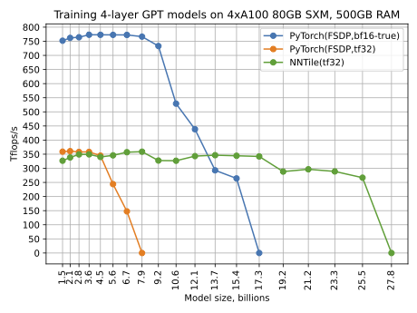
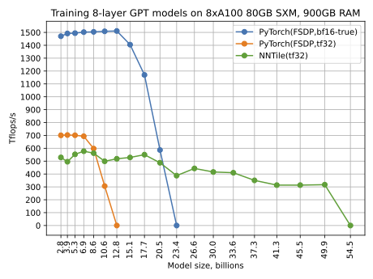

NNTile
======


## General purpose

**NNTile** is a framework for training large neural networks. It relies
on a task-based parallel programming paradigm, which distributes computations
across all avialable hardware resources dynamically and transmits data
asynchronously. For this purpose **NNTile** utilizes
[StarPU](https://starpu.gitlabpages.inria.fr) library.

## Preliminary experimental results

Experiments with custom 4-layer and 8-layer GPT models of sizes up to 50B
showed both good performance and a possibility to train 4 times larger models
compared to PyTorch FSDP on the same hardware (a single server with 8 x
Nvidia A100 80GB SXM).




The same figures in better quality:
 * [Custom 4-layer model on 4 GPUs](images/gpt_short_perf_4gpu.pdf)
 * [Custom 4-layer model on 8 GPUs](images/gpt_short_perf_8gpu.pdf)
 * [Custom 8-layer model on 8 GPUs](images/gpt_short8_perf.pdf)

## Authors

**NNTile** is developed by specialists from
 * Skolkovo Institute of Science and Technology ([Skoltech](https://skoltech.ru))
 * Artifical Intelligence Research Institute ([AIRI](https://airi.net))

Main contributors are:
 * Aleksandr Mikhalev
 * Aleksandr Katrutsa
 * Konstantin Sozykin
 * Gleb Karpov
 * Daniel Bershatsky

## Acknowledgement

Authors of the **NNTile** would like to thank Ivan Oseledets for bringing idea
of this project to life.
The work was generously supported by the Center in the field of Artificial
Intelligence in the direction of optimizing management decisions to reduce the
carbon footprint on the basis of the Skolkovo Institute of Science and
Technology under Contract No. 70-2021-00145/10841 dated 02.11.2021 (items
2.3.1, 2.3.3, 3.3.2 and 3.3.4) and Contract No. 10825/3978620 dated 26.08.2021.

## Assembly

**NNTile** comes with a `Dockerfile` to construct docker image with NNTile
and all prerequisites. Ready image can be acquired from the GitHub container
registry:
```shell
docker pull ghcr.io/nntile/nntile:1.1.0-starpu1.4.7-cuda12.4.0-ubuntu22.04
```
Sandbox image with prerequisites but without precompiled NNTile is also
accessible:
```shell
docker pull ghcr.io/nntile/nntile_sandbox:starpu1.4.7-cuda12.4.0-ubuntu22.04
```

Alternatively, the docker image can be built on your own system with the following
command:
```shell
docker build . \
    -t nntile:latest \
    --build-arg MAKE_JOBS=4 \
    --build-arg BASE_IMAGE=nvidia/cuda:12.4.0-devel-ubuntu22.04 \
    --build-arg CUDA_ARCHS="80;86;89;90"
```

During image building `StarPU` is compiled with `make`. This process can be
adjusted with degree of parallelism with `MAKE_JOBS` option (default no
parallelism). Due to Nvidia pruning their old docker images, it could be
possible that a default `nvidia/cuda:12.4.0-devel-ubuntu-22.04` is not
available. In such a case, input name of an appropriate available image.
Argument `CUDA_ARCHS` defines target CUDA architectures to be supported by
**NNTile**.

## Minimal requirements

NNTile does supports CUDA devices only of compute capability 8.0 or higher

## Minimal working GPT example

To make **NNTile** train your custom GPT model there is a minimal working example
[gpt2_custom_training.py](./wrappers/python/examples/gpt2_custom_training.py).
It works either with a
WikiText-103 datasets or with a dataset stored in a train.bin format that contains
a stream of uint16 values just like [NanoGPT](https://github.com/karpathy/nanogpt)
does it with a help of its special script
[prepare.py](https://github.com/karpathy/nanogpt/data/openwebtext/prepare.py)
for the OpenWebText.

To try the example, launch a docker container based on the `ghcr.io/skolai/nntile:1.0.0-starpu1.3.11-cuda12.2.0-ubuntu22.04` docker image. Once inside the sandbo environment (docker container), try the following command:
```shell
CUDA_VISIBLE_DEVICES=0 STARPU_NCPU=2 python /workspace/nntile/wrappers/python/examples/gpt2_custom_training.py --config-path=/workspace/nntile/wrappers/python/examples/gpt2_default_config.json --tokenizer=gpt2 --tokenizer-path=data --batch=1024 --minibatch=4 --minibatch-tile=4 --seq-tile=1024 --embd-tile=768 --inner-tile=3072 --head-tile=12 --restrict=cuda --flashattention --nforward=10 --nforward-warmup=10 --nbackward=10 --nbackward-warmup=10 --dataset=WikiText-103 --dataset-path=data --dataset-select=40000 --optimizer=fusedadamw --optimizer-eps=1e-8 --weight-decay=0.1 --loss-reduction=mean --lr=3e-4 --start-lr=0 --full-lr-iter=10 --nepochs=1 --nepochs-warmup=1
```
 * Environment variable `CUDA_VISIBLE_DEVICES` limits visibility of GPUs to StarPU. If this variable is not set, StarPU will use all the GPUs.
 * Environment variable `STARPU_NCPU=2` limits how many CPU cores will be used. If the variable is unset, all the CPU cores will be occupied.
 * `/workspace/nntile/wrappers/python/examples/gpt2_custom_training.py` is the location of the example script.
 * `--config-path` parameter points to a json GPT2 configuration file. Example uses default one, located at `/workspace/nntile/wrappers/python/examples/gpt2_default_config.json`.
 * `--tokenizer=gpt2` selects `gpt2` tokenizer from HuggingFace `transformers` Python library.
 * `--tokenizer-path=data` path to download chosen tokenizer.
 * `--batch=1024` how many sequences form the batch. Optimizer step happens after gradients for entire batch are collected.
 * `--minibatch=4` defines how many sequences are processed by StarPU at once on entire node. This variable defines maximum memory, allocated by StarPU buffers. `batch` must be divisible by `minibatch`.
 * `--minibatch-tile=4` defines how many sequences are processed by StarPU at once at a single computing unit (CPU core or entire GPU). `minibatch` must be divisible by `minibatch_tile`.
 * `--seq-tile=1024` defines how many tokens out of a sequence are processed by StarPU at once at a single computing unit (CPU core or entire GPU). Sequence length, defined in the GPT2 config json file, must be divisible by this value.
 * `--embd-tile=768` defines size of embedding processed by StarPU at once at a single computing unit (CPU core or entire GPU). Size of embedding, defined in the GPT2 config json file, does not restrict this value.
 * `--inner-tile=3072` defines size of embedding inside MLP of the GPT model processed by StarPU at once at a single computing unit (CPU core or entire GPU). Size of inner embedding of GPT2, which is 4 times larger than ordinary embedding size, does not restrict this value.
 * `--head-tile=12` defines number of attention heads processed by StarPU at once at a single computing unit (CPU core or entire GPU). Number of heads, defined in the GPT2 config json file, must be divisible by this value.
 * `--restrict=cuda` limits execution of low-level kernels to CUDA if applicable. Only CUDA devices will be used for computations, while certain auxiliary low-level kernels, which are not implemented in CUDA, will be executed on CPU.
 * `--flashattention` is a flag to enable Flash Attention logic. Flash Attention itself is not yet implemented in the **NNTile**. Turning ON this logic helps to reduce peak memory usage, which may improve performance by a lot.
 * `--nforward=10` sets number of forward operations to estimate performance to 10.
 * `--nforward-warmup=10` sets number of warmup forward operations before estimating performance to 10.
 * `--nbackward=10` sets number of backward operations to estimate performance to 10.
 * `--nbackward-warmup=10` sets number of warmup backward operations before estimating performance to 10.
 * `--dataset=WikiText-103` sets WikiText-103 as a training set. It will be automatically downloaded.
 * `--dataset-path=data` path to download WikiText-103. If it is already there, it will not be downloaded again.
 * `--dataset-select=40000` limits entire WikiText-103 to only first 40000 texts. It is enough to have 2 input batches of 1024 sequences of 1024 tokens.
 * `--optimizer=fusedadamw` selects optimizer.
 * `--optimizer-eps=1e-8` defines optimizer regularization parameter.
 * `--weight-decay=0.1` defines weight decay for the chosen AdamW optimizer.
 * `--loss-reduction=mean` sets up printed loss value as an average value across all tokens in an input batch.
 * `--lr=3e-4` is the learning rate.
 * `--start-lr=0` is the learning rate for the first input batch.
 * `--full-lr-iter=10` defines which AdamW iteration will use the full learning rate, presented by `--lr` flag. IF this value is simply 1, then all the AdamW optimizer iterations will use full learning rate.
 * `--nepochs=1` is the number of epochs to train the GPT2 model while measuring performance.
 * `--nepochs-warmup=1` is the number of warmup epochs of training the GPT2 model before measuring performance.

When launched on an example server with NVidia V100 16Gb SXM GPU, the following output was produced:
```shell
$ STARPU_NCPU=2 python /workspace/nntile/wrappers/python/examples/gpt2_custom_training.py --config-path=/workspace/nntile/wrappers/python/examples/gpt2_default_config.json --tokenizer=gpt2 --tokenizer-path=data --batch=1024 --minibatch=4 --minibatch-tile=4 --seq-tile=1024 --embd-tile=768 --inner-tile=3072 --head-tile=12 --restrict=cuda --flashattention --nforward=10 --nforward-warmup=10 --nbackward=10 --nbackward-warmup=10 --dataset=WikiText-103 --dataset-path=data --dataset-select=40000 --optimizer=fusedadamw --optimizer-eps=1e-8 --weight-decay=0.1 --loss-reduction=mean --lr=3e-4 --start-lr=0 --full-lr-iter=10 --nepochs=1 --nepochs-warmup=1
Namespace(config_path='/workspace/nntile/wrappers/python/examples/gpt2_default_config.json', tokenizer='gpt2', tokenizer_path='data', load_checkpoint=None, load_optimizer=None, save_checkpoint=None, save_checkpoint_dtype='fp32', save_optimizer=None, save_optimizer_dtype='fp32', batch=1024, minibatch=4, minibatch_tile=4, seq_tile=1024, embd_tile=768, inner_tile=3072, head_tile=12, restrict='cuda', flashattention=True, redux=False, fp32_fast_tf32=False, nforward=10, nforward_warmup=10, nbackward=10, nbackward_warmup=10, dataset='WikiText-103', dataset_path='data', dataset_select=40000, optimizer='fusedadamw', optimizer_eps=1e-08, weight_decay=0.1, loss_reduction='mean', lr=0.0003, start_lr=0.0, full_lr_iter=10, nepochs=1, nepochs_warmup=1)
PyTorch model:
GPT2LMHeadModel(
  (transformer): GPT2Model(
    (wte): Embedding(50257, 768)
    (wpe): Embedding(1024, 768)
    (drop): Dropout(p=0.1, inplace=False)
    (h): ModuleList(
      (0-11): 12 x GPT2Block(
        (ln_1): LayerNorm((768,), eps=1e-05, elementwise_affine=True)
        (attn): GPT2Attention(
          (c_attn): Conv1D()
          (c_proj): Conv1D()
          (attn_dropout): Dropout(p=0.1, inplace=False)
          (resid_dropout): Dropout(p=0.1, inplace=False)
        )
        (ln_2): LayerNorm((768,), eps=1e-05, elementwise_affine=True)
        (mlp): GPT2MLP(
          (c_fc): Conv1D()
          (c_proj): Conv1D()
          (act): NewGELUActivation()
          (dropout): Dropout(p=0.1, inplace=False)
        )
      )
    )
    (ln_f): LayerNorm((768,), eps=1e-05, elementwise_affine=True)
  )
  (lm_head): Linear(in_features=768, out_features=50257, bias=False)
)
Initialized NCPU=2 NCUDA=1
Initialized cuBLAS
StarPU + NNTile + MPI init in 0.5288841724395752 seconds
NNTile forward time: 1.3918728828430176 seconds
NNTile forward throughput (tokens/sec):  29427.974712989417
NNTile forward performance: 8.936898300563369 Tflops/s
NNTile backward time: 3.104170083999634 seconds
NNTile backward throughput (tokens/sec):  13195.153258878205
NNTile backward performance: 8.263447627453852 Tflops/s
Total train batches: 2
Total train sequences: 2048
Total train tokens: 2097152
From PyTorch loader to NNTile batches in 0.5677697658538818 seconds
Batch=1/2 Epoch=1/1 Loss=10.979899406433105
Batch=2/2 Epoch=1/1 Loss=10.981043815612793
Batch=1/2 Epoch=1/1 Loss=10.122427940368652
Batch=2/2 Epoch=1/1 Loss=9.724896430969238
Training time: 246.36041140556335 seconds
Training throughput tokens/sec: 8512.536523360593
Training performance: 7.9161130747831825 Tflops/s
Loss on the last batch: 9.724896430969238
Shutdown cuBLAS
Shutdown StarPU
```
