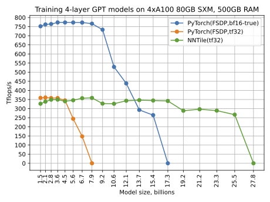
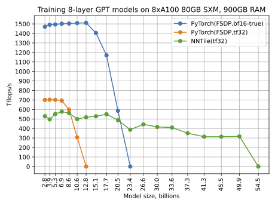

NNTile
======


## General purpose

**NNTile** is a framework for training large neural networks. It relies on a
task-based parallel programming paradigm that distributes computations across
available hardware resources dynamically and moves data asynchronously, using
the [StarPU](https://starpu.gitlabpages.inria.fr) runtime.

## Install (Python product)

The installable end-user package is **`torch_nntile`** (a pip wheel), not a
bare `libnntile` CMake build. Prebuilt wheels and local build instructions:
[torch_nntile/README.md](torch_nntile/README.md).

```bash
pip install torch==2.9.1 torchvision==0.24.1
pip install /path/to/torch_nntile-*.whl
```

Bare `cmake` defaults to the core C++ **libnntile** library only (no LibTorch
required). To also produce the wheel from source:

```bash
cmake -S . -B build -GNinja \
  -DBUILD_TORCH_NNTILE=ON -DBUILD_TORCH_NNTILE_WHEEL=ON \
  -DCMAKE_PREFIX_PATH="$(python3 -c 'import torch; print(torch.utils.cmake_prefix_path)')"
cmake --build build --target torch_nntile_wheel
# → build/wheelhouse/torch_nntile-*.whl
```

Or use [`torch_nntile/tools/build_wheel_deps.sh`](torch_nntile/tools/build_wheel_deps.sh)
/ the **torch_nntile wheels** GitHub Actions workflow.

## Documentation

Full documentation lives under **[docs/](docs/README.md)**. Start at
[docs/README.md](docs/README.md) for the complete map.

| Topic | Guide |
|-------|--------|
| Build, Docker, CMake, testing | [docs/build/README.md](docs/build/README.md) |
| C++ stack (kernel → tensor) | [docs/cpp/README.md](docs/cpp/README.md) |
| torch_nntile (Python / LibTorch) | [torch_nntile/README.md](torch_nntile/README.md) |
| Inference, HTTP gateway, Telegram bot | [docs/inference/README.md](docs/inference/README.md) |
| Gateway + bot deployment | [infra/README.md](infra/README.md) |
| SGOC scheduler (limited VRAM) | [docs/sgoc/README.md](docs/sgoc/README.md) |
| Graph API (work in progress) | [docs/graph-wip.md](docs/graph-wip.md) |

CUDA compute capability **8.0+** is required ([docs/README.md](docs/README.md)).

## Preliminary experimental results

Experiments with custom 4-layer and 8-layer GPT models of sizes up to 50B
showed both good performance and a possibility to train 4 times larger models
compared to PyTorch FSDP on the same hardware (a single server with 8 x
Nvidia A100 80GB SXM).




The same figures in better quality:

- [Custom 4-layer model on 4 GPUs](images/gpt_short_perf_4gpu.pdf)
- [Custom 4-layer model on 8 GPUs](images/gpt_short_perf_8gpu.pdf)
- [Custom 8-layer model on 8 GPUs](images/gpt_short8_perf.pdf)

## Authors

**NNTile** is developed by specialists from

- Skolkovo Institute of Science and Technology ([Skoltech](https://skoltech.ru))
- Artificial Intelligence Research Institute ([AIRI](https://airi.net))

Main contributors are:

- Aleksandr Mikhalev
- Aleksandr Katrutsa
- Konstantin Sozykin
- Gleb Karpov
- Daniel Bershatsky
- Danil Sivtsov
- Ekaterina Lisovskaya

## Acknowledgement

Authors of **NNTile** would like to thank Ivan Oseledets for bringing the idea
of this project to life.

The work was generously supported by the Center in the field of Artificial
Intelligence in the direction of optimizing management decisions to reduce the
carbon footprint on the basis of the Skolkovo Institute of Science and
Technology under Contract No. 70-2021-00145/10841 dated 02.11.2021 (items
2.3.1, 2.3.3, 3.3.2 and 3.3.4) and Contract No. 10825/3978620 dated 26.08.2021.

This work was supported by FASIE (fasie.ru).
