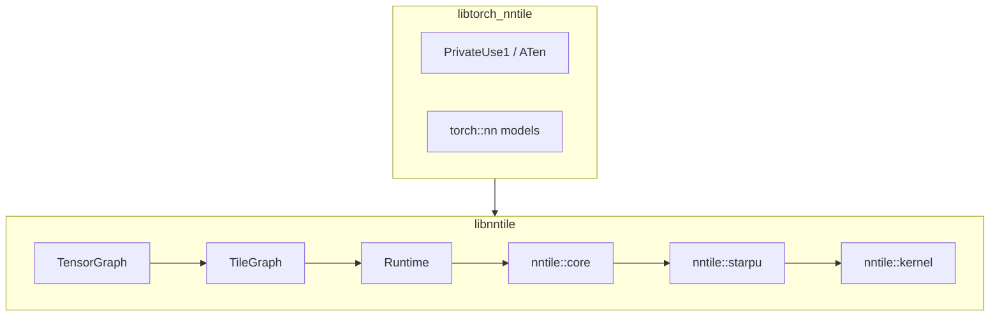

# C++ implementation overview

NNTile ships two installable libraries:

| Library | Contents | Umbrella headers |
|---------|----------|------------------|
| **libnntile** | kernel → starpu → core → TileGraph → TensorGraph → Runtime | [`nntile.hh`](../../nntile/include/nntile.hh), [`tensor.hh`](../../nntile/include/nntile/tensor.hh), [`tile.hh`](../../nntile/include/nntile/tile.hh), [`runtime.hh`](../../nntile/include/nntile/runtime.hh) |
| **libtorch_nntile** | LibTorch PrivateUse1 (`device=nntile`) + models | [`torch_nntile`](../../torch_nntile/README.md) |

`torch_nntile` / **libtorch_nntile** link **libnntile** only.

Product overview of the Graph API: [../graph.md](../graph.md).

## Layer headers

- [`include/nntile/kernel.hh`](../../nntile/include/nntile/kernel.hh)
- [`include/nntile/starpu.hh`](../../nntile/include/nntile/starpu.hh)
- [`include/nntile/core.hh`](../../nntile/include/nntile/core.hh)
- [`include/nntile/tile.hh`](../../nntile/include/nntile/tile.hh)
- [`include/nntile/tensor.hh`](../../nntile/include/nntile/tensor.hh)
- [`include/nntile/runtime.hh`](../../nntile/include/nntile/runtime.hh)

Sources mirror tests: `nntile/src/<level>/<op>.cc` ↔ `nntile/tests/<level>/<op>.cc`.

## kernel

**Namespace:** `nntile::kernel::<op>`

Raw numerical kernels on contiguous buffers (CPU and CUDA translation units under
`nntile/src/kernel/<op>/`).

## starpu

**Namespace:** `nntile::starpu`

StarPU codelets wrapping kernel calls.

## core

**Namespace:** `nntile::core`

Single-tile operations (`Tile<T>`), plus optional execution schedules
(`execution_schedule.hh`).

## tensor / tile / runtime

**Namespaces:** `nntile::tensor`, `nntile::tile`, `nntile::runtime`

| Layer | Role |
|-------|------|
| **TensorGraph** | Symbolic tensors (`TensorNode`) and ops (`OpNode` with `lower_to_tile`) |
| **TileGraph** | Tiled IR; tile ops implement `execute(Runtime&)` |
| **Runtime** | `compile`, `execute` / `execute_range`, `wait`; optional static schedule |

Typical flow: record into `TensorGraph` → `seal_phase` +
`append_tensor_graph_phase` → `Runtime::compile()` → `execute_range()` →
`wait()`. Design notes: [../dev/README.md](../dev/README.md).
