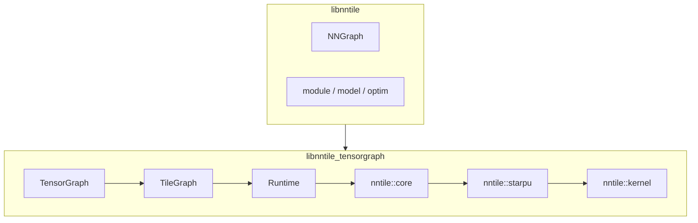

# C++ implementation overview

NNTile is split into two libraries:

| Library | Contents | Umbrella headers |
|---------|----------|------------------|
| **libnntile_tensorgraph** | kernel → starpu → core → TileGraph → TensorGraph → Runtime | [`tensor.hh`](../../nntile/include/nntile/tensor.hh), [`tile.hh`](../../nntile/include/nntile/tile.hh), [`runtime.hh`](../../nntile/include/nntile/runtime.hh) |
| **libnntile** | NNGraph, modules, models, optim, io, dataset (links tensorgraph) | [`graph.hh`](../../nntile/include/nntile/graph.hh), [`nn.hh`](../../nntile/include/nntile/nn.hh) |
| **full** | both | [`nntile.hh`](../../nntile/include/nntile.hh) |

`torch_nntile` links **only** `libnntile_tensorgraph`. The Python
`nntile` extension and C++ examples/models link `libnntile`.

High-level sources are gated by `BUILD_NNTILE_NNGRAPH` and related options
(default OFF on `graph_api`).

## Layer headers

- [`include/nntile/kernel.hh`](../../nntile/include/nntile/kernel.hh)
- [`include/nntile/starpu.hh`](../../nntile/include/nntile/starpu.hh)
- [`include/nntile/core.hh`](../../nntile/include/nntile/core.hh)
- [`include/nntile/tile.hh`](../../nntile/include/nntile/tile.hh)
- [`include/nntile/tensor.hh`](../../nntile/include/nntile/tensor.hh)
- [`include/nntile/runtime.hh`](../../nntile/include/nntile/runtime.hh)
- [`include/nntile/graph.hh`](../../nntile/include/nntile/graph.hh)

Sources mirror tests: `nntile/src/<level>/<op>.cc` ↔ `nntile/tests/<level>/<op>.cc`.

## kernel

**Namespace:** `nntile::kernel::<op>`

Raw numerical kernels on contiguous buffers (CPU and CUDA translation units under
`nntile/src/kernel/<op>/`).

## starpu

**Namespace:** `nntile::starpu`

StarPU codelets wrapping kernel calls.

## core

**Namespace:** `nntile::core`

Single-tile operations (`Tile<T>`).

## tensor / tile / runtime

**Namespaces:** `nntile::tensor`, `nntile::tile`, `nntile::runtime`

TensorGraph, TileGraph lowering, and Runtime execution.

## nn / module / model (libnntile)

**Namespace:** `nntile::nn` (and related)

NNGraph autograd, modules, and models. See
[`include/nntile/graph.hh`](../../nntile/include/nntile/graph.hh).
