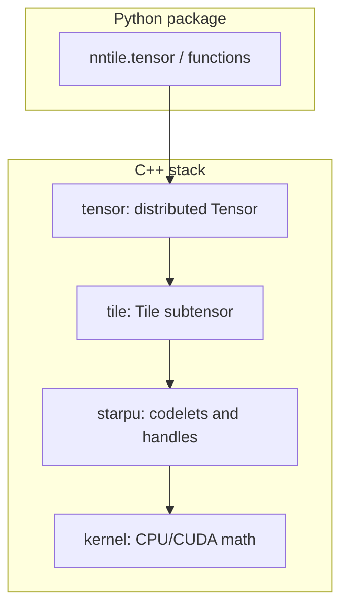

# C++ implementation overview

NNTile’s C++ code is organized in four layers from raw buffers up to distributed
tensors. Python and training scripts call into the **tensor** and **StarPU**
levels; lower layers implement the actual math and scheduling.

Umbrella headers index the public operations:

- [`include/nntile/kernel.hh`](../../include/nntile/kernel.hh)
- [`include/nntile/starpu.hh`](../../include/nntile/starpu.hh)
- [`include/nntile/tile.hh`](../../include/nntile/tile.hh)
- [`include/nntile/tensor.hh`](../../include/nntile/tensor.hh)

Sources mirror tests: `src/<level>/<op>.cc` ↔ `tests/<level>/<op>.cc`.

## kernel

**Namespace:** `nntile::kernel::<op>`

Raw numerical kernels on contiguous buffers (CPU and CUDA translation units under
`src/kernel/<op>/`).

| Category | Operations |
|----------|------------|
| Elementwise / unary | `add`, `add_inplace`, `multiply`, `multiply_inplace`, `scale`, `scale_inplace`, `fill`, `clear`, `pow`, `sqrt`, `sqrt_inplace`, `relu`, `relu_inplace`, `relu_backward`, `gelu`, `gelu_inplace`, `gelu_backward`, `gelutanh`, `gelutanh_inplace`, `gelutanh_backward`, `silu`, `silu_backward`, `hypot`, `hypot_inplace`, `hypot_scalar_inverse`, `mask_scalar`, `randn` |
| Fiber / slice / axis | `add_fiber`, `add_fiber_inplace`, `add_slice`, `add_slice_inplace`, `scale_fiber`, `scale_slice`, `multiply_fiber`, `multiply_fiber_inplace`, `multiply_slice`, `sum`, `sum_fiber`, `sum_slice`, `sumprod_fiber`, `sumprod_slice`, `norm`, `norm_fiber`, `norm_fiber_inplace`, `norm_slice`, `norm_slice_inplace` |
| Softmax / attention stats | `softmax`, `softmax_inplace`, `maxsumexp`, `logsumexp`, `accumulate_maxsumexp`, `accumulate_attn_output`, `total_sum_accum` |
| Linear algebra | `gemm` (via cblas/cublas backends) |
| Convolution | `conv2d_inplace`, `conv2d_bwd_input_inplace`, `conv2d_bwd_weight_inplace` |
| Embedding | `embedding`, `embedding_backward` |
| RoPE | `rope`, `rope_backward` |
| Optimizers | `adam_step`, `adamw_step`, `sgd_step` |
| Data movement | `copy`, `subcopy`, `transpose`, `subtract_indexed_outputs` |
| Flash attention | `flash_sdpa_fwd_cudnn`, `flash_sdpa_bwd_cudnn` |

## starpu

**Namespace:** `nntile::starpu`

StarPU **codelets** that wrap kernel calls and manage handles. Same operation set
as kernel, plus infrastructure:

| Extra | Role |
|-------|------|
| `handle`, `codelet` | Data handles and task descriptors |
| `accumulate`, `accumulate_hypot`, `accumulate_maxsumexp` | Reduction helpers for distributed execution |

Flat layout: `include/nntile/starpu/<op>.hh`, `src/starpu/<op>.cc`.

## tile

**Namespace:** `nntile::tile`

A **tile** is one contiguous subtensor (`Tile<T>`). Operations match kernel/starpu
semantics on a single tile. No `gather` / `scatter` at this level.

Also: `traits` for tile metadata.

## tensor

**Namespace:** `nntile::tensor`

A **tensor** is a distributed object made of tiles (`Tensor<T>`), with MPI
distribution metadata.

Same operations as tile, plus:

| Extra | Role |
|-------|------|
| `gather`, `scatter` | MPI gather/scatter of tile data |
| `distributions` | Distribution helpers |
| `traits` | Tensor traits and tiling |

## Build-time features

Compile-time flags in [`include/nntile/defs.h`](../../include/nntile/defs.h.in)
(from CMake): `NNTILE_USE_CUDA`, `NNTILE_USE_CUDA_FP16`, `NNTILE_USE_CUDA_BF16`,
`NNTILE_USE_CUDA_TF32`, `NNTILE_USE_CUDA_FP8`, `NNTILE_USE_CBLAS`.

Configure options: [build/README.md](../build/README.md).

## Tests

Per-level tests under `tests/kernel`, `tests/starpu`, `tests/tile`,
`tests/tensor`. See [build/README.md — Running tests](../build/README.md#running-tests).

## See also

- [python/functions.md](../python/functions.md) — Python wrappers for tensor ops
- [graph-wip.md](../graph-wip.md) — separate graph/autograd C++ stack
- [STYLE_GUIDE.md](../../STYLE_GUIDE.md)
