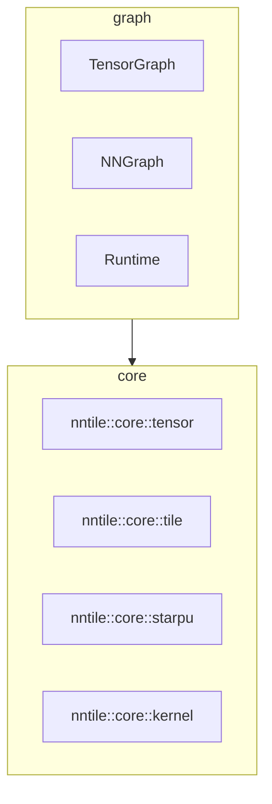

# C++ implementation overview

NNTile is split into two CMake packages:

| Package | Libraries | Umbrella headers |
|---------|-----------|------------------|
| **core** | `nntile_core` | [`include/nntile/core.hh`](../../include/nntile/core.hh) |
| **graph** | `nntile_graph` (links core) | [`include/nntile/graph.hh`](../../include/nntile/graph.hh) |
| **full** | both | [`include/nntile.hh`](../../include/nntile.hh) |

Core code lives under `src/core/` and `include/nntile/core/` with namespace
`nntile::core::{kernel,starpu,tile,tensor,...}`. Graph code lives under
`src/graph/` and `include/nntile/graph/` with namespace `nntile::graph`.

## Core layer headers

- [`include/nntile/core/kernel.hh`](../../include/nntile/core/kernel.hh)
- [`include/nntile/core/starpu.hh`](../../include/nntile/core/starpu.hh)
- [`include/nntile/core/tile.hh`](../../include/nntile/core/tile.hh)
- [`include/nntile/core/tensor.hh`](../../include/nntile/core/tensor.hh)

Sources mirror tests: `src/core/<level>/<op>.cc` ↔ `tests/core/<level>/<op>.cc`.

## kernel

**Namespace:** `nntile::core::kernel::<op>`

Raw numerical kernels on contiguous buffers (CPU and CUDA translation units under
`src/core/kernel/<op>/`).

## starpu

**Namespace:** `nntile::core::starpu`

StarPU codelets wrapping kernel calls.

## tile

**Namespace:** `nntile::core::tile`

Single-tile operations (`Tile<T>`).

## tensor

**Namespace:** `nntile::core::tensor`

Distributed tensors (`Tensor<T>`).

## graph

**Namespace:** `nntile::graph`

Symbolic graphs, lowering, runtime, modules, and optimizers. See
[`include/nntile/graph.hh`](../../include/nntile/graph.hh).
