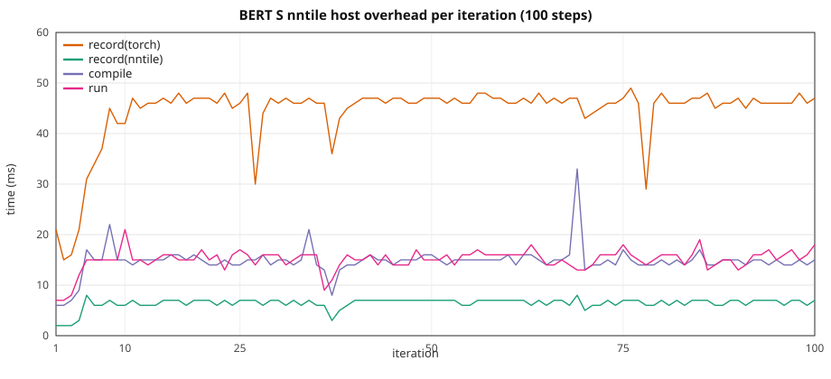

# BERT HF: graph overhead vs width / seqlen

Three paths, same configs / seq_len / 10 steps:

1. **CUDA** — stock HuggingFace `BertForMaskedLM`, `device=cuda`, no
   `torch_nntile` import.
2. **`torch.nn` on nntile** — same HF model on `device=nntile` (aten /
   torch-native StarPU codelets).
3. **`torch_nntile.nn` on nntile** —
   `torch_nntile.models.bert.BertMlm` (classic kernels). HF is used only to
   init weights.

Three-way loss and wall: [Three paths](#three-paths-1-run). Paths 1–2
10-repeat detail is below that. Path 3 (saved SDPA attn, no QK'
recompute) is in
[torch_nntile.nn vs CUDA](#torch_nntilenn-vs-cuda).

Depth is **12 layers** (XS–L); **XL** uses **6 layers** at similar param count.
Width and sequence length grow together with **`seq_len = hidden_size / 2`**.

> **VRAM warning.** Same as GPT-2: nntile keeps extra graph buffers. Keep CUDA
> well under the card limit on large configs so nntile stays on-device (no
> StarPU CPU↔GPU paging). GPUs are in **exclusive mode** — one process per GPU.

Configs: [`torch_nntile/examples/overhead_bert/`](../../torch_nntile/examples/overhead_bert/).  
Paths 1–2: [`train_bert_hf_overhead.py`](../../torch_nntile/examples/train_bert_hf_overhead.py),
[`run_bert_overhead_benchmark.py`](../../torch_nntile/tools/run_bert_overhead_benchmark.py).  
Path 3: [`train_nntile_native_overhead.py`](../../torch_nntile/examples/train_nntile_native_overhead.py),
[`run_nntile_native_overhead_benchmark.py`](../../torch_nntile/tools/run_nntile_native_overhead_benchmark.py).

## Attention backend

Stock HF BERT (transformers **4.52**) uses **eager** `BertSelfAttention` (manual
`matmul` / `softmax`; no `sdpa` backend). This study uses
**`attn_implementation="eager"`** on both CUDA and nntile. CUDA runs with
`--disable-tf32`.

## Loss

MLM loss via stock **`F.cross_entropy`** on logits with **`ignore_index=-100`**
(same on CUDA and nntile; see `mlm_ce_loss` in `hf_tiny_train_common.py`).

## Train wall

Same recipe as
[`gpt2_hf_overhead_scale.md`](gpt2_hf_overhead_scale.md): nntile
`record → compile → wait(prev) → run`, wall from first record through final
`wait()`; CUDA synced per iter. Prefetch outside the wall. Iter 1 nntile
`wait=0`; iter 10 `wait` includes the final join.

## Recipe

| | XS | S | M | L | XL |
|--|--:|--:|--:|--:|--:|
| Config | `bert_xs.json` | `bert_s.json` | `bert_m.json` | `bert_l.json` | `bert_xl.json` |
| `num_hidden_layers` | 12 | 12 | 12 | 12 | **6** |
| `hidden_size` / `num_attention_heads` | 1536 / 24 | 2048 / 16 | 3072 / 24 | 4096 / 32 | 5760 / 45 |
| `--seq-len` (`= hidden_size/2`) | **768** | **1024** | **1536** | **2048** | **2880** |
| Params (FP32) | 344 M (1.28 GiB) | 611 M (2.27 GiB) | 1.37 B (5.10 GiB) | 2.43 B (9.06 GiB) | **2.41 B (8.97 GiB)** |

B=1, 10 steps, seed 42, `--no-shuffle`, eager attention, CUDA `--disable-tf32`,
nntile `--ncpu 0 --ncuda 1 --restrict-cuda`. NVIDIA A40; **GPU 0** (XS/S/M/L),
**GPU 2** (XL), **GPU 1** (100-step S). Separate processes (`PYTHONNOUSERSITE=1`;
never import `torch_nntile` in the CUDA child). **Do not overlap jobs on one GPU.**

Paths 1–2 rerun: 2026-08-27–28, **10 repeats per configuration**
([`benchmark_logs/`](../../benchmark_logs/) `bert_*_20260827_gpu*`, `bert_xs_10x_20260828_gpu1`).
Includes **S nntile 100-step** steady-state run.
Path 3 (classic `sdpa_kernel` **saves attn**; QK' recompute is gone):
2026-08-30, 1 repeat, `STARPU_LIMIT_CUDA_MEM=46000`.

## Three paths (1 run)

Same recipe as the 10-repeat study. **1 repeat**. CUDA and `torch.nn`
from the torch-native ladder (2026-08-29). `torch_nntile.nn` is the
saved-attn run (2026-08-30). Logs:
`/tmp/bench_check_20260829/overhead/bert/` (paths 1–2),
[`benchmark_logs/classic_saveattn_mem_20260830/bert/`](../../benchmark_logs/classic_saveattn_mem_20260830/bert/)
(path 3).

### Loss

| Setup | CUDA | torch.nn nntile | torch_nntile.nn |
|-------|-----:|----------------:|----------------:|
| XS T=768 | 7.890008 | 7.889859 | 2.092767 |
| S T=1024 | 7.967797 | 7.967953 | 2.214778 |
| M T=1536 | 8.030198 | 8.030404 | 2.242690 |
| L T=2048 | 7.986812 | 7.986809 | 2.203440 |
| XL T=2880 | 8.069889 | 8.069840 | 2.200238 |

CUDA and `torch.nn` match to ~1e-4. Classic sits near **2.1** vs HF
**~7.9** — native `BertMlm` + classic CE, not stock `F.cross_entropy`
on HF logits. Walls remain comparable; do not treat classic loss as HF
parity.

### 10-step train wall

Classic `sdpa_kernel` **saves softmax weights** (no QK' recompute).
1 repeat, 2026-08-30, `STARPU_LIMIT_CUDA_MEM=46000`. CUDA / `torch.nn`
columns are the older 1-run paths 1–2 (2026-08-29).

| Setup | CUDA | torch.nn | torch_nntile.nn | torch.nn/CUDA | classic/CUDA |
|-------|-----:|---------:|----------------:|--------------:|-------------:|
| XS T=768 | 1.419 s | 1.674 s | 1.634 s | **1.18×** | **1.15×** |
| S T=1024 | 2.709 s | 3.009 s | 3.027 s | **1.11×** | **1.12×** |
| M T=1536 | 7.808 s | 8.167 s | 8.293 s | **1.05×** | **1.06×** |
| L T=2048 | 17.856 s | 18.490 s | 18.537 s | **1.04×** | **1.04×** |
| XL T=2880 | 24.900 s | 25.667 s | 25.776 s | **1.03×** | **1.04×** |

Classic is a few percent slower than CUDA (XS host-bound).

### Peak VRAM and bus (1 repeat)

Peak VRAM is `nvidia-smi memory.used`. H2D/D2H are StarPU bus stats at
shutdown. CUDA has no StarPU bus. Logs:
[`hf_path12_mem_20260830/bert/`](../../benchmark_logs/hf_path12_mem_20260830/bert/)
(CUDA / `torch.nn`);
[`classic_saveattn_mem_20260830/bert/`](../../benchmark_logs/classic_saveattn_mem_20260830/bert/)
(`torch_nntile.nn`).

| Setup | CUDA VRAM | torch.nn VRAM | torch.nn H2D | torch.nn D2H | torch_nntile.nn VRAM | torch_nntile.nn H2D | torch_nntile.nn D2H |
|-------|----------:|--------------:|-------------:|-------------:|---------------------:|--------------------:|--------------------:|
| XS T=768 | 3.5 GiB | 3.9 GiB | 1.29 GB | **0** | 5.1 GiB | 1.30 GB | **0** |
| S T=1024 | 5.8 GiB | 5.5 GiB | 2.29 GB | **0** | 7.7 GiB | 2.31 GB | **0** |
| M T=1536 | 13.1 GiB | 13.0 GiB | 5.14 GB | **0** | 17.9 GiB | 5.16 GB | **0** |
| L T=2048 | 24.0 GiB | 24.6 GiB | 9.13 GB | **0** | 33.2 GiB | 9.16 GB | **0** |
| XL T=2880 | 30.0 GiB | 31.2 GiB | 9.13 GB | **0** | **37.8 GiB** | 9.17 GB | **0** |

No D2H on any path.

### Path 3 record breakdown

| Setup | wall | record(nntile) | record(torch) | compile | run | wait | host/wall |
|-------|-----:|---------------:|--------------:|--------:|----:|-----:|----------:|
| XS T=768 | 1.634 s | 0.039 s | 0.209 s | 0.151 s | 0.135 s | 1.098 s | **24.4%** |
| S T=1024 | 3.027 s | 0.042 s | 0.205 s | 0.152 s | 0.146 s | 2.481 s | **13.2%** |
| M T=1536 | 8.293 s | 0.036 s | 0.149 s | 0.133 s | 0.138 s | 7.835 s | **3.8%** |
| L T=2048 | 18.537 s | 0.038 s | 0.205 s | 0.139 s | 0.147 s | 18.006 s | **2.1%** |
| XL T=2880 | 25.776 s | 0.027 s | 0.133 s | 0.097 s | 0.103 s | 25.413 s | **1.0%** |

Isolated `run+wait`: XS 0.152 s, S 0.290 s, M 0.819 s, L 1.848 s, XL 2.589 s.

## torch_nntile.nn vs CUDA

Path 3 only, overlap, 10 steps, **1 repeat**, 2026-08-30, saved attn.
CUDA walls are the published paths 1–2 10-repeat means (not re-run).
Peak VRAM / H2D / D2H below are **`torch_nntile.nn`**. CUDA VRAM and
`torch.nn` bus stats are in [Peak VRAM and bus](#peak-vram-and-bus-1-repeat).
Logs:
[`benchmark_logs/classic_saveattn_mem_20260830/bert/`](../../benchmark_logs/classic_saveattn_mem_20260830/bert/).

| Setup | CUDA wall | classic wall | classic/CUDA | isolated | peak VRAM | H2D | D2H | host/wall | classic loss |
|-------|----------:|-------------:|-------------:|---------:|----------:|----:|----:|----------:|-------------:|
| XS T=768 | 1.410 ± 0.002 s | 1.634 s | **1.16×** | 0.152 s | 5.1 GiB | 1.30 GB | **0** | **24.4%** | 2.092767 |
| S T=1024 | 2.775 ± 0.076 s | 3.027 s | **1.09×** | 0.290 s | 7.7 GiB | 2.31 GB | **0** | **13.2%** | 2.214778 |
| M T=1536 | 8.041 ± 0.166 s | 8.293 s | **1.03×** | 0.819 s | 17.9 GiB | 5.16 GB | **0** | **3.8%** | 2.242690 |
| L T=2048 | 17.986 ± 0.130 s | 18.537 s | **1.03×** | 1.848 s | 33.2 GiB | 9.16 GB | **0** | **2.1%** | 2.203440 |
| XL T=2880 | 24.835 ± 0.168 s | 25.776 s | **1.04×** | 2.589 s | **37.8 GiB** | 9.17 GB | **0** | **1.0%** | 2.200237 |

No StarPU reclaim. Classic MLM CE is ~2.1 vs HF ~7.9; walls remain
informative.

## torch.nn vs CUDA (10 repeats)

VRAM for CUDA / `torch.nn` / `torch_nntile.nn` is in
[Peak VRAM and bus](#peak-vram-and-bus-1-repeat) (`nvidia-smi`, 1 repeat).

| Setup | CUDA wall | nntile wall | nntile/CUDA | record(nntile) | record(torch) | compile | run | wait | host/wall | CUDA loss | nntile loss |
|-------|----------:|------------:|------------:|---------------:|--------------:|--------:|----:|-----:|----------:|----------:|------------:|
| XS T=768 | 1.410 ± 0.002 s | 1.641 ± 0.012 s | **1.16×** | 0.046 ± 0.005 s | 0.292 ± 0.012 s | 0.114 ± 0.005 s | 0.112 ± 0.003 s | 1.075 ± 0.032 s | **27.6%** | 7.890008 | **7.889859** |
| S T=1024 | 2.775 ± 0.076 s | 3.105 ± 0.190 s | **1.12×** | 0.045 ± 0.003 s | 0.299 ± 0.011 s | 0.113 ± 0.004 s | 0.119 ± 0.005 s | 2.529 ± 0.196 s | **14.8%** | 7.967797 | **7.967953** |
| M T=1536 | 8.041 ± 0.166 s | 8.410 ± 0.134 s | **1.05×** | 0.044 ± 0.003 s | 0.306 ± 0.008 s | 0.110 ± 0.005 s | 0.118 ± 0.008 s | 7.830 ± 0.142 s | **5.5%** | 8.030198 | **8.030404** |
| L T=2048 | 17.986 ± 0.130 s | 18.885 ± 0.035 s | **1.05×** | 0.042 ± 0.005 s | 0.298 ± 0.025 s | 0.108 ± 0.006 s | 0.119 ± 0.012 s | 18.316 ± 0.066 s | **2.4%** | 7.986812 | **7.986809** |
| XL T=2880 | 24.835 ± 0.168 s | 25.910 ± 0.179 s | **1.04×** | 0.028 ± 0.001 s | 0.206 ± 0.007 s | 0.071 ± 0.003 s | 0.080 ± 0.004 s | 25.522 ± 0.186 s | **1.2%** | 8.069889 | **8.069840** |

Host = `record(nntile)+record(torch)+compile` (~0.29–0.51 s for 10 steps,
**flat**). Host **share** drops **27.6% → 14.8% → 5.5% → 2.4% → 1.2%**
as GPU work grows.

### Loss / correctness (MLM)

Both paths use stock `F.cross_entropy` on MLM logits with `ignore_index=-100` (`mlm_ce_loss` in `hf_tiny_train_common.py`).

- **M:** CUDA 8.030198 vs nntile 8.030404 (Δ 0.000206).

Performance ratios remain informative; investigate any residual drift separately from graph overhead.

Isolated GPU `run+wait` vs CUDA isolated wall:
XS 0.144 ± 0.001 vs 0.127 ± 0.001 s, S 0.278 ± 0.002 vs 0.259 ± 0.001 s, M 0.801 ± 0.004 vs 0.771 ± 0.001 s, L 1.828 ± 0.002 vs 1.776 ± 0.002 s, XL 2.534 ± 0.003 vs 2.468 ± 0.004 s.

## 100-step S (nntile steady state, mean ± stdev over 10 runs)

Same **S** config (`hidden_size=2048`, `T=1024`, B=1), **100 optimizer steps**, nntile
overlap only. Complements the 10-step ladder above.

Loss **7.804439**.

| | Total | mean / step |
|--|--:|--:|
| record(nntile) | 0.640 ± 0.012 s | 6.4 ms |
| record(torch) | 4.477 ± 0.068 s | 45 ms |
| compile | 1.503 ± 0.014 s | 15 ms |
| run | 1.514 ± 0.010 s | 15 ms |
| wait | 20.554 ± 0.195 s | 206 ms |
| **train wall** | **28.700 ± 0.194 s** | 287 ms |

Host (record + compile) is **23%** of the wall (~66 ms/step).



CSV: [`bert_hf_overhead_s_100.csv`](bert_hf_overhead_s_100.csv) (median of 10 runs).

## Comparison to GPT-2 (same ladder geometry)

See [`gpt2_hf_overhead_scale.md`](gpt2_hf_overhead_scale.md) for the GPT-2 10× run
(same A40 GPUs, Aug 2026, CUDA-parity matmul).

| Size | GPT-2 nntile/CUDA | BERT nntile/CUDA |
|------|------------------:|-----------------:|
| XS | 0.99× | **1.16×** |
| S | 0.96× | **1.12×** |
| M | 0.94× | **1.05×** |
| L | 0.94× | **1.05×** |
| XL | 0.96× | **1.04×** |

### 100-step S (nntile)

| | GPT-2 | BERT | Notes |
|--|------:|-----:|-------|
| train wall | 27.5 s | **28.7 s** | same ballpark |
| final loss | 7.734033 | **7.804439** | MLM CE, matches 10-step S |
| host share | 22% | **23%** | flat host, GPU-bound |

## Per iteration (mean ± stdev over 10 runs)

### XS (`hidden_size=1536`, `T=768`)

| Iter | CUDA wall | record(nntile) | record(torch) | compile | run | wait |
|-----:|----------:|---------------:|--------------:|--------:|----:|-----:|
| 1 | 0.269 ± 0.001 | 0.002 ± 0.001 | 0.019 ± 0.002 | 0.006 | 0.006 ± 0.001 | 0.000 |
| 2 | 0.126 | 0.002 | 0.015 ± 0.001 | 0.005 | 0.007 ± 0.001 | 0.256 ± 0.014 |
| 3 | 0.127 | 0.003 ± 0.001 | 0.018 ± 0.001 | 0.006 ± 0.001 | 0.008 ± 0.001 | 0.110 ± 0.002 |
| 4 | 0.127 ± 0.001 | 0.003 | 0.020 ± 0.001 | 0.009 ± 0.001 | 0.010 ± 0.001 | 0.105 ± 0.001 |
| 5 | 0.127 | 0.006 ± 0.002 | 0.025 ± 0.003 | 0.011 ± 0.001 | 0.012 ± 0.001 | 0.094 ± 0.006 |
| 6 | 0.127 | 0.006 ± 0.001 | 0.031 ± 0.002 | 0.013 ± 0.002 | 0.013 ± 0.001 | 0.086 ± 0.003 |
| 7 | 0.127 ± 0.001 | 0.006 ± 0.001 | 0.035 ± 0.003 | 0.015 ± 0.002 | 0.013 ± 0.001 | 0.080 ± 0.006 |
| 8 | 0.127 | 0.006 ± 0.001 | 0.039 ± 0.001 | 0.016 ± 0.002 | 0.015 ± 0.001 | 0.075 ± 0.003 |
| 9 | 0.127 ± 0.001 | 0.007 ± 0.001 | 0.043 ± 0.002 | 0.017 ± 0.002 | 0.015 ± 0.001 | 0.070 ± 0.005 |
| 10 | 0.127 | 0.007 | 0.047 ± 0.001 | 0.016 ± 0.002 | 0.015 ± 0.001 | 0.199 ± 0.001 |

### S (`hidden_size=2048`, `T=1024`)

| Iter | CUDA wall | record(nntile) | record(torch) | compile | run | wait |
|-----:|----------:|---------------:|--------------:|--------:|----:|-----:|
| 1 | 0.402 ± 0.001 | 0.002 | 0.019 ± 0.001 | 0.006 ± 0.001 | 0.007 ± 0.001 | 0.000 |
| 2 | 0.302 ± 0.076 | 0.002 | 0.015 ± 0.001 | 0.006 ± 0.001 | 0.007 ± 0.000 | 0.521 ± 0.189 |
| 3 | 0.258 ± 0.001 | 0.003 ± 0.001 | 0.019 ± 0.001 | 0.007 ± 0.001 | 0.008 ± 0.001 | 0.239 ± 0.003 |
| 4 | 0.259 ± 0.001 | 0.004 ± 0.001 | 0.023 ± 0.001 | 0.010 ± 0.001 | 0.011 ± 0.001 | 0.234 ± 0.003 |
| 5 | 0.259 ± 0.001 | 0.004 ± 0.001 | 0.028 ± 0.002 | 0.012 ± 0.001 | 0.012 ± 0.001 | 0.225 ± 0.003 |
| 6 | 0.259 ± 0.001 | 0.005 ± 0.000 | 0.032 ± 0.001 | 0.013 ± 0.001 | 0.013 ± 0.002 | 0.218 ± 0.002 |
| 7 | 0.259 ± 0.001 | 0.006 ± 0.001 | 0.035 ± 0.006 | 0.013 ± 0.002 | 0.014 ± 0.002 | 0.214 ± 0.011 |
| 8 | 0.259 ± 0.001 | 0.006 ± 0.001 | 0.040 ± 0.002 | 0.014 ± 0.001 | 0.015 ± 0.001 | 0.206 ± 0.005 |
| 9 | 0.259 ± 0.001 | 0.007 ± 0.000 | 0.042 ± 0.005 | 0.016 ± 0.002 | 0.015 ± 0.002 | 0.203 ± 0.006 |
| 10 | 0.259 ± 0.001 | 0.007 ± 0.001 | 0.046 ± 0.001 | 0.015 ± 0.001 | 0.015 ± 0.001 | 0.468 ± 0.004 |

### M (`hidden_size=3072`, `T=1536`)

| Iter | CUDA wall | record(nntile) | record(torch) | compile | run | wait |
|-----:|----------:|---------------:|--------------:|--------:|----:|-----:|
| 1 | 1.114 ± 0.161 | 0.002 | 0.021 ± 0.002 | 0.006 ± 0.001 | 0.007 ± 0.001 | 0.000 |
| 2 | 0.767 ± 0.001 | 0.002 | 0.015 ± 0.001 | 0.005 ± 0.001 | 0.008 ± 0.001 | 1.119 ± 0.131 |
| 3 | 0.768 ± 0.001 | 0.003 | 0.020 ± 0.002 | 0.008 ± 0.001 | 0.009 ± 0.001 | 0.757 ± 0.002 |
| 4 | 0.768 ± 0.001 | 0.004 ± 0.000 | 0.023 ± 0.001 | 0.009 ± 0.001 | 0.011 ± 0.001 | 0.756 ± 0.003 |
| 5 | 0.769 ± 0.002 | 0.005 ± 0.000 | 0.028 ± 0.002 | 0.011 ± 0.001 | 0.011 ± 0.002 | 0.747 ± 0.004 |
| 6 | 0.770 ± 0.002 | 0.005 ± 0.001 | 0.033 ± 0.003 | 0.013 ± 0.002 | 0.013 ± 0.001 | 0.741 ± 0.006 |
| 7 | 0.770 ± 0.002 | 0.006 ± 0.000 | 0.036 ± 0.001 | 0.013 ± 0.001 | 0.014 ± 0.001 | 0.737 ± 0.004 |
| 8 | 0.771 ± 0.001 | 0.006 ± 0.001 | 0.041 ± 0.003 | 0.014 ± 0.002 | 0.015 ± 0.002 | 0.730 ± 0.008 |
| 9 | 0.771 ± 0.001 | 0.006 ± 0.001 | 0.043 ± 0.002 | 0.015 ± 0.002 | 0.015 ± 0.002 | 0.728 ± 0.007 |
| 10 | 0.772 ± 0.001 | 0.006 ± 0.001 | 0.046 ± 0.001 | 0.014 ± 0.002 | 0.015 ± 0.001 | 1.517 ± 0.006 |

### L (`hidden_size=4096`, `T=2048`)

| Iter | CUDA wall | record(nntile) | record(torch) | compile | run | wait |
|-----:|----------:|---------------:|--------------:|--------:|----:|-----:|
| 1 | 1.988 ± 0.127 | 0.002 | 0.019 ± 0.001 | 0.006 ± 0.001 | 0.010 ± 0.002 | 0.000 |
| 2 | 1.783 ± 0.004 | 0.002 | 0.015 ± 0.001 | 0.007 ± 0.001 | 0.008 ± 0.001 | 2.306 ± 0.016 |
| 3 | 1.784 ± 0.004 | 0.003 ± 0.000 | 0.020 ± 0.001 | 0.007 ± 0.001 | 0.010 ± 0.001 | 1.798 ± 0.006 |
| 4 | 1.781 ± 0.007 | 0.004 ± 0.001 | 0.024 ± 0.002 | 0.011 ± 0.002 | 0.011 ± 0.002 | 1.791 ± 0.007 |
| 5 | 1.778 ± 0.008 | 0.005 ± 0.001 | 0.030 ± 0.004 | 0.011 ± 0.001 | 0.012 ± 0.002 | 1.782 ± 0.009 |
| 6 | 1.773 ± 0.006 | 0.005 ± 0.001 | 0.032 ± 0.003 | 0.012 ± 0.002 | 0.014 ± 0.003 | 1.781 ± 0.013 |
| 7 | 1.773 ± 0.003 | 0.005 ± 0.001 | 0.035 ± 0.004 | 0.012 ± 0.002 | 0.013 ± 0.002 | 1.767 ± 0.014 |
| 8 | 1.775 ± 0.005 | 0.005 ± 0.001 | 0.039 ± 0.004 | 0.012 ± 0.002 | 0.014 ± 0.002 | 1.760 ± 0.010 |
| 9 | 1.775 ± 0.005 | 0.006 ± 0.001 | 0.041 ± 0.005 | 0.016 ± 0.001 | 0.014 ± 0.003 | 1.755 ± 0.009 |
| 10 | 1.776 ± 0.002 | 0.005 ± 0.001 | 0.043 ± 0.006 | 0.014 ± 0.001 | 0.014 ± 0.003 | 3.575 ± 0.010 |

### XL (`hidden_size=5760`, `T=2880`, 6 layers, `head_dim=128`)

| Iter | CUDA wall | record(nntile) | record(torch) | compile | run | wait |
|-----:|----------:|---------------:|--------------:|--------:|----:|-----:|
| 1 | 2.663 ± 0.151 | 0.001 | 0.013 ± 0.001 | 0.003 ± 0.001 | 0.006 ± 0.001 | 0.000 |
| 2 | 2.466 ± 0.010 | 0.001 | 0.009 ± 0.001 | 0.003 ± 0.001 | 0.005 ± 0.001 | 3.071 ± 0.170 |
| 3 | 2.467 ± 0.012 | 0.002 ± 0.000 | 0.012 ± 0.001 | 0.005 ± 0.001 | 0.006 ± 0.001 | 2.510 ± 0.006 |
| 4 | 2.461 ± 0.012 | 0.002 ± 0.001 | 0.016 ± 0.001 | 0.006 ± 0.001 | 0.008 ± 0.001 | 2.506 ± 0.009 |
| 5 | 2.458 ± 0.008 | 0.003 | 0.019 ± 0.002 | 0.008 ± 0.001 | 0.009 ± 0.001 | 2.497 ± 0.015 |
| 6 | 2.461 ± 0.005 | 0.004 ± 0.001 | 0.023 ± 0.001 | 0.008 ± 0.001 | 0.009 ± 0.001 | 2.486 ± 0.011 |
| 7 | 2.462 ± 0.003 | 0.004 ± 0.000 | 0.027 ± 0.001 | 0.009 ± 0.000 | 0.010 ± 0.001 | 2.482 ± 0.008 |
| 8 | 2.464 ± 0.003 | 0.004 | 0.029 ± 0.001 | 0.010 ± 0.000 | 0.009 ± 0.001 | 2.479 ± 0.005 |
| 9 | 2.466 ± 0.003 | 0.004 | 0.029 ± 0.001 | 0.009 ± 0.001 | 0.009 ± 0.001 | 2.478 ± 0.004 |
| 10 | 2.466 ± 0.002 | 0.004 | 0.029 ± 0.001 | 0.009 ± 0.000 | 0.010 ± 0.001 | 5.014 ± 0.007 |

## Isolated extra step (mean ± stdev over 10 runs)

| Setup | record(nntile) | record(torch) | compile | run | wait | run+wait | CUDA isolated |
|-------|---------------:|--------------:|--------:|----:|-----:|---------:|--------------:|
| XS | 0.007 ± 0.001 | 0.048 ± 0.001 | 0.018 ± 0.005 | 0.014 ± 0.001 | 0.130 ± 0.001 | **0.144 ± 0.001** | 0.127 ± 0.001 |
| S | 0.007 ± 0.001 | 0.049 ± 0.002 | 0.016 ± 0.001 | 0.014 ± 0.001 | 0.263 ± 0.002 | **0.278 ± 0.002** | 0.259 ± 0.001 |
| M | 0.007 ± 0.000 | 0.049 ± 0.001 | 0.015 ± 0.001 | 0.014 ± 0.001 | 0.787 ± 0.004 | **0.801 ± 0.004** | 0.771 ± 0.001 |
| L | 0.006 ± 0.001 | 0.046 ± 0.008 | 0.014 ± 0.003 | 0.012 ± 0.003 | 1.816 ± 0.001 | **1.828 ± 0.002** | 1.776 ± 0.002 |
| XL | 0.004 | 0.030 ± 0.001 | 0.009 ± 0.001 | 0.008 ± 0.001 | 2.526 ± 0.004 | **2.534 ± 0.003** | 2.468 ± 0.004 |

| Setup | Full isolated (record+compile+run+wait) | Hidden host (`run+wait`) | Saved |
|-------|----------------------------------------:|-------------------------:|------:|
| XS | 0.217 s | 0.144 s | 0.073 s (**33%**) |
| S | 0.349 s | 0.278 s | 0.072 s (**20%**) |
| M | 0.872 s | 0.801 s | 0.071 s (**8%**) |
| L | 1.894 s | 1.828 s | 0.066 s (**3%**) |
| XL | 2.577 s | 2.534 s | 0.043 s (**2%**) |

## Sequential prep vs compute (`--wait-after-run`)

| Setup | CUDA wall | sequential wall | prep | compute | compute/CUDA | prep/wall |
|-------|----------:|----------------:|-----:|--------:|-------------:|----------:|
| XS T=768 | 1.410 ± 0.002 s | 2.047 ± 0.016 s | 0.473 ± 0.013 s | **1.573 ± 0.014 s** | **1.12×** | 23.1% |
| S T=1024 | 2.775 ± 0.076 s | 3.483 ± 0.187 s | 0.486 ± 0.011 s | **2.996 ± 0.187 s** | **1.08×** | 13.9% |
| M T=1536 | 8.041 ± 0.166 s | 8.793 ± 0.126 s | 0.496 ± 0.010 s | **8.296 ± 0.131 s** | **1.03×** | 5.6% |
| L T=2048 | 17.986 ± 0.130 s | 19.200 ± 0.132 s | 0.473 ± 0.041 s | **18.724 ± 0.107 s** | **1.04×** | 2.5% |
| XL T=2880 | 24.835 ± 0.168 s | 26.190 ± 0.099 s | 0.324 ± 0.014 s | **25.864 ± 0.107 s** | **1.04×** | 1.2% |

Sequential nntile loss: XS 7.889859, S 7.967953, M 8.030404, L 7.986809, XL 8.069840.

### Per iteration (prep / compute, mean ± stdev)

#### XS (`T=768`)

| Iter | prep | compute | record(nntile) | record(torch) | compile | run | wait |
|-----:|-----:|--------:|---------------:|--------------:|--------:|----:|-----:|
| 1 | 0.027 ± 0.001 | 0.285 ± 0.007 | 0.002 | 0.020 | 0.005 ± 0.001 | 0.006 ± 0.001 | 0.278 ± 0.006 |
| 2 | 0.025 ± 0.002 | 0.142 ± 0.002 | 0.003 | 0.016 ± 0.001 | 0.006 ± 0.001 | 0.006 ± 0.001 | 0.136 ± 0.001 |
| 3 | 0.030 ± 0.002 | 0.142 | 0.003 ± 0.001 | 0.019 ± 0.002 | 0.008 ± 0.001 | 0.007 ± 0.001 | 0.135 ± 0.001 |
| 4 | 0.038 ± 0.002 | 0.143 ± 0.001 | 0.004 | 0.024 | 0.010 ± 0.001 | 0.008 ± 0.001 | 0.134 ± 0.002 |
| 5 | 0.045 ± 0.003 | 0.144 ± 0.001 | 0.005 ± 0.001 | 0.029 ± 0.001 | 0.011 ± 0.001 | 0.011 ± 0.002 | 0.133 ± 0.002 |
| 6 | 0.052 ± 0.002 | 0.143 ± 0.001 | 0.006 ± 0.001 | 0.033 ± 0.001 | 0.013 ± 0.001 | 0.012 ± 0.001 | 0.132 ± 0.001 |
| 7 | 0.057 ± 0.002 | 0.144 ± 0.002 | 0.006 ± 0.001 | 0.037 ± 0.001 | 0.014 ± 0.001 | 0.013 ± 0.001 | 0.131 ± 0.001 |
| 8 | 0.063 ± 0.002 | 0.144 | 0.007 | 0.043 ± 0.001 | 0.014 ± 0.001 | 0.013 ± 0.001 | 0.132 ± 0.002 |
| 9 | 0.067 ± 0.003 | 0.144 ± 0.002 | 0.007 | 0.044 ± 0.003 | 0.016 | 0.014 ± 0.001 | 0.129 ± 0.002 |
| 10 | 0.068 ± 0.002 | 0.143 ± 0.001 | 0.007 ± 0.001 | 0.046 ± 0.002 | 0.015 | 0.015 ± 0.002 | 0.129 ± 0.002 |

#### S (`T=1024`)

| Iter | prep | compute | record(nntile) | record(torch) | compile | run | wait |
|-----:|-----:|--------:|---------------:|--------------:|--------:|----:|-----:|
| 1 | 0.028 ± 0.002 | 0.516 ± 0.188 | 0.002 | 0.019 ± 0.001 | 0.006 ± 0.001 | 0.007 ± 0.001 | 0.509 ± 0.188 |
| 2 | 0.028 ± 0.002 | 0.274 ± 0.002 | 0.003 ± 0.000 | 0.017 ± 0.001 | 0.007 ± 0.001 | 0.007 ± 0.000 | 0.267 ± 0.002 |
| 3 | 0.035 ± 0.003 | 0.275 ± 0.002 | 0.004 ± 0.001 | 0.021 ± 0.002 | 0.009 ± 0.001 | 0.008 ± 0.001 | 0.267 ± 0.002 |
| 4 | 0.041 ± 0.002 | 0.275 ± 0.002 | 0.005 ± 0.000 | 0.026 ± 0.001 | 0.011 ± 0.001 | 0.010 ± 0.001 | 0.265 ± 0.002 |
| 5 | 0.046 ± 0.006 | 0.275 ± 0.001 | 0.005 ± 0.001 | 0.029 ± 0.003 | 0.012 ± 0.002 | 0.010 ± 0.002 | 0.265 ± 0.002 |
| 6 | 0.053 ± 0.003 | 0.276 ± 0.001 | 0.006 ± 0.000 | 0.034 ± 0.001 | 0.013 ± 0.001 | 0.012 ± 0.001 | 0.264 ± 0.001 |
| 7 | 0.059 ± 0.003 | 0.276 ± 0.001 | 0.007 ± 0.002 | 0.038 ± 0.002 | 0.014 ± 0.001 | 0.012 ± 0.001 | 0.264 ± 0.001 |
| 8 | 0.062 ± 0.005 | 0.277 ± 0.001 | 0.007 ± 0.001 | 0.041 ± 0.005 | 0.015 ± 0.001 | 0.013 ± 0.002 | 0.263 ± 0.003 |
| 9 | 0.067 ± 0.006 | 0.276 ± 0.001 | 0.007 ± 0.001 | 0.044 ± 0.002 | 0.016 ± 0.002 | 0.014 ± 0.001 | 0.262 ± 0.001 |
| 10 | 0.066 ± 0.003 | 0.276 ± 0.001 | 0.007 ± 0.001 | 0.045 ± 0.002 | 0.014 ± 0.001 | 0.013 ± 0.001 | 0.263 ± 0.001 |

#### M (`T=1536`)

| Iter | prep | compute | record(nntile) | record(torch) | compile | run | wait |
|-----:|-----:|--------:|---------------:|--------------:|--------:|----:|-----:|
| 1 | 0.028 ± 0.001 | 1.119 ± 0.130 | 0.002 | 0.020 ± 0.001 | 0.006 ± 0.000 | 0.007 ± 0.000 | 1.111 ± 0.130 |
| 2 | 0.030 ± 0.001 | 0.793 ± 0.002 | 0.004 ± 0.000 | 0.018 ± 0.001 | 0.008 ± 0.001 | 0.007 ± 0.001 | 0.786 ± 0.002 |
| 3 | 0.036 ± 0.002 | 0.796 ± 0.002 | 0.005 ± 0.000 | 0.022 ± 0.001 | 0.010 ± 0.001 | 0.009 ± 0.001 | 0.788 ± 0.002 |
| 4 | 0.043 ± 0.002 | 0.796 ± 0.001 | 0.005 ± 0.000 | 0.027 ± 0.001 | 0.012 ± 0.001 | 0.010 ± 0.001 | 0.786 ± 0.001 |
| 5 | 0.049 ± 0.003 | 0.798 ± 0.002 | 0.006 ± 0.001 | 0.030 ± 0.002 | 0.012 ± 0.000 | 0.011 ± 0.001 | 0.787 ± 0.002 |
| 6 | 0.055 ± 0.001 | 0.798 ± 0.001 | 0.006 | 0.035 ± 0.001 | 0.014 ± 0.001 | 0.012 ± 0.000 | 0.786 ± 0.002 |
| 7 | 0.059 ± 0.002 | 0.799 ± 0.002 | 0.006 ± 0.000 | 0.039 ± 0.002 | 0.014 ± 0.001 | 0.012 ± 0.001 | 0.787 ± 0.002 |
| 8 | 0.063 ± 0.003 | 0.799 ± 0.002 | 0.007 ± 0.001 | 0.042 ± 0.001 | 0.015 ± 0.001 | 0.013 ± 0.001 | 0.786 ± 0.003 |
| 9 | 0.068 ± 0.003 | 0.799 ± 0.001 | 0.007 ± 0.000 | 0.045 ± 0.002 | 0.016 ± 0.001 | 0.014 ± 0.001 | 0.785 ± 0.001 |
| 10 | 0.065 ± 0.002 | 0.799 ± 0.001 | 0.006 ± 0.001 | 0.044 ± 0.001 | 0.015 ± 0.001 | 0.012 ± 0.001 | 0.787 ± 0.001 |

#### L (`T=2048`)

| Iter | prep | compute | record(nntile) | record(torch) | compile | run | wait |
|-----:|-----:|--------:|---------------:|--------------:|--------:|----:|-----:|
| 1 | 0.029 ± 0.002 | 2.265 ± 0.106 | 0.002 ± 0.000 | 0.020 ± 0.002 | 0.006 ± 0.000 | 0.009 ± 0.001 | 2.256 ± 0.105 |
| 2 | 0.030 ± 0.004 | 1.831 ± 0.004 | 0.004 ± 0.001 | 0.018 ± 0.002 | 0.008 ± 0.002 | 0.007 ± 0.001 | 1.824 ± 0.003 |
| 3 | 0.037 ± 0.005 | 1.833 ± 0.002 | 0.005 ± 0.001 | 0.022 ± 0.003 | 0.010 ± 0.002 | 0.009 ± 0.002 | 1.825 ± 0.002 |
| 4 | 0.042 ± 0.005 | 1.833 ± 0.005 | 0.005 ± 0.001 | 0.026 ± 0.003 | 0.011 ± 0.002 | 0.009 ± 0.001 | 1.824 ± 0.005 |
| 5 | 0.047 ± 0.004 | 1.834 ± 0.008 | 0.005 ± 0.001 | 0.030 ± 0.002 | 0.012 ± 0.001 | 0.010 ± 0.001 | 1.824 ± 0.008 |
| 6 | 0.052 ± 0.006 | 1.826 ± 0.007 | 0.006 ± 0.001 | 0.033 ± 0.004 | 0.014 ± 0.003 | 0.011 ± 0.003 | 1.815 ± 0.005 |
| 7 | 0.054 ± 0.010 | 1.825 ± 0.005 | 0.005 ± 0.001 | 0.036 ± 0.006 | 0.013 ± 0.002 | 0.010 ± 0.002 | 1.814 ± 0.006 |
| 8 | 0.056 ± 0.012 | 1.826 ± 0.007 | 0.006 ± 0.001 | 0.037 ± 0.009 | 0.013 ± 0.004 | 0.011 ± 0.003 | 1.816 ± 0.008 |
| 9 | 0.064 ± 0.010 | 1.824 ± 0.005 | 0.006 ± 0.001 | 0.043 ± 0.005 | 0.015 ± 0.004 | 0.012 ± 0.003 | 1.812 ± 0.005 |
| 10 | 0.061 ± 0.007 | 1.827 ± 0.003 | 0.005 ± 0.001 | 0.043 ± 0.004 | 0.012 ± 0.002 | 0.010 ± 0.002 | 1.817 ± 0.003 |

Steady compute after iter 1 (mean over repeats): ~0.142 s (XS), ~0.274 s (S), ~0.793 s (M), ~1.831 s (L), ~2.531 s (XL).

## Takeaways

1. **`seq_len = hidden_size / 2`**, eager HF BERT attention, MLM CE loss.
2. **Graph host overhead is flat** (~0.3–0.5 s / 10 steps); share falls as GPU
   work grows (27.6% → 1.2%).
3. **With VRAM headroom, nntile is within ~5–16% of CUDA on wall time**
   (XS 1.16×, S 1.12×, M 1.05×, L 1.05×, XL 1.04×).
4. **Sequential GPU time** (`run+wait`): **1.12× → 1.08× → 1.03× → 1.04× → 1.04×** CUDA.
5. Timings are **mean ± stdev** over 10 runs per size on the assigned GPU.
6. **MLM loss** matches CUDA vs nntile to ~1e-4 — see loss section above.
7. **100-step S** wall **28.700 ± 0.194 s** — see section above.
8. Classic `torch_nntile.nn` (saved attn): **1.03–1.16×** CUDA, XL peak
   **37.8 GiB**, **no D2H**. CUDA / `torch.nn` VRAM is in
   [Peak VRAM and bus](#peak-vram-and-bus-1-repeat). See
   [torch_nntile.nn vs CUDA](#torch_nntilenn-vs-cuda).

## How to reproduce

```bash
export TORCH_LIB_DIR="$(python3 -c 'import os, torch; print(os.path.join(os.path.dirname(torch.__file__), "lib"))')"
export NNTILE_BUILD_DIR=$PWD/build TORCH_NNTILE_BUILD_DIR=$PWD/build
export LD_LIBRARY_PATH="${CONDA_PREFIX}/lib:${TORCH_LIB_DIR}:$PWD/build/nntile:$PWD/build/torch_nntile:/opt/starpu/lib"
export STARPU_SILENT=1 STARPU_FXT_TRACE=0 STARPU_WORKERS_NOBIND=1

# One size per GPU; do not overlap on exclusive-mode GPUs.
python3 torch_nntile/tools/run_bert_overhead_benchmark.py \
  --logdir /tmp/bert_overhead_l_gpu0 --gpu 0 --repeats 10 --sizes l --skip-long
python3 torch_nntile/tools/run_bert_overhead_benchmark.py \
  --logdir /tmp/bert_overhead_xl_gpu2 --gpu 2 --repeats 10 --sizes xl --skip-long
python3 torch_nntile/tools/run_bert_overhead_benchmark.py \
  --logdir /tmp/bert_overhead_s100 --gpu 1 --repeats 10 --only-long

python3 torch_nntile/tools/update_bert_overhead_doc.py \
  --summary benchmark_logs/bert_sm_20260827_gpu0/results_summary.json \
  --results benchmark_logs/bert_sm_20260827_gpu0/results.json \
  --merge-summary benchmark_logs/bert_xs_loss_20260827_gpu0/results_summary.json \
  --merge-results benchmark_logs/bert_xs_loss_20260827_gpu0/results.json \
  --merge-summary benchmark_logs/bert_l_20260827_gpu0/results_summary.json \
  --merge-results benchmark_logs/bert_l_20260827_gpu0/results.json \
  --merge-summary benchmark_logs/bert_xl_20260827_gpu2/results_summary.json \
  --merge-results benchmark_logs/bert_xl_20260827_gpu2/results.json \
  --merge-summary benchmark_logs/bert_s100_20260827_gpu0/results_summary.json \
  --merge-results benchmark_logs/bert_s100_20260827_gpu0/results.json
```
