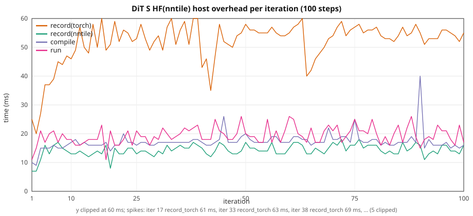

# DiT HF: graph overhead vs width / patch count

**Notation.** Each label is **implementation(backend)**. The word
*outside* the brackets is the implementation; the word *inside* is the
backend.

- **HF** — HuggingFace Diffusers `DiTTransformer2DModel`
  (`diffusers==0.32.2`).
- **cuda** — PyTorch CUDA (`device=cuda`).
- **nntile** (as backend) — StarPU / nntile (`device=nntile`).

This study is **HF(cuda)** vs **HF(nntile)** only (no `torch_nntile.models`
rewrite).

Ten-step stock **Diffusers**
[`DiTTransformer2DModel`](https://huggingface.co/docs/diffusers/api/models/dit_transformer2d)
noise-prediction training on **HF(cuda)** vs **HF(nntile)**. Inputs are
**synthetic diffusion batches** (deterministic `float32` images + noise; no
`datasets` I/O). Loss is MSE between predicted and target noise
(`diffusion_mse_loss` in
[`dit_hf_tiny_train_common.py`](../../torch_nntile/examples/dit_hf_tiny_train_common.py)).

**VRAM ladder (matched to Llama HF(cuda) peaks).** Hidden size follows the Llama
overhead rungs (1536 … 5760). `sample_size` is set so patch count
`(sample_size / patch_size)²` is close to Llama `seq_len` at each rung.
`num_layers` is searched so **HF(cuda)** 10-step train peak VRAM matches Llama —
except **XL: 6 layers** (one below the 7-layer HF(cuda) match) so **HF(nntile) stays
on-GPU** without StarPU host paging (7 layers gave ~1.10× wall; 6 layers
~0.99×).

> **VRAM / nntile.** nntile allocates extra graph buffers. Keep the published
> configs within device memory on both setups. This study used one **NVIDIA A40**
> per job (`CUDA_VISIBLE_DEVICES`); do not overlap processes on one GPU.

Configs: [`torch_nntile/examples/overhead_dit/`](../../torch_nntile/examples/overhead_dit/).
Train: [`train_dit_hf_overhead.py`](../../torch_nntile/examples/train_dit_hf_overhead.py).
Runner: [`run_dit_overhead_benchmark.py`](../../torch_nntile/tools/run_dit_overhead_benchmark.py).
VRAM search: [`match_dit_vram_to_llama.py`](../../torch_nntile/tools/match_dit_vram_to_llama.py).

## Model and data

- **Model:** Diffusers `DiTTransformer2DModel` (AdaLN-Zero, `patch_size=2`,
  `in_channels=3`). Class/timestep conditioning; label dropout disabled
  (`disable_dit_label_dropout`) for deterministic runs.
- **Batch:** `make_synthetic_diffusion_batch()` — random `noisy` / `noise`
  tensors, timesteps, class labels; seed `42 + step`.
- **Optimizer:** SGD, lr `1e-3`, B=1, 10 steps (100 for long S), `--no-shuffle`.
- **CUDA:** `--disable-tf32`. **nntile:** `--ncpu 0 --ncuda 1 --restrict-cuda`.

## Loss

MSE noise prediction: `model(noisy, timestep, class_labels)` vs ground-truth
`noise` (same reduction on HF(cuda) and HF(nntile)).

## Train wall

Same protocol as
[`gpt2_hf_overhead_scale.md`](gpt2_hf_overhead_scale.md): nntile
`record → compile → wait(prev) → run`, wall from first record through final
`wait()`; HF(cuda) synchronized per iter. Prefetch outside the wall. Iter 1 nntile
`wait=0`; iter 10 `wait` includes the final join.

## Recipe

| | XS | S | M | L | XL |
|--|--:|--:|--:|--:|--:|
| Config | `dit_xs.json` | `dit_s.json` | `dit_m.json` | `dit_l.json` | `dit_xl.json` |
| `num_layers` | 11 | 10 | 11 | 12 | **6** |
| hidden (`heads×head_dim`) | 1536 (24×64) | 2048 (16×128) | 3072 (24×128) | 4096 (32×128) | 5760 (45×128) |
| `sample_size` | 56 | 64 | 78 | 90 | 108 |
| patches `T` (`(size/2)²`) | **784** | **1024** | **1521** | **2025** | **2916** |
| HF(cuda) VRAM target (10-step) | ~3.93 GiB | ~6.49 GiB | ~15.61 GiB | ~29.58 GiB | ~31–32 (6 layers; 7-layer HF(cuda) match caused nntile offload) |

NVIDIA A40, one GPU per job, **10 repeats** per configuration.
Includes **S HF(nntile) 100-step** steady-state run. Requires
`diffusers==0.32.2` (see
[`reproducibility.md`](reproducibility.md)).

## Overall (10-step train wall)

| Setup | HF(cuda) wall | HF(nntile) wall | HF(nntile) / HF(cuda) | record(nntile) | record(torch) | compile | run | wait | host/wall | HF(cuda) loss | HF(nntile) loss |
|-------|----------:|------------:|------------:|---------------:|--------------:|--------:|----:|-----:|----------:|----------:|------------:|
| XS T=784 | 1.480 ± 0.059 s | 2.080 ± 0.159 s | **1.41×** | 0.125 ± 0.004 s | 0.428 ± 0.028 s | 0.171 ± 0.014 s | 0.181 ± 0.011 s | 1.174 ± 0.163 s | **35.0%** | 1.209802 | **1.209802** |
| S T=1024 | 2.841 ± 0.178 s | 3.015 ± 0.171 s | **1.06×** | 0.119 ± 0.010 s | 0.381 ± 0.018 s | 0.142 ± 0.006 s | 0.166 ± 0.013 s | 2.206 ± 0.161 s | **21.3%** | 1.192550 | **1.192550** |
| M T=1521 | 8.070 ± 0.152 s | 8.144 ± 0.167 s | **1.01×** | 0.123 ± 0.009 s | 0.392 ± 0.014 s | 0.142 ± 0.004 s | 0.180 ± 0.012 s | 7.306 ± 0.162 s | **8.1%** | 1.141145 | **1.141145** |
| L T=2025 | 19.541 ± 0.167 s | 19.295 ± 0.033 s | **0.99×** | 0.128 ± 0.006 s | 0.414 ± 0.011 s | 0.151 ± 0.006 s | 0.198 ± 0.011 s | 18.402 ± 0.032 s | **3.6%** | 1.141843 | **1.141843** |
| XL T=2916 | 26.490 ± 0.296 s | 26.131 ± 0.251 s | **0.99×** | 0.091 ± 0.010 s | 0.290 ± 0.021 s | 0.103 ± 0.009 s | 0.126 ± 0.012 s | 25.519 ± 0.271 s | **1.9%** | 1.022619 | **1.022619** |

Host = `record(nntile)+record(torch)+compile` (~0.29–0.51 s for 10 steps,
**flat**). Host **share** drops **35.0% → 21.3% → 8.1% → 3.6% → 1.9%**
as GPU work grows.

MSE noise-prediction loss matches HF(cuda) vs HF(nntile) to printed 1e-4 at all ladder sizes (XS 1.209802 both).

Isolated GPU `run+wait` vs HF(cuda) isolated wall:
XS 0.158 ± 0.005 vs 0.127 ± 0.001 s, S 0.256 ± 0.002 vs 0.244 ± 0.001 s, M 0.762 ± 0.002 vs 0.766 ± 0.002 s, L 1.862 ± 0.004 vs 1.913 ± 0.005 s, XL 2.535 ± 0.018 vs 2.626 ± 0.016 s.

## 100-step S (nntile steady state, mean ± stdev over 10 runs)

Same **S** config (hidden 2048, `sample_size=64`, **1024 patches**), B=1,
**100 optimizer steps**, nntile overlap only. Complements the
10-step ladder above.

Loss **1.226684** (MSE noise; matches 10-step S).

| | Total | mean / step |
|--|--:|--:|
| record(nntile) | 1.337 ± 0.055 s | 13.4 ms |
| record(torch) | 5.251 ± 0.353 s | 53 ms |
| compile | 1.656 ± 0.062 s | 17 ms |
| run | 1.797 ± 0.062 s | 18 ms |
| wait | 16.670 ± 0.635 s | 167 ms |
| **train wall** | **26.721 ± 0.274 s** | 267 ms |

Host (record + compile) is **31%** of the wall (~82 ms/step).



CSV: [`dit_hf_overhead_s_100.csv`](dit_hf_overhead_s_100.csv) (median of 10 runs).

## Comparison to GPT-2 (wall time only)

GPT-2 uses the same **hidden / token-count ladder** but a different task
(causal LM cross-entropy vs DiT MSE noise prediction). Compare **HF(nntile) / HF(cuda)
wall ratios** only; loss values are not comparable.

See [`gpt2_hf_overhead_scale.md`](gpt2_hf_overhead_scale.md).

| Size | GPT-2 HF(nntile)/HF(cuda) | DiT HF(nntile)/HF(cuda) |
|------|------------------:|-----------------:|
| XS | 0.99× | **1.41×** |
| S | 0.96× | **1.06×** |
| M | 0.94× | **1.01×** |
| L | 0.94× | **0.99×** |
| XL | 0.96× | **0.99×** |

### 100-step S (nntile)

| | GPT-2 | DiT | Notes |
|--|------:|-----:|-------|
| train wall | 27.5 s | **26.7 s** | same ballpark |
| final loss | 7.734033 (LM CE) | **1.226684** (MSE noise) | different task |
| host share | 22% | **31%** | flat host, GPU-bound |

## Per iteration (mean ± stdev over 10 runs)

### XS (hidden 1536, T=784 patches)

| Iter | HF(cuda) wall | record(nntile) | record(torch) | compile | run | wait |
|-----:|----------:|---------------:|--------------:|--------:|----:|-----:|
| 1 | 0.342 ± 0.058 | 0.008 ± 0.001 | 0.027 ± 0.002 | 0.011 ± 0.001 | 0.013 ± 0.001 | 0.000 |
| 2 | 0.126 ± 0.001 | 0.007 ± 0.000 | 0.023 ± 0.002 | 0.011 ± 0.001 | 0.017 ± 0.003 | 0.507 ± 0.161 |
| 3 | 0.126 ± 0.001 | 0.013 ± 0.002 | 0.035 ± 0.004 | 0.017 ± 0.002 | 0.016 ± 0.002 | 0.079 ± 0.009 |
| 4 | 0.127 ± 0.001 | 0.013 ± 0.001 | 0.036 ± 0.003 | 0.017 ± 0.002 | 0.019 ± 0.002 | 0.078 ± 0.007 |
| 5 | 0.127 ± 0.001 | 0.014 ± 0.002 | 0.040 ± 0.002 | 0.019 ± 0.003 | 0.018 ± 0.002 | 0.071 ± 0.009 |
| 6 | 0.127 ± 0.001 | 0.013 ± 0.001 | 0.045 ± 0.005 | 0.018 ± 0.003 | 0.019 ± 0.003 | 0.070 ± 0.008 |
| 7 | 0.127 ± 0.001 | 0.014 ± 0.001 | 0.050 ± 0.007 | 0.019 ± 0.003 | 0.020 ± 0.003 | 0.064 ± 0.013 |
| 8 | 0.127 ± 0.001 | 0.014 ± 0.001 | 0.055 ± 0.008 | 0.018 ± 0.002 | 0.020 ± 0.002 | 0.057 ± 0.013 |
| 9 | 0.127 ± 0.001 | 0.014 ± 0.002 | 0.058 ± 0.009 | 0.019 ± 0.003 | 0.020 ± 0.003 | 0.055 ± 0.017 |
| 10 | 0.127 ± 0.001 | 0.014 ± 0.001 | 0.059 ± 0.007 | 0.022 ± 0.004 | 0.019 ± 0.002 | 0.192 ± 0.017 |

### S (hidden 2048, T=1024 patches)

| Iter | HF(cuda) wall | record(nntile) | record(torch) | compile | run | wait |
|-----:|----------:|---------------:|--------------:|--------:|----:|-----:|
| 1 | 0.638 ± 0.179 | 0.006 ± 0.000 | 0.024 ± 0.001 | 0.011 ± 0.002 | 0.013 ± 0.002 | 0.000 |
| 2 | 0.245 ± 0.001 | 0.007 ± 0.001 | 0.022 ± 0.001 | 0.011 ± 0.002 | 0.016 ± 0.004 | 0.580 ± 0.164 |
| 3 | 0.245 ± 0.001 | 0.012 ± 0.003 | 0.031 ± 0.003 | 0.013 ± 0.001 | 0.015 ± 0.003 | 0.186 ± 0.009 |
| 4 | 0.245 ± 0.001 | 0.012 ± 0.002 | 0.034 ± 0.004 | 0.014 ± 0.002 | 0.018 ± 0.003 | 0.182 ± 0.010 |
| 5 | 0.245 ± 0.001 | 0.014 ± 0.002 | 0.039 ± 0.003 | 0.015 ± 0.001 | 0.017 ± 0.002 | 0.174 ± 0.007 |
| 6 | 0.245 ± 0.001 | 0.014 ± 0.002 | 0.041 ± 0.004 | 0.016 ± 0.001 | 0.017 ± 0.003 | 0.173 ± 0.006 |
| 7 | 0.245 ± 0.001 | 0.013 ± 0.002 | 0.044 ± 0.004 | 0.015 ± 0.002 | 0.017 ± 0.003 | 0.170 ± 0.008 |
| 8 | 0.245 ± 0.001 | 0.013 ± 0.001 | 0.046 ± 0.003 | 0.016 ± 0.002 | 0.018 ± 0.003 | 0.169 ± 0.006 |
| 9 | 0.245 ± 0.001 | 0.014 ± 0.002 | 0.049 ± 0.003 | 0.016 ± 0.001 | 0.018 ± 0.002 | 0.164 ± 0.008 |
| 10 | 0.244 ± 0.001 | 0.014 ± 0.002 | 0.050 ± 0.002 | 0.016 ± 0.001 | 0.018 ± 0.003 | 0.408 ± 0.006 |

### M (hidden 3072, T=1521 patches)

| Iter | HF(cuda) wall | record(nntile) | record(torch) | compile | run | wait |
|-----:|----------:|---------------:|--------------:|--------:|----:|-----:|
| 1 | 1.179 ± 0.137 | 0.007 | 0.027 ± 0.002 | 0.010 ± 0.000 | 0.013 ± 0.001 | 0.000 |
| 2 | 0.766 ± 0.002 | 0.007 ± 0.000 | 0.023 ± 0.001 | 0.011 ± 0.001 | 0.015 ± 0.003 | 1.168 ± 0.164 |
| 3 | 0.765 ± 0.002 | 0.012 ± 0.003 | 0.032 ± 0.004 | 0.013 ± 0.000 | 0.018 ± 0.004 | 0.690 ± 0.010 |
| 4 | 0.765 ± 0.003 | 0.014 ± 0.002 | 0.037 ± 0.003 | 0.015 ± 0.002 | 0.019 ± 0.003 | 0.681 ± 0.010 |
| 5 | 0.766 ± 0.003 | 0.013 ± 0.002 | 0.039 ± 0.003 | 0.015 ± 0.001 | 0.019 ± 0.003 | 0.677 ± 0.009 |
| 6 | 0.766 ± 0.003 | 0.014 ± 0.001 | 0.042 ± 0.002 | 0.015 ± 0.001 | 0.019 ± 0.003 | 0.674 ± 0.006 |
| 7 | 0.766 ± 0.003 | 0.014 ± 0.002 | 0.046 ± 0.003 | 0.015 ± 0.001 | 0.018 ± 0.002 | 0.668 ± 0.007 |
| 8 | 0.765 ± 0.003 | 0.013 ± 0.002 | 0.047 ± 0.003 | 0.015 ± 0.001 | 0.021 ± 0.003 | 0.669 ± 0.007 |
| 9 | 0.766 ± 0.002 | 0.014 ± 0.001 | 0.049 ± 0.005 | 0.015 ± 0.000 | 0.019 ± 0.002 | 0.665 ± 0.010 |
| 10 | 0.765 ± 0.002 | 0.014 ± 0.003 | 0.050 ± 0.003 | 0.017 ± 0.001 | 0.018 ± 0.002 | 1.413 ± 0.009 |

### L (hidden 4096, T=2025 patches)

| Iter | HF(cuda) wall | record(nntile) | record(torch) | compile | run | wait |
|-----:|----------:|---------------:|--------------:|--------:|----:|-----:|
| 1 | 2.389 ± 0.170 | 0.007 ± 0.001 | 0.029 ± 0.001 | 0.012 ± 0.001 | 0.014 ± 0.001 | 0.000 |
| 2 | 1.908 ± 0.003 | 0.007 ± 0.000 | 0.026 ± 0.001 | 0.012 ± 0.001 | 0.017 ± 0.003 | 2.442 ± 0.009 |
| 3 | 1.902 ± 0.008 | 0.013 ± 0.002 | 0.034 ± 0.003 | 0.014 ± 0.001 | 0.019 ± 0.002 | 1.775 ± 0.010 |
| 4 | 1.911 ± 0.017 | 0.014 ± 0.002 | 0.039 ± 0.002 | 0.015 ± 0.001 | 0.020 ± 0.003 | 1.769 ± 0.009 |
| 5 | 1.901 ± 0.005 | 0.014 ± 0.002 | 0.042 ± 0.002 | 0.015 ± 0.001 | 0.021 ± 0.003 | 1.764 ± 0.007 |
| 6 | 1.902 ± 0.005 | 0.014 ± 0.002 | 0.043 ± 0.003 | 0.015 ± 0.001 | 0.023 ± 0.003 | 1.765 ± 0.009 |
| 7 | 1.904 ± 0.006 | 0.015 ± 0.001 | 0.048 ± 0.002 | 0.016 ± 0.001 | 0.021 ± 0.003 | 1.758 ± 0.006 |
| 8 | 1.909 ± 0.010 | 0.015 ± 0.002 | 0.050 ± 0.002 | 0.016 ± 0.001 | 0.022 ± 0.004 | 1.762 ± 0.008 |
| 9 | 1.907 ± 0.005 | 0.015 ± 0.002 | 0.051 ± 0.002 | 0.016 ± 0.001 | 0.021 ± 0.004 | 1.762 ± 0.011 |
| 10 | 1.909 ± 0.004 | 0.015 ± 0.002 | 0.053 ± 0.004 | 0.020 ± 0.003 | 0.020 ± 0.003 | 3.606 ± 0.011 |

### XL (hidden 5760, T=2916 patches, 6 layers)

| Iter | HF(cuda) wall | record(nntile) | record(torch) | compile | run | wait |
|-----:|----------:|---------------:|--------------:|--------:|----:|-----:|
| 1 | 2.978 ± 0.157 | 0.006 ± 0.001 | 0.017 ± 0.001 | 0.006 | 0.008 ± 0.000 | 0.000 |
| 2 | 2.600 ± 0.015 | 0.004 | 0.014 ± 0.001 | 0.006 ± 0.000 | 0.009 ± 0.001 | 3.331 ± 0.156 |
| 3 | 2.605 ± 0.016 | 0.006 ± 0.001 | 0.019 ± 0.002 | 0.009 ± 0.001 | 0.010 ± 0.001 | 2.466 ± 0.017 |
| 4 | 2.607 ± 0.019 | 0.009 ± 0.001 | 0.025 ± 0.002 | 0.011 ± 0.001 | 0.015 ± 0.002 | 2.464 ± 0.019 |
| 5 | 2.610 ± 0.019 | 0.011 ± 0.001 | 0.029 ± 0.002 | 0.012 ± 0.000 | 0.013 ± 0.002 | 2.453 ± 0.021 |
| 6 | 2.612 ± 0.018 | 0.010 ± 0.002 | 0.032 ± 0.003 | 0.011 ± 0.002 | 0.014 ± 0.002 | 2.457 ± 0.021 |
| 7 | 2.615 ± 0.018 | 0.011 ± 0.002 | 0.035 ± 0.003 | 0.012 ± 0.002 | 0.013 ± 0.002 | 2.455 ± 0.022 |
| 8 | 2.619 ± 0.016 | 0.011 ± 0.002 | 0.037 ± 0.005 | 0.011 ± 0.001 | 0.015 ± 0.002 | 2.457 ± 0.023 |
| 9 | 2.621 ± 0.018 | 0.011 ± 0.002 | 0.041 ± 0.003 | 0.013 ± 0.001 | 0.014 ± 0.003 | 2.453 ± 0.021 |
| 10 | 2.623 ± 0.016 | 0.011 ± 0.002 | 0.041 ± 0.006 | 0.011 ± 0.002 | 0.014 ± 0.002 | 4.983 ± 0.039 |

## Isolated extra step (mean ± stdev over 10 runs)

| Setup | record(nntile) | record(torch) | compile | run | wait | run+wait | HF(cuda) isolated |
|-------|---------------:|--------------:|--------:|----:|-----:|---------:|--------------:|
| XS | 0.016 ± 0.002 | 0.063 ± 0.009 | 0.018 ± 0.001 | 0.019 ± 0.002 | 0.139 ± 0.005 | **0.158 ± 0.005** | 0.127 ± 0.001 |
| S | 0.018 ± 0.004 | 0.058 ± 0.006 | 0.020 ± 0.003 | 0.018 ± 0.002 | 0.239 ± 0.001 | **0.256 ± 0.002** | 0.244 ± 0.001 |
| M | 0.018 ± 0.002 | 0.059 ± 0.003 | 0.019 ± 0.002 | 0.019 ± 0.002 | 0.744 ± 0.003 | **0.762 ± 0.002** | 0.766 ± 0.002 |
| L | 0.018 ± 0.003 | 0.060 ± 0.004 | 0.018 ± 0.002 | 0.018 ± 0.002 | 1.844 ± 0.004 | **1.862 ± 0.004** | 1.913 ± 0.005 |
| XL | 0.015 ± 0.001 | 0.048 ± 0.002 | 0.014 ± 0.001 | 0.014 ± 0.001 | 2.522 ± 0.018 | **2.535 ± 0.018** | 2.626 ± 0.016 |

| Setup | Full isolated (record+compile+run+wait) | Hidden host (`run+wait`) | Saved |
|-------|----------------------------------------:|-------------------------:|------:|
| XS | 0.255 s | 0.158 s | 0.097 s (**38%**) |
| S | 0.352 s | 0.256 s | 0.096 s (**27%**) |
| M | 0.858 s | 0.762 s | 0.096 s (**11%**) |
| L | 1.959 s | 1.862 s | 0.097 s (**5%**) |
| XL | 2.612 s | 2.535 s | 0.077 s (**3%**) |

## Sequential prep vs compute (`--wait-after-run`)

| Setup | HF(cuda) wall | sequential wall | prep | compute | compute / HF(cuda) | prep/wall |
|-------|----------:|----------------:|-----:|--------:|-------------:|----------:|
| XS T=784 | 1.480 ± 0.059 s | 2.709 ± 0.180 s | 0.734 ± 0.009 s | **1.974 ± 0.177 s** | **1.33×** | 27.1% |
| S T=1024 | 2.841 ± 0.178 s | 3.618 ± 0.146 s | 0.720 ± 0.010 s | **2.896 ± 0.153 s** | **1.02×** | 19.9% |
| M T=1521 | 8.070 ± 0.152 s | 8.760 ± 0.155 s | 0.728 ± 0.020 s | **8.031 ± 0.153 s** | **1.00×** | 8.3% |
| L T=2025 | 19.541 ± 0.167 s | 19.952 ± 0.035 s | 0.755 ± 0.041 s | **19.195 ± 0.059 s** | **0.98×** | 3.8% |
| XL T=2916 | 26.490 ± 0.296 s | 26.637 ± 0.192 s | 0.563 ± 0.029 s | **26.070 ± 0.206 s** | **0.98×** | 2.1% |

Sequential HF(nntile) loss: XS 1.209802, S 1.192550, M 1.141145, L 1.141843, XL 1.022619.

### Per iteration (prep / compute, mean ± stdev)

#### XS (T=784)

| Iter | prep | compute | record(nntile) | record(torch) | compile | run | wait |
|-----:|-----:|--------:|---------------:|--------------:|--------:|----:|-----:|
| 1 | 0.044 ± 0.002 | 0.594 ± 0.175 | 0.007 ± 0.000 | 0.027 ± 0.002 | 0.010 ± 0.001 | 0.012 ± 0.001 | 0.582 ± 0.175 |
| 2 | 0.044 ± 0.003 | 0.152 ± 0.001 | 0.009 ± 0.001 | 0.025 ± 0.001 | 0.010 ± 0.001 | 0.012 ± 0.001 | 0.140 ± 0.001 |
| 3 | 0.058 ± 0.004 | 0.153 ± 0.001 | 0.012 ± 0.001 | 0.032 ± 0.002 | 0.014 ± 0.002 | 0.015 ± 0.002 | 0.138 ± 0.002 |
| 4 | 0.068 ± 0.004 | 0.152 ± 0.001 | 0.014 ± 0.001 | 0.038 ± 0.002 | 0.016 ± 0.001 | 0.017 ± 0.001 | 0.136 ± 0.001 |
| 5 | 0.079 ± 0.002 | 0.153 ± 0.001 | 0.017 ± 0.001 | 0.043 ± 0.002 | 0.019 ± 0.001 | 0.018 ± 0.001 | 0.135 ± 0.002 |
| 6 | 0.082 ± 0.003 | 0.153 ± 0.001 | 0.017 ± 0.001 | 0.046 ± 0.002 | 0.018 ± 0.001 | 0.018 ± 0.001 | 0.135 ± 0.001 |
| 7 | 0.085 ± 0.003 | 0.154 ± 0.001 | 0.018 ± 0.002 | 0.048 ± 0.001 | 0.018 ± 0.001 | 0.019 ± 0.001 | 0.135 ± 0.002 |
| 8 | 0.088 ± 0.002 | 0.153 ± 0.002 | 0.018 ± 0.001 | 0.052 ± 0.001 | 0.018 ± 0.001 | 0.018 ± 0.001 | 0.136 ± 0.002 |
| 9 | 0.091 ± 0.003 | 0.154 ± 0.001 | 0.019 ± 0.003 | 0.054 ± 0.001 | 0.018 ± 0.001 | 0.019 ± 0.001 | 0.136 ± 0.002 |
| 10 | 0.094 ± 0.001 | 0.155 ± 0.001 | 0.018 ± 0.001 | 0.056 ± 0.001 | 0.020 ± 0.001 | 0.019 ± 0.001 | 0.136 ± 0.001 |

#### S (T=1024)

| Iter | prep | compute | record(nntile) | record(torch) | compile | run | wait |
|-----:|-----:|--------:|---------------:|--------------:|--------:|----:|-----:|
| 1 | 0.040 ± 0.001 | 0.604 ± 0.149 | 0.006 ± 0.000 | 0.024 ± 0.001 | 0.009 ± 0.000 | 0.012 ± 0.001 | 0.593 ± 0.149 |
| 2 | 0.043 ± 0.002 | 0.253 ± 0.001 | 0.009 ± 0.001 | 0.024 ± 0.001 | 0.010 ± 0.001 | 0.012 ± 0.002 | 0.241 ± 0.002 |
| 3 | 0.056 ± 0.002 | 0.254 ± 0.001 | 0.012 ± 0.001 | 0.030 ± 0.001 | 0.013 ± 0.001 | 0.015 ± 0.002 | 0.239 ± 0.003 |
| 4 | 0.066 ± 0.002 | 0.254 ± 0.001 | 0.015 ± 0.001 | 0.036 ± 0.001 | 0.016 ± 0.001 | 0.016 ± 0.001 | 0.237 ± 0.001 |
| 5 | 0.076 ± 0.002 | 0.255 ± 0.001 | 0.017 ± 0.001 | 0.041 ± 0.001 | 0.018 ± 0.001 | 0.017 ± 0.000 | 0.237 ± 0.001 |
| 6 | 0.082 ± 0.003 | 0.255 ± 0.001 | 0.018 ± 0.001 | 0.045 ± 0.001 | 0.019 ± 0.001 | 0.018 ± 0.001 | 0.237 ± 0.002 |
| 7 | 0.085 ± 0.002 | 0.255 ± 0.001 | 0.018 ± 0.001 | 0.048 ± 0.001 | 0.019 | 0.018 ± 0.001 | 0.237 ± 0.001 |
| 8 | 0.088 ± 0.002 | 0.256 ± 0.001 | 0.019 ± 0.001 | 0.051 ± 0.001 | 0.019 ± 0.000 | 0.019 ± 0.001 | 0.237 ± 0.001 |
| 9 | 0.090 ± 0.003 | 0.256 ± 0.002 | 0.018 ± 0.001 | 0.053 ± 0.001 | 0.019 ± 0.001 | 0.018 ± 0.001 | 0.237 ± 0.002 |
| 10 | 0.095 ± 0.002 | 0.256 ± 0.002 | 0.019 ± 0.001 | 0.057 ± 0.002 | 0.019 | 0.019 ± 0.001 | 0.237 ± 0.001 |

#### M (T=1521)

| Iter | prep | compute | record(nntile) | record(torch) | compile | run | wait |
|-----:|-----:|--------:|---------------:|--------------:|--------:|----:|-----:|
| 1 | 0.045 ± 0.002 | 1.195 ± 0.148 | 0.007 ± 0.000 | 0.027 ± 0.002 | 0.010 ± 0.001 | 0.013 ± 0.001 | 1.182 ± 0.147 |
| 2 | 0.045 ± 0.004 | 0.760 ± 0.001 | 0.009 ± 0.001 | 0.025 ± 0.002 | 0.010 ± 0.001 | 0.012 ± 0.001 | 0.748 ± 0.001 |
| 3 | 0.058 ± 0.004 | 0.760 ± 0.002 | 0.012 ± 0.002 | 0.032 ± 0.002 | 0.014 ± 0.002 | 0.014 ± 0.001 | 0.746 ± 0.003 |
| 4 | 0.069 ± 0.003 | 0.758 ± 0.004 | 0.015 ± 0.001 | 0.038 ± 0.001 | 0.016 ± 0.001 | 0.016 ± 0.001 | 0.742 ± 0.004 |
| 5 | 0.077 ± 0.003 | 0.760 ± 0.004 | 0.017 ± 0.001 | 0.042 ± 0.002 | 0.018 ± 0.001 | 0.018 ± 0.001 | 0.742 ± 0.004 |
| 6 | 0.079 ± 0.006 | 0.759 ± 0.004 | 0.016 ± 0.002 | 0.045 ± 0.002 | 0.017 ± 0.002 | 0.017 ± 0.002 | 0.742 ± 0.004 |
| 7 | 0.083 ± 0.005 | 0.759 ± 0.003 | 0.017 ± 0.002 | 0.049 ± 0.002 | 0.018 ± 0.003 | 0.018 ± 0.003 | 0.740 ± 0.003 |
| 8 | 0.086 ± 0.004 | 0.759 ± 0.003 | 0.017 ± 0.002 | 0.051 ± 0.001 | 0.018 ± 0.001 | 0.019 ± 0.002 | 0.740 ± 0.003 |
| 9 | 0.091 ± 0.002 | 0.759 ± 0.002 | 0.018 ± 0.001 | 0.054 ± 0.001 | 0.019 ± 0.001 | 0.019 ± 0.001 | 0.740 ± 0.003 |
| 10 | 0.096 ± 0.003 | 0.761 ± 0.003 | 0.019 ± 0.001 | 0.056 ± 0.001 | 0.021 ± 0.001 | 0.019 ± 0.001 | 0.742 ± 0.003 |

#### L (T=2025)

| Iter | prep | compute | record(nntile) | record(torch) | compile | run | wait |
|-----:|-----:|--------:|---------------:|--------------:|--------:|----:|-----:|
| 1 | 0.051 ± 0.006 | 2.518 ± 0.042 | 0.008 ± 0.001 | 0.030 ± 0.002 | 0.012 ± 0.003 | 0.015 ± 0.002 | 2.502 ± 0.041 |
| 2 | 0.053 ± 0.004 | 1.852 ± 0.008 | 0.011 ± 0.001 | 0.029 ± 0.002 | 0.013 ± 0.002 | 0.014 ± 0.001 | 1.837 ± 0.008 |
| 3 | 0.064 ± 0.002 | 1.847 ± 0.005 | 0.013 ± 0.001 | 0.035 ± 0.001 | 0.017 ± 0.002 | 0.017 ± 0.001 | 1.830 ± 0.006 |
| 4 | 0.069 ± 0.003 | 1.850 ± 0.004 | 0.014 ± 0.002 | 0.039 ± 0.002 | 0.016 ± 0.001 | 0.016 ± 0.001 | 1.834 ± 0.004 |
| 5 | 0.078 ± 0.005 | 1.852 ± 0.003 | 0.016 ± 0.002 | 0.044 ± 0.003 | 0.018 ± 0.002 | 0.018 ± 0.002 | 1.834 ± 0.004 |
| 6 | 0.085 ± 0.009 | 1.852 ± 0.003 | 0.017 ± 0.003 | 0.047 ± 0.005 | 0.021 ± 0.003 | 0.021 ± 0.002 | 1.831 ± 0.004 |
| 7 | 0.084 ± 0.008 | 1.854 ± 0.002 | 0.017 ± 0.002 | 0.049 ± 0.005 | 0.018 ± 0.001 | 0.018 ± 0.001 | 1.837 ± 0.003 |
| 8 | 0.088 ± 0.011 | 1.857 ± 0.003 | 0.017 ± 0.003 | 0.052 ± 0.006 | 0.018 ± 0.002 | 0.018 ± 0.002 | 1.838 ± 0.004 |
| 9 | 0.091 ± 0.009 | 1.857 ± 0.004 | 0.018 ± 0.003 | 0.054 ± 0.005 | 0.019 ± 0.002 | 0.019 ± 0.002 | 1.838 ± 0.006 |
| 10 | 0.094 ± 0.010 | 1.857 ± 0.004 | 0.018 ± 0.003 | 0.053 ± 0.006 | 0.022 ± 0.002 | 0.018 ± 0.001 | 1.840 ± 0.005 |

#### XL (T=2916)

| Iter | prep | compute | record(nntile) | record(torch) | compile | run | wait |
|-----:|-----:|--------:|---------------:|--------------:|--------:|----:|-----:|
| 1 | 0.029 ± 0.001 | 3.423 ± 0.102 | 0.007 ± 0.001 | 0.017 ± 0.001 | 0.006 | 0.008 ± 0.000 | 3.415 ± 0.102 |
| 2 | 0.032 ± 0.003 | 2.502 ± 0.018 | 0.007 ± 0.001 | 0.017 ± 0.001 | 0.008 ± 0.001 | 0.008 ± 0.001 | 2.494 ± 0.019 |
| 3 | 0.040 ± 0.005 | 2.508 ± 0.018 | 0.009 ± 0.002 | 0.022 ± 0.002 | 0.009 ± 0.001 | 0.009 ± 0.001 | 2.499 ± 0.018 |
| 4 | 0.049 ± 0.006 | 2.510 ± 0.019 | 0.011 ± 0.002 | 0.027 ± 0.002 | 0.012 ± 0.002 | 0.012 ± 0.002 | 2.498 ± 0.021 |
| 5 | 0.057 ± 0.005 | 2.515 ± 0.018 | 0.012 ± 0.002 | 0.031 ± 0.002 | 0.014 ± 0.002 | 0.013 ± 0.001 | 2.502 ± 0.018 |
| 6 | 0.062 ± 0.007 | 2.517 ± 0.019 | 0.014 ± 0.002 | 0.034 ± 0.004 | 0.014 ± 0.002 | 0.013 ± 0.002 | 2.504 ± 0.020 |
| 7 | 0.069 ± 0.005 | 2.520 ± 0.019 | 0.015 ± 0.001 | 0.039 ± 0.003 | 0.015 ± 0.001 | 0.014 ± 0.001 | 2.507 ± 0.019 |
| 8 | 0.072 ± 0.003 | 2.523 ± 0.019 | 0.015 ± 0.001 | 0.042 ± 0.002 | 0.015 ± 0.001 | 0.014 ± 0.001 | 2.509 ± 0.019 |
| 9 | 0.078 ± 0.005 | 2.526 ± 0.019 | 0.016 ± 0.001 | 0.045 ± 0.005 | 0.017 ± 0.001 | 0.014 ± 0.001 | 2.512 ± 0.019 |
| 10 | 0.074 ± 0.005 | 2.527 ± 0.017 | 0.015 ± 0.001 | 0.044 ± 0.005 | 0.015 ± 0.001 | 0.014 ± 0.001 | 2.513 ± 0.016 |

Steady compute after iter 1 (mean over repeats): ~0.152 s (XS), ~0.253 s (S), ~0.760 s (M), ~1.852 s (L), ~2.502 s (XL).

## Takeaways

1. **Diffusers DiT**, synthetic diffusion batches, MSE noise loss; ladder
   geometry aligned to Llama via hidden size + patch count + HF(cuda) VRAM match.
2. **Graph host overhead is flat** (~0.3–0.5 s / 10 steps); share falls as GPU
   work grows (35.0% → 1.9%).
3. **With on-device headroom, HF(nntile) is within ~5–40% of HF(cuda) on wall time**
   (XS 1.41×, S 1.06×, M 1.01×, L 0.99×, XL 0.99×). XS is host-bound; M/L/XL are near parity.
4. **XL needs one fewer layer than the HF(cuda) VRAM match** (6 vs 7) to avoid
   nntile host offload; wall ratio improves from ~1.10× to ~0.99×.
5. **Sequential GPU time** (`run+wait`): **1.33× → 1.02× → 1.00× → 0.98× → 0.98×** vs HF(cuda).
6. Timings are **mean ± stdev** over 10 runs.
7. **MSE loss** matches HF(cuda) vs HF(nntile) to ~1e-4 — see loss section above.
8. **100-step S** wall **26.721 ± 0.274 s** — see section above.

## How to reproduce

```bash
# diffusers in a venv with system-site-packages (inherits conda torch):
python3 -m venv --system-site-packages .venv
.venv/bin/pip install 'diffusers==0.32.2'

export TORCH_LIB_DIR="$(python3 -c 'import os, torch; print(os.path.join(os.path.dirname(torch.__file__), "lib"))')"
export NNTILE_BUILD_DIR=$PWD/build TORCH_NNTILE_BUILD_DIR=$PWD/build
export LD_LIBRARY_PATH="${CONDA_PREFIX}/lib:${TORCH_LIB_DIR}:$PWD/build/nntile:$PWD/build/torch_nntile:/opt/starpu/lib"
export STARPU_SILENT=1 STARPU_FXT_TRACE=0 STARPU_WORKERS_NOBIND=1

# VRAM-match configs (optional --apply writes overhead_dit/*.json):
.venv/bin/python torch_nntile/tools/match_dit_vram_to_llama.py 1 --apply

# Full ladder, 10 repeats, one GPU:
.venv/bin/python torch_nntile/tools/run_dit_overhead_benchmark.py \
  --logdir /tmp/dit_overhead --gpu 0 --repeats 10

# Regenerate this doc from parsed logs:
.venv/bin/python torch_nntile/tools/update_dit_overhead_doc.py \
  --summary /tmp/dit_overhead/results_summary.json \
  --results /tmp/dit_overhead/results.json
```
