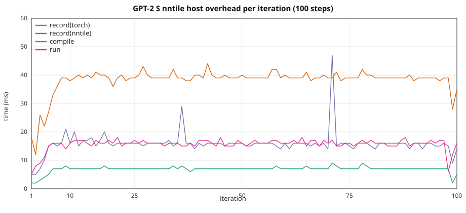

# GPT-2 HF: graph overhead vs width / seqlen

Three paths, same configs / seq_len / 10 steps:

1. **CUDA** — stock HuggingFace `GPT2LMHeadModel`, `device=cuda`, no
   `torch_nntile` import.
2. **`torch.nn` on nntile** — same HF model on `device=nntile` (aten /
   torch-native StarPU codelets).
3. **`torch_nntile.nn` on nntile** — `torch_nntile.models.gpt2_minimal.GPT2LMHead`
   (`gemm`, `add_fiber`, `sdpa_kernel`, classic `LayerNorm` / `Embedding` /
   `GELU`, `training.cross_entropy`, fused `SGD`). Hand-written NNTile
   kernels only. `gpt2_minimal.py` was not changed for this study.

Three-way loss and wall: [Three paths](#three-paths-1-run). Paths 1–2
10-repeat detail is below that. Path 3 (saved SDPA attn, no QK'
recompute) is in
[torch_nntile.nn vs CUDA](#torch_nntilenn-vs-cuda).
Path 3 per-iter is in
[torch_nntile.nn (classic kernels)](#torch_nntilenn-classic-kernels).

Depth is **12 layers** (XS–L); **XL** uses **6 layers** at similar param count. Width and sequence length grow
together with **`seq_len = n_embd / 2`**. XS is the 2 GiB GPT-2
width (`n_embd=1536` from [`2gb/gpt2.json`](../../torch_nntile/examples/2gb/gpt2.json))
with **12 layers** instead of that file's 20.

> **VRAM warning.** Nntile keeps extra graph buffers, so it uses
> **more GPU memory than CUDA** on the same model. If that footprint
> no longer fits in device memory, StarPU **moves data between CPU and
> GPU**. Those transfers dominate step time and make nntile look much
> slower than CUDA. Keep CUDA well under the card limit so nntile
> stays on-device. On this ladder (1 repeat): CUDA XL **34.5 GiB**,
> `torch.nn` XL **32.1 GiB** (no D2H), classic XL **37.3 GiB** (no D2H).
> See [Peak VRAM and bus](#peak-vram-and-bus-1-repeat).

Configs: [`torch_nntile/examples/overhead_gpt2/`](../../torch_nntile/examples/overhead_gpt2/).  
Paths 1–2: [`train_gpt2_hf.py`](../../torch_nntile/examples/train_gpt2_hf.py),
[`run_gpt2_overhead_benchmark.py`](../../torch_nntile/tools/run_gpt2_overhead_benchmark.py).  
Path 3: [`train_gpt2.py`](../../torch_nntile/examples/train_gpt2.py),
[`run_gpt2_nntile_native_overhead_benchmark.py`](../../torch_nntile/tools/run_gpt2_nntile_native_overhead_benchmark.py).

## Train wall

Nntile:

1. Drain leftover work (`wait()`). GPU idle.
2. **Start timer** — *before* the first `record`.
3. Each step: `record → compile → wait(previous run) → run(submit)`.
4. After the last `run()`, **`wait()`**. **Stop timer.**
5. Loss `.item()` is **after** that join.

Logs print `elapsed after first record` (~20 ms). That time is inside
the wall.

CUDA: `synchronize`, start timer, 10 synced steps, stop after the last
synchronize. Prefetch is outside both walls.

Iter 1 nntile `wait=0` (no previous `run()`). Iter 10 `wait` includes
the final join (~2× a steady `wait`).

## Recipe

| | XS | S | M | L | XL |
|--|--:|--:|--:|--:|--:|
| Config | `gpt2_xs.json` | `gpt2_s.json` | `gpt2_m.json` | `gpt2_l.json` | `gpt2_xl.json` |
| `n_layer` | 12 | 12 | 12 | 12 | **6** |
| `n_embd` / `n_head` | 1536 / 24 | 2048 / 16 | 3072 / 24 | 4096 / 32 | 5760 / 45 |
| `--seq-len` (`= n_embd/2`) | **768** | **1024** | **1536** | **2048** | **2880** |
| Params (FP32) | 344 M (1.28 GiB) | 611 M (2.44 GiB) | 1.37 B (5.49 GiB) | 2.44 B (9.74 GiB) | **2.41 B (8.97 GiB)** |

B=1, 10 steps, seed 42, `--no-shuffle`, MATH SDPA, CUDA `--disable-tf32`,
nntile `--ncpu 0 --ncuda 1 --restrict-cuda`. NVIDIA A40, **GPU 0** (XS–L), **GPU 1** (XL).
Separate processes (never import `torch_nntile` in the CUDA child).

Paths 1–2 rerun: 2026-08-25 (XS–L) and 2026-08-28 (XL), **10 repeats**
(mean ± stdev; [`benchmark_logs/`](../../benchmark_logs/)
`gpt2_*_20260828_gpu1`, `/tmp/gpt2_overhead_x10_100step_20260825`).
Path 3 (classic `sdpa_kernel` **saves attn**; QK' recompute is gone):
2026-08-30, 1 repeat, `STARPU_LIMIT_CUDA_MEM=46000`. Logs:
[`benchmark_logs/classic_saveattn_mem_20260830/gpt2/`](../../benchmark_logs/classic_saveattn_mem_20260830/gpt2/).

## Three paths (1 run)

Same recipe as the 10-repeat study. **1 repeat**. CUDA and `torch.nn`
from the torch-native ladder (2026-08-29). `torch_nntile.nn` is the
saved-attn run (2026-08-30). Logs:
`/tmp/bench_check_20260829/overhead/gpt2/` (paths 1–2),
[`benchmark_logs/classic_saveattn_mem_20260830/gpt2/`](../../benchmark_logs/classic_saveattn_mem_20260830/gpt2/)
(path 3).

### Loss

| Setup | CUDA | torch.nn nntile | torch_nntile.nn |
|-------|-----:|----------------:|----------------:|
| XS T=768 | 7.888845 | 7.888845 | 7.888844 |
| S T=1024 | 7.929048 | 7.929048 | 7.929047 |
| M T=1536 | 7.996911 | 7.996911 | 7.996909 |
| L T=2048 | 8.127417 | 8.127417 | 8.127415 |
| XL T=2880 | 8.389783 | 8.389783 | 8.389775 |

CUDA and `torch.nn` match to printed 1e-6. `torch_nntile.nn` is within
~1e-6. Different kernels; not bit-identical.

### 10-step train wall

Classic `sdpa_kernel` **saves softmax weights** (no QK' recompute).
1 repeat, 2026-08-30, `STARPU_LIMIT_CUDA_MEM=46000`. CUDA / `torch.nn`
columns are the older 1-run paths 1–2 (2026-08-29).

| Setup | CUDA | torch.nn | torch_nntile.nn | torch.nn/CUDA | classic/CUDA |
|-------|-----:|---------:|----------------:|--------------:|-------------:|
| XS T=768 | 1.623 s | 1.640 s | 1.650 s | **1.01×** | **1.02×** |
| S T=1024 | 3.045 s | 2.912 s | 3.034 s | **0.96×** | **1.00×** |
| M T=1536 | 8.572 s | 8.053 s | 8.304 s | **0.94×** | **0.97×** |
| L T=2048 | 18.815 s | 17.798 s | 18.578 s | **0.95×** | **0.99×** |
| XL T=2880 | 25.703 s | 24.469 s | 25.582 s | **0.95×** | **1.00×** |

Classic tracks CUDA (**0.97–1.02×**).

### Peak VRAM and bus (1 repeat)

Peak VRAM is `nvidia-smi memory.used`. H2D/D2H are StarPU bus stats at
shutdown (prefetch + 10 steps + isolated). CUDA has no StarPU bus.
Logs: [`hf_path12_mem_20260830/gpt2/`](../../benchmark_logs/hf_path12_mem_20260830/gpt2/)
(CUDA / `torch.nn`);
[`classic_saveattn_mem_20260830/gpt2/`](../../benchmark_logs/classic_saveattn_mem_20260830/gpt2/)
(`torch_nntile.nn`).

| Setup | CUDA VRAM | torch.nn VRAM | torch.nn H2D | torch.nn D2H | torch_nntile.nn VRAM | torch_nntile.nn H2D | torch_nntile.nn D2H |
|-------|----------:|--------------:|-------------:|-------------:|---------------------:|--------------------:|--------------------:|
| XS T=768 | 4.5 GiB | 3.8 GiB | 1.29 GB | **0** | 5.0 GiB | 1.30 GB | **0** |
| S T=1024 | 7.2 GiB | 5.5 GiB | 2.29 GB | **0** | 7.6 GiB | 2.29 GB | **0** |
| M T=1536 | 16.3 GiB | 13.4 GiB | 5.13 GB | **0** | 17.8 GiB | 5.13 GB | **0** |
| L T=2048 | 28.2 GiB | 25.2 GiB | 9.11 GB | **0** | 32.9 GiB | 9.10 GB | **0** |
| XL T=2880 | 34.5 GiB | 32.1 GiB | 9.05 GB | **0** | **37.3 GiB** | 9.06 GB | **0** |

No D2H on any path. `torch.nn` peak is **below** CUDA; classic is above.

## torch_nntile.nn vs CUDA

Path 3 only, overlap, 10 steps, **1 repeat**, 2026-08-30, saved attn.
CUDA walls are the published paths 1–2 10-repeat means (not re-run).
Peak VRAM / H2D / D2H below are **`torch_nntile.nn`**. CUDA VRAM and
`torch.nn` bus stats are in [Peak VRAM and bus](#peak-vram-and-bus-1-repeat).
[`benchmark_logs/classic_saveattn_mem_20260830/gpt2/`](../../benchmark_logs/classic_saveattn_mem_20260830/gpt2/).

| Setup | CUDA wall | classic wall | classic/CUDA | isolated | peak VRAM | H2D | D2H | host/wall | classic loss |
|-------|----------:|-------------:|-------------:|---------:|----------:|----:|----:|----------:|-------------:|
| XS T=768 | 1.614 ± 0.007 s | 1.650 s | **1.02×** | 0.148 s | 5.0 GiB | 1.30 GB | **0** | **25.0%** | 7.888844 |
| S T=1024 | 3.024 ± 0.008 s | 3.034 s | **1.00×** | 0.289 s | 7.6 GiB | 2.29 GB | **0** | **13.1%** | 7.929048 |
| M T=1536 | 8.502 ± 0.010 s | 8.304 s | **0.98×** | 0.815 s | 17.8 GiB | 5.13 GB | **0** | **4.3%** | 7.996910 |
| L T=2048 | 18.953 ± 0.027 s | 18.578 s | **0.98×** | 1.851 s | 32.9 GiB | 9.10 GB | **0** | **1.9%** | 8.127415 |
| XL T=2880 | 26.332 ± 0.177 s | 25.582 s | **0.97×** | 2.570 s | **37.3 GiB** | 9.06 GB | **0** | **0.8%** | 8.389775 |

Host = `record(nntile)+record(torch)+compile`. Host **share** drops **25.0% → 13.1% → 4.3% → 1.9% → 0.8%**. No StarPU reclaim. H2D is the initial prefetch.

| Setup | record(nntile) | record(torch) | compile | run | wait |
|-------|---------------:|--------------:|--------:|----:|-----:|
| XS T=768 | 0.041 s | 0.199 s | 0.173 s | 0.153 s | 1.084 s |
| S T=1024 | 0.040 s | 0.194 s | 0.164 s | 0.156 s | 2.479 s |
| M T=1536 | 0.036 s | 0.170 s | 0.155 s | 0.154 s | 7.787 s |
| L T=2048 | 0.032 s | 0.187 s | 0.141 s | 0.151 s | 18.064 s |
| XL T=2880 | 0.021 s | 0.114 s | 0.082 s | 0.085 s | 25.277 s |

## torch.nn vs CUDA (10 repeats)

Loss matches CUDA vs `torch.nn` nntile to printed 1e-6 (XS 7.888845
both; L 8.127417 both; XL 8.389783 both).

| Setup | CUDA wall | nntile wall | nntile/CUDA | record(nntile) | record(torch) | compile | run | wait | host/wall |
|-------|----------:|------------:|------------:|---------------:|--------------:|--------:|----:|-----:|----------:|
| XS T=768 | 1.614 ± 0.007 s | 1.600 ± 0.014 s | **0.99×** | 0.055 ± 0.002 s | 0.267 ± 0.007 s | 0.127 ± 0.005 s | 0.124 ± 0.004 s | 1.027 ± 0.019 s | **28.0%** |
| S T=1024 | 3.024 ± 0.008 s | 2.890 ± 0.012 s | **0.96×** | 0.057 ± 0.003 s | 0.283 ± 0.011 s | 0.133 ± 0.006 s | 0.132 ± 0.005 s | 2.284 ± 0.014 s | **16.3%** |
| M T=1536 | 8.502 ± 0.010 s | 7.982 ± 0.007 s | **0.94×** | 0.053 ± 0.003 s | 0.270 ± 0.004 s | 0.120 ± 0.006 s | 0.132 ± 0.005 s | 7.407 ± 0.016 s | **5.5%** |
| L T=2048 | 18.953 ± 0.027 s | 17.843 ± 0.046 s | **0.94×** | 0.052 ± 0.002 s | 0.273 ± 0.006 s | 0.118 ± 0.005 s | 0.133 ± 0.004 s | 17.266 ± 0.049 s | **2.5%** |
| XL T=2880 | 26.332 ± 0.177 s | 25.259 ± 0.150 s | **0.96×** | 0.032 ± 0.001 s | 0.173 ± 0.003 s | 0.069 ± 0.003 s | 0.076 ± 0.003 s | 24.906 ± 0.157 s | **1.1%** |

VRAM for CUDA / `torch.nn` / `torch_nntile.nn` is in
[Peak VRAM and bus](#peak-vram-and-bus-1-repeat) (`nvidia-smi`, 1 repeat).

Host = `record(nntile)+record(torch)+compile` (~0.42–0.47 s for 10
steps, **flat**). Host **share** drops **28.0% → 16.3% → 5.5% → 2.5% → 1.1%**
as GPU work grows.

On this ladder CUDA stays ≤28 GiB, so nntile's extra ~1–12 GiB still
fits on the 46 GiB card. Isolated GPU `wait` is then close to CUDA
(XS 0.137 ± 0.001 vs 0.143 ± 0.000 s,
S 0.267 ± 0.001 vs 0.285 ± 0.001 s,
M 0.780 ± 0.003 vs 0.836 ± 0.002 s,
L 1.759 ± 0.002 vs 1.878 ± 0.001 s, XL 2.476 ± 0.007 vs 2.611 ± 0.009 s).

## Per iteration (mean ± stdev over 10 runs)

### XS (`n_embd=1536`, `T=768`)

| Iter | CUDA wall | record(nntile) | record(torch) | compile | run | wait |
|-----:|----------:|---------------:|--------------:|--------:|----:|-----:|
| 1 | 0.328 ± 0.005 | 0.002 | 0.017 ± 0.001 | 0.005 ± 0.001 | 0.006 ± 0.000 | 0.000 |
| 2 | 0.143 ± 0.001 | 0.002 | 0.012 ± 0.000 | 0.005 ± 0.001 | 0.007 ± 0.001 | 0.276 ± 0.010 |
| 3 | 0.143 ± 0.001 | 0.004 ± 0.001 | 0.017 ± 0.002 | 0.009 ± 0.002 | 0.010 ± 0.002 | 0.102 ± 0.004 |
| 4 | 0.143 ± 0.001 | 0.005 ± 0.001 | 0.021 ± 0.002 | 0.014 ± 0.003 | 0.013 ± 0.001 | 0.091 ± 0.006 |
| 5 | 0.143 ± 0.001 | 0.006 ± 0.001 | 0.026 ± 0.001 | 0.015 ± 0.001 | 0.014 ± 0.001 | 0.081 ± 0.003 |
| 6 | 0.143 ± 0.001 | 0.007 ± 0.001 | 0.030 ± 0.001 | 0.016 ± 0.002 | 0.015 ± 0.001 | 0.076 ± 0.003 |
| 7 | 0.143 ± 0.001 | 0.007 ± 0.001 | 0.033 ± 0.001 | 0.015 ± 0.001 | 0.014 ± 0.001 | 0.073 ± 0.002 |
| 8 | 0.143 ± 0.001 | 0.008 ± 0.001 | 0.034 ± 0.004 | 0.015 ± 0.001 | 0.015 ± 0.001 | 0.072 ± 0.005 |
| 9 | 0.143 ± 0.001 | 0.007 ± 0.001 | 0.039 ± 0.001 | 0.017 ± 0.002 | 0.015 ± 0.002 | 0.065 ± 0.003 |
| 10 | 0.143 ± 0.001 | 0.007 ± 0.000 | 0.039 ± 0.001 | 0.015 ± 0.001 | 0.015 ± 0.002 | 0.193 ± 0.003 |

### S (`n_embd=2048`, `T=1024`)

| Iter | CUDA wall | record(nntile) | record(torch) | compile | run | wait |
|-----:|----------:|---------------:|--------------:|--------:|----:|-----:|
| 1 | 0.459 ± 0.004 | 0.002 ± 0.000 | 0.018 ± 0.001 | 0.006 ± 0.002 | 0.006 ± 0.001 | 0.000 |
| 2 | 0.284 ± 0.001 | 0.002 | 0.012 ± 0.000 | 0.006 ± 0.001 | 0.008 ± 0.001 | 0.381 ± 0.002 |
| 3 | 0.285 ± 0.001 | 0.003 ± 0.001 | 0.021 ± 0.009 | 0.013 ± 0.005 | 0.010 ± 0.002 | 0.230 ± 0.005 |
| 4 | 0.285 ± 0.001 | 0.005 ± 0.001 | 0.022 ± 0.003 | 0.012 ± 0.002 | 0.013 ± 0.002 | 0.221 ± 0.007 |
| 5 | 0.285 ± 0.001 | 0.006 ± 0.001 | 0.028 ± 0.002 | 0.016 ± 0.002 | 0.014 ± 0.001 | 0.209 ± 0.006 |
| 6 | 0.285 ± 0.001 | 0.007 ± 0.001 | 0.030 ± 0.002 | 0.016 ± 0.001 | 0.015 ± 0.001 | 0.206 ± 0.004 |
| 7 | 0.285 ± 0.001 | 0.008 ± 0.002 | 0.035 ± 0.002 | 0.016 ± 0.001 | 0.016 ± 0.001 | 0.199 ± 0.005 |
| 8 | 0.285 ± 0.001 | 0.008 ± 0.000 | 0.038 ± 0.002 | 0.016 ± 0.001 | 0.016 ± 0.001 | 0.195 ± 0.002 |
| 9 | 0.285 ± 0.001 | 0.008 ± 0.001 | 0.040 ± 0.000 | 0.017 ± 0.001 | 0.016 ± 0.002 | 0.193 ± 0.002 |
| 10 | 0.285 ± 0.001 | 0.008 ± 0.001 | 0.040 ± 0.000 | 0.016 ± 0.001 | 0.016 ± 0.001 | 0.451 ± 0.003 |

### M (`n_embd=3072`, `T=1536`)

| Iter | CUDA wall | record(nntile) | record(torch) | compile | run | wait |
|-----:|----------:|---------------:|--------------:|--------:|----:|-----:|
| 1 | 0.984 ± 0.004 | 0.002 | 0.017 ± 0.001 | 0.006 ± 0.000 | 0.006 ± 0.001 | 0.000 |
| 2 | 0.832 ± 0.001 | 0.002 | 0.012 ± 0.000 | 0.006 ± 0.001 | 0.008 ± 0.000 | 0.883 ± 0.001 |
| 3 | 0.834 ± 0.001 | 0.003 ± 0.001 | 0.017 ± 0.001 | 0.009 ± 0.001 | 0.011 ± 0.001 | 0.740 ± 0.003 |
| 4 | 0.835 ± 0.001 | 0.005 ± 0.001 | 0.021 ± 0.002 | 0.011 ± 0.002 | 0.013 ± 0.001 | 0.733 ± 0.005 |
| 5 | 0.835 ± 0.001 | 0.006 ± 0.001 | 0.026 ± 0.001 | 0.014 ± 0.002 | 0.014 ± 0.001 | 0.722 ± 0.005 |
| 6 | 0.836 ± 0.002 | 0.006 ± 0.001 | 0.029 ± 0.001 | 0.015 ± 0.001 | 0.015 ± 0.001 | 0.717 ± 0.003 |
| 7 | 0.837 ± 0.001 | 0.007 ± 0.000 | 0.033 ± 0.001 | 0.015 ± 0.001 | 0.016 ± 0.001 | 0.716 ± 0.004 |
| 8 | 0.837 ± 0.001 | 0.007 | 0.038 ± 0.001 | 0.014 ± 0.001 | 0.015 ± 0.001 | 0.710 ± 0.004 |
| 9 | 0.837 ± 0.001 | 0.007 | 0.039 ± 0.001 | 0.016 ± 0.001 | 0.017 ± 0.003 | 0.709 ± 0.003 |
| 10 | 0.837 ± 0.001 | 0.007 ± 0.000 | 0.039 ± 0.001 | 0.014 ± 0.001 | 0.016 ± 0.001 | 1.477 ± 0.007 |

### L (`n_embd=4096`, `T=2048`)

| Iter | CUDA wall | record(nntile) | record(torch) | compile | run | wait |
|-----:|----------:|---------------:|--------------:|--------:|----:|-----:|
| 1 | 2.001 ± 0.006 | 0.002 | 0.017 ± 0.001 | 0.005 ± 0.001 | 0.006 ± 0.001 | 0.000 |
| 2 | 1.881 ± 0.005 | 0.002 | 0.012 ± 0.000 | 0.006 ± 0.000 | 0.009 ± 0.001 | 1.860 ± 0.011 |
| 3 | 1.881 ± 0.002 | 0.004 ± 0.000 | 0.018 ± 0.002 | 0.009 ± 0.001 | 0.011 ± 0.001 | 1.726 ± 0.005 |
| 4 | 1.882 ± 0.002 | 0.005 ± 0.001 | 0.022 ± 0.002 | 0.012 ± 0.002 | 0.014 ± 0.002 | 1.723 ± 0.004 |
| 5 | 1.886 ± 0.004 | 0.006 ± 0.001 | 0.027 ± 0.002 | 0.014 ± 0.001 | 0.014 ± 0.001 | 1.715 ± 0.006 |
| 6 | 1.886 ± 0.008 | 0.006 ± 0.000 | 0.030 ± 0.001 | 0.013 ± 0.001 | 0.015 ± 0.001 | 1.711 ± 0.006 |
| 7 | 1.883 ± 0.007 | 0.007 ± 0.000 | 0.033 ± 0.001 | 0.014 ± 0.001 | 0.016 ± 0.002 | 1.704 ± 0.011 |
| 8 | 1.885 ± 0.009 | 0.007 ± 0.000 | 0.036 ± 0.002 | 0.013 ± 0.001 | 0.015 ± 0.001 | 1.696 ± 0.011 |
| 9 | 1.885 ± 0.008 | 0.006 ± 0.001 | 0.039 ± 0.002 | 0.016 ± 0.001 | 0.016 ± 0.001 | 1.693 ± 0.012 |
| 10 | 1.881 ± 0.004 | 0.007 ± 0.000 | 0.040 ± 0.001 | 0.014 ± 0.001 | 0.016 ± 0.002 | 3.438 ± 0.007 |


### XL (`n_embd=5760`, `T=2880`, 6 layers, `head_dim=128`)

| Iter | CUDA wall | record(nntile) | record(torch) | compile | run | wait |
|-----:|----------:|---------------:|--------------:|--------:|----:|-----:|
| 1 | 2.944 ± 0.141 | 0.001 ± 0.000 | 0.012 ± 0.001 | 0.003 | 0.004 ± 0.000 | 0.000 |
| 2 | 2.586 ± 0.009 | 0.001 | 0.007 ± 0.000 | 0.003 ± 0.000 | 0.005 ± 0.001 | 3.026 ± 0.147 |
| 3 | 2.589 ± 0.005 | 0.002 ± 0.000 | 0.010 ± 0.001 | 0.005 ± 0.001 | 0.006 ± 0.001 | 2.433 ± 0.008 |
| 4 | 2.591 ± 0.005 | 0.003 ± 0.001 | 0.014 ± 0.001 | 0.007 ± 0.001 | 0.008 ± 0.001 | 2.425 ± 0.008 |
| 5 | 2.596 ± 0.005 | 0.004 ± 0.001 | 0.018 ± 0.001 | 0.008 ± 0.001 | 0.009 ± 0.001 | 2.422 ± 0.006 |
| 6 | 2.601 ± 0.005 | 0.004 | 0.020 ± 0.001 | 0.008 ± 0.000 | 0.009 ± 0.001 | 2.421 ± 0.006 |
| 7 | 2.602 ± 0.005 | 0.004 | 0.022 ± 0.001 | 0.008 ± 0.000 | 0.009 ± 0.001 | 2.424 ± 0.007 |
| 8 | 2.607 ± 0.004 | 0.004 | 0.024 ± 0.001 | 0.008 ± 0.000 | 0.009 ± 0.001 | 2.426 ± 0.006 |
| 9 | 2.607 ± 0.010 | 0.004 | 0.023 ± 0.002 | 0.010 ± 0.000 | 0.009 ± 0.001 | 2.428 ± 0.006 |
| 10 | 2.608 ± 0.011 | 0.004 | 0.023 ± 0.001 | 0.008 ± 0.000 | 0.009 ± 0.001 | 4.902 ± 0.012 |
## Isolated extra step (mean ± stdev over 10 runs)

| Setup | record(nntile) | record(torch) | compile | run | wait | run+wait | CUDA isolated |
|-------|---------------:|--------------:|--------:|----:|-----:|---------:|--------------:|
| XS | 0.007 ± 0.000 | 0.039 ± 0.000 | 0.014 ± 0.001 | 0.014 | 0.123 ± 0.001 | **0.137 ± 0.001** | 0.143 ± 0.000 |
| S | 0.007 | 0.040 ± 0.001 | 0.015 ± 0.000 | 0.014 ± 0.000 | 0.253 ± 0.001 | **0.267 ± 0.001** | 0.285 ± 0.001 |
| M | 0.007 ± 0.000 | 0.040 ± 0.001 | 0.015 | 0.014 | 0.766 ± 0.003 | **0.780 ± 0.003** | 0.836 ± 0.002 |
| L | 0.007 ± 0.000 | 0.042 ± 0.001 | 0.015 ± 0.001 | 0.014 ± 0.001 | 1.744 ± 0.002 | **1.759 ± 0.002** | 1.878 ± 0.001 |

| Setup | Full isolated (record+compile+run+wait) | Hidden host (`run+wait`) | Saved |
|-------|----------------------------------------:|-------------------------:|------:|
| XS | 0.198 s | 0.137 s | 0.061 s (**31%**) |
| S | 0.329 s | 0.267 s | 0.061 s (**19%**) |
| M | 0.843 s | 0.780 s | 0.063 s (**7%**) |
| L | 1.823 s | 1.759 s | 0.064 s (**4%**) |

## Sequential prep vs compute (`--wait-after-run`)

| Setup | CUDA wall | sequential wall | prep | compute | compute/CUDA | prep/wall |
|-------|----------:|----------------:|-----:|--------:|-------------:|----------:|
| XS T=768 | 1.614 ± 0.007 s | 1.969 ± 0.021 s | 0.454 ± 0.011 s | **1.514 ± 0.016 s** | **0.94×** | 23.1% |
| S T=1024 | 3.024 ± 0.008 s | 3.263 ± 0.020 s | 0.471 ± 0.014 s | **2.791 ± 0.010 s** | **0.92×** | 14.4% |
| M T=1536 | 8.502 ± 0.010 s | 8.366 ± 0.012 s | 0.473 ± 0.008 s | **7.892 ± 0.009 s** | **0.93×** | 5.7% |
| L T=2048 | 18.953 ± 0.027 s | 18.241 ± 0.040 s | 0.485 ± 0.010 s | **17.754 ± 0.037 s** | **0.94×** | 2.7% |
| XL T=2880 | 26.332 ± 0.177 s | 25.492 ± 0.156 s | 0.290 ± 0.007 s | **25.200 ± 0.157 s** | **0.96×** | 1.1% |

Loss matches the overlapping runs (XS 7.888845, S 7.929048, M 7.996911, L 8.127417, XL 8.389783).

### Per iteration (prep / compute, mean ± stdev)

#### XS (`T=768`)

| Iter | prep | compute | record(nntile) | record(torch) | compile | run | wait |
|-----:|-----:|--------:|---------------:|--------------:|--------:|----:|-----:|
| 1 | 0.024 ± 0.001 | 0.297 ± 0.012 | 0.002 ± 0.000 | 0.017 ± 0.001 | 0.005 ± 0.001 | 0.005 ± 0.000 | 0.292 ± 0.012 |
| 2 | 0.022 ± 0.002 | 0.134 ± 0.001 | 0.003 | 0.013 ± 0.001 | 0.006 ± 0.000 | 0.006 ± 0.001 | 0.128 ± 0.001 |
| 3 | 0.029 ± 0.002 | 0.135 ± 0.001 | 0.004 ± 0.001 | 0.017 ± 0.001 | 0.008 ± 0.001 | 0.008 ± 0.001 | 0.127 ± 0.001 |
| 4 | 0.039 ± 0.004 | 0.136 ± 0.001 | 0.005 ± 0.001 | 0.022 ± 0.001 | 0.011 ± 0.002 | 0.011 ± 0.001 | 0.125 ± 0.001 |
| 5 | 0.049 ± 0.003 | 0.135 ± 0.001 | 0.007 ± 0.001 | 0.028 ± 0.002 | 0.014 ± 0.001 | 0.013 ± 0.001 | 0.122 ± 0.001 |
| 6 | 0.053 ± 0.001 | 0.135 ± 0.001 | 0.008 ± 0.001 | 0.031 ± 0.001 | 0.014 ± 0.000 | 0.013 ± 0.000 | 0.122 ± 0.001 |
| 7 | 0.056 ± 0.002 | 0.135 ± 0.001 | 0.008 ± 0.001 | 0.034 ± 0.001 | 0.014 ± 0.000 | 0.013 | 0.122 ± 0.001 |
| 8 | 0.058 ± 0.001 | 0.136 ± 0.001 | 0.008 ± 0.001 | 0.036 ± 0.001 | 0.014 | 0.013 | 0.122 ± 0.001 |
| 9 | 0.064 ± 0.006 | 0.136 ± 0.001 | 0.009 ± 0.002 | 0.040 ± 0.002 | 0.016 ± 0.002 | 0.013 ± 0.001 | 0.122 ± 0.001 |
| 10 | 0.060 ± 0.003 | 0.135 ± 0.000 | 0.007 ± 0.001 | 0.039 ± 0.003 | 0.014 ± 0.000 | 0.013 ± 0.000 | 0.122 ± 0.001 |

#### S (`T=1024`)

| Iter | prep | compute | record(nntile) | record(torch) | compile | run | wait |
|-----:|-----:|--------:|---------------:|--------------:|--------:|----:|-----:|
| 1 | 0.025 ± 0.003 | 0.406 ± 0.004 | 0.002 ± 0.000 | 0.018 ± 0.002 | 0.005 ± 0.001 | 0.006 ± 0.001 | 0.400 ± 0.003 |
| 2 | 0.031 ± 0.006 | 0.263 ± 0.001 | 0.003 ± 0.001 | 0.015 ± 0.005 | 0.012 ± 0.006 | 0.007 ± 0.001 | 0.257 ± 0.001 |
| 3 | 0.032 ± 0.003 | 0.265 ± 0.002 | 0.005 ± 0.001 | 0.018 ± 0.002 | 0.009 ± 0.001 | 0.009 ± 0.001 | 0.256 ± 0.001 |
| 4 | 0.041 ± 0.004 | 0.265 ± 0.001 | 0.006 ± 0.001 | 0.023 ± 0.002 | 0.013 ± 0.002 | 0.011 ± 0.002 | 0.254 ± 0.002 |
| 5 | 0.051 ± 0.004 | 0.265 ± 0.001 | 0.007 ± 0.001 | 0.030 ± 0.002 | 0.014 ± 0.001 | 0.013 ± 0.001 | 0.252 ± 0.001 |
| 6 | 0.054 ± 0.002 | 0.265 ± 0.001 | 0.008 ± 0.001 | 0.032 ± 0.001 | 0.014 ± 0.000 | 0.013 ± 0.001 | 0.252 ± 0.001 |
| 7 | 0.056 ± 0.002 | 0.265 ± 0.001 | 0.008 ± 0.001 | 0.033 ± 0.001 | 0.015 ± 0.001 | 0.013 ± 0.001 | 0.252 ± 0.001 |
| 8 | 0.058 ± 0.003 | 0.266 ± 0.001 | 0.007 ± 0.001 | 0.036 ± 0.002 | 0.014 ± 0.001 | 0.013 ± 0.001 | 0.252 ± 0.001 |
| 9 | 0.061 ± 0.002 | 0.266 ± 0.001 | 0.007 ± 0.001 | 0.038 ± 0.001 | 0.015 ± 0.001 | 0.014 ± 0.001 | 0.252 ± 0.001 |
| 10 | 0.060 ± 0.002 | 0.266 ± 0.001 | 0.007 ± 0.001 | 0.039 ± 0.001 | 0.014 ± 0.000 | 0.013 ± 0.001 | 0.252 ± 0.001 |

#### M (`T=1536`)

| Iter | prep | compute | record(nntile) | record(torch) | compile | run | wait |
|-----:|-----:|--------:|---------------:|--------------:|--------:|----:|-----:|
| 1 | 0.024 ± 0.001 | 0.907 ± 0.001 | 0.002 ± 0.000 | 0.016 ± 0.000 | 0.006 ± 0.000 | 0.006 | 0.901 ± 0.001 |
| 2 | 0.026 ± 0.001 | 0.774 ± 0.002 | 0.004 | 0.015 | 0.008 ± 0.000 | 0.007 ± 0.001 | 0.767 ± 0.003 |
| 3 | 0.036 ± 0.003 | 0.774 ± 0.003 | 0.005 ± 0.001 | 0.020 ± 0.001 | 0.011 ± 0.001 | 0.010 ± 0.001 | 0.764 ± 0.003 |
| 4 | 0.044 ± 0.002 | 0.775 ± 0.001 | 0.007 ± 0.001 | 0.025 ± 0.001 | 0.013 ± 0.001 | 0.012 ± 0.001 | 0.762 ± 0.001 |
| 5 | 0.050 ± 0.002 | 0.776 ± 0.003 | 0.007 ± 0.001 | 0.028 ± 0.001 | 0.014 ± 0.001 | 0.013 ± 0.001 | 0.763 ± 0.002 |
| 6 | 0.055 ± 0.002 | 0.778 ± 0.002 | 0.007 ± 0.001 | 0.032 ± 0.001 | 0.015 ± 0.001 | 0.014 ± 0.001 | 0.763 ± 0.002 |
| 7 | 0.055 ± 0.003 | 0.777 ± 0.002 | 0.008 ± 0.001 | 0.034 ± 0.002 | 0.014 ± 0.001 | 0.013 ± 0.001 | 0.763 ± 0.002 |
| 8 | 0.059 ± 0.003 | 0.778 ± 0.002 | 0.008 ± 0.001 | 0.037 ± 0.002 | 0.014 ± 0.001 | 0.014 ± 0.003 | 0.764 ± 0.002 |
| 9 | 0.062 ± 0.002 | 0.778 ± 0.002 | 0.007 ± 0.001 | 0.039 ± 0.002 | 0.016 ± 0.000 | 0.013 ± 0.001 | 0.764 ± 0.002 |
| 10 | 0.060 ± 0.002 | 0.776 ± 0.003 | 0.008 ± 0.001 | 0.038 ± 0.001 | 0.014 ± 0.000 | 0.013 ± 0.000 | 0.763 ± 0.003 |

#### L (`T=2048`)

| Iter | prep | compute | record(nntile) | record(torch) | compile | run | wait |
|-----:|-----:|--------:|---------------:|--------------:|--------:|----:|-----:|
| 1 | 0.025 ± 0.001 | 1.883 ± 0.001 | 0.002 | 0.017 ± 0.001 | 0.006 ± 0.001 | 0.006 ± 0.001 | 1.876 ± 0.001 |
| 2 | 0.028 ± 0.002 | 1.760 ± 0.003 | 0.004 ± 0.001 | 0.016 ± 0.001 | 0.008 ± 0.001 | 0.008 ± 0.001 | 1.752 ± 0.003 |
| 3 | 0.036 ± 0.003 | 1.765 ± 0.001 | 0.005 ± 0.001 | 0.020 ± 0.001 | 0.011 ± 0.002 | 0.010 ± 0.002 | 1.755 ± 0.002 |
| 4 | 0.047 ± 0.005 | 1.766 ± 0.003 | 0.007 ± 0.001 | 0.025 ± 0.002 | 0.014 ± 0.003 | 0.012 ± 0.001 | 1.754 ± 0.003 |
| 5 | 0.050 ± 0.004 | 1.768 ± 0.004 | 0.007 ± 0.001 | 0.029 ± 0.002 | 0.014 ± 0.001 | 0.012 ± 0.001 | 1.756 ± 0.004 |
| 6 | 0.055 ± 0.003 | 1.765 ± 0.008 | 0.007 ± 0.001 | 0.032 ± 0.001 | 0.015 ± 0.001 | 0.013 ± 0.001 | 1.752 ± 0.008 |
| 7 | 0.057 ± 0.004 | 1.761 ± 0.009 | 0.008 ± 0.001 | 0.034 ± 0.002 | 0.015 ± 0.002 | 0.014 ± 0.002 | 1.748 ± 0.009 |
| 8 | 0.059 ± 0.003 | 1.764 ± 0.009 | 0.008 ± 0.001 | 0.037 ± 0.002 | 0.014 ± 0.001 | 0.013 ± 0.001 | 1.751 ± 0.010 |
| 9 | 0.066 ± 0.004 | 1.763 ± 0.008 | 0.008 ± 0.001 | 0.040 ± 0.002 | 0.018 ± 0.002 | 0.015 ± 0.001 | 1.748 ± 0.008 |
| 10 | 0.062 ± 0.004 | 1.759 ± 0.007 | 0.008 ± 0.002 | 0.039 ± 0.002 | 0.015 ± 0.002 | 0.014 ± 0.002 | 1.745 ± 0.007 |


#### XL (`T=2880`)

| Iter | prep | compute | record(nntile) | record(torch) | compile | run | wait |
|-----:|-----:|--------:|---------------:|--------------:|--------:|----:|-----:|
| 1 | 0.015 ± 0.001 | 3.051 ± 0.160 | 0.001 ± 0.000 | 0.011 ± 0.001 | 0.003 | 0.004 ± 0.001 | 3.046 ± 0.160 |
| 2 | 0.015 ± 0.001 | 2.450 ± 0.010 | 0.002 ± 0.000 | 0.009 ± 0.001 | 0.004 ± 0.001 | 0.004 ± 0.001 | 2.446 ± 0.010 |
| 3 | 0.021 ± 0.002 | 2.451 ± 0.005 | 0.003 ± 0.001 | 0.012 ± 0.001 | 0.005 ± 0.001 | 0.005 ± 0.001 | 2.445 ± 0.006 |
| 4 | 0.028 ± 0.003 | 2.454 ± 0.004 | 0.004 ± 0.001 | 0.016 ± 0.002 | 0.008 ± 0.001 | 0.007 ± 0.001 | 2.447 ± 0.004 |
| 5 | 0.032 ± 0.001 | 2.458 ± 0.006 | 0.005 ± 0.001 | 0.019 ± 0.001 | 0.008 ± 0.001 | 0.007 ± 0.001 | 2.452 ± 0.006 |
| 6 | 0.034 ± 0.001 | 2.461 ± 0.005 | 0.005 ± 0.001 | 0.021 ± 0.001 | 0.008 ± 0.000 | 0.007 ± 0.001 | 2.454 ± 0.004 |
| 7 | 0.035 ± 0.001 | 2.463 ± 0.005 | 0.005 ± 0.000 | 0.023 ± 0.001 | 0.008 ± 0.000 | 0.007 ± 0.001 | 2.456 ± 0.006 |
| 8 | 0.036 ± 0.001 | 2.468 ± 0.006 | 0.005 ± 0.000 | 0.023 ± 0.001 | 0.008 ± 0.000 | 0.007 ± 0.001 | 2.461 ± 0.006 |
| 9 | 0.037 ± 0.001 | 2.470 ± 0.006 | 0.005 ± 0.000 | 0.023 ± 0.001 | 0.009 ± 0.001 | 0.007 | 2.463 ± 0.005 |
| 10 | 0.036 ± 0.001 | 2.473 ± 0.006 | 0.005 ± 0.000 | 0.023 ± 0.001 | 0.008 ± 0.000 | 0.008 ± 0.001 | 2.465 ± 0.006 |
Steady compute after iter 1 (mean over repeats): ~0.134 s (XS),
~0.263 s (S), ~0.774 s (M), ~1.760 s (L), ~2.450 s (XL).

## Takeaways

1. **`seq_len = n_embd / 2`**: XS 768, S 1024, M 1536, L 2048, XL 2880.
2. **First record is in the wall** (~20 ms after `t0`).
3. **Host overhead is flat** (~46–50 ms/step). Share **28.0% → 16.3% → 5.5% → 2.5% → 1.1%**.
4. **With VRAM headroom, nntile matches or beats CUDA** (XS 0.99×, S 0.96×, M 0.94×, L 0.94×, XL 0.96×).
5. **Sequential GPU time** (`run+wait`): **0.94× → 0.92× → 0.93× → 0.94× → 0.96×** CUDA.
6. Timings are **mean ± stdev over 10 runs** on the same GPU.

## 100-step S (nntile, mean ± stdev over 10 runs)

Loss 7.734033.

| | Total | mean / step |
|--|--:|--:|
| record(nntile) | 0.712 ± 0.010 s | 7.1 ms |
| record(torch) | 3.840 ± 0.037 s | 38 ms |
| compile | 1.575 ± 0.011 s | 16 ms |
| run | 1.591 ± 0.015 s | 16 ms |
| wait | 19.774 ± 0.047 s | 198 ms |
| **train wall** | **27.506 ± 0.018 s** | 275 ms |

Host (record + compile) is **22%** of the wall.



CSV: [`gpt2_hf_overhead_s_100.csv`](gpt2_hf_overhead_s_100.csv) (median run).

## torch_nntile.nn (classic kernels)

Same XS–XL configs as above. This is path 3 only:
[`train_gpt2.py`](../../torch_nntile/examples/train_gpt2.py) records
`torch_nntile.models.gpt2_minimal.GPT2LMHead` (`torch_nntile.nn` /
classic kernels). HF is used only to **init** weights
(`load_hf_into_gpt2_lm_head`), then discarded. The train loop is
classic `cross_entropy` + fused `SGD`. `--ncpu 0 --ncuda 1
--restrict-cuda --no-save-checkpoint`. Sequential uses
`--wait-after-run`.

Three-way loss and wall are in [Three paths](#three-paths-1-run).
Tables below are path-3 record/compile/run/wait from the saved-attn
run (2026-08-30). Peak VRAM / H2D / D2H are **`torch_nntile.nn`**.
See [torch_nntile.nn vs CUDA](#torch_nntilenn-vs-cuda) and
[Peak VRAM and bus](#peak-vram-and-bus-1-repeat).

### Overall (path 3 record breakdown)

| Setup | wall | record(nntile) | record(torch) | compile | run | wait | host/wall | peak VRAM | H2D | D2H |
|-------|-----:|---------------:|--------------:|--------:|----:|-----:|----------:|----------:|----:|----:|
| XS T=768 | 1.650 s | 0.041 s | 0.199 s | 0.173 s | 0.153 s | 1.084 s | **25.0%** | 5.0 GiB | 1.30 GB | **0** |
| S T=1024 | 3.034 s | 0.040 s | 0.194 s | 0.164 s | 0.156 s | 2.479 s | **13.1%** | 7.6 GiB | 2.29 GB | **0** |
| M T=1536 | 8.304 s | 0.036 s | 0.170 s | 0.155 s | 0.154 s | 7.787 s | **4.3%** | 17.8 GiB | 5.13 GB | **0** |
| L T=2048 | 18.578 s | 0.032 s | 0.187 s | 0.141 s | 0.151 s | 18.064 s | **1.9%** | 32.9 GiB | 9.10 GB | **0** |
| XL T=2880 | 25.582 s | 0.021 s | 0.114 s | 0.082 s | 0.085 s | 25.277 s | **0.8%** | **37.3 GiB** | 9.06 GB | **0** |

Host = `record(nntile)+record(torch)+compile`. Host **share** drops **25.0% → 13.1% → 4.3% → 1.9% → 0.8%**.
Isolated `run+wait`: XS 0.148 s, S 0.289 s, M 0.815 s, L 1.851 s,
XL 2.570 s.

Per-iteration and sequential tables from the 2026-08-29 QK'
recompute path are omitted.

### `torch_nntile.nn` takeaways

1. Path 3 is `GPT2LMHead` / `torch_nntile.nn`, not stock `torch.nn`.
2. Classic SDPA **saves attn**; QK' recompute is not used.
3. Walls vs CUDA: [torch_nntile.nn vs CUDA](#torch_nntilenn-vs-cuda)
   (**0.97–1.02×**). Classic XL peak **37.3 GiB**, **no D2H**. CUDA /
   `torch.nn` VRAM is in [Peak VRAM and bus](#peak-vram-and-bus-1-repeat).

## How to reproduce

```bash
export TORCH_LIB_DIR="$(python3 -c 'import os, torch; print(os.path.join(os.path.dirname(torch.__file__), "lib"))')"
export NNTILE_BUILD_DIR=$PWD/build TORCH_NNTILE_BUILD_DIR=$PWD/build
export LD_LIBRARY_PATH="${CONDA_PREFIX}/lib:${TORCH_LIB_DIR}:$PWD/build/nntile:$PWD/build/torch_nntile:/opt/starpu/lib"
export STARPU_SILENT=1 STARPU_FXT_TRACE=0 STARPU_WORKERS_NOBIND=1

python3 torch_nntile/tools/run_gpt2_overhead_benchmark.py \
  --logdir benchmark_logs/gpt2_xl_10x_YYYYMMDD_gpu1 --gpu 1 --repeats 10 --sizes xl --skip-long

python3 torch_nntile/tools/update_gpt2_overhead_doc.py \
  --summary /tmp/gpt2_overhead_x10_YYYYMMDD/results_summary.json \
  --results /tmp/gpt2_overhead_x10_YYYYMMDD/results.json

# Classic nntile (GPT2LMHead), same configs. CUDA and nntile must be
# separate processes; Exclusive_Process: one size-group per GPU.
python3 torch_nntile/tools/run_gpt2_nntile_native_overhead_benchmark.py \
  --logdir benchmark_logs/gpt2_nntile_native_YYYYMMDD --gpu 1 \
  --repeats 1 --skip-long --sizes xs s
```
