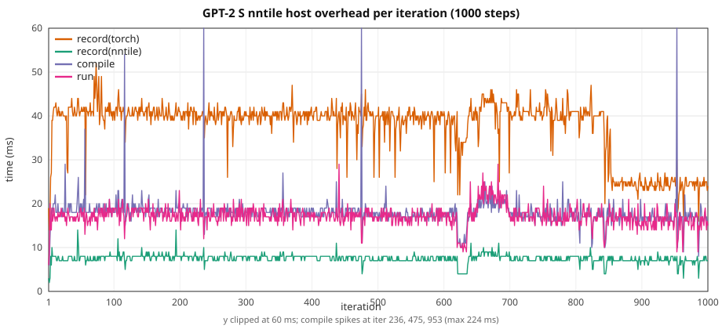

# GPT-2 HF: graph overhead vs width / seqlen

Ten-step stock HuggingFace GPT-2 on **CUDA** vs **`device=nntile`**.
Depth is **12 layers** everywhere. Width and sequence length grow
together with **`seq_len = n_embd / 2`**. XS is the 2 GiB GPT-2
width (`n_embd=1536` from [`2gb/gpt2.json`](../../torch_nntile/examples/2gb/gpt2.json))
with **12 layers** instead of that file’s 20.

> **VRAM warning.** Nntile keeps extra graph buffers, so it uses
> **more GPU memory than CUDA** on the same model. If that footprint
> no longer fits in device memory, StarPU **moves data between CPU and
> GPU**. Those transfers dominate step time and make nntile look much
> slower than CUDA. Keep CUDA well under the card limit (this ladder
> peaks at ~28 GiB CUDA / ~40 GiB nntile on a 46 GiB A40) so nntile
> stays on-device.

Configs: [`torch_nntile/examples/overhead_gpt2/`](../../torch_nntile/examples/overhead_gpt2/).  
Script: [`train_gpt2_hf.py`](../../torch_nntile/examples/train_gpt2_hf.py).

## Train wall

Nntile:

1. Drain leftover work (`wait()`). GPU idle.
2. **Start timer** — *before* the first `record`.
3. Each step: `record → compile → wait(previous run) → run(submit)`.
4. After the last `run()`, **`wait()`**. **Stop timer.**
5. Loss `.item()` is **after** that join.

Logs print `elapsed after first record` (~20 ms). That time is inside
the wall.

CUDA: `synchronize`, start timer, 10 synced steps, stop after the last
synchronize. Prefetch is outside both walls.

Iter 1 nntile `wait=0` (no previous `run()`). Iter 10 `wait` includes
the final join (~2× a steady `wait`).

## Recipe

| | XS | S | M | L |
|--|--:|--:|--:|--:|
| Config | `gpt2_xs.json` | `gpt2_s.json` | `gpt2_m.json` | `gpt2_l.json` |
| `n_layer` | 12 | 12 | 12 | 12 |
| `n_embd` / `n_head` | 1536 / 24 | 2048 / 16 | 3072 / 24 | 4096 / 32 |
| `--seq-len` (`= n_embd/2`) | **768** | **1024** | **1536** | **2048** |
| Params (FP32) | 344 M (1.28 GiB) | 611 M (2.44 GiB) | 1.37 B (5.49 GiB) | 2.44 B (9.74 GiB) |

B=1, 10 steps, seed 42, `--no-shuffle`, MATH SDPA, CUDA `--disable-tf32`,
nntile `--ncpu 0 --ncuda 1 --restrict-cuda`. NVIDIA A40, GPU 3. Separate
processes (never import `torch_nntile` in the CUDA child).

## Overall (10-step train wall)

Loss matches CUDA vs nntile to printed 1e-6 (XS 7.888845 both; L last
digit 8.127417 vs 8.127419).

| Setup | CUDA wall | nntile wall | nntile/CUDA | record(nntile) | record(torch) | compile | run | wait | host/wall | peak VRAM CUDA / nntile |
|-------|----------:|------------:|------------:|---------------:|--------------:|--------:|----:|-----:|----------:|------------------------:|
| XS T=768 | 1.611 s | 1.799 s | **1.12×** | 0.061 s | 0.285 s | 0.152 s | 0.151 s | 1.150 s | **27.7%** | 4.5 / 5.8 GiB |
| S T=1024 | 3.018 s | 3.127 s | **1.04×** | 0.062 s | 0.285 s | 0.161 s | 0.150 s | 2.468 s | **16.2%** | 7.2 / 8.7 GiB |
| M T=1536 | 8.517 s | 8.428 s | **0.99×** | 0.054 s | 0.271 s | 0.128 s | 0.139 s | 7.834 s | **5.4%** | 16.3 / 21.1 GiB |
| L T=2048 | 19.114 s | 18.598 s | **0.97×** | 0.052 s | 0.288 s | 0.129 s | 0.145 s | 17.983 s | **2.5%** | 28.2 / 40.4 GiB |

Host = `record(nntile)+record(torch)+compile` (~0.45–0.51 s for 10
steps, **flat**). Host **share** drops **27.7% → 16.2% → 5.4% → 2.5%**
as GPU work grows. Smaller models are **worse** on both ratio and
overhead percentage.

On this ladder CUDA stays ≤28 GiB, so nntile’s extra ~1–12 GiB still
fits on the 46 GiB card. Isolated GPU `wait` is then close to CUDA
(XS 0.145 vs 0.142 s, S 0.281 vs 0.283 s, M 0.810 vs 0.838 s,
L 1.825 vs 1.904 s). XS’s 12% and S’s 4% wall gaps are leftover host
on a short step (especially iter 1, where `wait=0`). M and L hide
that host behind `wait`.

## Per iteration

### XS (`n_embd=1536`, `T=768`)

| Iter | CUDA wall | record(nntile) | record(torch) | compile | run | wait |
|-----:|----------:|---------------:|--------------:|--------:|----:|-----:|
| 1 | 0.329 | 0.002 | 0.017 | 0.007 | 0.007 | 0.000 |
| 2 | 0.142 | 0.002 | 0.014 | 0.006 | 0.009 | 0.304 |
| 3 | 0.142 | 0.003 | 0.016 | 0.012 | 0.013 | 0.115 |
| 4 | 0.143 | 0.005 | 0.022 | 0.016 | 0.015 | 0.100 |
| 5 | 0.142 | 0.006 | 0.026 | 0.017 | 0.017 | 0.096 |
| 6 | 0.142 | 0.007 | 0.030 | 0.017 | 0.018 | 0.092 |
| 7 | 0.142 | 0.009 | 0.035 | 0.016 | 0.019 | 0.082 |
| 8 | 0.142 | 0.009 | 0.039 | 0.024 | 0.018 | 0.074 |
| 9 | 0.143 | 0.009 | 0.043 | 0.020 | 0.019 | 0.072 |
| 10 | 0.143 | 0.009 | 0.043 | 0.019 | 0.017 | 0.215 |

### S (`n_embd=2048`, `T=1024`)

| Iter | CUDA wall | record(nntile) | record(torch) | compile | run | wait |
|-----:|----------:|---------------:|--------------:|--------:|----:|-----:|
| 1 | 0.461 | 0.002 | 0.019 | 0.007 | 0.007 | 0.000 |
| 2 | 0.283 | 0.002 | 0.013 | 0.006 | 0.011 | 0.402 |
| 3 | 0.284 | 0.005 | 0.019 | 0.031 | 0.011 | 0.243 |
| 4 | 0.284 | 0.005 | 0.022 | 0.014 | 0.017 | 0.241 |
| 5 | 0.284 | 0.008 | 0.030 | 0.018 | 0.017 | 0.221 |
| 6 | 0.284 | 0.008 | 0.031 | 0.018 | 0.016 | 0.223 |
| 7 | 0.284 | 0.008 | 0.036 | 0.016 | 0.015 | 0.218 |
| 8 | 0.285 | 0.008 | 0.034 | 0.017 | 0.019 | 0.218 |
| 9 | 0.284 | 0.008 | 0.039 | 0.018 | 0.017 | 0.213 |
| 10 | 0.284 | 0.008 | 0.041 | 0.016 | 0.019 | 0.489 |

### M (`n_embd=3072`, `T=1536`)

| Iter | CUDA wall | record(nntile) | record(torch) | compile | run | wait |
|-----:|----------:|---------------:|--------------:|--------:|----:|-----:|
| 1 | 0.995 | 0.002 | 0.019 | 0.007 | 0.007 | 0.000 |
| 2 | 0.837 | 0.002 | 0.013 | 0.007 | 0.010 | 0.931 |
| 3 | 0.837 | 0.004 | 0.017 | 0.010 | 0.011 | 0.778 |
| 4 | 0.839 | 0.005 | 0.021 | 0.012 | 0.015 | 0.774 |
| 5 | 0.837 | 0.006 | 0.025 | 0.015 | 0.016 | 0.765 |
| 6 | 0.834 | 0.007 | 0.030 | 0.015 | 0.016 | 0.756 |
| 7 | 0.834 | 0.006 | 0.032 | 0.015 | 0.017 | 0.755 |
| 8 | 0.833 | 0.008 | 0.036 | 0.018 | 0.015 | 0.752 |
| 9 | 0.835 | 0.007 | 0.038 | 0.016 | 0.018 | 0.757 |
| 10 | 0.836 | 0.007 | 0.041 | 0.014 | 0.014 | 1.566 |

### L (`n_embd=4096`, `T=2048`)

| Iter | CUDA wall | record(nntile) | record(torch) | compile | run | wait |
|-----:|----------:|---------------:|--------------:|--------:|----:|-----:|
| 1 | 2.018 | 0.003 | 0.019 | 0.007 | 0.008 | 0.000 |
| 2 | 1.886 | 0.002 | 0.013 | 0.007 | 0.011 | 1.931 |
| 3 | 1.898 | 0.004 | 0.020 | 0.011 | 0.014 | 1.795 |
| 4 | 1.899 | 0.005 | 0.024 | 0.013 | 0.017 | 1.786 |
| 5 | 1.902 | 0.006 | 0.029 | 0.013 | 0.015 | 1.783 |
| 6 | 1.902 | 0.006 | 0.031 | 0.013 | 0.014 | 1.774 |
| 7 | 1.901 | 0.006 | 0.033 | 0.015 | 0.019 | 1.777 |
| 8 | 1.899 | 0.008 | 0.037 | 0.018 | 0.014 | 1.762 |
| 9 | 1.903 | 0.007 | 0.041 | 0.016 | 0.018 | 1.775 |
| 10 | 1.905 | 0.007 | 0.040 | 0.016 | 0.014 | 3.600 |

## Isolated extra step (after final loss, GPU idle)

Sequential nntile phases; no overlap with a previous `run()`.

| Setup | record(nntile) | record(torch) | compile | run | wait | run+wait | CUDA isolated |
|-------|---------------:|--------------:|--------:|----:|-----:|---------:|--------------:|
| XS | 0.004 | 0.035 | 0.007 | 0.008 | 0.145 | **0.153** | 0.142 |
| S | 0.003 | 0.032 | 0.007 | 0.007 | 0.281 | **0.288** | 0.283 |
| M | 0.004 | 0.035 | 0.007 | 0.007 | 0.810 | **0.817** | 0.838 |
| L | 0.003 | 0.034 | 0.007 | 0.007 | 1.825 | **1.832** | 1.904 |

If record+compile run on the host while another job owns the GPU, the
remaining critical path is `run+wait`:

| Setup | Full isolated (record+compile+run+wait) | Hidden host (`run+wait`) | Saved |
|-------|----------------------------------------:|-------------------------:|------:|
| XS | 0.199 s | 0.153 s | 0.046 s (**23%**) |
| S | 0.337 s | 0.288 s | 0.049 s (**15%**) |
| M | 0.863 s | 0.817 s | 0.046 s (**5%**) |
| L | 1.876 s | 1.832 s | 0.044 s (**2%**) |

In the timed 10-step loop, record+compile of step \(k\) already overlap
GPU work of step \(k-1\).

## Sequential prep vs compute (`--wait-after-run`)

Same 10-step nntile recipe, but each step is
`record → compile → run() → wait()` with **no overlap**. CUDA numbers
are the overlapping-ladder walls (not rerun). Prep is
`record(nntile)+record(torch)+compile`. Compute is `run+wait` — GPU
submit plus join of **this** step. That compute time is what would
still occupy the device if another tenant did graph capture on the
host (or on a second stream of work) while this job ran.

| Setup | CUDA wall | sequential wall | prep | compute | compute/CUDA | prep/wall |
|-------|----------:|----------------:|-----:|--------:|-------------:|----------:|
| XS T=768 | 1.611 s | 2.182 s | 0.484 s | **1.696 s** | **1.05×** | 22.2% |
| S T=1024 | 3.018 s | 3.579 s | 0.544 s | **3.034 s** | **1.01×** | 15.2% |
| M T=1536 | 8.517 s | 8.855 s | 0.512 s | **8.341 s** | **0.98×** | 5.8% |
| L T=2048 | 19.114 s | 18.794 s | 0.445 s | **18.347 s** | **0.96×** | 2.4% |

Prep stays ~0.45–0.54 s. Compute tracks CUDA (slightly faster on M/L).
The sequential wall is longer than the overlapping nntile wall because
host prep no longer hides behind the previous `run()`. If several users
share one GPU, the interesting number is **compute**, not that longer
wall.

Loss matches the overlapping runs (XS 7.888845, S 7.929048, M 7.996911,
L 8.127419).

### Per iteration (prep / compute)

#### XS (`T=768`)

| Iter | prep | compute | record(nntile) | record(torch) | compile | run | wait |
|-----:|-----:|--------:|---------------:|--------------:|--------:|----:|-----:|
| 1 | 0.024 | 0.301 | 0.002 | 0.016 | 0.006 | 0.007 | 0.294 |
| 2 | 0.026 | 0.152 | 0.004 | 0.014 | 0.008 | 0.009 | 0.143 |
| 3 | 0.039 | 0.153 | 0.006 | 0.020 | 0.012 | 0.012 | 0.141 |
| 4 | 0.050 | 0.155 | 0.008 | 0.026 | 0.016 | 0.015 | 0.139 |
| 5 | 0.058 | 0.154 | 0.010 | 0.031 | 0.018 | 0.017 | 0.137 |
| 6 | 0.062 | 0.158 | 0.010 | 0.034 | 0.018 | 0.017 | 0.141 |
| 7 | 0.052 | 0.156 | 0.008 | 0.026 | 0.017 | 0.017 | 0.139 |
| 8 | 0.061 | 0.156 | 0.009 | 0.033 | 0.018 | 0.019 | 0.138 |
| 9 | 0.062 | 0.154 | 0.009 | 0.035 | 0.018 | 0.019 | 0.136 |
| 10 | 0.052 | 0.156 | 0.010 | 0.024 | 0.017 | 0.019 | 0.137 |

#### S (`T=1024`)

| Iter | prep | compute | record(nntile) | record(torch) | compile | run | wait |
|-----:|-----:|--------:|---------------:|--------------:|--------:|----:|-----:|
| 1 | 0.028 | 0.432 | 0.002 | 0.019 | 0.007 | 0.007 | 0.425 |
| 2 | 0.042 | 0.286 | 0.004 | 0.015 | 0.022 | 0.010 | 0.276 |
| 3 | 0.036 | 0.287 | 0.005 | 0.019 | 0.012 | 0.010 | 0.277 |
| 4 | 0.044 | 0.288 | 0.006 | 0.025 | 0.012 | 0.011 | 0.277 |
| 5 | 0.054 | 0.290 | 0.009 | 0.030 | 0.015 | 0.014 | 0.276 |
| 6 | 0.060 | 0.291 | 0.008 | 0.035 | 0.017 | 0.016 | 0.275 |
| 7 | 0.070 | 0.289 | 0.007 | 0.047 | 0.016 | 0.015 | 0.274 |
| 8 | 0.066 | 0.289 | 0.011 | 0.037 | 0.018 | 0.017 | 0.272 |
| 9 | 0.074 | 0.290 | 0.010 | 0.039 | 0.025 | 0.020 | 0.270 |
| 10 | 0.069 | 0.291 | 0.009 | 0.042 | 0.018 | 0.017 | 0.274 |

#### M (`T=1536`)

| Iter | prep | compute | record(nntile) | record(torch) | compile | run | wait |
|-----:|-----:|--------:|---------------:|--------------:|--------:|----:|-----:|
| 1 | 0.028 | 0.953 | 0.002 | 0.019 | 0.007 | 0.008 | 0.945 |
| 2 | 0.032 | 0.817 | 0.005 | 0.016 | 0.010 | 0.012 | 0.805 |
| 3 | 0.040 | 0.818 | 0.006 | 0.020 | 0.013 | 0.011 | 0.806 |
| 4 | 0.052 | 0.822 | 0.008 | 0.026 | 0.018 | 0.014 | 0.808 |
| 5 | 0.049 | 0.821 | 0.006 | 0.026 | 0.017 | 0.014 | 0.807 |
| 6 | 0.051 | 0.821 | 0.006 | 0.029 | 0.016 | 0.013 | 0.808 |
| 7 | 0.060 | 0.820 | 0.007 | 0.032 | 0.021 | 0.016 | 0.804 |
| 8 | 0.069 | 0.821 | 0.011 | 0.039 | 0.019 | 0.015 | 0.806 |
| 9 | 0.058 | 0.824 | 0.007 | 0.036 | 0.016 | 0.016 | 0.808 |
| 10 | 0.072 | 0.824 | 0.009 | 0.044 | 0.019 | 0.017 | 0.807 |

#### L (`T=2048`)

| Iter | prep | compute | record(nntile) | record(torch) | compile | run | wait |
|-----:|-----:|--------:|---------------:|--------------:|--------:|----:|-----:|
| 1 | 0.028 | 1.947 | 0.003 | 0.019 | 0.007 | 0.008 | 1.939 |
| 2 | 0.029 | 1.823 | 0.005 | 0.015 | 0.009 | 0.009 | 1.814 |
| 3 | 0.039 | 1.826 | 0.006 | 0.020 | 0.013 | 0.011 | 1.815 |
| 4 | 0.051 | 1.814 | 0.007 | 0.023 | 0.020 | 0.017 | 1.797 |
| 5 | 0.046 | 1.815 | 0.007 | 0.023 | 0.016 | 0.014 | 1.801 |
| 6 | 0.045 | 1.822 | 0.007 | 0.024 | 0.014 | 0.014 | 1.808 |
| 7 | 0.057 | 1.821 | 0.008 | 0.027 | 0.022 | 0.018 | 1.803 |
| 8 | 0.049 | 1.826 | 0.008 | 0.024 | 0.017 | 0.016 | 1.810 |
| 9 | 0.053 | 1.828 | 0.008 | 0.027 | 0.018 | 0.015 | 1.813 |
| 10 | 0.048 | 1.825 | 0.007 | 0.024 | 0.017 | 0.016 | 1.809 |

Steady compute after iter 1 is ~0.155 s (XS), ~0.289 s (S), ~0.821 s
(M), ~1.82 s (L) — the same GPU work as the isolated extra step.

## Takeaways

1. **`seq_len = n_embd / 2`**: XS 768, S 1024, M 1536, L 2048.
2. **First record is in the wall** (~20 ms after `t0`).
3. **Host overhead is flat** (~50 ms/step). Share **28% → 16% → 5% → 2.5%**.
   Smaller models have a **worse** nntile/CUDA ratio and a **higher**
   host share.
4. **With VRAM headroom, nntile matches or beats CUDA** once the step
   is long enough (XS 1.12×, S 1.04×, M 0.99×, L 0.97×).
5. **If prep and compute are split** (`--wait-after-run`), GPU time
   (`run+wait`) is **1.05× → 1.01× → 0.98× → 0.96×** CUDA. That is the
   occupancy another tenant would see if graph capture ran off-device.
6. **If nntile VRAM is too high**, StarPU pages GPU↔CPU and performance
   collapses. Size the job so CUDA is comfortably below the device
   limit (here L CUDA is 28 GiB on a 46 GiB A40).

## 1000-step S (nntile)

Same S recipe (`n_embd=2048`, `T=1024`, B=1), **1000 steps**, nntile
only. Wall starts before the first record and ends on the final
`wait()`. Loss 7.634643.

| | Total | mean / step |
|--|--:|--:|
| record(nntile) | 7.513 s | 7.5 ms |
| record(torch) | 37.541 s | 38 ms |
| compile | 18.253 s | 18 ms |
| run | 17.226 s | 17 ms |
| wait | 222.628 s | 223 ms |
| **train wall** | **303.281 s** | 303 ms |

Host (record + compile) is **21%** of the wall; the rest is GPU
`wait` plus `run` submit. Median per-iter values stay **flat** over
1000 steps (no compile/record growth). A few compile spikes
(iters 236 / 475 / 953: 85 / 131 / 224 ms) sit ~2× apart and do not
trend upward.



`wait` is omitted from the figure (GPU compute, ~220 ms/step). y-axis
clipped at 60 ms so the typical 8–40 ms host bands stay readable.
CSV: [`gpt2_hf_overhead_s_1000.csv`](gpt2_hf_overhead_s_1000.csv).

## How to reproduce

Set up the CUDA runtime env once (conda example; see
[build/README.md](../docs/build/README.md#cuda-runtime-source--conda)):

```bash
export TORCH_LIB_DIR="$(python3 -c 'import os, torch; print(os.path.join(os.path.dirname(torch.__file__), "lib"))')"
export NNTILE_BUILD_DIR=$PWD/build TORCH_NNTILE_BUILD_DIR=$PWD/build
export LD_LIBRARY_PATH="${CONDA_PREFIX}/lib:${TORCH_LIB_DIR}:$PWD/build/nntile:$PWD/build/torch_nntile:/opt/starpu/lib"
export STARPU_SILENT=1 STARPU_FXT_TRACE=0 STARPU_WORKERS_NOBIND=1
```

```bash
# CUDA: do not put torch_nntile on PYTHONPATH
python3 -u torch_nntile/examples/train_gpt2_hf.py train \
  --device cuda --disable-tf32 --seed 42 --no-shuffle \
  --config torch_nntile/examples/overhead_gpt2/gpt2_s.json \
  --seq-len 1024 --batch-size 1 --max-sequences 10 --epochs 1 \
  --output-dir /tmp/gpt2_overhead_s_cuda

# nntile: PYTHONPATH=torch_nntile package; see env block above
export PYTHONPATH=$PWD/torch_nntile
python3 -u torch_nntile/examples/train_gpt2_hf.py train \
  --device nntile --restrict-cuda --ncpu 0 --ncuda 1 --seed 42 --no-shuffle \
  --config torch_nntile/examples/overhead_gpt2/gpt2_s.json \
  --seq-len 1024 --batch-size 1 --max-sequences 10 --epochs 1 \
  --output-dir /tmp/gpt2_overhead_s_nntile
```

XS: `gpt2_xs.json --seq-len 768`. M: `gpt2_m.json --seq-len 1536`.
L: `gpt2_l.json --seq-len 2048`.
Sequential prep/compute: add `--wait-after-run` on nntile.
S 1000-step: `--max-sequences 1000` on `gpt2_s.json --seq-len 1024`.
The nntile log must show `elapsed after first record` ~0.02 s.
