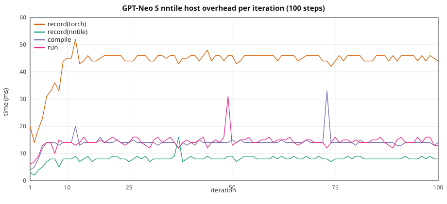

# GPT-Neo HF: graph overhead vs width / seqlen

Ten-step stock HuggingFace **GPTNeoForCausalLM** on **CUDA** vs **`device=nntile`**.
Depth is **12 global-attention layers** everywhere. Width and sequence length
grow together with **`seq_len = hidden_size / 2`**. XS uses the 2 GiB GPT-Neo
width (`hidden_size=1536` from [`2gb/gpt_neo.json`](../../torch_nntile/examples/2gb/gpt_neo.json))
with **12 layers** instead of that file's 20.

> **VRAM warning.** Same as GPT-2: nntile keeps extra graph buffers. Keep CUDA
> well under the card limit on large configs so nntile stays on-device (no
> StarPU CPU↔GPU paging).

Configs: [`torch_nntile/examples/overhead_gpt_neo/`](../../torch_nntile/examples/overhead_gpt_neo/).  
Script: [`train_gpt_neo_hf.py`](../../torch_nntile/examples/train_gpt_neo_hf.py).  
Benchmark runner: [`run_gpt_neo_overhead_benchmark.py`](../../torch_nntile/tools/run_gpt_neo_overhead_benchmark.py).

## Attention backend

Stock HF GPT-Neo (transformers **4.52**) registers **`eager`** and
`flash_attention_2` only — **no `sdpa` class**. This study uses
**`attn_implementation="eager"`** (`GPTNeoSelfAttention`: explicit
`matmul` / `softmax` / mask), on both CUDA and nntile. CUDA runs with
`--disable-tf32`. GPT-2 SDPA / MATH pinning does **not** apply here.

## Train wall

Same recipe as
[`gpt2_hf_overhead_scale.md`](gpt2_hf_overhead_scale.md): nntile
`record → compile → wait(prev) → run`, wall from first record through final
`wait()`; CUDA synced per iter. Prefetch outside the wall. Iter 1 nntile
`wait=0`; iter 10 `wait` includes the final join.

## Recipe

| | XS | S | M | L |
|--|--:|--:|--:|--:|
| Config | `gpt_neo_xs.json` | `gpt_neo_s.json` | `gpt_neo_m.json` | `gpt_neo_l.json` |
| `num_layers` | 12 | 12 | 12 | 12 |
| `hidden_size` / `num_heads` | 1536 / 24 | 2048 / 16 | 3072 / 24 | 4096 / 32 |
| `--seq-len` (`= hidden_size/2`) | **768** | **1024** | **1536** | **2048** |
| Params (FP32) | 344 M (1.28 GiB) | 611 M (2.27 GiB) | 1.37 B (5.10 GiB) | 2.43 B (9.06 GiB) |

B=1, 10 steps, seed 42, `--no-shuffle`, eager attention, CUDA `--disable-tf32`,
nntile `--ncpu 0 --ncuda 1 --restrict-cuda`. NVIDIA A40, **GPU 0**.
Separate processes (`PYTHONNOUSERSITE=1`; never import `torch_nntile` in the CUDA child).

Rerun: 2026-08-25, **10 repeats per configuration** (mean ± stdev;
`/tmp/gpt_neo_overhead_x10_100step_20260825`). Includes **S nntile 100-step** steady-state run per repeat.

## Overall (10-step train wall)

| Setup | CUDA wall | nntile wall | nntile/CUDA | record(nntile) | record(torch) | compile | run | wait | host/wall | CUDA loss | nntile loss |
|-------|----------:|------------:|------------:|---------------:|--------------:|--------:|----:|-----:|----------:|----------:|------------:|
| XS T=768 | 1.610 ± 0.005 s | 1.591 ± 0.012 s | **0.99×** | 0.059 ± 0.005 s | 0.318 ± 0.021 s | 0.116 ± 0.006 s | 0.115 ± 0.009 s | 0.982 ± 0.036 s | **31.0%** | 7.919604 | **7.919605** |
| S T=1024 | 3.032 ± 0.025 s | 2.953 ± 0.125 s | **0.97×** | 0.061 ± 0.003 s | 0.334 ± 0.029 s | 0.114 ± 0.004 s | 0.135 ± 0.027 s | 2.307 ± 0.114 s | **17.3%** | 8.061604 | **8.063025** |
| M T=1536 | 8.492 ± 0.110 s | 8.078 ± 0.117 s | **0.95×** | 0.059 ± 0.003 s | 0.304 ± 0.007 s | 0.112 ± 0.002 s | 0.123 ± 0.003 s | 7.480 ± 0.112 s | **5.9%** | 8.281400 | **8.283568** |
| L T=2048 | 19.002 ± 0.040 s | 18.131 ± 0.023 s | **0.95×** | 0.059 ± 0.002 s | 0.304 ± 0.006 s | 0.111 ± 0.006 s | 0.126 ± 0.004 s | 17.530 ± 0.028 s | **2.6%** | 8.430460 | **8.375641** |

Host = `record(nntile)+record(torch)+compile` (~0.50–0.59 s for 10 steps,
**flat**). Host **share** drops **31.0% → 17.3% → 5.9% → 2.6%**
as GPU work grows.

- **XS:** loss matches to printed digits (7.919604).

### Loss / correctness

- **S:** CUDA 8.061604 vs nntile 8.063025 (Δ 0.001421).
- **M:** CUDA 8.281400 vs nntile 8.283568 (Δ 0.002168).
- **L:** CUDA 8.430460 vs nntile 8.375641 (Δ 0.054819).

Performance ratios remain informative; investigate eager-attention training parity separately from graph overhead.

Isolated GPU `run+wait` vs CUDA isolated wall:
XS 0.137 ± 0.001 vs 0.142 s,
S 0.270 ± 0.002 vs 0.285 ± 0.001 s,
M 0.783 ± 0.004 vs 0.831 ± 0.004 s,
L 1.793 ± 0.002 vs 1.883 ± 0.004 s.

## 100-step S (nntile steady state, mean ± stdev over 10 runs)

Same **S** config (`hidden_size=2048`, `T=1024`, B=1), **100 optimizer steps**, nntile
overlap only. Complements the 10-step ladder above.

Loss **7.932405**.

| | Total | mean / step |
|--|--:|--:|
| record(nntile) | 0.789 ± 0.009 s | 7.9 ms |
| record(torch) | 4.311 ± 0.196 s | 43 ms |
| compile | 1.383 ± 0.007 s | 14 ms |
| run | 1.470 ± 0.042 s | 15 ms |
| wait | 19.596 ± 0.195 s | 196 ms |
| **train wall** | **27.561 ± 0.058 s** | 276 ms |

Host (record + compile) is **24%** of the wall (~65 ms/step).



CSV: [`gpt_neo_hf_overhead_s_100.csv`](gpt_neo_hf_overhead_s_100.csv) (median of 10 runs).

## Comparison to GPT-2 (same ladder geometry)

See [`gpt2_hf_overhead_scale.md`](gpt2_hf_overhead_scale.md) for the GPT-2 10× run
(same A40 GPU 0, Aug 2026, CUDA-parity matmul).

| Size | GPT-2 nntile/CUDA | GPT-Neo nntile/CUDA |
|------|------------------:|--------------------:|
| XS | 0.99× | **0.99×** |
| S | 0.96× | **0.97×** |
| M | 0.94× | **0.95×** |
| L | 0.94× | **0.95×** |

### 100-step S (nntile)

| | GPT-2 | GPT-Neo | Notes |
|--|------:|--------:|-------|
| train wall | 27.5 s | **27.6 s** | same ballpark |
| final loss | 7.734033 | **7.932405** | Neo drifts vs CUDA on 10-step S |
| host share | 22% | **24%** | flat host, GPU-bound |

## Per iteration (mean ± stdev over 10 runs)

### XS (`hidden_size=1536`, `T=768`)

| Iter | CUDA wall | record(nntile) | record(torch) | compile | run | wait |
|-----:|----------:|---------------:|--------------:|--------:|----:|-----:|
| 1 | 0.330 ± 0.002 | 0.002 ± 0.000 | 0.019 ± 0.002 | 0.005 ± 0.001 | 0.006 ± 0.001 | 0.000 |
| 2 | 0.142 ± 0.000 | 0.002 ± 0.000 | 0.014 ± 0.001 | 0.005 ± 0.001 | 0.007 ± 0.001 | 0.265 ± 0.011 |
| 3 | 0.142 ± 0.001 | 0.004 ± 0.002 | 0.021 ± 0.004 | 0.008 ± 0.002 | 0.009 ± 0.002 | 0.099 ± 0.007 |
| 4 | 0.142 ± 0.001 | 0.005 ± 0.001 | 0.025 ± 0.004 | 0.012 ± 0.001 | 0.013 ± 0.004 | 0.089 ± 0.008 |
| 5 | 0.142 ± 0.001 | 0.008 ± 0.002 | 0.033 ± 0.004 | 0.014 ± 0.003 | 0.013 ± 0.001 | 0.074 ± 0.009 |
| 6 | 0.142 ± 0.000 | 0.007 ± 0.000 | 0.036 ± 0.004 | 0.014 ± 0.001 | 0.012 ± 0.001 | 0.072 ± 0.005 |
| 7 | 0.142 ± 0.000 | 0.007 ± 0.000 | 0.039 ± 0.004 | 0.014 ± 0.001 | 0.013 ± 0.001 | 0.068 ± 0.004 |
| 8 | 0.142 ± 0.000 | 0.007 ± 0.000 | 0.042 ± 0.003 | 0.014 ± 0.001 | 0.013 ± 0.001 | 0.065 ± 0.004 |
| 9 | 0.142 ± 0.000 | 0.007 ± 0.001 | 0.044 ± 0.002 | 0.016 ± 0.001 | 0.014 ± 0.001 | 0.062 ± 0.003 |
| 10 | 0.142 ± 0.000 | 0.008 ± 0.001 | 0.045 ± 0.002 | 0.014 ± 0.001 | 0.013 ± 0.002 | 0.188 ± 0.002 |

### S (`hidden_size=2048`, `T=1024`)

| Iter | CUDA wall | record(nntile) | record(torch) | compile | run | wait |
|-----:|----------:|---------------:|--------------:|--------:|----:|-----:|
| 1 | 0.463 ± 0.002 | 0.003 ± 0.001 | 0.019 ± 0.001 | 0.005 ± 0.001 | 0.006 ± 0.001 | 0.000 |
| 2 | 0.293 ± 0.030 | 0.002 ± 0.000 | 0.014 ± 0.000 | 0.005 ± 0.001 | 0.019 ± 0.025 | 0.415 ± 0.116 |
| 3 | 0.284 ± 0.001 | 0.004 ± 0.001 | 0.041 ± 0.030 | 0.007 ± 0.002 | 0.009 ± 0.004 | 0.232 ± 0.004 |
| 4 | 0.284 ± 0.001 | 0.005 ± 0.002 | 0.024 ± 0.003 | 0.012 ± 0.002 | 0.013 ± 0.002 | 0.219 ± 0.009 |
| 5 | 0.284 ± 0.001 | 0.007 ± 0.001 | 0.031 ± 0.003 | 0.014 ± 0.001 | 0.015 ± 0.002 | 0.206 ± 0.006 |
| 6 | 0.285 ± 0.001 | 0.008 ± 0.002 | 0.035 ± 0.002 | 0.014 ± 0.001 | 0.014 ± 0.001 | 0.202 ± 0.005 |
| 7 | 0.285 ± 0.001 | 0.007 ± 0.001 | 0.039 ± 0.002 | 0.014 ± 0.000 | 0.014 ± 0.001 | 0.199 ± 0.003 |
| 8 | 0.284 ± 0.001 | 0.008 ± 0.000 | 0.041 ± 0.002 | 0.015 ± 0.003 | 0.015 ± 0.001 | 0.196 ± 0.002 |
| 9 | 0.285 ± 0.001 | 0.008 ± 0.000 | 0.044 ± 0.001 | 0.015 ± 0.001 | 0.015 ± 0.001 | 0.191 ± 0.002 |
| 10 | 0.285 ± 0.001 | 0.008 ± 0.000 | 0.045 ± 0.001 | 0.014 ± 0.001 | 0.015 ± 0.001 | 0.448 ± 0.003 |

### M (`hidden_size=3072`, `T=1536`)

| Iter | CUDA wall | record(nntile) | record(torch) | compile | run | wait |
|-----:|----------:|---------------:|--------------:|--------:|----:|-----:|
| 1 | 1.021 ± 0.116 | 0.002 ± 0.000 | 0.019 ± 0.001 | 0.005 ± 0.000 | 0.006 ± 0.001 | 0.000 |
| 2 | 0.828 ± 0.002 | 0.002 ± 0.000 | 0.014 ± 0.001 | 0.005 ± 0.001 | 0.007 ± 0.001 | 0.922 ± 0.112 |
| 3 | 0.828 ± 0.003 | 0.004 | 0.019 ± 0.000 | 0.008 ± 0.001 | 0.009 ± 0.001 | 0.746 ± 0.001 |
| 4 | 0.830 ± 0.002 | 0.005 ± 0.001 | 0.025 ± 0.003 | 0.012 ± 0.001 | 0.014 ± 0.002 | 0.737 ± 0.007 |
| 5 | 0.831 ± 0.003 | 0.008 ± 0.001 | 0.030 ± 0.002 | 0.013 ± 0.001 | 0.014 ± 0.002 | 0.724 ± 0.006 |
| 6 | 0.829 ± 0.003 | 0.007 ± 0.001 | 0.034 ± 0.002 | 0.013 ± 0.001 | 0.014 ± 0.002 | 0.722 ± 0.005 |
| 7 | 0.831 ± 0.004 | 0.007 ± 0.000 | 0.037 ± 0.002 | 0.013 ± 0.001 | 0.014 ± 0.001 | 0.717 ± 0.005 |
| 8 | 0.829 ± 0.002 | 0.007 ± 0.000 | 0.039 ± 0.001 | 0.014 ± 0.001 | 0.015 ± 0.002 | 0.715 ± 0.004 |
| 9 | 0.832 ± 0.002 | 0.007 ± 0.000 | 0.042 ± 0.001 | 0.015 ± 0.001 | 0.014 ± 0.001 | 0.710 ± 0.003 |
| 10 | 0.831 ± 0.004 | 0.007 ± 0.000 | 0.044 ± 0.001 | 0.014 ± 0.001 | 0.015 ± 0.001 | 1.486 ± 0.006 |

### L (`hidden_size=4096`, `T=2048`)

| Iter | CUDA wall | record(nntile) | record(torch) | compile | run | wait |
|-----:|----------:|---------------:|--------------:|--------:|----:|-----:|
| 1 | 2.017 ± 0.004 | 0.003 ± 0.001 | 0.019 ± 0.001 | 0.005 | 0.006 | 0.000 |
| 2 | 1.889 ± 0.004 | 0.002 | 0.014 ± 0.000 | 0.006 ± 0.001 | 0.008 ± 0.001 | 1.892 ± 0.003 |
| 3 | 1.892 ± 0.002 | 0.004 ± 0.001 | 0.019 ± 0.001 | 0.008 ± 0.001 | 0.010 ± 0.001 | 1.761 ± 0.004 |
| 4 | 1.890 ± 0.006 | 0.006 ± 0.001 | 0.026 ± 0.003 | 0.012 ± 0.001 | 0.014 ± 0.002 | 1.752 ± 0.007 |
| 5 | 1.889 ± 0.011 | 0.008 ± 0.001 | 0.032 ± 0.003 | 0.013 ± 0.003 | 0.013 ± 0.001 | 1.731 ± 0.008 |
| 6 | 1.888 ± 0.011 | 0.007 ± 0.001 | 0.033 ± 0.002 | 0.012 ± 0.001 | 0.014 ± 0.001 | 1.731 ± 0.010 |
| 7 | 1.887 ± 0.010 | 0.007 ± 0.001 | 0.037 ± 0.002 | 0.013 ± 0.001 | 0.015 ± 0.001 | 1.726 ± 0.005 |
| 8 | 1.885 ± 0.009 | 0.007 ± 0.001 | 0.039 ± 0.001 | 0.013 ± 0.001 | 0.016 ± 0.004 | 1.720 ± 0.004 |
| 9 | 1.882 ± 0.004 | 0.007 ± 0.001 | 0.042 ± 0.002 | 0.015 ± 0.001 | 0.013 ± 0.001 | 1.713 ± 0.005 |
| 10 | 1.881 ± 0.001 | 0.007 ± 0.001 | 0.044 ± 0.001 | 0.013 ± 0.001 | 0.015 ± 0.001 | 3.503 ± 0.007 |

## Isolated extra step (mean ± stdev over 10 runs)

| Setup | record(nntile) | record(torch) | compile | run | wait | run+wait | CUDA isolated |
|-------|---------------:|--------------:|--------:|----:|-----:|---------:|--------------:|
| XS | 0.008 ± 0.000 | 0.044 ± 0.006 | 0.014 | 0.013 ± 0.000 | 0.124 ± 0.001 | **0.137 ± 0.001** | 0.142 |
| S | 0.008 ± 0.001 | 0.047 ± 0.002 | 0.015 ± 0.003 | 0.014 ± 0.001 | 0.256 ± 0.002 | **0.270 ± 0.002** | 0.285 ± 0.001 |
| M | 0.008 ± 0.000 | 0.047 ± 0.001 | 0.014 ± 0.000 | 0.013 ± 0.000 | 0.770 ± 0.004 | **0.783 ± 0.004** | 0.831 ± 0.004 |
| L | 0.008 ± 0.001 | 0.048 ± 0.001 | 0.015 ± 0.001 | 0.014 ± 0.001 | 1.780 ± 0.002 | **1.793 ± 0.002** | 1.883 ± 0.004 |

| Setup | Full isolated (record+compile+run+wait) | Hidden host (`run+wait`) | Saved |
|-------|----------------------------------------:|-------------------------:|------:|
| XS | 0.203 s | 0.137 s | 0.066 s (**32%**) |
| S | 0.340 s | 0.270 s | 0.070 s (**21%**) |
| M | 0.852 s | 0.783 s | 0.069 s (**8%**) |
| L | 1.864 s | 1.793 s | 0.071 s (**4%**) |

## Sequential prep vs compute (`--wait-after-run`)

| Setup | CUDA wall | sequential wall | prep | compute | compute/CUDA | prep/wall |
|-------|----------:|----------------:|-----:|--------:|-------------:|----------:|
| XS T=768 | 1.610 ± 0.005 s | 2.019 ± 0.023 s | 0.501 ± 0.017 s | **1.518 ± 0.013 s** | **0.94×** | 24.8% |
| S T=1024 | 3.032 ± 0.025 s | 3.321 ± 0.032 s | 0.513 ± 0.028 s | **2.807 ± 0.012 s** | **0.93×** | 15.4% |
| M T=1536 | 8.492 ± 0.110 s | 8.460 ± 0.021 s | 0.504 ± 0.014 s | **7.955 ± 0.024 s** | **0.94×** | 6.0% |
| L T=2048 | 19.002 ± 0.040 s | 18.565 ± 0.033 s | 0.507 ± 0.013 s | **18.056 ± 0.028 s** | **0.95×** | 2.7% |

Sequential nntile loss: XS 7.919605, S 8.063025, M 8.283568, L 8.375641.

### Per iteration (prep / compute, mean ± stdev)

#### XS (`T=768`)

| Iter | prep | compute | record(nntile) | record(torch) | compile | run | wait |
|-----:|-----:|--------:|---------------:|--------------:|--------:|----:|-----:|
| 1 | 0.026 ± 0.002 | 0.294 ± 0.011 | 0.002 ± 0.000 | 0.019 ± 0.001 | 0.005 ± 0.001 | 0.005 ± 0.001 | 0.288 ± 0.011 |
| 2 | 0.036 ± 0.019 | 0.135 ± 0.001 | 0.004 ± 0.000 | 0.015 ± 0.001 | 0.017 ± 0.018 | 0.006 ± 0.001 | 0.129 ± 0.001 |
| 3 | 0.031 ± 0.002 | 0.135 ± 0.000 | 0.004 ± 0.001 | 0.020 ± 0.001 | 0.007 ± 0.001 | 0.007 ± 0.001 | 0.128 ± 0.001 |
| 4 | 0.041 ± 0.002 | 0.136 ± 0.001 | 0.006 ± 0.001 | 0.025 ± 0.001 | 0.010 ± 0.001 | 0.009 ± 0.001 | 0.126 ± 0.001 |
| 5 | 0.051 ± 0.005 | 0.136 ± 0.001 | 0.008 ± 0.002 | 0.030 ± 0.002 | 0.012 ± 0.002 | 0.012 ± 0.002 | 0.124 ± 0.002 |
| 6 | 0.056 ± 0.002 | 0.136 ± 0.001 | 0.008 ± 0.001 | 0.035 ± 0.001 | 0.013 ± 0.001 | 0.012 ± 0.001 | 0.124 ± 0.001 |
| 7 | 0.061 ± 0.002 | 0.136 ± 0.001 | 0.008 ± 0.001 | 0.038 ± 0.001 | 0.014 ± 0.000 | 0.013 ± 0.001 | 0.123 ± 0.001 |
| 8 | 0.064 ± 0.002 | 0.136 ± 0.001 | 0.009 ± 0.002 | 0.042 ± 0.001 | 0.014 | 0.013 ± 0.001 | 0.123 ± 0.001 |
| 9 | 0.068 ± 0.002 | 0.137 ± 0.001 | 0.009 ± 0.001 | 0.044 ± 0.001 | 0.014 ± 0.001 | 0.013 ± 0.001 | 0.123 ± 0.001 |
| 10 | 0.067 ± 0.002 | 0.137 ± 0.002 | 0.008 ± 0.001 | 0.045 ± 0.002 | 0.014 | 0.013 ± 0.002 | 0.124 ± 0.001 |

#### S (`T=1024`)

| Iter | prep | compute | record(nntile) | record(torch) | compile | run | wait |
|-----:|-----:|--------:|---------------:|--------------:|--------:|----:|-----:|
| 1 | 0.026 ± 0.001 | 0.404 ± 0.001 | 0.003 ± 0.001 | 0.018 ± 0.001 | 0.005 ± 0.001 | 0.006 ± 0.001 | 0.398 ± 0.000 |
| 2 | 0.048 ± 0.029 | 0.265 ± 0.001 | 0.004 ± 0.000 | 0.016 ± 0.001 | 0.029 ± 0.029 | 0.006 ± 0.001 | 0.259 ± 0.001 |
| 3 | 0.032 ± 0.004 | 0.266 ± 0.001 | 0.004 ± 0.001 | 0.020 ± 0.002 | 0.008 ± 0.002 | 0.007 ± 0.001 | 0.259 ± 0.002 |
| 4 | 0.041 ± 0.004 | 0.267 ± 0.001 | 0.006 ± 0.001 | 0.025 ± 0.002 | 0.010 ± 0.001 | 0.010 ± 0.001 | 0.257 ± 0.001 |
| 5 | 0.050 ± 0.004 | 0.267 ± 0.001 | 0.007 ± 0.001 | 0.031 ± 0.002 | 0.012 ± 0.002 | 0.011 ± 0.001 | 0.256 ± 0.001 |
| 6 | 0.056 ± 0.003 | 0.268 ± 0.002 | 0.008 ± 0.001 | 0.035 ± 0.002 | 0.013 ± 0.001 | 0.013 ± 0.003 | 0.255 ± 0.001 |
| 7 | 0.060 ± 0.003 | 0.267 ± 0.001 | 0.008 ± 0.001 | 0.038 ± 0.004 | 0.014 | 0.013 ± 0.000 | 0.255 ± 0.001 |
| 8 | 0.064 ± 0.004 | 0.267 ± 0.001 | 0.009 ± 0.001 | 0.041 ± 0.005 | 0.014 | 0.013 ± 0.001 | 0.255 ± 0.001 |
| 9 | 0.068 ± 0.002 | 0.268 ± 0.001 | 0.009 ± 0.001 | 0.044 ± 0.002 | 0.014 ± 0.001 | 0.013 ± 0.000 | 0.255 ± 0.002 |
| 10 | 0.068 ± 0.003 | 0.268 ± 0.001 | 0.008 ± 0.001 | 0.045 ± 0.002 | 0.015 ± 0.002 | 0.014 ± 0.002 | 0.254 ± 0.002 |

#### M (`T=1536`)

| Iter | prep | compute | record(nntile) | record(torch) | compile | run | wait |
|-----:|-----:|--------:|---------------:|--------------:|--------:|----:|-----:|
| 1 | 0.027 ± 0.001 | 0.911 ± 0.003 | 0.003 ± 0.001 | 0.019 ± 0.001 | 0.005 ± 0.000 | 0.006 ± 0.000 | 0.905 ± 0.003 |
| 2 | 0.028 ± 0.001 | 0.781 ± 0.002 | 0.004 ± 0.000 | 0.017 ± 0.001 | 0.007 ± 0.001 | 0.007 ± 0.001 | 0.774 ± 0.002 |
| 3 | 0.037 ± 0.003 | 0.782 ± 0.001 | 0.006 ± 0.001 | 0.022 ± 0.002 | 0.009 ± 0.001 | 0.009 ± 0.001 | 0.774 ± 0.001 |
| 4 | 0.043 ± 0.003 | 0.782 ± 0.002 | 0.006 ± 0.000 | 0.026 ± 0.001 | 0.011 ± 0.001 | 0.011 ± 0.001 | 0.771 ± 0.003 |
| 5 | 0.050 ± 0.002 | 0.784 ± 0.002 | 0.007 ± 0.001 | 0.030 ± 0.001 | 0.013 ± 0.001 | 0.013 ± 0.002 | 0.771 ± 0.002 |
| 6 | 0.055 ± 0.004 | 0.784 ± 0.003 | 0.007 ± 0.001 | 0.034 ± 0.002 | 0.013 ± 0.001 | 0.013 ± 0.002 | 0.771 ± 0.004 |
| 7 | 0.061 ± 0.003 | 0.784 ± 0.003 | 0.009 ± 0.001 | 0.039 ± 0.002 | 0.014 ± 0.001 | 0.014 ± 0.002 | 0.770 ± 0.004 |
| 8 | 0.066 ± 0.003 | 0.783 ± 0.004 | 0.009 ± 0.001 | 0.042 ± 0.002 | 0.014 ± 0.002 | 0.014 ± 0.002 | 0.769 ± 0.004 |
| 9 | 0.069 ± 0.002 | 0.781 ± 0.004 | 0.009 ± 0.001 | 0.045 ± 0.001 | 0.016 ± 0.001 | 0.014 ± 0.001 | 0.768 ± 0.005 |
| 10 | 0.067 ± 0.002 | 0.782 ± 0.004 | 0.009 ± 0.001 | 0.045 ± 0.001 | 0.014 ± 0.000 | 0.013 ± 0.001 | 0.769 ± 0.004 |

#### L (`T=2048`)

| Iter | prep | compute | record(nntile) | record(torch) | compile | run | wait |
|-----:|-----:|--------:|---------------:|--------------:|--------:|----:|-----:|
| 1 | 0.027 ± 0.001 | 1.924 ± 0.009 | 0.003 ± 0.000 | 0.019 ± 0.001 | 0.005 ± 0.001 | 0.006 ± 0.001 | 1.917 ± 0.009 |
| 2 | 0.031 ± 0.001 | 1.797 ± 0.003 | 0.005 ± 0.000 | 0.018 ± 0.001 | 0.008 ± 0.001 | 0.008 ± 0.001 | 1.789 ± 0.004 |
| 3 | 0.037 ± 0.003 | 1.797 ± 0.003 | 0.005 ± 0.001 | 0.022 ± 0.002 | 0.009 ± 0.001 | 0.008 ± 0.001 | 1.789 ± 0.003 |
| 4 | 0.046 ± 0.004 | 1.795 ± 0.010 | 0.007 ± 0.001 | 0.028 ± 0.002 | 0.012 ± 0.001 | 0.010 ± 0.001 | 1.785 ± 0.010 |
| 5 | 0.053 ± 0.003 | 1.793 ± 0.010 | 0.008 ± 0.001 | 0.032 ± 0.002 | 0.013 ± 0.001 | 0.012 ± 0.001 | 1.781 ± 0.010 |
| 6 | 0.055 ± 0.002 | 1.792 ± 0.007 | 0.008 ± 0.001 | 0.035 ± 0.001 | 0.013 ± 0.001 | 0.012 ± 0.001 | 1.780 ± 0.008 |
| 7 | 0.060 ± 0.005 | 1.788 ± 0.003 | 0.008 ± 0.001 | 0.038 ± 0.004 | 0.014 ± 0.001 | 0.012 ± 0.001 | 1.776 ± 0.004 |
| 8 | 0.064 ± 0.006 | 1.788 ± 0.003 | 0.008 ± 0.000 | 0.041 ± 0.005 | 0.015 ± 0.001 | 0.013 ± 0.002 | 1.775 ± 0.003 |
| 9 | 0.069 ± 0.002 | 1.791 ± 0.003 | 0.008 ± 0.001 | 0.045 ± 0.001 | 0.015 ± 0.002 | 0.013 ± 0.001 | 1.778 ± 0.003 |
| 10 | 0.065 ± 0.007 | 1.791 ± 0.004 | 0.008 ± 0.001 | 0.043 ± 0.006 | 0.014 ± 0.001 | 0.013 ± 0.001 | 1.778 ± 0.004 |

Steady compute after iter 1 (mean over repeats): ~0.135 s (XS),
~0.265 s (S), ~0.781 s (M), ~1.797 s (L).

## Takeaways

1. **`seq_len = hidden_size / 2`**, 12 global layers, eager HF attention.
2. **Graph host overhead is flat** (~0.5 s / 10 steps); share falls as GPU
   work grows (31.0% → 2.6%).
3. **With VRAM headroom, nntile matches or beats CUDA on wall time**
   (XS 0.99×, S 0.97×, M 0.95×, L 0.95×).
4. **Sequential GPU time** (`run+wait`): **0.94× → 0.93× → 0.94× → 0.95×** CUDA.
5. Timings are **mean ± stdev over 10 runs** on the same GPU.
6. Check **CUDA vs nntile loss** above for training parity beyond XS.
7. **100-step S** wall **27.561 ± 0.058 s** — see section above.

## How to reproduce

```bash
export TORCH_LIB_DIR="$(python3 -c 'import os, torch; print(os.path.join(os.path.dirname(torch.__file__), "lib"))')"
export NNTILE_BUILD_DIR=$PWD/build TORCH_NNTILE_BUILD_DIR=$PWD/build
export LD_LIBRARY_PATH="${CONDA_PREFIX}/lib:${TORCH_LIB_DIR}:$PWD/build/nntile:$PWD/build/torch_nntile:/opt/starpu/lib"
export STARPU_SILENT=1 STARPU_FXT_TRACE=0 STARPU_WORKERS_NOBIND=1

python3 torch_nntile/tools/run_gpt_neo_overhead_benchmark.py \
  --logdir /tmp/gpt_neo_overhead_x10_YYYYMMDD --gpu 0 --repeats 10 --long-steps 100

python3 torch_nntile/tools/update_gpt_neo_overhead_doc.py \
  --summary /tmp/gpt_neo_overhead_x10_YYYYMMDD/results_summary.json \
  --results /tmp/gpt_neo_overhead_x10_YYYYMMDD/results.json
```
