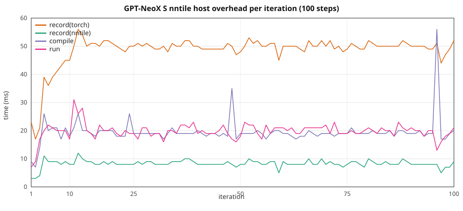

# GPT-NeoX HF: graph overhead vs width / seqlen

Ten-step stock HuggingFace **GPTNeoXForCausalLM** on **CUDA** vs **`device=nntile`**.
Depth is **12 layers** (XS–L); **XL** uses **6 layers** at similar param count.
Width and sequence length grow together with
**`seq_len = hidden_size / 2`**. XS uses the 2 GiB GPT-NeoX width
(`hidden_size=1536` from [`2gb/gpt_neox.json`](../../torch_nntile/examples/2gb/gpt_neox.json))
with **12 layers** instead of that file's 20.

> **VRAM warning.** Same as GPT-2: nntile keeps extra graph buffers. Keep CUDA
> well under the card limit on large configs so nntile stays on-device (no
> StarPU CPU↔GPU paging).

Configs: [`torch_nntile/examples/overhead_gpt_neox/`](../../torch_nntile/examples/overhead_gpt_neox/).  
Script: [`train_gpt_neox_hf.py`](../../torch_nntile/examples/train_gpt_neox_hf.py).  
Benchmark runner: [`run_gpt_neox_overhead_benchmark.py`](../../torch_nntile/tools/run_gpt_neox_overhead_benchmark.py).

## Attention backend

Same as GPT-2: stock HF GPT-NeoX (transformers **4.52**) with
**`attn_implementation="sdpa"`**, MATH backend pinned on both CUDA and nntile.
CUDA runs with `--disable-tf32`.

## Train wall

Same recipe as
[`gpt2_hf_overhead_scale.md`](gpt2_hf_overhead_scale.md): nntile
`record → compile → wait(prev) → run`, wall from first record through final
`wait()`; CUDA synced per iter. Prefetch outside the wall. Iter 1 nntile
`wait=0`; iter 10 `wait` includes the final join.

## Recipe

| | XS | S | M | L | XL |
|--|--:|--:|--:|--:|--:|
| Config | `gpt_neox_xs.json` | `gpt_neox_s.json` | `gpt_neox_m.json` | `gpt_neox_l.json` | `gpt_neox_xl.json` |
| `num_hidden_layers` | 12 | 12 | 12 | 12 | **6** |
| `hidden_size` / `num_attention_heads` | 1536 / 24 | 2048 / 16 | 3072 / 24 | 4096 / 32 | **5760 / 45** |
| `--seq-len` (`= hidden_size/2`) | **768** | **1024** | **1536** | **2048** | **2880** |
| Params (FP32) | 344 M (1.28 GiB) | 611 M (2.27 GiB) | 1.37 B (5.10 GiB) | 2.43 B (9.06 GiB) | **2.41 B (8.97 GiB)** |

B=1, 10 steps, seed 42, `--no-shuffle`, MATH SDPA, CUDA `--disable-tf32`,
nntile `--ncpu 0 --ncuda 1 --restrict-cuda`. NVIDIA A40, **GPU 0**.
Separate processes (`PYTHONNOUSERSITE=1`; never import `torch_nntile` in the CUDA child).

Rerun: 2026-08-25, **10 repeats per configuration** (mean ± stdev;
`/tmp/gpt_neox_overhead_x10_100step_20260825`). Includes **S nntile 100-step** steady-state run per repeat.
**XL** (`head_dim=128`): 2026-08-26, 10 repeats,
[`benchmark_logs/neox_xl_hd128_20260826_gpu0/`](../../benchmark_logs/neox_xl_hd128_20260826_gpu0/).

## Overall (10-step train wall)

| Setup | CUDA wall | nntile wall | nntile/CUDA | record(nntile) | record(torch) | compile | run | wait | host/wall | CUDA loss | nntile loss |
|-------|----------:|------------:|------------:|---------------:|--------------:|--------:|----:|-----:|----------:|----------:|------------:|
| XS T=768 | 1.532 ± 0.131 s | 1.746 ± 0.033 s | **1.14×** | 0.068 ± 0.003 s | 0.351 ± 0.026 s | 0.171 ± 0.009 s | 0.166 ± 0.005 s | 0.989 ± 0.051 s | **33.8%** | 7.951084 | **7.951084** |
| S T=1024 | 2.912 ± 0.173 s | 3.036 ± 0.014 s | **1.04×** | 0.068 ± 0.008 s | 0.332 ± 0.041 s | 0.167 ± 0.010 s | 0.174 ± 0.014 s | 2.294 ± 0.076 s | **18.7%** | 8.017246 | **8.017246** |
| M T=1536 | 8.078 ± 0.063 s | 8.286 ± 0.193 s | **1.03×** | 0.061 ± 0.006 s | 0.322 ± 0.015 s | 0.149 ± 0.012 s | 0.160 ± 0.015 s | 7.594 ± 0.199 s | **6.4%** | 8.167099 | **8.167099** |
| L T=2048 | 18.310 ± 0.138 s | 18.296 ± 0.165 s | **1.00×** | 0.057 ± 0.007 s | 0.319 ± 0.035 s | 0.145 ± 0.011 s | 0.158 ± 0.016 s | 17.616 ± 0.168 s | **2.8%** | 8.425716 | **8.425716** |
| XL T=2880 | 25.401 ± 0.121 s | 25.578 ± 0.100 s | **1.01×** | 0.039 ± 0.004 s | 0.208 ± 0.016 s | 0.092 ± 0.009 s | 0.104 ± 0.009 s | 25.132 ± 0.095 s | **1.3%** | 8.691405 | **8.691405** |

Host = `record(nntile)+record(torch)+compile` (~0.50–0.59 s for 10 steps,
**flat**). Host **share** drops **33.8% → 18.7% → 6.4% → 2.8% → 1.3%**
as GPU work grows.

Loss matches CUDA vs nntile to printed 1e-5 (XS 7.951084 both).

Isolated GPU `run+wait` vs CUDA isolated wall:
XS 0.150 ± 0.002 vs 0.131 ± 0.001 s,
S 0.280 ± 0.002 vs 0.266 ± 0.001 s,
M 0.792 ± 0.004 vs 0.791 ± 0.003 s,
L 1.795 ± 0.004 vs 1.809 ± 0.006 s,
XL 2.503 ± 0.010 vs 2.520 ± 0.005 s.

## 100-step S (nntile steady state, mean ± stdev over 10 runs)

Same **S** config (`hidden_size=2048`, `T=1024`, B=1), **100 optimizer steps**, nntile
overlap only. Complements the 10-step ladder above.

Loss **7.945045**.

| | Total | mean / step |
|--|--:|--:|
| record(nntile) | 0.781 ± 0.067 s | 7.8 ms |
| record(torch) | 4.617 ± 0.533 s | 46 ms |
| compile | 1.902 ± 0.081 s | 19 ms |
| run | 1.887 ± 0.099 s | 19 ms |
| wait | 19.821 ± 0.940 s | 198 ms |
| **train wall** | **29.019 ± 0.294 s** | 290 ms |

Host (record + compile) is **25%** of the wall (~73 ms/step).



CSV: [`gpt_neox_hf_overhead_s_100.csv`](gpt_neox_hf_overhead_s_100.csv) (median of 10 runs).

## Comparison to GPT-2 / GPT-Neo (same ladder geometry)

See [`gpt2_hf_overhead_scale.md`](gpt2_hf_overhead_scale.md) and
[`gpt_neo_hf_overhead_scale.md`](gpt_neo_hf_overhead_scale.md) for the GPT-2 and
GPT-Neo 10× runs (same A40 **GPU 0**, Aug 2026, CUDA-parity matmul).

| Size | GPT-2 nntile/CUDA | GPT-Neo nntile/CUDA | GPT-NeoX nntile/CUDA |
|------|------------------:|--------------------:|---------------------:|
| XS | 0.99× | **1.01×** | **1.14×** |
| S | 0.96× | **1.01×** | **1.04×** |
| M | 0.94× | **0.97×** | **1.03×** |
| L | 0.94× | **0.96×** | **1.00×** |
| XL | 0.96× | **0.97×** | **1.01×** |

### 100-step S (nntile)

| | GPT-2 | GPT-Neo | GPT-NeoX | Notes |
|--|------:|--------:|---------:|-------|
| train wall | 27.5 s | **27.8 s** | **29.0 s** | same ballpark |
| final loss | 7.734033 | **7.932405** | **7.945045** | see 10-step loss table |
| host share | 22% | **24%** | **25%** | flat host, GPU-bound |

## Per iteration (mean ± stdev over 10 runs)

### XS (`hidden_size=1536`, `T=768`)

| Iter | CUDA wall | record(nntile) | record(torch) | compile | run | wait |
|-----:|----------:|---------------:|--------------:|--------:|----:|-----:|
| 1 | 0.354 ± 0.131 | 0.003 | 0.021 ± 0.001 | 0.008 ± 0.001 | 0.010 ± 0.003 | 0.000 |
| 2 | 0.131 ± 0.001 | 0.003 ± 0.000 | 0.017 ± 0.001 | 0.009 ± 0.001 | 0.011 ± 0.001 | 0.285 ± 0.021 |
| 3 | 0.131 ± 0.001 | 0.005 ± 0.001 | 0.024 ± 0.002 | 0.015 ± 0.001 | 0.016 ± 0.003 | 0.095 ± 0.004 |
| 4 | 0.131 ± 0.001 | 0.007 ± 0.001 | 0.029 ± 0.004 | 0.018 ± 0.003 | 0.016 ± 0.002 | 0.082 ± 0.007 |
| 5 | 0.131 ± 0.000 | 0.008 ± 0.001 | 0.033 ± 0.004 | 0.019 ± 0.002 | 0.019 ± 0.002 | 0.079 ± 0.007 |
| 6 | 0.131 ± 0.001 | 0.009 ± 0.001 | 0.040 ± 0.006 | 0.021 ± 0.003 | 0.019 ± 0.002 | 0.066 ± 0.007 |
| 7 | 0.131 ± 0.001 | 0.008 ± 0.001 | 0.044 ± 0.007 | 0.019 ± 0.003 | 0.019 ± 0.001 | 0.065 ± 0.010 |
| 8 | 0.131 ± 0.000 | 0.009 ± 0.001 | 0.047 ± 0.007 | 0.020 ± 0.004 | 0.018 ± 0.002 | 0.061 ± 0.010 |
| 9 | 0.131 ± 0.001 | 0.008 ± 0.001 | 0.046 ± 0.006 | 0.021 ± 0.003 | 0.018 ± 0.002 | 0.062 ± 0.007 |
| 10 | 0.131 ± 0.000 | 0.008 ± 0.001 | 0.049 ± 0.004 | 0.021 ± 0.004 | 0.018 ± 0.002 | 0.195 ± 0.011 |

### S (`hidden_size=2048`, `T=1024`)

| Iter | CUDA wall | record(nntile) | record(torch) | compile | run | wait |
|-----:|----------:|---------------:|--------------:|--------:|----:|-----:|
| 1 | 0.522 ± 0.170 | 0.003 ± 0.001 | 0.021 ± 0.001 | 0.010 ± 0.004 | 0.009 ± 0.002 | 0.000 |
| 2 | 0.265 ± 0.001 | 0.003 ± 0.000 | 0.017 ± 0.001 | 0.008 ± 0.002 | 0.011 ± 0.001 | 0.394 ± 0.010 |
| 3 | 0.265 ± 0.001 | 0.005 ± 0.001 | 0.023 ± 0.002 | 0.014 ± 0.002 | 0.016 ± 0.002 | 0.227 ± 0.006 |
| 4 | 0.265 ± 0.001 | 0.007 ± 0.002 | 0.029 ± 0.005 | 0.019 ± 0.005 | 0.020 ± 0.003 | 0.212 ± 0.011 |
| 5 | 0.265 ± 0.001 | 0.009 ± 0.003 | 0.035 ± 0.006 | 0.019 ± 0.002 | 0.020 ± 0.003 | 0.204 ± 0.010 |
| 6 | 0.266 ± 0.001 | 0.008 ± 0.002 | 0.037 ± 0.007 | 0.020 ± 0.002 | 0.019 ± 0.003 | 0.202 ± 0.012 |
| 7 | 0.266 ± 0.001 | 0.009 ± 0.001 | 0.040 ± 0.005 | 0.020 ± 0.003 | 0.019 ± 0.002 | 0.199 ± 0.010 |
| 8 | 0.266 ± 0.001 | 0.009 ± 0.001 | 0.042 ± 0.007 | 0.019 ± 0.001 | 0.019 ± 0.001 | 0.197 ± 0.009 |
| 9 | 0.266 ± 0.001 | 0.008 ± 0.001 | 0.043 ± 0.007 | 0.019 ± 0.004 | 0.021 ± 0.002 | 0.197 ± 0.011 |
| 10 | 0.266 ± 0.001 | 0.008 ± 0.001 | 0.045 ± 0.009 | 0.020 ± 0.003 | 0.020 ± 0.003 | 0.462 ± 0.014 |

### M (`hidden_size=3072`, `T=1536`)

| Iter | CUDA wall | record(nntile) | record(torch) | compile | run | wait |
|-----:|----------:|---------------:|--------------:|--------:|----:|-----:|
| 1 | 0.965 ± 0.060 | 0.003 | 0.022 ± 0.001 | 0.007 ± 0.001 | 0.010 ± 0.001 | 0.000 |
| 2 | 0.787 ± 0.002 | 0.003 ± 0.000 | 0.017 ± 0.001 | 0.011 ± 0.001 | 0.011 ± 0.001 | 1.018 ± 0.195 |
| 3 | 0.789 ± 0.002 | 0.005 ± 0.001 | 0.023 ± 0.001 | 0.013 ± 0.002 | 0.014 ± 0.002 | 0.743 ± 0.004 |
| 4 | 0.790 ± 0.001 | 0.006 ± 0.001 | 0.027 ± 0.002 | 0.014 ± 0.003 | 0.017 ± 0.002 | 0.736 ± 0.008 |
| 5 | 0.790 ± 0.002 | 0.007 ± 0.001 | 0.033 ± 0.002 | 0.017 ± 0.002 | 0.018 ± 0.003 | 0.727 ± 0.007 |
| 6 | 0.791 ± 0.001 | 0.008 ± 0.001 | 0.036 ± 0.002 | 0.019 ± 0.002 | 0.018 ± 0.003 | 0.719 ± 0.008 |
| 7 | 0.791 ± 0.002 | 0.007 ± 0.001 | 0.038 ± 0.002 | 0.018 ± 0.002 | 0.019 ± 0.002 | 0.720 ± 0.006 |
| 8 | 0.792 ± 0.002 | 0.008 ± 0.001 | 0.041 ± 0.003 | 0.018 ± 0.002 | 0.018 ± 0.004 | 0.716 ± 0.010 |
| 9 | 0.791 ± 0.001 | 0.007 ± 0.002 | 0.042 ± 0.004 | 0.016 ± 0.003 | 0.018 ± 0.003 | 0.715 ± 0.009 |
| 10 | 0.791 ± 0.003 | 0.007 ± 0.001 | 0.043 ± 0.005 | 0.016 ± 0.002 | 0.017 ± 0.003 | 1.500 ± 0.013 |

### L (`hidden_size=4096`, `T=2048`)

| Iter | CUDA wall | record(nntile) | record(torch) | compile | run | wait |
|-----:|----------:|---------------:|--------------:|--------:|----:|-----:|
| 1 | 1.993 ± 0.117 | 0.003 | 0.021 ± 0.001 | 0.010 ± 0.001 | 0.013 ± 0.002 | 0.000 |
| 2 | 1.811 ± 0.004 | 0.003 ± 0.000 | 0.017 ± 0.002 | 0.010 ± 0.001 | 0.011 ± 0.001 | 1.977 ± 0.153 |
| 3 | 1.815 ± 0.003 | 0.004 ± 0.000 | 0.022 ± 0.001 | 0.012 ± 0.002 | 0.013 ± 0.001 | 1.757 ± 0.005 |
| 4 | 1.816 ± 0.003 | 0.005 ± 0.001 | 0.026 ± 0.004 | 0.013 ± 0.003 | 0.015 ± 0.003 | 1.752 ± 0.009 |
| 5 | 1.816 ± 0.005 | 0.006 ± 0.001 | 0.031 ± 0.004 | 0.015 ± 0.002 | 0.017 ± 0.003 | 1.738 ± 0.012 |
| 6 | 1.813 ± 0.009 | 0.007 ± 0.001 | 0.036 ± 0.004 | 0.017 ± 0.001 | 0.017 ± 0.002 | 1.726 ± 0.015 |
| 7 | 1.813 ± 0.009 | 0.007 ± 0.001 | 0.038 ± 0.005 | 0.017 ± 0.002 | 0.017 ± 0.003 | 1.726 ± 0.014 |
| 8 | 1.813 ± 0.009 | 0.007 ± 0.001 | 0.040 ± 0.006 | 0.016 ± 0.002 | 0.018 ± 0.003 | 1.722 ± 0.012 |
| 9 | 1.811 ± 0.009 | 0.007 ± 0.001 | 0.043 ± 0.009 | 0.017 ± 0.003 | 0.019 ± 0.003 | 1.720 ± 0.016 |
| 10 | 1.809 ± 0.006 | 0.008 ± 0.001 | 0.046 ± 0.003 | 0.017 ± 0.002 | 0.018 ± 0.003 | 3.499 ± 0.006 |


### XL (`hidden_size=5760`, `T=2880`, 6 layers, `head_dim=128`)

| Iter | CUDA wall | record(nntile) | record(torch) | compile | run | wait |
|-----:|----------:|---------------:|--------------:|--------:|----:|-----:|
| 1 | 2.762 ± 0.140 | 0.002 | 0.014 ± 0.001 | 0.005 ± 0.000 | 0.007 ± 0.001 | 0.000 |
| 2 | 2.510 ± 0.014 | 0.002 ± 0.001 | 0.009 ± 0.000 | 0.005 ± 0.000 | 0.007 ± 0.001 | 3.034 ± 0.081 |
| 3 | 2.513 ± 0.016 | 0.003 ± 0.000 | 0.013 ± 0.001 | 0.007 ± 0.001 | 0.008 ± 0.002 | 2.468 ± 0.013 |
| 4 | 2.512 ± 0.011 | 0.004 ± 0.001 | 0.018 ± 0.003 | 0.008 ± 0.001 | 0.010 ± 0.002 | 2.458 ± 0.022 |
| 5 | 2.509 ± 0.008 | 0.004 ± 0.001 | 0.020 ± 0.002 | 0.010 ± 0.002 | 0.012 ± 0.002 | 2.449 ± 0.011 |
| 6 | 2.520 ± 0.012 | 0.005 ± 0.001 | 0.024 ± 0.002 | 0.012 ± 0.002 | 0.011 ± 0.003 | 2.444 ± 0.009 |
| 7 | 2.517 ± 0.011 | 0.005 ± 0.001 | 0.026 ± 0.003 | 0.011 ± 0.003 | 0.012 ± 0.003 | 2.449 ± 0.008 |
| 8 | 2.517 ± 0.006 | 0.005 ± 0.001 | 0.027 ± 0.004 | 0.011 ± 0.003 | 0.011 ± 0.003 | 2.445 ± 0.016 |
| 9 | 2.518 ± 0.006 | 0.005 ± 0.001 | 0.029 ± 0.004 | 0.011 ± 0.002 | 0.013 ± 0.002 | 2.447 ± 0.008 |
| 10 | 2.523 ± 0.008 | 0.006 ± 0.001 | 0.029 ± 0.004 | 0.012 ± 0.002 | 0.012 ± 0.002 | 4.939 ± 0.018 |

## Isolated extra step (mean ± stdev over 10 runs)

| Setup | record(nntile) | record(torch) | compile | run | wait | run+wait | CUDA isolated |
|-------|---------------:|--------------:|--------:|----:|-----:|---------:|--------------:|
| XS | 0.008 ± 0.001 | 0.051 ± 0.007 | 0.022 ± 0.003 | 0.020 ± 0.002 | 0.130 ± 0.004 | **0.150 ± 0.002** | 0.131 ± 0.001 |
| S | 0.008 ± 0.002 | 0.050 ± 0.009 | 0.020 ± 0.006 | 0.018 ± 0.004 | 0.263 ± 0.004 | **0.280 ± 0.002** | 0.266 ± 0.001 |
| M | 0.007 ± 0.002 | 0.043 ± 0.009 | 0.020 ± 0.004 | 0.017 ± 0.003 | 0.776 ± 0.003 | **0.792 ± 0.004** | 0.791 ± 0.003 |
| L | 0.007 ± 0.002 | 0.048 ± 0.009 | 0.019 ± 0.004 | 0.016 ± 0.003 | 1.779 ± 0.004 | **1.795 ± 0.004** | 1.809 ± 0.006 |
| XL | 0.005 ± 0.001 | 0.030 ± 0.005 | 0.011 ± 0.003 | 0.010 ± 0.003 | 2.494 ± 0.011 | **2.503 ± 0.010** | 2.520 ± 0.005 |

| Setup | Full isolated (record+compile+run+wait) | Hidden host (`run+wait`) | Saved |
|-------|----------------------------------------:|-------------------------:|------:|
| XS | 0.231 s | 0.150 s | 0.081 s (**35%**) |
| S | 0.358 s | 0.280 s | 0.078 s (**22%**) |
| M | 0.863 s | 0.792 s | 0.071 s (**8%**) |
| L | 1.869 s | 1.795 s | 0.074 s (**4%**) |
| XL | 2.549 s | 2.503 s | 0.046 s (**2%**) |

## Sequential prep vs compute (`--wait-after-run`)

| Setup | CUDA wall | sequential wall | prep | compute | compute/CUDA | prep/wall |
|-------|----------:|----------------:|-----:|--------:|-------------:|----------:|
| XS T=768 | 1.532 ± 0.131 s | 2.267 ± 0.122 s | 0.590 ± 0.035 s | **1.676 ± 0.126 s** | **1.09×** | 26.0% |
| S T=1024 | 2.912 ± 0.173 s | 3.581 ± 0.120 s | 0.602 ± 0.023 s | **2.978 ± 0.113 s** | **1.02×** | 16.8% |
| M T=1536 | 8.078 ± 0.063 s | 8.674 ± 0.121 s | 0.554 ± 0.034 s | **8.120 ± 0.145 s** | **1.01×** | 6.4% |
| L T=2048 | 18.310 ± 0.138 s | 18.827 ± 0.234 s | 0.545 ± 0.029 s | **18.280 ± 0.223 s** | **1.00×** | 2.9% |
| XL T=2880 | 25.401 ± 0.121 s | 25.920 ± 0.191 s | 0.354 ± 0.051 s | **25.564 ± 0.181 s** | **1.01×** | 1.4% |

Sequential nntile loss: XS 7.951084, S 8.017246, M 8.167099, L 8.425716, XL 8.691405.

### Per iteration (prep / compute, mean ± stdev)

#### XS (`T=768`)

| Iter | prep | compute | record(nntile) | record(torch) | compile | run | wait |
|-----:|-----:|--------:|---------------:|--------------:|--------:|----:|-----:|
| 1 | 0.034 ± 0.001 | 0.357 ± 0.123 | 0.003 | 0.022 ± 0.001 | 0.008 ± 0.001 | 0.009 ± 0.001 | 0.348 ± 0.123 |
| 2 | 0.030 ± 0.002 | 0.144 ± 0.002 | 0.004 ± 0.000 | 0.017 ± 0.001 | 0.009 ± 0.001 | 0.009 ± 0.001 | 0.135 ± 0.002 |
| 3 | 0.043 ± 0.004 | 0.145 ± 0.002 | 0.006 ± 0.001 | 0.023 ± 0.002 | 0.013 ± 0.002 | 0.013 ± 0.002 | 0.132 ± 0.003 |
| 4 | 0.053 ± 0.003 | 0.147 ± 0.002 | 0.008 ± 0.001 | 0.028 ± 0.001 | 0.017 ± 0.001 | 0.016 ± 0.001 | 0.131 ± 0.002 |
| 5 | 0.062 ± 0.004 | 0.147 ± 0.003 | 0.009 ± 0.002 | 0.034 ± 0.002 | 0.019 ± 0.002 | 0.020 ± 0.005 | 0.128 ± 0.005 |
| 6 | 0.071 ± 0.005 | 0.148 ± 0.001 | 0.010 ± 0.002 | 0.039 ± 0.003 | 0.022 ± 0.003 | 0.019 ± 0.001 | 0.129 ± 0.002 |
| 7 | 0.068 ± 0.013 | 0.147 ± 0.001 | 0.009 ± 0.002 | 0.039 ± 0.007 | 0.019 ± 0.004 | 0.019 ± 0.004 | 0.128 ± 0.004 |
| 8 | 0.074 ± 0.011 | 0.146 ± 0.002 | 0.011 ± 0.002 | 0.043 ± 0.006 | 0.020 ± 0.003 | 0.020 ± 0.003 | 0.127 ± 0.004 |
| 9 | 0.076 ± 0.010 | 0.147 ± 0.002 | 0.011 ± 0.002 | 0.044 ± 0.006 | 0.021 ± 0.002 | 0.021 ± 0.006 | 0.126 ± 0.004 |
| 10 | 0.078 ± 0.008 | 0.148 ± 0.003 | 0.011 ± 0.001 | 0.046 ± 0.006 | 0.021 ± 0.002 | 0.021 ± 0.002 | 0.127 ± 0.002 |

#### S (`T=1024`)

| Iter | prep | compute | record(nntile) | record(torch) | compile | run | wait |
|-----:|-----:|--------:|---------------:|--------------:|--------:|----:|-----:|
| 1 | 0.035 ± 0.004 | 0.473 ± 0.110 | 0.003 ± 0.000 | 0.023 ± 0.003 | 0.010 ± 0.001 | 0.009 ± 0.001 | 0.463 ± 0.111 |
| 2 | 0.033 ± 0.002 | 0.276 ± 0.002 | 0.005 ± 0.000 | 0.018 ± 0.001 | 0.010 ± 0.001 | 0.011 ± 0.001 | 0.265 ± 0.001 |
| 3 | 0.045 ± 0.004 | 0.278 ± 0.002 | 0.007 ± 0.001 | 0.024 ± 0.001 | 0.014 ± 0.002 | 0.014 ± 0.001 | 0.264 ± 0.002 |
| 4 | 0.057 ± 0.004 | 0.279 ± 0.002 | 0.008 ± 0.001 | 0.030 ± 0.002 | 0.018 ± 0.002 | 0.017 ± 0.002 | 0.262 ± 0.001 |
| 5 | 0.062 ± 0.004 | 0.278 ± 0.002 | 0.009 ± 0.001 | 0.034 ± 0.002 | 0.020 ± 0.002 | 0.018 ± 0.002 | 0.260 ± 0.003 |
| 6 | 0.067 ± 0.007 | 0.279 ± 0.002 | 0.010 ± 0.002 | 0.037 ± 0.002 | 0.020 ± 0.004 | 0.017 ± 0.003 | 0.261 ± 0.003 |
| 7 | 0.068 ± 0.006 | 0.279 ± 0.001 | 0.009 ± 0.001 | 0.040 ± 0.003 | 0.019 ± 0.002 | 0.018 ± 0.002 | 0.261 ± 0.003 |
| 8 | 0.075 ± 0.007 | 0.280 ± 0.003 | 0.010 ± 0.001 | 0.043 ± 0.005 | 0.022 ± 0.003 | 0.019 ± 0.001 | 0.261 ± 0.003 |
| 9 | 0.080 ± 0.007 | 0.279 ± 0.002 | 0.011 ± 0.003 | 0.047 ± 0.002 | 0.022 ± 0.003 | 0.020 ± 0.002 | 0.259 ± 0.002 |
| 10 | 0.079 ± 0.006 | 0.278 ± 0.002 | 0.011 ± 0.001 | 0.046 ± 0.003 | 0.022 ± 0.004 | 0.019 ± 0.002 | 0.259 ± 0.002 |

#### M (`T=1536`)

| Iter | prep | compute | record(nntile) | record(torch) | compile | run | wait |
|-----:|-----:|--------:|---------------:|--------------:|--------:|----:|-----:|
| 1 | 0.031 ± 0.001 | 0.992 ± 0.133 | 0.003 | 0.022 ± 0.001 | 0.006 ± 0.001 | 0.009 ± 0.001 | 0.983 ± 0.133 |
| 2 | 0.036 ± 0.004 | 0.789 ± 0.002 | 0.005 ± 0.001 | 0.019 ± 0.002 | 0.011 ± 0.002 | 0.010 ± 0.002 | 0.778 ± 0.003 |
| 3 | 0.043 ± 0.003 | 0.790 ± 0.003 | 0.006 ± 0.001 | 0.024 ± 0.001 | 0.013 ± 0.002 | 0.012 ± 0.001 | 0.778 ± 0.002 |
| 4 | 0.049 ± 0.002 | 0.792 ± 0.003 | 0.006 ± 0.001 | 0.027 ± 0.001 | 0.015 ± 0.001 | 0.014 ± 0.002 | 0.779 ± 0.003 |
| 5 | 0.056 ± 0.004 | 0.793 ± 0.003 | 0.007 ± 0.001 | 0.032 ± 0.002 | 0.017 ± 0.002 | 0.015 ± 0.002 | 0.777 ± 0.002 |
| 6 | 0.059 ± 0.011 | 0.793 ± 0.003 | 0.007 ± 0.002 | 0.034 ± 0.005 | 0.018 ± 0.005 | 0.016 ± 0.004 | 0.777 ± 0.003 |
| 7 | 0.062 ± 0.010 | 0.794 ± 0.003 | 0.008 ± 0.002 | 0.037 ± 0.006 | 0.018 ± 0.003 | 0.015 ± 0.002 | 0.778 ± 0.004 |
| 8 | 0.069 ± 0.007 | 0.793 ± 0.003 | 0.008 ± 0.002 | 0.042 ± 0.003 | 0.018 ± 0.002 | 0.016 ± 0.002 | 0.777 ± 0.005 |
| 9 | 0.075 ± 0.005 | 0.791 ± 0.003 | 0.009 ± 0.002 | 0.046 ± 0.002 | 0.020 ± 0.002 | 0.017 ± 0.001 | 0.774 ± 0.004 |
| 10 | 0.074 ± 0.014 | 0.792 ± 0.005 | 0.010 ± 0.002 | 0.045 ± 0.008 | 0.019 ± 0.004 | 0.017 ± 0.003 | 0.776 ± 0.006 |

#### L (`T=2048`)

| Iter | prep | compute | record(nntile) | record(torch) | compile | run | wait |
|-----:|-----:|--------:|---------------:|--------------:|--------:|----:|-----:|
| 1 | 0.034 ± 0.001 | 2.091 ± 0.198 | 0.003 | 0.022 ± 0.001 | 0.010 ± 0.001 | 0.013 ± 0.001 | 2.078 ± 0.198 |
| 2 | 0.038 ± 0.001 | 1.801 ± 0.002 | 0.006 ± 0.000 | 0.020 ± 0.001 | 0.012 ± 0.001 | 0.011 ± 0.001 | 1.789 ± 0.002 |
| 3 | 0.046 ± 0.003 | 1.803 ± 0.004 | 0.007 ± 0.001 | 0.025 ± 0.001 | 0.015 ± 0.002 | 0.013 ± 0.001 | 1.789 ± 0.003 |
| 4 | 0.050 ± 0.005 | 1.799 ± 0.007 | 0.007 ± 0.002 | 0.027 ± 0.002 | 0.016 ± 0.002 | 0.013 ± 0.002 | 1.786 ± 0.007 |
| 5 | 0.055 ± 0.004 | 1.799 ± 0.007 | 0.007 ± 0.001 | 0.032 ± 0.002 | 0.016 ± 0.002 | 0.014 ± 0.002 | 1.785 ± 0.009 |
| 6 | 0.064 ± 0.006 | 1.798 ± 0.010 | 0.008 ± 0.001 | 0.036 ± 0.002 | 0.021 ± 0.004 | 0.016 ± 0.002 | 1.782 ± 0.010 |
| 7 | 0.061 ± 0.005 | 1.796 ± 0.009 | 0.007 ± 0.001 | 0.037 ± 0.002 | 0.017 ± 0.002 | 0.014 ± 0.001 | 1.782 ± 0.008 |
| 8 | 0.064 ± 0.006 | 1.799 ± 0.009 | 0.008 ± 0.000 | 0.040 ± 0.004 | 0.017 ± 0.003 | 0.015 ± 0.003 | 1.785 ± 0.009 |
| 9 | 0.068 ± 0.009 | 1.798 ± 0.008 | 0.008 ± 0.001 | 0.041 ± 0.007 | 0.019 ± 0.003 | 0.016 ± 0.002 | 1.782 ± 0.008 |
| 10 | 0.065 ± 0.007 | 1.797 ± 0.006 | 0.007 ± 0.001 | 0.041 ± 0.005 | 0.017 ± 0.002 | 0.015 ± 0.001 | 1.782 ± 0.005 |

Steady compute after iter 1 (mean over repeats): ~0.144 s (XS),
~0.276 s (S), ~0.789 s (M), ~1.801 s (L), ~2.556 s (XL).

#### XL (`T=2880`)

| Iter | prep | compute | record(nntile) | record(torch) | compile | run | wait |
|-----:|-----:|--------:|---------------:|--------------:|--------:|----:|-----:|
| 1 | 0.021 ± 0.002 | 3.077 ± 0.149 | 0.002 | 0.014 ± 0.001 | 0.005 ± 0.000 | 0.008 ± 0.001 | 3.069 ± 0.150 |
| 2 | 0.022 ± 0.003 | 2.503 ± 0.008 | 0.003 ± 0.001 | 0.013 ± 0.001 | 0.006 ± 0.001 | 0.006 ± 0.001 | 2.498 ± 0.009 |
| 3 | 0.030 ± 0.005 | 2.498 ± 0.015 | 0.004 ± 0.001 | 0.016 ± 0.002 | 0.009 ± 0.002 | 0.008 ± 0.002 | 2.490 ± 0.017 |
| 4 | 0.034 ± 0.005 | 2.500 ± 0.009 | 0.005 ± 0.001 | 0.019 ± 0.002 | 0.010 ± 0.002 | 0.009 ± 0.002 | 2.491 ± 0.010 |
| 5 | 0.038 ± 0.008 | 2.490 ± 0.009 | 0.005 ± 0.001 | 0.022 ± 0.003 | 0.011 ± 0.004 | 0.010 ± 0.003 | 2.480 ± 0.009 |
| 6 | 0.037 ± 0.010 | 2.496 ± 0.006 | 0.005 ± 0.002 | 0.023 ± 0.005 | 0.010 ± 0.003 | 0.009 ± 0.003 | 2.488 ± 0.006 |
| 7 | 0.040 ± 0.010 | 2.497 ± 0.007 | 0.005 ± 0.002 | 0.024 ± 0.006 | 0.010 ± 0.003 | 0.009 ± 0.003 | 2.488 ± 0.008 |
| 8 | 0.043 ± 0.009 | 2.499 ± 0.007 | 0.005 ± 0.001 | 0.027 ± 0.006 | 0.010 ± 0.003 | 0.009 ± 0.002 | 2.490 ± 0.005 |
| 9 | 0.046 ± 0.007 | 2.499 ± 0.007 | 0.005 ± 0.001 | 0.028 ± 0.003 | 0.012 ± 0.003 | 0.011 ± 0.004 | 2.488 ± 0.008 |
| 10 | 0.043 ± 0.008 | 2.505 ± 0.003 | 0.005 ± 0.002 | 0.027 ± 0.005 | 0.010 ± 0.003 | 0.009 ± 0.002 | 2.496 ± 0.004 |

## Takeaways

1. **`seq_len = hidden_size / 2`**, 12 layers (XS–L) / 6 layers (XL), MATH SDPA attention.
2. **Graph host overhead is flat** (~0.34–0.59 s / 10 steps); share falls as GPU
   work grows (33.8% → 1.3%).
3. **With VRAM headroom, nntile matches or beats CUDA on wall time**
   (XS 1.14×, S 1.04×, M 1.03×, L 1.00×, XL 1.01×).
4. **Sequential GPU time** (`run+wait`): **1.09× → 1.02× → 1.01× → 1.00× → 1.01×** CUDA.
5. Timings are **mean ± stdev over 10 runs** on the same GPU.
6. Check **CUDA vs nntile loss** above for training parity beyond XS.
7. **100-step S** wall **29.019 ± 0.294 s** — see section above.

## How to reproduce

```bash
export TORCH_LIB_DIR="$(python3 -c 'import os, torch; print(os.path.join(os.path.dirname(torch.__file__), "lib"))')"
export NNTILE_BUILD_DIR=$PWD/build TORCH_NNTILE_BUILD_DIR=$PWD/build
export LD_LIBRARY_PATH="${CONDA_PREFIX}/lib:${TORCH_LIB_DIR}:$PWD/build/nntile:$PWD/build/torch_nntile:/opt/starpu/lib"
export STARPU_SILENT=1 STARPU_FXT_TRACE=0 STARPU_WORKERS_NOBIND=1

python3 torch_nntile/tools/run_gpt_neox_overhead_benchmark.py \
  --logdir /tmp/gpt_neox_overhead_x10_YYYYMMDD --gpu 0 --repeats 10 --long-steps 100

python3 torch_nntile/tools/update_gpt_neox_overhead_doc.py \
  --summary /tmp/gpt_neox_overhead_x10_YYYYMMDD/results_summary.json \
  --results /tmp/gpt_neox_overhead_x10_YYYYMMDD/results.json
```
