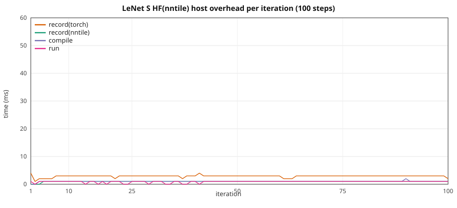

# LeNet HF: graph overhead vs width / spatial size

**Notation.** Each label is **implementation(backend)**.

- **HF** — stock PyTorch `torch.nn` CNN (`TinyLeNet` in
  [`train_lenet_tiny.py`](../../torch_nntile/examples/train_lenet_tiny.py)).
  Not HuggingFace Transformers; the name matches the transformer overhead
  docs (implementation outside the brackets).
- **cuda** — PyTorch CUDA (`device=cuda`).
- **nntile** (as backend) — StarPU / nntile (`device=nntile`).

**There is no nntile(nntile) LeNet.** `torch_nntile.models` has no CNN
ports; this study is only **HF(cuda)** vs **HF(nntile)**.

Two setups, same configs / 10 steps:

1. **HF(cuda)** — stock `TinyLeNet`, `device=cuda`, no `torch_nntile` import.
2. **HF(nntile)** — same graph on `device=nntile` (aten / torch-native
   StarPU codelets: `convolution_overrideable`, `max_pool2d_with_indices`,
   Linear).

> **VRAM warning.** Nntile keeps extra graph buffers. Keep HF(cuda) well
> under the card limit so `device=nntile` stays on-device (no StarPU
> CPU↔GPU paging). If logs show D2H volume, shrink spatial size or
> channels before collecting 10-repeat walls. GPUs are in exclusive mode
> — one process per GPU.

Configs: [`torch_nntile/examples/overhead_lenet/`](../../torch_nntile/examples/overhead_lenet/).
HF(cuda) / HF(nntile):
[`train_cnn_hf_overhead.py`](../../torch_nntile/examples/train_cnn_hf_overhead.py)
(`--model lenet`),
[`run_lenet_overhead_benchmark.py`](../../torch_nntile/tools/run_lenet_overhead_benchmark.py).

## Loss

Classification CE on synthetic NCHW images vs class labels (new batch
seed per step: `42 + step`). Same `F.cross_entropy` on HF(cuda) and
HF(nntile).

## Train wall

Same recipe as
[`gpt2_hf_overhead_scale.md`](gpt2_hf_overhead_scale.md): nntile
`record → compile → wait(prev) → run`, wall from first record through
final `wait()`; HF(cuda) synced per iter. Prefetch outside the wall.
Iter 1 nntile `wait=0`; iter 10 `wait` includes the final join.

The printed 10-step wall includes first-kernel launch. At XS that tax is
a large fraction of the wall (HF(cuda) iter 1 ~0.18 s vs iters 2–10
0.024 s; HF(nntile) first `wait` ~0.15 s). The extra isolated step after
the wall is the steady-state compare.

## Recipe

Spatial size grows with width. `height` / `width` must be divisible by 4
(two stride-2 max-pools). XL shrinks `fc_hidden` (depth analog) and uses
112² so HF(nntile) fills an A40.

| | XS | S | M | L | XL |
|--|--:|--:|--:|--:|--:|
| Config | `lenet_xs.json` | `lenet_s.json` | `lenet_m.json` | `lenet_l.json` | `lenet_xl.json` |
| `height` × `width` | 32² | 48² | 64² | 80² | **112²** |
| `conv1` / `conv2` | 256 / 1024 | 448 / 1792 | 768 / 3072 | 832 / 3328 | 1024 / 4096 |
| `fc_hidden` | 8192 | 4096 | 2048 | 2048 | **1024** |
| Params (FP32) | 544 M (2.02 GiB) | 1.08 B (4.01 GiB) | 1.67 B (6.22 GiB) | 2.80 B (10.41 GiB) | 3.39 B (12.64 GiB) |

B=1, 10 steps, seed 42, `--no-shuffle`, HF(cuda) and HF(nntile)
`--disable-tf32 --disable-cudnn`, `device=nntile` `--ncpu 0 --ncuda 1
--restrict-cuda`. NVIDIA A40, one GPU per job. Separate processes
(`PYTHONNOUSERSITE=1`; never import `torch_nntile` in the HF(cuda)
process). **Do not overlap jobs on one GPU.**

HF(cuda) / HF(nntile): **10 repeats** (mean ± stdev), including **S HF(nntile) 100-step**.
`STARPU_LIMIT_CUDA_MEM=46000`.

## Two setups

### Loss

| Setup | HF(cuda) | HF(nntile) |
|-------|-----:|----------------:|
| XS 32² | 2.587098 | 2.587098 |
| S 48² | 2.315209 | 2.315209 |
| M 64² | 2.347548 | 2.347548 |
| L 80² | 2.310275 | 2.310275 |
| XL 112² | 2.288747 | 2.288747 |

### 10-step train wall

**10 repeats** (mean ± stdev), `STARPU_LIMIT_CUDA_MEM=46000`.
XS is a dedicated `--sizes xs --skip-long` 10-repeat (same flags); S–XL
are from the full ladder. The earlier full-ladder XS wall (HF(cuda)
0.548 ± 0.133 s, **0.74×**) was CUDA first-iter launch on a cold GPU,
not a real nntile speedup.

| Setup | HF(cuda) | HF(nntile) | HF(nntile) / HF(cuda) |
|-------|-----:|---------:|--------------:|
| XS 32² | 0.400 ± 0.011 s | 0.388 ± 0.003 s | **0.97×** |
| S 48² | 0.683 ± 0.099 s | 0.703 ± 0.104 s | **1.03×** |
| M 64² | 1.202 ± 0.153 s | 1.185 ± 0.176 s | **0.99×** |
| L 80² | 1.673 ± 0.102 s | 1.771 ± 0.136 s | **1.06×** |
| XL 112² | 2.569 ± 0.110 s | 2.610 ± 0.114 s | **1.02×** |

Isolated extra step (GPU idle, not in the wall): XS HF(cuda) **0.024 s**
vs HF(nntile) **0.025 s** every repeat.

### Peak VRAM and bus

10-step overlap, NVIDIA A40, `STARPU_LIMIT_CUDA_MEM=46000`, B=1. Peak VRAM is `nvidia-smi memory.used` polled by a sidecar process (`watch_gpu_peak.py`) while the train child runs (`peak_vram_gib=`). H2D/D2H are StarPU bus stats at shutdown from the VRAM-fit probe. **D2H is 0 on every size**.

| Setup | HF(cuda) VRAM | HF(nntile) VRAM | H2D | D2H |
|-------|----------:|----------------:|----:|----:|
| XS 32² | 4.4 GiB | 6.5 GiB | 2.02 GB | **0** |
| S 48² | 8.4 GiB | 12.5 GiB | 4.01 GB | **0** |
| M 64² | 13.0 GiB | 19.2 GiB | 6.22 GB | **0** |
| L 80² | 21.5 GiB | 31.9 GiB | 10.41 GB | **0** |
| XL 112² | 26.1 GiB | 39.0 GiB | 12.64 GB | **0** |

## HF(nntile) vs HF(cuda) (10 repeats)

Overlap mode. Host = `record(nntile)+record(torch)+compile`.

| Setup | HF(cuda) wall | HF(nntile) wall | HF(nntile) / HF(cuda) | record(nntile) | record(torch) | compile | run | wait | host/wall | isolated |
|-------|----------:|------------:|------------:|---------------:|--------------:|--------:|----:|-----:|----------:|---------:|
| XS 32² | 0.400 ± 0.011 s | 0.388 ± 0.003 s | **0.97×** | 0.006 ± 0.001 s | 0.021 ± 0.002 s | 0.007 ± 0.001 s | 0.009 ± 0.001 s | 0.344 ± 0.004 s | **8.7%** | 0.025 s |
| S 48² | 0.683 ± 0.099 s | 0.703 ± 0.104 s | **1.03×** | 0.007 ± 0.002 s | 0.023 ± 0.002 s | 0.007 ± 0.001 s | 0.010 ± 0.002 s | 0.656 ± 0.106 s | **5.3%** | 0.051 ± 0.000 s |
| M 64² | 1.202 ± 0.153 s | 1.185 ± 0.176 s | **0.99×** | 0.007 ± 0.000 s | 0.023 ± 0.002 s | 0.007 ± 0.000 s | 0.011 ± 0.000 s | 1.136 ± 0.175 s | **3.2%** | 0.094 ± 0.000 s |
| L 80² | 1.673 ± 0.102 s | 1.771 ± 0.136 s | **1.06×** | 0.007 ± 0.000 s | 0.024 ± 0.002 s | 0.007 ± 0.001 s | 0.011 ± 0.001 s | 1.721 ± 0.135 s | **2.2%** | 0.149 ± 0.001 s |
| XL 112² | 2.569 ± 0.110 s | 2.610 ± 0.114 s | **1.02×** | 0.007 ± 0.000 s | 0.025 ± 0.001 s | 0.007 ± 0.001 s | 0.010 ± 0.001 s | 2.559 ± 0.114 s | **1.5%** | 0.231 ± 0.001 s |

## Sequential HF(nntile)

`--wait-after-run`: record → compile → run → wait (no overlap).

| Setup | HF(cuda) | HF(nntile) overlap | HF(nntile) sequential | seq / cuda |
|-------|-----:|---------:|----------:|----------:|
| XS 32² | 0.400 ± 0.011 s | 0.388 ± 0.003 s | 0.427 ± 0.012 s | **1.07×** |
| S 48² | 0.683 ± 0.099 s | 0.703 ± 0.104 s | 0.747 ± 0.131 s | **1.09×** |
| M 64² | 1.202 ± 0.153 s | 1.185 ± 0.176 s | 1.267 ± 0.175 s | **1.05×** |
| L 80² | 1.673 ± 0.102 s | 1.771 ± 0.136 s | 1.727 ± 0.103 s | **1.03×** |
| XL 112² | 2.569 ± 0.110 s | 2.610 ± 0.114 s | 2.658 ± 0.166 s | **1.03×** |

## S HF(nntile) 100-step

Overlap, size S, 100 steps, 10 repeats (mean ± stdev). Complements the 10-step HF ladder above.

Loss **2.280750**.

| | Total | mean / step |
|--|--:|--:|
| record(nntile) | 0.078 ± 0.003 s | 0.8 ms |
| record(torch) | 0.256 ± 0.016 s | 2.6 ms |
| compile | 0.090 ± 0.004 s | 0.9 ms |
| run | 0.079 ± 0.006 s | 0.8 ms |
| wait | 4.796 ± 0.021 s | 48 ms |
| **train wall** | **5.311 ± 0.018 s** | 53 ms |

Host (record + compile) is **8%** of the wall.



CSV: [`lenet_hf_overhead_s_100.csv`](lenet_hf_overhead_s_100.csv) (median of 10 runs).

## How to reproduce

```bash
export TORCH_LIB_DIR="$(python3 -c 'import os, torch; print(os.path.join(os.path.dirname(torch.__file__), "lib"))')"
export NNTILE_BUILD_DIR=$PWD/build TORCH_NNTILE_BUILD_DIR=$PWD/build
export LD_LIBRARY_PATH="${CONDA_PREFIX}/lib:${TORCH_LIB_DIR}:$PWD/build/nntile:$PWD/build/torch_nntile:${CONDA_PREFIX}/lib"
export STARPU_SILENT=1 STARPU_FXT_TRACE=0 STARPU_WORKERS_NOBIND=1
export STARPU_LIMIT_CUDA_MEM=46000

# Probe
python3 torch_nntile/tools/run_lenet_overhead_benchmark.py \
  --logdir /tmp/lenet_overhead_probe --gpu 0 --repeats 1 --sizes xs --skip-long

# Full ladder, 10 repeats, one idle GPU
python3 torch_nntile/tools/run_lenet_overhead_benchmark.py \
  --logdir /tmp/lenet_overhead --gpu 0 --repeats 10 --long-steps 100

# XS-only 10-repeat (first-launch vs isolated-step check)
python3 torch_nntile/tools/run_lenet_overhead_benchmark.py \
  --logdir /tmp/lenet_xs --gpu 0 --repeats 10 --sizes xs --skip-long
```

Equivalent with the shared runner:
`python3 torch_nntile/tools/run_cnn_overhead_benchmark.py --family lenet ...`.
