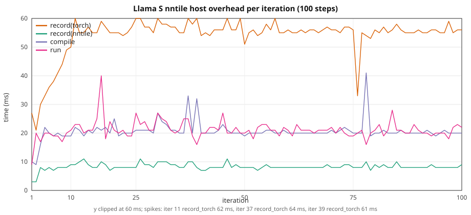

# Llama HF: graph overhead vs width / seqlen

Three paths, same configs / seq_len / 10 steps:

1. **CUDA** — stock HuggingFace `LlamaForCausalLM`, `device=cuda`, no
   `torch_nntile` import.
2. **`torch.nn` on nntile** — same HF model on `device=nntile` (aten /
   torch-native StarPU codelets).
3. **`torch_nntile.nn` on nntile** —
   `torch_nntile.models.llama.LlamaCausal` (classic kernels). HF is used
   only to init weights.

Three-way loss and wall: [Three paths](#three-paths-1-run). Paths 1–2
10-repeat detail is below that. Path 3 (saved SDPA attn, no QK'
recompute) is in
[torch_nntile.nn vs CUDA](#torch_nntilenn-vs-cuda).
Classic Llama XL **fits** on the A40 with this config — see that section.

Depth is **12 layers** for XS–L (MHA: ``num_key_value_heads = num_attention_heads``).
**XL** uses **6 layers**, ``hidden_size=5120`` / 40 heads (head dim 128),
``seq_len = hidden_size / 2 = 2560``. That is slightly below the original
5760 / 45 / T=2880 rung so classic stays on-device on an A40. XS uses
the 2 GiB Llama width (`hidden_size=1536` from
[`2gb/llama.json`](../../torch_nntile/examples/2gb/llama.json)) with **12 layers**
instead of that file's 18.

> **VRAM warning.** Same as GPT-2: nntile keeps extra graph buffers. Keep CUDA
> well under the card limit on large configs so nntile stays on-device (no
> StarPU CPU↔GPU paging). With this XL config, classic **fits** (peak
> **35.6 GiB**, D2H **0**). `torch.nn` XL is **31.1 GiB** (D2H **0**);
> CUDA XL is **27.7 GiB**. The old 5760 / T=2880 classic XL paged
> (~44 GiB, **14.2 GB D2H**).

Configs: [`torch_nntile/examples/overhead_llama/`](../../torch_nntile/examples/overhead_llama/).  
Paths 1–2: [`train_llama_hf.py`](../../torch_nntile/examples/train_llama_hf.py),
[`run_llama_overhead_benchmark.py`](../../torch_nntile/tools/run_llama_overhead_benchmark.py).  
Path 3: [`train_nntile_native_overhead.py`](../../torch_nntile/examples/train_nntile_native_overhead.py),
[`run_nntile_native_overhead_benchmark.py`](../../torch_nntile/tools/run_nntile_native_overhead_benchmark.py).

## Attention backend

Same as GPT-2 / GPT-NeoX: stock HF Llama with **`attn_implementation="sdpa"`**,
MATH backend pinned on both CUDA and nntile. CUDA runs with `--disable-tf32`.

## Train wall

Same recipe as
[`gpt2_hf_overhead_scale.md`](gpt2_hf_overhead_scale.md): nntile
`record → compile → wait(prev) → run`, wall from first record through final
`wait()`; CUDA synced per iter. Prefetch outside the wall. Iter 1 nntile
`wait=0`; iter 10 `wait` includes the final join.

## Recipe

| | XS | S | M | L | XL |
|--|--:|--:|--:|--:|--:|
| Config | `llama_xs.json` | `llama_s.json` | `llama_m.json` | `llama_l.json` | `llama_xl.json` |
| `num_hidden_layers` | 12 | 12 | 12 | 12 | 6 |
| `hidden_size` / `num_attention_heads` | 1536 / 24 | 2048 / 16 | 3072 / 24 | 4096 / 32 | 5120 / 40 |
| `--seq-len` (`= hidden_size/2`) | **768** | **1024** | **1536** | **2048** | **2560** |
| Params (FP32) | 344 M (1.28 GiB) | 611 M (2.27 GiB) | 1.37 B (5.10 GiB) | 2.43 B (9.06 GiB) | 2.54 B (9.45 GiB) |

B=1, 10 steps, seed 42, `--no-shuffle`, MATH SDPA, CUDA `--disable-tf32`,
nntile `--ncpu 0 --ncuda 1 --restrict-cuda`. NVIDIA A40, **GPU 2** for every
config (`CUDA_VISIBLE_DEVICES=2` via the runner). Separate processes
(`PYTHONNOUSERSITE=1`; never import `torch_nntile` in the CUDA child).
**No checkpoints** (`--no-save-checkpoint`; output dirs deleted after each run).

Paths 1–2 rerun: 2026-08-26, **10 repeats per configuration** (mean ± stdev;
`benchmark_logs/llama_rerun_20260827_gpu0`). Includes **S nntile 100-step** steady-state run per repeat.
Path 3 1-run three-way: 2026-08-29 (paths 1–2 CUDA / `torch.nn`;
classic XS–L in that table used QK' recompute and are omitted below).
Path 3 **and** paths 1–2 XL after shrinking `llama_xl.json` to 5120 /
T=2560: 2026-08-31, **1 repeat**. Classic on GPU 2, CUDA / `torch.nn`
on GPU 3. `STARPU_LIMIT_CUDA_MEM=46000`.

## Three paths (1 run)

Same recipe as the 10-repeat study. CUDA and `torch.nn` XS–L from the
torch-native ladder (**1 repeat**, 2026-08-29). XL (all three paths) is
the 2026-08-31 5120 / T=2560 rerun. Classic XS–L omitted. Logs:
`/tmp/bench_check_20260829/overhead/llama/` (paths 1–2 XS–L),
[`benchmark_logs/llama_hf_xl_5120_20260831_gpu3/`](../../benchmark_logs/llama_hf_xl_5120_20260831_gpu3/)
(paths 1–2 XL),
[`benchmark_logs/llama_nntile_native_xl_5120_20260831_gpu2/`](../../benchmark_logs/llama_nntile_native_xl_5120_20260831_gpu2/)
(path 3 XL).

### Loss

| Setup | CUDA | torch.nn nntile | torch_nntile.nn |
|-------|-----:|----------------:|----------------:|
| XS T=768 | 7.943643 | 7.943643 | 7.943644 |
| S T=1024 | 8.045213 | 8.045213 | 8.045214 |
| M T=1536 | 8.244499 | 8.244499 | 8.244499 |
| L T=2048 | 8.443067 | 8.443067 | 8.443068 |
| XL T=2560 | 8.657223 | 8.657223 | 8.657222 |

All three paths match to printed 1e-6.

### 10-step train wall

Classic `sdpa_kernel` **saves softmax weights** (no QK' recompute).
XS–L classic were not rerun after that change and are omitted (the
old QK' recompute walls are not current). XL is 1 repeat,
2026-08-31, `STARPU_LIMIT_CUDA_MEM=46000`, **5120 / T=2560**. CUDA /
`torch.nn` XL columns are the same-day 1-repeat rerun (not the
2026-08-29 5760 numbers).

| Setup | CUDA | torch.nn | torch_nntile.nn | torch.nn/CUDA | classic/CUDA |
|-------|-----:|---------:|----------------:|--------------:|-------------:|
| XS T=768 | 1.915 s | 2.297 s | — | **1.20×** | — |
| S T=1024 | 3.708 s | 3.965 s | — | **1.07×** | — |
| M T=1536 | 10.533 s | 10.721 s | — | **1.02×** | — |
| L T=2048 | 23.785 s | 23.808 s | — | **1.00×** | — |
| XL T=2560 | 22.874 s | 23.000 s | 21.900 s | **1.01×** | **0.96×** |

Classic XL is **0.96×** CUDA (isolated `run+wait` 2.186 s vs CUDA
isolated 2.289 s). Host/wall **0.9%**. No StarPU paging.

### Peak VRAM and bus (1 repeat)

Peak VRAM is `nvidia-smi memory.used`. H2D/D2H are StarPU bus stats at
shutdown. CUDA has no StarPU bus. Logs:
[`hf_path12_mem_20260830/llama/`](../../benchmark_logs/hf_path12_mem_20260830/llama/)
(CUDA / `torch.nn` XS–L);
[`llama_hf_xl_5120_20260831_gpu3/`](../../benchmark_logs/llama_hf_xl_5120_20260831_gpu3/)
(CUDA / `torch.nn` XL);
[`llama_nntile_native_xl_5120_20260831_gpu2/`](../../benchmark_logs/llama_nntile_native_xl_5120_20260831_gpu2/)
(`torch_nntile.nn` XL). Classic XS–L not rerun after save-attn.

| Setup | CUDA VRAM | torch.nn VRAM | torch.nn H2D | torch.nn D2H | torch_nntile.nn VRAM | torch_nntile.nn H2D | torch_nntile.nn D2H |
|-------|----------:|--------------:|-------------:|-------------:|---------------------:|--------------------:|--------------------:|
| XS T=768 | 5.1 GiB | 5.7 GiB | 1.71 GB | **0** | — | — | — |
| S T=1024 | 7.9 GiB | 7.8 GiB | 3.03 GB | **0** | — | — | — |
| M T=1536 | 18.7 GiB | 18.3 GiB | 6.80 GB | **0** | — | — | — |
| L T=2048 | 30.7 GiB | 34.0 GiB | 12.06 GB | **0** | — | — | — |
| XL T=2560 | 27.7 GiB | 31.1 GiB | 9.45 GB | **0** | **35.6 GiB** | 9.46 GB | **0** |

`torch.nn` and classic XL **do not page** (D2H **0**).

### Path 3 record breakdown

XL only (saved attn). XS–L omitted.

| Setup | wall | record(nntile) | record(torch) | compile | run | wait | host/wall |
|-------|-----:|---------------:|--------------:|--------:|----:|-----:|----------:|
| XL T=2560 | 21.900 s | 0.020 s | 0.108 s | 0.069 s | 0.078 s | 21.623 s | **0.9%** |

Isolated `run+wait`: XL 2.186 s.

## torch_nntile.nn vs CUDA

Path 3 only, overlap, 10 steps, **1 repeat**, 2026-08-31, GPU 2,
saved SDPA attn, extra autograd saves dropped (transpose / add /
`add_fiber` / `sum_slice`). `llama_xl.json` is **5120 / 40 heads /
T=2560**. `STARPU_LIMIT_CUDA_MEM=46000`. CUDA wall is the same-day
1-repeat rerun (not the 10-repeat 5760 mean). Peak VRAM / H2D / D2H
below are **`torch_nntile.nn`**. CUDA VRAM and `torch.nn` bus stats
are in [Peak VRAM and bus](#peak-vram-and-bus-1-repeat). Logs:
[`benchmark_logs/llama_nntile_native_xl_5120_20260831_gpu2/`](../../benchmark_logs/llama_nntile_native_xl_5120_20260831_gpu2/).

XS–L classic were not rerun after save-attn; those QK' recompute
walls are omitted.

| Setup | CUDA wall | classic wall | classic/CUDA | isolated | peak VRAM | H2D | D2H | host/wall | classic loss |
|-------|----------:|-------------:|-------------:|---------:|----------:|----:|----:|----------:|-------------:|
| XL T=2560 | 22.874 s | 21.900 s | **0.96×** | 2.186 s | **35.6 GiB** | 9.46 GB | **0** | **0.9%** | 8.657222 |

No StarPU reclaim. Bus stats at shutdown (prefetch + 10 steps +
isolated):

| Direction | Volume | Transfers | avg size |
|--|--:|--:|--:|
| NUMA 0 → CUDA 0 | **9.46 GB** | 81 | 120 MB |
| CUDA 0 → NUMA 0 | **0** | 1 | 0 |
| **Total** | **9.46 GB** | 82 | |

Classic Llama XL **fits** on the A40 (D2H **0**), unlike the old
5760 / T=2880 config. Isolated 2.186 s is slightly under CUDA
isolated 2.289 s and `torch.nn` 2.287 s.

Llama `_apply_rope` already keeps `sin`/`cos` as `[B, S, 64]` (no
`scale_slice` expand to heads). Remaining extra footprint vs T5 is
mostly **SwiGLU** (`gate`+`SiLU`+`up`+`mul`: four `[B, S, 20480]`
activations × 6 ≈ **4.7 GiB/step**) vs T5 ReLU FF.

## torch.nn vs CUDA (10 repeats)

VRAM for CUDA / `torch.nn` / `torch_nntile.nn` is in
[Peak VRAM and bus](#peak-vram-and-bus-1-repeat) (`nvidia-smi`, 1 repeat).
XL 10-repeat walls below are **omitted** (they were the old 5760 /
T=2880 config). 1-repeat 5120 / T=2560 is in
[Three paths](#three-paths-1-run).

| Setup | CUDA wall | nntile wall | nntile/CUDA | record(nntile) | record(torch) | compile | run | wait | host/wall | CUDA loss | nntile loss |
|-------|----------:|------------:|------------:|---------------:|--------------:|--------:|----:|-----:|----------:|----------:|------------:|
| XS T=768 | 1.917 ± 0.008 s | 2.176 ± 0.013 s | **1.14×** | 0.073 ± 0.004 s | 0.417 ± 0.027 s | 0.198 ± 0.018 s | 0.187 ± 0.008 s | 1.301 ± 0.047 s | **31.6%** | 7.943643 | **7.943643** |
| S T=1024 | 3.709 ± 0.010 s | 3.932 ± 0.012 s | **1.06×** | 0.070 ± 0.004 s | 0.399 ± 0.032 s | 0.186 ± 0.007 s | 0.195 ± 0.012 s | 3.083 ± 0.042 s | **16.6%** | 8.045213 | **8.045213** |
| M T=1536 | 10.496 ± 0.014 s | 10.632 ± 0.040 s | **1.01×** | 0.065 ± 0.003 s | 0.380 ± 0.014 s | 0.175 ± 0.013 s | 0.189 ± 0.008 s | 9.822 ± 0.029 s | **5.8%** | 8.244499 | **8.244499** |
| L T=2048 | 23.703 ± 0.065 s | 23.677 ± 0.049 s | **1.00×** | 0.064 ± 0.003 s | 0.376 ± 0.015 s | 0.171 ± 0.005 s | 0.189 ± 0.008 s | 22.875 ± 0.036 s | **2.6%** | 8.443067 | **8.443067** |

Host = `record(nntile)+record(torch)+compile` (~0.50–0.59 s for 10 steps,
**flat**). Host **share** drops **31.6% → 16.6% → 5.8% → 2.6%**
as GPU work grows (XS–L).

Loss matches CUDA vs nntile to printed 1e-5 (XS 7.943643 both).

Isolated GPU `run+wait` vs CUDA isolated wall:
XS 0.188 ± 0.001 vs 0.169 ± 0.001 s, S 0.366 ± 0.001 vs 0.349 ± 0.001 s, M 1.037 ± 0.003 vs 1.032 ± 0.005 s, L 2.338 ± 0.004 vs 2.348 ± 0.003 s. XL 1-repeat: `torch.nn` 2.287 s vs CUDA 2.289 s.

## 100-step S (nntile steady state, mean ± stdev over 10 runs)

Same **S** config (`hidden_size=2048`, `T=1024`, B=1), **100 optimizer steps**, nntile
overlap only. Complements the 10-step ladder above.

Loss **8.079026**.

| | Total | mean / step |
|--|--:|--:|
| record(nntile) | 0.803 ± 0.034 s | 8.0 ms |
| record(torch) | 5.373 ± 0.155 s | 54 ms |
| compile | 2.036 ± 0.072 s | 20 ms |
| run | 2.041 ± 0.089 s | 20 ms |
| wait | 27.186 ± 0.281 s | 272 ms |
| **train wall** | **37.449 ± 0.110 s** | 374 ms |

Host (record + compile) is **22%** of the wall (~82 ms/step).



CSV: [`llama_hf_overhead_s_100.csv`](llama_hf_overhead_s_100.csv) (median of 10 runs).

## Comparison to GPT-2 / GPT-NeoX (same ladder geometry)

See [`gpt2_hf_overhead_scale.md`](gpt2_hf_overhead_scale.md) and
[`gpt_neox_hf_overhead_scale.md`](gpt_neox_hf_overhead_scale.md) for the GPT-2 and
GPT-NeoX 10× runs (A40, Aug 2026). All **Llama** configs below use one GPU
(see recipe). Llama XL is **5120 / T=2560**; GPT-2 / GPT-NeoX XL stay
5760 / T=2880.

| Size | GPT-2 nntile/CUDA | GPT-NeoX nntile/CUDA | Llama nntile/CUDA |
|------|------------------:|---------------------:|------------------:|
| XS | 0.99× | 1.14× | **1.14×** |
| S | 0.96× | 1.04× | **1.06×** |
| M | 0.94× | 1.03× | **1.01×** |
| L | 0.94× | 1.00× | **1.00×** |
| XL | 0.96× | 1.01× | **1.01×** (1 repeat) |

### 100-step S (nntile)

| | GPT-2 | GPT-NeoX | Llama | Notes |
|--|------:|---------:|------:|-------|
| train wall | 27.5 s | 29.0 s | **37.4 s** | same ballpark |
| final loss | 7.734033 | 7.945045 | **8.079026** | see 10-step loss table |
| host share | 22% | 25% | **22%** | flat host, GPU-bound |

## Per iteration (mean ± stdev over 10 runs)

### XS (`hidden_size=1536`, `T=768`)

| Iter | CUDA wall | record(nntile) | record(torch) | compile | run | wait |
|-----:|----------:|---------------:|--------------:|--------:|----:|-----:|
| 1 | 0.393 ± 0.004 | 0.003 ± 0.000 | 0.027 ± 0.001 | 0.010 ± 0.001 | 0.010 ± 0.002 | 0.000 |
| 2 | 0.170 ± 0.001 | 0.004 | 0.021 ± 0.001 | 0.010 ± 0.002 | 0.013 ± 0.002 | 0.339 ± 0.005 |
| 3 | 0.169 ± 0.001 | 0.006 ± 0.002 | 0.027 ± 0.003 | 0.016 ± 0.001 | 0.016 ± 0.002 | 0.127 ± 0.007 |
| 4 | 0.169 ± 0.001 | 0.007 ± 0.002 | 0.034 ± 0.003 | 0.022 ± 0.004 | 0.019 ± 0.002 | 0.113 ± 0.007 |
| 5 | 0.169 ± 0.001 | 0.008 ± 0.001 | 0.039 ± 0.002 | 0.023 ± 0.005 | 0.021 ± 0.004 | 0.104 ± 0.005 |
| 6 | 0.169 ± 0.001 | 0.009 ± 0.001 | 0.045 ± 0.003 | 0.021 ± 0.004 | 0.021 ± 0.002 | 0.098 ± 0.007 |
| 7 | 0.169 ± 0.001 | 0.009 ± 0.001 | 0.051 ± 0.005 | 0.023 ± 0.003 | 0.022 ± 0.003 | 0.095 ± 0.010 |
| 8 | 0.169 ± 0.001 | 0.009 ± 0.001 | 0.055 ± 0.007 | 0.024 ± 0.006 | 0.021 ± 0.002 | 0.087 ± 0.011 |
| 9 | 0.169 ± 0.001 | 0.009 ± 0.001 | 0.058 ± 0.006 | 0.022 ± 0.003 | 0.022 ± 0.002 | 0.085 ± 0.009 |
| 10 | 0.170 ± 0.001 | 0.009 ± 0.001 | 0.060 ± 0.005 | 0.025 ± 0.004 | 0.022 ± 0.003 | 0.253 ± 0.009 |

### S (`hidden_size=2048`, `T=1024`)

| Iter | CUDA wall | record(nntile) | record(torch) | compile | run | wait |
|-----:|----------:|---------------:|--------------:|--------:|----:|-----:|
| 1 | 0.566 ± 0.004 | 0.003 ± 0.000 | 0.027 ± 0.001 | 0.011 ± 0.000 | 0.011 ± 0.001 | 0.000 |
| 2 | 0.348 ± 0.001 | 0.004 | 0.022 ± 0.002 | 0.012 ± 0.001 | 0.015 ± 0.004 | 0.504 ± 0.004 |
| 3 | 0.349 ± 0.001 | 0.006 ± 0.001 | 0.029 ± 0.004 | 0.017 ± 0.001 | 0.017 ± 0.002 | 0.299 ± 0.008 |
| 4 | 0.349 ± 0.001 | 0.007 ± 0.001 | 0.035 ± 0.004 | 0.020 ± 0.002 | 0.021 ± 0.003 | 0.289 ± 0.007 |
| 5 | 0.349 ± 0.001 | 0.008 ± 0.001 | 0.041 ± 0.004 | 0.021 ± 0.001 | 0.021 ± 0.002 | 0.279 ± 0.006 |
| 6 | 0.349 ± 0.001 | 0.008 ± 0.001 | 0.044 ± 0.005 | 0.020 ± 0.001 | 0.021 ± 0.001 | 0.277 ± 0.007 |
| 7 | 0.350 ± 0.001 | 0.008 ± 0.000 | 0.047 ± 0.005 | 0.020 ± 0.002 | 0.021 ± 0.003 | 0.275 ± 0.006 |
| 8 | 0.349 ± 0.001 | 0.008 ± 0.001 | 0.048 ± 0.005 | 0.020 ± 0.001 | 0.023 ± 0.007 | 0.274 ± 0.007 |
| 9 | 0.350 ± 0.001 | 0.008 ± 0.001 | 0.051 ± 0.005 | 0.021 ± 0.001 | 0.022 ± 0.002 | 0.267 ± 0.008 |
| 10 | 0.349 ± 0.001 | 0.009 ± 0.001 | 0.053 ± 0.008 | 0.024 ± 0.004 | 0.022 ± 0.002 | 0.619 ± 0.010 |

### M (`hidden_size=3072`, `T=1536`)

| Iter | CUDA wall | record(nntile) | record(torch) | compile | run | wait |
|-----:|----------:|---------------:|--------------:|--------:|----:|-----:|
| 1 | 1.233 ± 0.004 | 0.003 ± 0.001 | 0.028 ± 0.004 | 0.010 ± 0.003 | 0.015 ± 0.002 | 0.000 |
| 2 | 1.026 ± 0.002 | 0.004 ± 0.001 | 0.022 ± 0.001 | 0.014 ± 0.003 | 0.015 ± 0.002 | 1.169 ± 0.019 |
| 3 | 1.028 ± 0.002 | 0.006 ± 0.001 | 0.031 ± 0.004 | 0.016 ± 0.002 | 0.018 ± 0.004 | 0.968 ± 0.008 |
| 4 | 1.030 ± 0.001 | 0.007 ± 0.001 | 0.034 ± 0.001 | 0.018 ± 0.003 | 0.020 ± 0.001 | 0.959 ± 0.005 |
| 5 | 1.030 ± 0.002 | 0.007 ± 0.001 | 0.039 ± 0.002 | 0.021 ± 0.003 | 0.022 ± 0.003 | 0.953 ± 0.005 |
| 6 | 1.030 ± 0.002 | 0.008 ± 0.001 | 0.042 ± 0.002 | 0.019 ± 0.001 | 0.020 ± 0.003 | 0.950 ± 0.004 |
| 7 | 1.030 ± 0.003 | 0.007 ± 0.001 | 0.042 ± 0.005 | 0.019 ± 0.002 | 0.020 ± 0.002 | 0.953 ± 0.008 |
| 8 | 1.030 ± 0.004 | 0.007 ± 0.001 | 0.046 ± 0.004 | 0.019 ± 0.001 | 0.019 ± 0.001 | 0.949 ± 0.007 |
| 9 | 1.030 ± 0.004 | 0.007 ± 0.000 | 0.047 ± 0.003 | 0.019 ± 0.001 | 0.020 ± 0.002 | 0.950 ± 0.006 |
| 10 | 1.030 ± 0.003 | 0.008 ± 0.001 | 0.048 ± 0.007 | 0.022 ± 0.001 | 0.020 ± 0.002 | 1.969 ± 0.013 |

### L (`hidden_size=4096`, `T=2048`)

| Iter | CUDA wall | record(nntile) | record(torch) | compile | run | wait |
|-----:|----------:|---------------:|--------------:|--------:|----:|-----:|
| 1 | 2.546 ± 0.026 | 0.003 ± 0.000 | 0.028 ± 0.002 | 0.013 ± 0.001 | 0.016 ± 0.001 | 0.000 |
| 2 | 2.351 ± 0.004 | 0.004 | 0.022 ± 0.003 | 0.014 ± 0.001 | 0.014 ± 0.003 | 2.466 ± 0.006 |
| 3 | 2.353 ± 0.003 | 0.005 ± 0.001 | 0.029 ± 0.002 | 0.014 ± 0.001 | 0.016 ± 0.003 | 2.282 ± 0.008 |
| 4 | 2.353 ± 0.007 | 0.006 ± 0.000 | 0.033 ± 0.002 | 0.016 ± 0.001 | 0.020 ± 0.003 | 2.276 ± 0.005 |
| 5 | 2.351 ± 0.011 | 0.007 ± 0.000 | 0.038 ± 0.002 | 0.019 ± 0.001 | 0.022 ± 0.003 | 2.262 ± 0.016 |
| 6 | 2.353 ± 0.012 | 0.007 ± 0.001 | 0.042 ± 0.002 | 0.018 ± 0.001 | 0.020 ± 0.002 | 2.254 ± 0.011 |
| 7 | 2.351 ± 0.011 | 0.008 ± 0.002 | 0.044 ± 0.002 | 0.018 ± 0.002 | 0.021 ± 0.002 | 2.256 ± 0.015 |
| 8 | 2.350 ± 0.010 | 0.007 ± 0.001 | 0.043 ± 0.006 | 0.018 ± 0.001 | 0.019 ± 0.002 | 2.254 ± 0.009 |
| 9 | 2.348 ± 0.009 | 0.008 ± 0.001 | 0.049 ± 0.002 | 0.019 ± 0.002 | 0.021 ± 0.003 | 2.249 ± 0.011 |
| 10 | 2.348 ± 0.005 | 0.007 ± 0.001 | 0.048 ± 0.006 | 0.022 ± 0.001 | 0.019 ± 0.003 | 4.575 ± 0.015 |

### XL (`hidden_size=5120`, `T=2560`, 6 layers, head_dim=128, 1 repeat)

`torch.nn` overlap vs CUDA, 2026-08-31. Not a 10-repeat mean.

| Iter | CUDA wall | record(nntile) | record(torch) | compile | run | wait |
|-----:|----------:|---------------:|--------------:|--------:|----:|-----:|
| 1 | 2.443 | 0.002 | 0.016 | 0.006 | 0.009 | 0.000 |
| 2 | 2.249 | 0.002 | 0.011 | 0.006 | 0.010 | 2.407 |
| 3 | 2.259 | 0.005 | 0.020 | 0.011 | 0.015 | 2.223 |
| 4 | 2.263 | 0.005 | 0.021 | 0.012 | 0.014 | 2.216 |
| 5 | 2.268 | 0.006 | 0.026 | 0.014 | 0.018 | 2.221 |
| 6 | 2.272 | 0.007 | 0.029 | 0.014 | 0.014 | 2.209 |
| 7 | 2.277 | 0.006 | 0.029 | 0.014 | 0.014 | 2.221 |
| 8 | 2.277 | 0.007 | 0.037 | 0.015 | 0.018 | 2.211 |
| 9 | 2.282 | 0.007 | 0.027 | 0.014 | 0.015 | 2.221 |
| 10 | 2.283 | 0.007 | 0.025 | 0.017 | 0.018 | 4.507 |

## Isolated extra step (mean ± stdev over 10 runs)

XL is **1 repeat** (`torch.nn`, 5120 / T=2560). XS–L are 10-repeat means.

| Setup | record(nntile) | record(torch) | compile | run | wait | run+wait | CUDA isolated |
|-------|---------------:|--------------:|--------:|----:|-----:|---------:|--------------:|
| XS | 0.010 ± 0.001 | 0.064 ± 0.003 | 0.026 ± 0.003 | 0.023 ± 0.001 | 0.165 ± 0.001 | **0.188 ± 0.001** | 0.169 ± 0.001 |
| S | 0.010 ± 0.001 | 0.059 ± 0.003 | 0.025 ± 0.000 | 0.023 ± 0.001 | 0.343 ± 0.002 | **0.366 ± 0.001** | 0.349 ± 0.001 |
| M | 0.009 ± 0.001 | 0.054 ± 0.003 | 0.023 ± 0.001 | 0.021 ± 0.001 | 1.016 ± 0.003 | **1.037 ± 0.003** | 1.032 ± 0.005 |
| L | 0.007 ± 0.001 | 0.051 ± 0.010 | 0.020 ± 0.003 | 0.018 ± 0.003 | 2.320 ± 0.004 | **2.338 ± 0.004** | 2.348 ± 0.003 |
| XL | 0.007 | 0.028 | 0.014 | 0.014 | 2.273 | **2.287** | 2.289 |

| Setup | Full isolated (record+compile+run+wait) | Hidden host (`run+wait`) | Saved |
|-------|----------------------------------------:|-------------------------:|------:|
| XS | 0.287 s | 0.188 s | 0.100 s (**35%**) |
| S | 0.460 s | 0.366 s | 0.093 s (**20%**) |
| M | 1.123 s | 1.037 s | 0.086 s (**8%**) |
| L | 2.417 s | 2.338 s | 0.079 s (**3%**) |
| XL | 3.336 s | 2.287 s | 0.049 s (**2%**) |

## Sequential prep vs compute (`--wait-after-run`)

| Setup | CUDA wall | sequential wall | prep | compute | compute/CUDA | prep/wall |
|-------|----------:|----------------:|-----:|--------:|-------------:|----------:|
| XS T=768 | 1.917 ± 0.008 s | 2.736 ± 0.013 s | 0.683 ± 0.014 s | **2.051 ± 0.012 s** | **1.07×** | 25.0% |
| S T=1024 | 3.709 ± 0.010 s | 4.503 ± 0.018 s | 0.689 ± 0.014 s | **3.813 ± 0.008 s** | **1.03×** | 15.3% |
| M T=1536 | 10.496 ± 0.014 s | 11.153 ± 0.027 s | 0.657 ± 0.018 s | **10.495 ± 0.016 s** | **1.00×** | 5.9% |
| L T=2048 | 23.703 ± 0.065 s | 24.185 ± 0.046 s | 0.642 ± 0.009 s | **23.541 ± 0.047 s** | **0.99×** | 2.7% |

XL sequential (`--wait-after-run`) was not rerun after shrinking
`llama_xl.json`. 1-repeat overlap is in [Three paths](#three-paths-1-run).

Sequential nntile loss: XS 7.943643, S 8.045213, M 8.244499, L 8.443067.

### Per iteration (prep / compute, mean ± stdev)

#### XS (`T=768`)

| Iter | prep | compute | record(nntile) | record(torch) | compile | run | wait |
|-----:|-----:|--------:|---------------:|--------------:|--------:|----:|-----:|
| 1 | 0.041 ± 0.001 | 0.381 ± 0.001 | 0.003 | 0.027 ± 0.001 | 0.011 ± 0.001 | 0.011 ± 0.001 | 0.370 ± 0.002 |
| 2 | 0.038 ± 0.003 | 0.183 ± 0.001 | 0.005 ± 0.001 | 0.022 ± 0.001 | 0.012 ± 0.002 | 0.012 ± 0.001 | 0.171 ± 0.001 |
| 3 | 0.051 ± 0.003 | 0.184 ± 0.001 | 0.007 ± 0.001 | 0.028 ± 0.001 | 0.016 ± 0.002 | 0.016 ± 0.003 | 0.168 ± 0.003 |
| 4 | 0.062 ± 0.002 | 0.186 ± 0.001 | 0.009 ± 0.001 | 0.035 ± 0.001 | 0.019 ± 0.001 | 0.018 ± 0.001 | 0.168 ± 0.001 |
| 5 | 0.070 ± 0.003 | 0.186 ± 0.001 | 0.009 ± 0.001 | 0.039 ± 0.002 | 0.021 ± 0.001 | 0.021 ± 0.002 | 0.165 ± 0.001 |
| 6 | 0.076 ± 0.004 | 0.186 ± 0.002 | 0.010 ± 0.002 | 0.043 ± 0.002 | 0.023 ± 0.002 | 0.022 ± 0.003 | 0.164 ± 0.003 |
| 7 | 0.080 ± 0.003 | 0.186 ± 0.001 | 0.011 ± 0.001 | 0.047 ± 0.002 | 0.023 ± 0.001 | 0.022 ± 0.001 | 0.164 ± 0.001 |
| 8 | 0.086 ± 0.005 | 0.187 ± 0.002 | 0.011 ± 0.002 | 0.050 ± 0.002 | 0.025 ± 0.003 | 0.023 ± 0.004 | 0.164 ± 0.004 |
| 9 | 0.087 ± 0.004 | 0.186 ± 0.002 | 0.011 ± 0.001 | 0.052 ± 0.002 | 0.024 ± 0.002 | 0.022 ± 0.001 | 0.164 ± 0.002 |
| 10 | 0.092 ± 0.005 | 0.186 ± 0.002 | 0.011 ± 0.002 | 0.053 ± 0.002 | 0.027 ± 0.003 | 0.024 ± 0.002 | 0.163 ± 0.002 |

#### S (`T=1024`)

| Iter | prep | compute | record(nntile) | record(torch) | compile | run | wait |
|-----:|-----:|--------:|---------------:|--------------:|--------:|----:|-----:|
| 1 | 0.043 ± 0.003 | 0.550 ± 0.002 | 0.003 ± 0.000 | 0.028 ± 0.002 | 0.012 ± 0.001 | 0.012 ± 0.000 | 0.538 ± 0.001 |
| 2 | 0.041 ± 0.001 | 0.360 ± 0.002 | 0.005 ± 0.001 | 0.023 ± 0.001 | 0.013 ± 0.001 | 0.012 ± 0.001 | 0.348 ± 0.001 |
| 3 | 0.054 ± 0.003 | 0.363 ± 0.002 | 0.007 ± 0.001 | 0.029 ± 0.001 | 0.018 ± 0.002 | 0.017 ± 0.002 | 0.346 ± 0.003 |
| 4 | 0.065 ± 0.005 | 0.363 ± 0.002 | 0.009 ± 0.002 | 0.036 ± 0.004 | 0.020 ± 0.001 | 0.018 ± 0.001 | 0.345 ± 0.002 |
| 5 | 0.069 ± 0.003 | 0.362 ± 0.001 | 0.009 ± 0.001 | 0.039 ± 0.001 | 0.022 ± 0.001 | 0.021 ± 0.002 | 0.342 ± 0.003 |
| 6 | 0.075 ± 0.003 | 0.363 ± 0.002 | 0.010 ± 0.001 | 0.042 ± 0.002 | 0.023 ± 0.001 | 0.021 ± 0.001 | 0.343 ± 0.002 |
| 7 | 0.081 ± 0.003 | 0.364 ± 0.002 | 0.011 ± 0.001 | 0.047 ± 0.002 | 0.024 ± 0.001 | 0.021 ± 0.001 | 0.342 ± 0.001 |
| 8 | 0.084 ± 0.004 | 0.362 ± 0.001 | 0.011 ± 0.001 | 0.049 ± 0.001 | 0.024 ± 0.001 | 0.021 ± 0.001 | 0.341 ± 0.001 |
| 9 | 0.087 ± 0.004 | 0.363 ± 0.002 | 0.012 ± 0.002 | 0.051 ± 0.001 | 0.025 ± 0.002 | 0.022 ± 0.001 | 0.341 ± 0.002 |
| 10 | 0.089 ± 0.006 | 0.363 ± 0.002 | 0.010 ± 0.002 | 0.054 ± 0.004 | 0.025 ± 0.002 | 0.021 ± 0.002 | 0.343 ± 0.002 |

#### M (`T=1536`)

| Iter | prep | compute | record(nntile) | record(torch) | compile | run | wait |
|-----:|-----:|--------:|---------------:|--------------:|--------:|----:|-----:|
| 1 | 0.038 ± 0.001 | 1.214 ± 0.003 | 0.003 ± 0.000 | 0.027 ± 0.001 | 0.008 ± 0.000 | 0.014 ± 0.001 | 1.200 ± 0.002 |
| 2 | 0.046 ± 0.001 | 1.029 ± 0.002 | 0.006 ± 0.001 | 0.025 ± 0.000 | 0.015 ± 0.001 | 0.013 ± 0.001 | 1.016 ± 0.003 |
| 3 | 0.055 ± 0.004 | 1.030 ± 0.003 | 0.008 ± 0.001 | 0.029 ± 0.002 | 0.018 ± 0.002 | 0.016 ± 0.002 | 1.014 ± 0.003 |
| 4 | 0.061 ± 0.005 | 1.031 ± 0.002 | 0.008 ± 0.002 | 0.034 ± 0.003 | 0.019 ± 0.001 | 0.017 ± 0.001 | 1.014 ± 0.003 |
| 5 | 0.067 ± 0.010 | 1.032 ± 0.003 | 0.009 ± 0.002 | 0.037 ± 0.004 | 0.021 ± 0.004 | 0.018 ± 0.003 | 1.014 ± 0.004 |
| 6 | 0.070 ± 0.008 | 1.031 ± 0.002 | 0.009 ± 0.002 | 0.041 ± 0.003 | 0.021 ± 0.004 | 0.018 ± 0.002 | 1.013 ± 0.003 |
| 7 | 0.073 ± 0.004 | 1.031 ± 0.005 | 0.009 ± 0.002 | 0.043 ± 0.002 | 0.020 ± 0.002 | 0.018 ± 0.002 | 1.012 ± 0.005 |
| 8 | 0.079 ± 0.007 | 1.032 ± 0.004 | 0.010 ± 0.002 | 0.048 ± 0.004 | 0.022 ± 0.002 | 0.019 ± 0.001 | 1.014 ± 0.003 |
| 9 | 0.080 ± 0.004 | 1.032 ± 0.006 | 0.010 ± 0.001 | 0.049 ± 0.002 | 0.021 ± 0.001 | 0.019 ± 0.001 | 1.014 ± 0.006 |
| 10 | 0.087 ± 0.010 | 1.032 ± 0.005 | 0.010 ± 0.002 | 0.053 ± 0.008 | 0.024 ± 0.003 | 0.021 ± 0.002 | 1.011 ± 0.005 |

#### L (`T=2048`)

| Iter | prep | compute | record(nntile) | record(torch) | compile | run | wait |
|-----:|-----:|--------:|---------------:|--------------:|--------:|----:|-----:|
| 1 | 0.042 ± 0.001 | 2.517 ± 0.004 | 0.003 ± 0.000 | 0.027 ± 0.001 | 0.012 ± 0.000 | 0.015 ± 0.001 | 2.502 ± 0.004 |
| 2 | 0.043 ± 0.001 | 2.337 ± 0.005 | 0.006 ± 0.000 | 0.024 ± 0.001 | 0.013 ± 0.001 | 0.012 ± 0.001 | 2.325 ± 0.005 |
| 3 | 0.052 ± 0.003 | 2.343 ± 0.006 | 0.007 ± 0.001 | 0.028 ± 0.002 | 0.016 ± 0.002 | 0.015 ± 0.002 | 2.328 ± 0.006 |
| 4 | 0.059 ± 0.004 | 2.338 ± 0.008 | 0.008 ± 0.001 | 0.033 ± 0.001 | 0.018 ± 0.002 | 0.016 ± 0.002 | 2.322 ± 0.009 |
| 5 | 0.067 ± 0.005 | 2.332 ± 0.013 | 0.009 ± 0.002 | 0.037 ± 0.001 | 0.021 ± 0.003 | 0.019 ± 0.002 | 2.313 ± 0.014 |
| 6 | 0.068 ± 0.003 | 2.336 ± 0.010 | 0.009 ± 0.001 | 0.040 ± 0.002 | 0.020 ± 0.001 | 0.017 ± 0.001 | 2.319 ± 0.010 |
| 7 | 0.076 ± 0.004 | 2.333 ± 0.011 | 0.009 ± 0.001 | 0.044 ± 0.001 | 0.022 ± 0.002 | 0.019 ± 0.002 | 2.315 ± 0.012 |
| 8 | 0.075 ± 0.006 | 2.335 ± 0.009 | 0.009 ± 0.001 | 0.045 ± 0.002 | 0.020 ± 0.003 | 0.017 ± 0.002 | 2.318 ± 0.010 |
| 9 | 0.077 ± 0.006 | 2.333 ± 0.006 | 0.009 ± 0.001 | 0.046 ± 0.005 | 0.022 ± 0.002 | 0.018 ± 0.001 | 2.315 ± 0.007 |
| 10 | 0.083 ± 0.005 | 2.338 ± 0.003 | 0.009 ± 0.001 | 0.051 ± 0.003 | 0.022 ± 0.003 | 0.018 ± 0.002 | 2.319 ± 0.004 |

Steady compute after iter 1 (mean over repeats): ~0.183 s (XS),
~0.360 s (S), ~1.029 s (M), ~2.337 s (L).

## Takeaways

1. **`seq_len = hidden_size / 2`**, 12 layers, MATH SDPA attention.
2. **Graph host overhead is flat** (~0.5 s / 10 steps); share falls as GPU
   work grows (31.6% → 2.6%).
3. **With VRAM headroom, nntile matches or beats CUDA on wall time**
   (XS 1.14×, S 1.06×, M 1.01×, L 1.00×, XL 1.01× 1-repeat).
4. **Sequential GPU time** (`run+wait`): **1.07× → 1.03× → 1.00× → 0.99×** CUDA (XS–L).
5. Timings are **mean ± stdev over 10 runs** on the same GPU (XS–L).
   XL is 1 repeat after the 5120 shrink.
6. Check **CUDA vs nntile loss** above for training parity beyond XS.
7. **100-step S** wall **37.449 ± 0.110 s** — see section above.
8. Classic Llama XL (5120 / T=2560): wall **21.900 s** (**0.96×** CUDA),
   peak **35.6 GiB**, D2H **0**. `torch.nn` XL is **31.1 GiB** with D2H
   **0**; CUDA XL is **27.7 GiB**. XS–L classic not rerun. See
   [Peak VRAM and bus](#peak-vram-and-bus-1-repeat) and
   [torch_nntile.nn vs CUDA](#torch_nntilenn-vs-cuda).

## How to reproduce

```bash
export TORCH_LIB_DIR="$(python3 -c 'import os, torch; print(os.path.join(os.path.dirname(torch.__file__), "lib"))')"
export NNTILE_BUILD_DIR=$PWD/build TORCH_NNTILE_BUILD_DIR=$PWD/build
export LD_LIBRARY_PATH="${CONDA_PREFIX}/lib:${TORCH_LIB_DIR}:$PWD/build/nntile:$PWD/build/torch_nntile:/opt/starpu/lib"
export STARPU_SILENT=1 STARPU_FXT_TRACE=0 STARPU_WORKERS_NOBIND=1

python3 torch_nntile/tools/run_llama_overhead_benchmark.py \
  --logdir /tmp/llama_overhead_x10_YYYYMMDD --gpu 2 --repeats 10 --long-steps 100

python3 torch_nntile/tools/update_llama_overhead_doc.py \
  --summary /tmp/llama_overhead_x10_YYYYMMDD/results_summary.json \
  --results /tmp/llama_overhead_x10_YYYYMMDD/results.json
```
