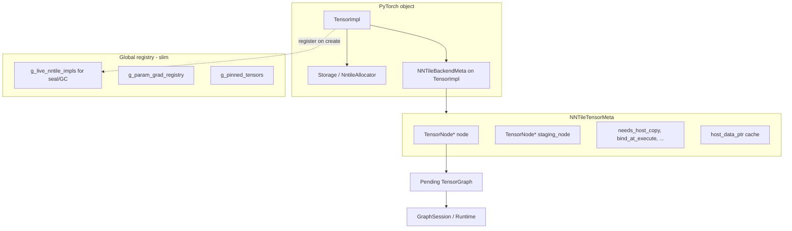

# Plan: embed NNTile graph state on `device=nntile` tensors

**Parent context:** [torch_tensor_gc_investigation.md](torch_tensor_gc_investigation.md)  
**Related PR:** [#425](https://github.com/nntile/nntile/pull/425) (GC + metadata-only staging)  
**Branch target:** `graph_api` (follow-on work; do not block #425 merge on this)  
**Status:** draft plan

This document describes how to reimplement `device=nntile` PyTorch tensors so
each `TensorImpl` **owns** its association to `TensorGraph::TensorNode` (and
related per-tensor flags), instead of treating `g_tensor_nodes[TensorImpl*]` as
the primary source of truth.

---

## 1. Problem statement

### Today

| Layer | What happens |
|-------|----------------|
| PyTorch | `at::Tensor` on `PrivateUse1`; views share `Storage`, new `TensorImpl` per view |
| Host bytes | `NntileAllocator` (`std::vector`); 0-byte for metadata-only intermediates |
| Graph link | Side map `g_tensor_nodes: TensorImpl* → MappedTensor` in `nntile_graph_recorder.cpp` |
| Lookup | `tensor_impl_key` / `canonical_tensor_impl_key` + map find |
| Views | `view` / `permute` call `record_view_alias`; `as_strided` does **not** |
| Transpose | Always allocates contiguous output + `swap_two_axes` (materialize) |

`MappedTensor` holds more than a node pointer:

```cpp
struct MappedTensor {
    TensorNode *node;
    TensorNode *staging_node;
    DataType dtype;
    size_t count;
    bool needs_host_copy;
    bool bind_at_execute;
    bool is_persistent_input;
    void *host_data_ptr;
};
```

The map is used for **three different jobs**:

1. **Per-tensor graph association** (should live on the tensor).
2. **Compile / session binding** (host ptr → runtime tiles).
3. **GC / output marks** (iterate “live” tensors at `compile_graph()`).

Mixing these makes views fragile: a view’s `TensorImpl*` must be registered
separately via `record_view_alias`, and lookup failures are silent until execute.

### Goals

1. **Primary ownership:** every `device=nntile` `TensorImpl` carries
   `NNTileTensorMeta` (at minimum `TensorNode*`, plus per-tensor flags).
2. **Explicit view propagation:** every view-creating ATen stub sets meta on
   the **result** `TensorImpl` (derive or share node as appropriate).
3. **Reliable lookup:** `lookup_data_node(tensor)` reads meta first; no
   dependence on a side table for the common case.
4. **Preserve GC behavior** from PR #425: metadata-only intermediates, selective
   pinning, output marks, tile adoption, param-grad aliases.
5. **Enable strided views** (`as_strided`, future non-materializing transpose)
   by making graph wiring impossible to “forget.”

### Non-goals (this plan)

- MPI / multi-process
- Full PyTorch `contiguous()` on nntile (remains unsupported)
- Zero-copy tile aliasing for arbitrary strides (graph `contiguous_view` still
  copies tiles at execute; separate op work if true zero-copy is needed)
- Pickle / `torch.save` of nntile tensors with embedded graph nodes
- Replacing `TensorGraph` or executor op set

---

## 2. Target architecture



### Design choice: `c10::BackendMeta` subclass

Use PyTorch’s intended extension point (`TensorImpl::set_backend_meta`), not a
second global map.

```cpp
struct NNTileTensorMeta {
    nntile::TensorGraph::TensorNode *node = nullptr;
    nntile::TensorGraph::TensorNode *staging_node = nullptr;
    nntile::DataType dtype = nntile::DataType::FP32;
    std::size_t count = 0;
    bool needs_host_copy = false;
    bool bind_at_execute = false;
    bool is_persistent_input = false;
    void *host_data_ptr = nullptr;
};

struct NNTileBackendMeta final : c10::BackendMeta {
    NNTileTensorMeta data;
    c10::intrusive_ptr<c10::BackendMeta> clone(
        const c10::intrusive_ptr<c10::BackendMeta> &ptr) const override;
};
```

**Why not only `NNTileTensorImpl` subclass?** Possible later, but `BackendMeta`
works with `at::detail::make_tensor<at::TensorImpl>` already used in
`reshape_alias` / `as_strided`. Fewer callsites to change.

**Why not `Storage` context?** Views share storage but need different
`TensorNode*` (e.g. `permute`). Meta must be per `TensorImpl`.

**`BackendMeta::clone`:** default PyTorch `clone` returns the same pointer
(shared). **Do not rely on automatic clone for views.** Each view ATen stub must
call `assign_nntile_meta_from_view(base, result, ViewKind)`.

### Central API (new header `nntile_tensor_meta.h`)

| Function | Role |
|----------|------|
| `NNTileTensorMeta *nntile_meta(TensorImpl *)` | Nullable accessor |
| `NNTileTensorMeta &nntile_meta(at::Tensor &)` | Assert nntile device |
| `void init_nntile_meta(at::Tensor &, NNTileTensorMeta)` | Attach on create |
| `void assign_view_meta(base, view, ViewProp)` | View / permute / as_strided |
| `TensorNode *nntile_node(const at::Tensor &)` | Replace `lookup_data_node` |
| `void set_nntile_node(at::Tensor &, TensorNode *)` | Replace `register_data_node` body |
| `void on_nntile_tensor_destroyed(TensorImpl *)` | Output-mark / live-set cleanup |

All graph recording continues to go through these helpers so executor code stays
readable.

---

## 3. PyTorch view semantics (what we must mirror)

PyTorch views:

- New `TensorImpl`, shared `Storage`, updated sizes / strides / offset.
- **No** built-in propagation of custom metadata.
- Autograd tracks the view as a separate tensor; backward may call the same ATen
  op again.

### View → graph node policy

| ATen op | PyTorch layout | Graph node on result |
|---------|----------------|----------------------|
| `view` / `reshape` (alias) | Same numel, maybe same shape | Same node if shape equal; else `contiguous_view` node |
| `permute` | Strided alias | `contiguous_view` with permuted **shape** (today’s `record_view_alias`) |
| `as_strided` | General strided alias | **New:** derive node from base + stride metadata, or graph “strided_view” op (phase 2) |
| `transpose` | Today: new contiguous buffer | Phase 1: keep materialize; Phase 2: optional stride alias + `swap_axes` graph op only when needed |
| `expand` / `broadcast_to` | Not a storage alias | Existing broadcast graph ops (unchanged) |
| `slice` / `select` | Offset alias | `contiguous_view` or dedicated slice op (audit per stub) |

**Important:** graph `contiguous_view` is a **same-numel reshape** at the tensor
graph level; lowering copies tiles (`tile::copy_same_numel`). That is still
“no extra host allocation,” which is the practical win for metadata-only
intermediates.

---

## 4. What shrinks vs what stays global

### Moves onto `TensorImpl` (via `NNTileBackendMeta`)

- `node`, `staging_node`
- `needs_host_copy`, `bind_at_execute`, `is_persistent_input`
- `host_data_ptr` cache (still synced from `tensor.storage().data_ptr()` on
  staging transitions)

### Stays global (session / graph scope)

| Structure | Reason |
|-----------|--------|
| `g_graph`, `g_session` | One pending graph and compiled session per process |
| `g_pinned_tensors` | Pin holders across record window |
| `g_param_grad_registry`, `g_param_grad_nodes` | Param tensor → grad node; param may be CPU or nntile |
| `g_relu_preactivation_stack` | Op-specific recording stack |
| `g_all_nodes` | Track nodes for output-mark closure |
| `g_persisted_tile_pool` | Tile adoption across recompiles |
| `g_axis_name_hints`, `g_axis_tiling_by_name` | Tiling hints |
| **`g_live_nntile_impls`** (new, small) | `unordered_set<TensorImpl*>` for `seal_output_marks` and optional leak checks |

### `g_tensor_nodes` map

**Phase out** as primary store. Migration options:

- **Phase A:** map mirrors meta (write-through) for debugging parity.
- **Phase B:** map removed; compile iterates `g_live_nntile_impls` and reads meta.

### `canonical_tensor_impl_key`

**Narrow scope** after migration:

- Still useful for `g_metadata_only_impls` / `g_staged_input_impls` sets in
  `nntile_tensor_gc.cpp`.
- **No longer** used to find `TensorNode*` for an arbitrary view; use
  `nntile_node(tensor)` on the view’s own `TensorImpl`.

### `on_tensor_impl_released` / storage hook

Today: triggered from `NntileAllocator::release_storage` via
`on_host_storage_released`, keyed by storage context → one canonical `TensorImpl*`.

**Gap:** shared-storage views can leave orphan map entries for non-canonical
`TensorImpl*` keys.

**Fix in this plan:**

1. Register each nntile `TensorImpl*` in `g_live_nntile_impls` when meta is
   attached.
2. Add **`TensorImpl` weak ownership hook**: on last `TensorImpl` destruction,
   call `on_nntile_tensor_destroyed(impl)`:
   - remove from `g_live_nntile_impls`
   - `clear_output_mark_if_unreferenced(node)` (existing logic)
   - do **not** free `TensorNode*` (owned by graph)

Implement via `c10::intrusive_ptr` custom deleter or a small
`NNTileTensorImpl` wrapper whose destructor notifies — pick the least invasive
option that runs when **view** `TensorImpl` dies, not only when `Storage` dies.

---

## 5. Implementation phases

### Phase 0 — Inventory & harness (no behavior change)

**Files:** tests only + optional debug flag.

1. Add unit test `test_nntile_meta_coverage.py` that records which ATen ops
   create nntile tensors without going through `get_or_create_data_node` /
   `record_view_alias`.
2. Document all `make_tensor` / `empty` / `empty_metadata` callsites (see
   table in §7).
3. Add debug env `TORCH_NNTILE_ASSERT_META=1`: `TORCH_CHECK(nntile_meta(impl))`
   on every executor `get_or_create_data_node` entry.

**Acceptance:** inventory checklist committed; tests pass unchanged.

---

### Phase 1 — `NNTileBackendMeta` + dual-write

**New files:**

- `torch_nntile/csrc/nntile_tensor_meta.h`
- `torch_nntile/csrc/nntile_tensor_meta.cpp`

**Changes:**

1. Implement meta accessors and `init_nntile_meta`.
2. **`get_or_create_data_node` / `register_data_node` / `record_view_alias`:**
   write **both** map and meta (dual-write).
3. **`lookup_data_node`:** read meta first; fall back to map.
4. Attach meta in:
   - `empty_metadata_tensor`
   - `ensure_host_staging` (upgrade metadata-only → staged)
   - `reshape_alias` (inherit or assign via new helper)
   - `view`, `permute`, `as_strided` (wire `as_strided` — today’s gap)
5. `compile_graph` / `seal_output_marks`: iterate `g_live_nntile_impls` **and**
   map (union), verify same nodes during dual-write.

**Acceptance:**

- Full `pytest torch_nntile/tests` parity with current baseline.
- `as_strided` on nntile records a graph alias (same policy as `view`).
- `TORCH_NNTILE_ASSERT_META=1` passes on graph tests.

---

### Phase 2 — Per-impl destruction hook + map read-remove

1. Implement `on_nntile_tensor_destroyed(TensorImpl *)`.
2. `seal_output_marks_from_live_tensors_locked` uses only `g_live_nntile_impls`.
3. `lookup_data_node` meta-only (map read fallback deprecated).
4. `on_tensor_impl_released` delegates to per-impl destroy where possible;
   storage hook only updates `host_data_ptr` on surviving staged tensors.

**Acceptance:**

- `probe_tensor_lifetime.py --nntile` scenarios unchanged.
- No growth of stale map entries in long view chains (add C++ unit test).

---

### Phase 3 — Remove `g_tensor_nodes` primary map

1. Replace `MappedTensor` map with session-local bind table if needed:
   `GraphSession::impl_to_node` already exists; extend for compile bind only.
2. `refresh_staged_tensor_mapping` mutates meta, not map.
3. `clear_pending_graph_after_compile_locked` clears nodes in meta for
   ephemeral tensors (`node = nullptr` on retained staged params).
4. Delete dual-write; remove `g_tensor_nodes`.

**Acceptance:**

- Recorder stats (`tensor_nodes` count) derived from `g_live_nntile_impls`.
- CI green on CPU-only cloud agent + CUDA wheel workflow.

---

### Phase 4 — View / layout completeness (optional follow-on)

1. Audit `slice`, `narrow`, `_unsafe_view`, `detach` (meta must copy or clear).
2. **Transpose policy:** add `transpose_as_view` internal path when input is
   contiguous and op is recording (stride alias + graph axis swap) vs keep
   materialize for execute-only eager path.
3. Graph op: `strided_view` if `as_strided` patterns exceed `contiguous_view`
   (non-contiguous tile layout).

**Acceptance:**

- `test_transpose_materialize.py` extended: forward transpose without host alloc
  in graph mode where legal.
- Document remaining cases that still require materialize.

---

## 6. Callsite migration map

### Tensor creation (must call `init_nntile_meta`)

| Location | Notes |
|----------|-------|
| `nntile_tensor_gc.cpp` — `empty_metadata_tensor` | Metadata-only default |
| `nntile_tensor_gc.cpp` — `ensure_host_staging` | In-place storage upgrade |
| `nntile_kernels.cpp` — `empty` / `empty_strided` | Staged vs metadata per graph mode |
| `nntile_kernels.cpp` — `reshape_alias` | Base for all views |
| `nntile_kernels.cpp` — `transpose_int` | New contiguous tensor + node from op |
| `nntile_executor.cpp` — all `empty` outputs | Via `get_or_create_data_node` |
| `nntile_add.cpp`, `broadcast.cpp`, … | Outputs of graph ops |

### View ops (must call `assign_view_meta`)

| Location | Today |
|----------|-------|
| `nntile_kernels.cpp` — `view` | `record_view_alias` ✓ |
| `nntile_kernels.cpp` — `permute` | `record_view_alias` ✓ |
| `nntile_kernels.cpp` — `as_strided` | **missing** |
| Any custom `reshape_alias` caller | audit |

### Recorder (simplify to meta wrappers)

| API | After migration |
|-----|-----------------|
| `get_or_create_data_node` | ensure meta.node; create graph node if null |
| `register_data_node` | `set_nntile_node` + output mark |
| `lookup_data_node` | `nntile_node` |
| `record_view_alias` | `assign_view_meta` |
| `refresh_staged_tensor_mapping` | update meta.host_data_ptr, bind flags |

### Unchanged executor surface

Executor files (`nntile_executor.cpp`, `nntile_linear.cpp`, `nntile_norm.cpp`,
…) keep calling `get_or_create_data_node` / `register_data_node`; implementation
moves to meta-backed helpers. **No mass executor rewrite.**

---

## 7. Compile / run lifecycle (adjusted)

```text
Record window
  ATen op → init/update NNTileBackendMeta on each tensor touched
  → g_live_nntile_impls.insert(impl)
  → TensorGraph ops reference TensorNode* from meta

compile_graph()
  seal_output_marks_from_live_tensors_locked()
    for impl in g_live_nntile_impls: mark meta.node output
    + param grad registry + producer closure
  insert_input_scatter_staging_locked()
    read meta.host_data_ptr, meta.staging_node
  bind_storage_to_runtime per staged meta
  g_session->impl_to_node[impl] = meta.node  // snapshot
  clear ephemeral meta.node (retain staged params)

run() / backward
  sync_runtime_to_nntile_tensor: meta.host_data_ptr from tensor storage
  register_grad_alias_for_host_copy: meta on grad tensor
```

---

## 8. Testing strategy

| Layer | Tests |
|-------|-------|
| Meta presence | `test_nntile_tensor_meta.py`: every op in minimal GPT-2 forward leaves meta.node set |
| Views | `view` / `permute` / `as_strided` same node or view-node; graph op count |
| GC | `probe_tensor_lifetime.py --nntile`; storage release count |
| Compile seal | compile with `del` intermediate; assert output marks shrink |
| Regression | existing parity tests (mm, linear, sdpa, transpose, contiguous raises) |
| Stress | chain 20 views; lookup never misses |
| Debug | `TORCH_NNTILE_ASSERT_META=1` in CI optional job |

---

## 9. Risks and mitigations

| Risk | Mitigation |
|------|------------|
| `TensorImpl` destroyed without meta cleanup | `g_live_nntile_impls` + destructor hook (§4) |
| Double-free of `TensorNode*` | Nodes owned by graph only; meta holds raw pointer |
| Stale `node` after recompile | `clear_pending_graph_after_compile` nulls ephemeral meta.node (same as today) |
| `detach` / `clone` copies meta incorrectly | Explicit stubs: `detach` shares node; `clone` new node + copy op |
| CPU tensor mixed into graph | unchanged; only `PrivateUse1` gets meta |
| Autograd backward re-enters ATen | meta must be set in forward stub before backward runs |
| Wheel ABI | header-only meta inline minimal; compile torch_nntile against pinned torch 2.9.1 |

---

## 10. Open questions

1. **`detach`:** share `TensorNode*` or break graph link? (Recommend: share node,
   same as today’s map semantics for aliasing.)
2. **In-place ops (`add_`):** meta.node unchanged; confirm `version_counter`
   does not invalidate node binding.
3. **`_values` / functional tensor:** out of scope unless used on nntile.
4. **Transpose:** materialize vs view — product decision for Phase 4.
5. **True zero-copy tile views:** needs new `TileGraph` op, not just meta move.

---

## 11. Task checklist

| ID | Task | Deps | Est. invasiveness |
|----|------|------|-------------------|
| M0 | Inventory callsites + `TORCH_NNTILE_ASSERT_META` harness | — | Low |
| M1 | `NNTileBackendMeta` + accessors | M0 | Medium |
| M2 | Dual-write in recorder + creation paths | M1 | Medium |
| M3 | Wire `as_strided` + `reshape_alias` meta | M2 | Low |
| M4 | `g_live_nntile_impls` + destroy hook | M2 | Medium |
| M5 | `seal_output_marks` from live set only | M4 | Low |
| M6 | Remove `g_tensor_nodes` map | M5 | High |
| M7 | Docs: README architecture § + update GC doc | M6 | Low |
| M8 | Phase 4 layout ops (optional) | M6 | High |

**Suggested PR slicing:**

- PR 1: M0–M3 (meta embedded, dual-write, behavior parity)
- PR 2: M4–M7 (GC hook, map removal, docs)
- PR 3: M8 (layout / transpose policy)

---

## 12. Success criteria

1. `lookup_data_node(tensor)` does not consult a global `TensorImpl* → node` map.
2. Every view-creating nntile ATen stub sets meta on the result.
3. Graph tests and `probe_tensor_lifetime.py` match PR #425 behavior.
4. `as_strided` no longer silent-noops graph recording.
5. Architecture docs describe per-tensor ownership clearly.

---

## References

- `torch_nntile/csrc/nntile_graph_recorder.cpp` — `MappedTensor`, `g_tensor_nodes`
- `torch_nntile/csrc/nntile_tensor_gc.cpp` — metadata-only, storage hooks
- `torch_nntile/csrc/nntile_kernels.cpp` — view / permute / as_strided
- `nntile/tensor/ops/contiguous_view.hh` — graph reshape alias op
- PyTorch `c10::BackendMeta` in `TensorImpl.h` (torch 2.9.1)
