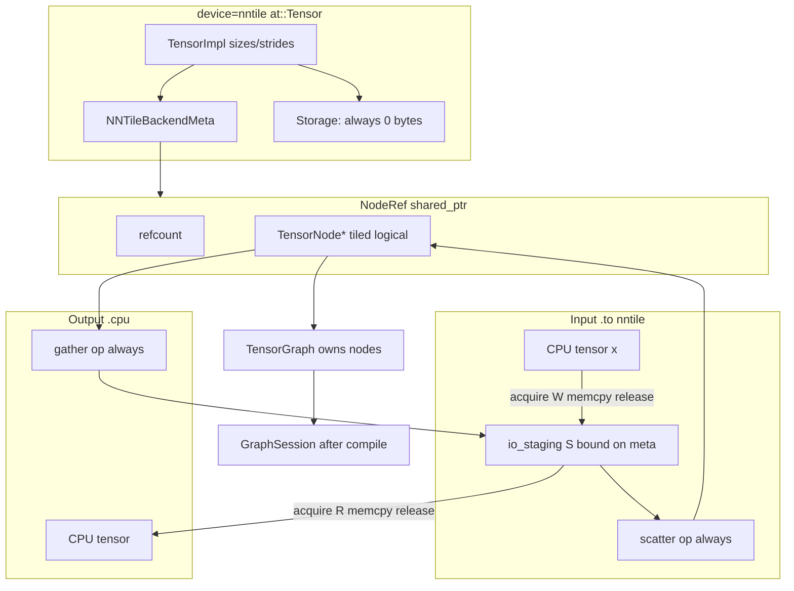

# Plan: `device=nntile` tensor reimplementation

**Parent context:** [torch_tensor_gc_investigation.md](torch_tensor_gc_investigation.md)  
**Delivery:** all spec and implementation work lands in PR
[#425](https://github.com/nntile/nntile/pull/425) only — branch
`cursor/pytorch-tensor-gc-investigation-94e3`, base `graph_api`. Do **not**
open follow-on PRs for this reimplementation.  
**Status:** agreed target architecture (conversation 2026-07)

This document is the **canonical spec** for reimplementing `device=nntile`
PyTorch tensors. It replaces earlier “three tiers” and “seal at compile”
framing with the ownership model agreed in design review.

---

## 1. Executive summary

A `device=nntile` tensor is **one kind of object**:

> A PyTorch `at::Tensor` shell (shape, dtype, autograd) whose authoritative
> compute state is a `TensorGraph::TensorNode*` (tiles in StarPU after
> compile+run), held via refcounted `NodeRef` on the `TensorImpl`. **No host
> payload on `Storage`** (always 0-byte metadata). Data enters and leaves via
> single-tile StarPU staging nodes + gather/scatter (§3.4–3.6).

**Core rules**

1. **`NodeRef`** (`shared_ptr` control block + `TensorNode*`) on every nntile
   `TensorImpl` — no side map as source of truth.
2. **`mark_output(true)`** when a node is first bound to a PyTorch tensor;
   **`mark_output(false)`** when the last `NodeRef` is released — **never** a
   compile-time seal pass.
3. **NNTile tensors are always contiguous** (by design). Same-numel
   `view`/`reshape` is **free** (same `NodeRef`, no graph op, no tile copy).
4. **Compile boundary is caller-controlled:** any recorded op sequence may be
   flushed with `compile_graph()` + `run()` when the user chooses. Examples:
   partial-iteration compile (forward then backward separately), or several
   full forward+backward passes in one capture. **Invariant:** one `run()` per
   `compile_graph()` — never multiple `run()` on the same compile.
5. **No graph epoch id** on `NodeRef`. Work with whatever graph is current;
   node pointers are valid for the lifetime of the owning `TensorGraph` object.

---

## 2. What is wrong today (“mid-way” design)

| Problem | Current code / behavior |
|---------|-------------------------|
| Graph link off-tensor | `g_tensor_nodes[TensorImpl*] → MappedTensor` in `nntile_graph_recorder.cpp` |
| Tensor categories | `g_metadata_only_impls`, `is_staged_input_tensor`, `is_persistent_input` |
| Lookup indirection | `canonical_tensor_impl_key` for node resolution |
| Output marks at compile | `seal_output_marks_from_live_tensors_locked()` clears all marks, re-marks from map, runs `mark_output_producer_closure_locked` |
| Reshape copies tiles | `record_view_alias` → `contiguous_view` when shape changes (same numel) |
| Unwired views | `as_strided` has no graph link |
| Permute vs transpose | `permute` = stride alias (often non-contiguous); `transpose` = materialize |
| Post-compile node nulling | `clear_pending_graph_after_compile_locked` sets `mapped.node = nullptr` on retained entries |
| Misleading host staging on outputs/grads | StarPU tiles + gather/scatter I/O (§3.4–3.6) |
| `NntileAllocator` dense host bytes on nntile tensors | 0-byte `Storage` always |

The map mixes **ownership**, **compile binding**, and **GC** in one structure.
That makes views easy to forget and GC dependent on batch scans.

---

## 3. Target architecture

### 3.1 Object model



```cpp
// torch_nntile/csrc/nntile_tensor_meta.h (new)

struct NodeRefControlBlock {
    nntile::TensorGraph::TensorNode *node = nullptr;

    explicit NodeRefControlBlock(nntile::TensorGraph::TensorNode *n);
    ~NodeRefControlBlock();  // if last ref: node->mark_output(false)

    NodeRefControlBlock(const NodeRefControlBlock &) = delete;
    NodeRefControlBlock &operator=(const NodeRefControlBlock &) = delete;
};

using NodeRef = std::shared_ptr<NodeRefControlBlock>;

struct NNTileBackendMeta final : c10::BackendMeta {
    //! Logical tiled node L — used by recorded graph ops (via NodeRef).
    NodeRef node_ref;
    //! Bound single-tile I/O staging node S — PyTorch↔StarPU transfers.
    //! Created once per nntile tensor; reused across .to() / .cpu() calls.
    //! NOT wrapped in NodeRef; mark_output(false) when scatter consumes it.
    nntile::TensorGraph::TensorNode *io_staging = nullptr;
};

// Accessors
NodeRef nntile_node_ref(const at::Tensor &);
nntile::TensorGraph::TensorNode *nntile_node(const at::Tensor &);
void attach_node_ref(at::Tensor &, NodeRef);
```

**No graph epoch id.** `TensorNode*` is valid while the owning `TensorGraph`
object that contains it is alive. After `compile_graph()`, the pending graph is
**moved** into `g_session->tensor_graph` — addresses are stable. The next
iteration starts a **new** pending graph with **new** nodes; live weight
**tiles** persist via adoption, not by carrying old `TensorNode*` across graphs.

### 3.2 What is NOT a tensor property

| Rejected concept | Replacement |
|------------------|-------------|
| Three tiers (GraphHandle / Staged / Persistent) | One tensor kind; 0-byte Storage |
| `is_persistent_input` | Param alive in Python → `NodeRef` refcount > 0 |
| `g_metadata_only_impls` | All nntile tensors are metadata-only (`nbytes() == 0`) |
| `is_staged_input_tensor` | **Delete** — replaced by bound `io_staging` node |
| Host `std::vector` on `Storage` | **Delete** — StarPU single-tile acquire/memcpy |
| Graph epoch id on `NodeRef` | Pointer valid for lifetime of owning graph object |

### 3.3 Zero host `Storage`

Every `device=nntile` tensor uses **0-byte** `Storage` (metadata-only). The
`NntileAllocator` does not hold tensor payload bytes. Authoritative data always
lives in StarPU tiles addressed by `TensorNode*`.

There is no optional host buffer for inputs, outputs, grads, or optimizer
state.

### 3.4 Bound single-tile I/O node (`io_staging`)

Extend the internal `device=nntile` representation with a **persistent bound
single-tile `TensorNode* S`** (`io_staging` on `NNTileBackendMeta`), dedicated
to PyTorch↔NNTile data transfer. It is **not** a separate PyTorch tensor and
**not** wrapped in `NodeRef`.

| Node | Field | PyTorch link | Role |
|------|-------|--------------|------|
| `L` | `node_ref` | `at::Tensor` via `NodeRef` | Logical (possibly tiled) graph node |
| `S` | `io_staging` | None (internal) | Single-tile StarPU buffer for I/O |

**v1 policy (always copy):** regardless of how `L` is tiled, always route I/O
through `S` plus an explicit graph op:

| Direction | Steps |
|-----------|--------|
| **In** `.to("nntile")` | CPU `memcpy` → `S` (via `acquire(W)`); at compile prepend **`scatter(S → L)` always** |
| **Out** `.cpu()` | **`gather(L → S)` always**; then `acquire(R)` → CPU `memcpy` → `release` |

This may copy redundantly when `L` is already single-tile; that is accepted
for v1 simplicity (see §3.7 for the future shortcut).

**Repeated `.to("nntile")`:** reuse the same `S` for that `at::Tensor`; each
call overwrites `S`'s StarPU buffer (no new staging node per transfer).

### 3.5 Input: `x_nnt = x.to("nntile")`

When copying a **CPU** tensor `x` to nntile:

```text
1. Ensure logical TensorNode* L exists in pending graph; attach NodeRef(L) to x_nnt
   → mark_output(true) on L
2. Ensure bound io_staging* S exists on x_nnt meta (create once if null)
   → single-tile; mark_output(false) on S (see below)
3. acquire(S, STARPU_W) → memcpy from x CPU storage → release
4. At compile_graph(): prepend scatter(S → L) — ALWAYS (v1), even if L is single-tile
5. run() executes scatter; L holds authoritative tiled data for ops
```

**`mark_output` on `S`:** because v1 always records `scatter(S → L)`, `S` is
consumed and its StarPU buffer is **invalidated** during `compile+run`. Therefore
`S` must **`mark_output(false)`** — it must not be treated as a user-retained
output. Only `L` carries the live `NodeRef` output mark.

**Multiple `.to("nntile")` on the same `x_nnt`:** overwrite the same `S` buffer;
refresh `scatter(S → L)` on the next compile (or update recorded scatter if the
pending graph is still open).

Weights / params loaded via `.to("nntile")` use the same path.

**No** `ensure_host_staging`, **no** host `Storage` on `x_nnt`.

### 3.6 Output: `.cpu()` readout

After `compile_graph()` + `run()`, values live in `L`'s tiles while `NodeRef` is
alive (`mark_output(true)` on `L`).

**Readout (v1 — always gather):**

```text
x_nnt.cpu()
  1. Resolve L from NodeRef; resolve bound S from io_staging on meta
  2. gather(L → S)   # always, even if L is single-tile
  3. acquire(S, STARPU_R) → memcpy → CPU tensor Storage → release
```

`S` is **not** invalidated after `.cpu()` readout in v1 — it remains bound on
the tensor for the next `.to("nntile")` overwrite. (Gather fills `S` from `L`;
no ephemeral node.)

`L` tiles remain until last `NodeRef` released → `mark_output(false)` → later
compile+run reclaims them.

### 3.7 Future optimization (not v1)

When `L` is **single-tile** (no real tiling), skip the extra copy:

| Case | Input `.to("nntile")` | Output `.cpu()` |
|------|----------------------|-----------------|
| `L` multi-tile | `memcpy` → `S`; `scatter(S → L)`; `S` invalidated at run | `gather(L → S)`; read `S` |
| `L` single-tile | **Use `S` directly** — no `scatter` op | **Read `S` directly** — no `gather` op |

If `scatter` is omitted, `S` may serve as the effective logical node (or alias
`L` ≡ `S`). If `scatter` is present, `S` stays `mark_output(false)` and is
invalidated by run — `L` is authoritative.

v1 does **not** implement this branch; always emit `scatter` / `gather`.

---

## 4. Layout and views

### 4.1 Always contiguous

**Invariant:** every `device=nntile` tensor is C-contiguous for its current
`sizes()`.

Enforcement:

- `TORCH_CHECK(tensor.is_contiguous())` in kernels that require it (extend
  coverage).
- Reject non-contiguous `as_strided` results.
- `aten::contiguous` on nntile: remains **unsupported** (noop if already
  contiguous, else error) — layout is fixed at graph level.

### 4.2 Same-numel reshape is free

`view` / `reshape` with unchanged numel:

| Layer | Behavior |
|-------|----------|
| PyTorch | New `TensorImpl`, new `sizes()`, contiguous strides |
| Graph | **Same `NodeRef`** — no new `TensorNode`, no `CONTIGUOUS_VIEW` op |
| Execute | No tile work |

Rationale: nntile data is contiguous; reshape is reinterpretation of the same
flat tile sequence. Shape for ops comes from the **PyTorch tensor at record
time**; graph node identity is `(nelems, dtype)` for alias purposes.

**Remove** `contiguous_view` from the `view`/`reshape` path. Deprecate or
repurpose `record_view_alias` → `share_node_ref_for_reshape(base, view)`.

### 4.3 What is not a free view

| Op | Policy |
|----|--------|
| `view` / `reshape` (same numel) | Free — share `NodeRef` |
| `permute` | Breaks contiguity in general → **layout op** (materialize) or **error** in v1; remove stride-alias `permute` that produces non-contiguous tensors |
| `transpose` / `.t()` | Layout op — `swap_two_axes` (materialize in graph); document as layout conversion |
| `as_strided` (non-contiguous) | **Reject** |
| `expand` / `broadcast_to` | Existing broadcast graph ops (not storage alias) |

### 4.4 View implementation checklist

Every view-creating ATen stub must set meta on the **result**:

| Stub | Action |
|------|--------|
| `view` | `share_node_ref` if same numel |
| `reshape` / `_reshape_alias` | same |
| `as_strided` | contiguous only; share or reject |
| `detach` | share `NodeRef` (same node) |
| `slice` / `narrow` | audit; prefer free slice if contiguous rules allow |
| `permute` | v1: materialize or forbid (see §4.3) |

---

## 5. Output marks and GC

### 5.1 Event-driven `mark_output` (no seal at compile)

```text
create node + attach first NodeRef to at::Tensor  →  mark_output(true)
last NodeRef released                             →  mark_output(false)
compile_graph()                                   →  reads marks; does NOT rewrite them
```

**Delete:**

- `seal_output_marks_from_live_tensors_locked()`
- `mark_output_producer_closure_locked()` (inflating `is_output` on ancestors)

**Keep / refactor:**

- `clear_output_mark_if_unreferenced_locked` → logic moves into
  `NodeRefControlBlock` destructor (refcount-based, not map scan).

### 5.2 What `is_output` means

> At least one live PyTorch tensor (or autograd-held `at::Tensor`) holds a
> `NodeRef` to this node.

It means **retain this node's tiles in the NNTile runtime** across compile+run
until the last handle is gone. It does **not** imply host `Storage` or a
separate staging buffer on the PyTorch tensor.
Intermediates whose Python handles were dropped before compile have
`is_output == false` but may remain in the **op graph** until DCE removes
unreachable ops.

### 5.3 DCE and tile GC

`Runtime::eliminate_dead_ops()` already traces from `is_input()` /
`is_output()` nodes through op connectivity. Under the new model:

- **Output marks** = retain StarPU tiles for live tensor handles; enable
  `.cpu()` readout via gather (§3.4).
- **Graph edges** = backward/forward dataflow (intermediate liveness without
  Python refs).

After `run()`, release StarPU buffers for tiles that are not inputs/outputs and
are not needed by the compiled session (existing / planned
`release_dead_tiles_after_op` work).

When refcount hits zero **before** compile, `mark_output(false)` allows DCE to
drop that node’s tiles on the **next** compile.

### 5.4 Autograd without Python

`NodeRef` refcount must reflect **all** live `at::Tensor` handles, including
C++ autograd `SavedVariable` packs (Python `weakref` may be dead while backward
still holds the tensor). Options:

- Autograd saves tensors that already share `NodeRef` (refcount bump), or
- Custom saved-tensor hook that pins `NodeRef` for backward.

Document in implementation phase; do not rely on Python GC alone.

---

## 6. Execution and compile boundaries

### 6.1 Invariant (only hard rule)

```text
compile_graph()  +  run()     # executes exactly what was captured before this compile
```

**Forbidden:**

```text
compile_graph()
run(); run(); run()            # NO — one run per compile
```

Everything else — how much you record before calling compile — is **user /
framework choice**. The recorder appends ops to the pending graph until the
next `compile_graph()`.

### 6.2 Capture → compile → run cycle

```text
[ capture ops into pending g_graph … ]  →  compile_graph()  →  run()
[ capture more ops …               ]  →  compile_graph()  →  run()
…
```

Each `compile_graph()`:

1. Takes the **current** pending graph (everything captured since the last
   compile, or since session start).
2. Compiles and executes it with **one** `run()`.
3. Starts a **new empty** pending `g_graph` for the next capture segment.

Live `at::Tensor` objects (params, activations still referenced) survive
across compile boundaries; **tile adoption** carries weight/state tiles from the
finished session into the next compile when those tensors are rebound.

### 6.3 Valid training patterns (examples)

#### A — Full step, one compile (common)

```text
forward + loss + backward + optimizer.step()
compile_graph()
run()
```

One capture segment; one compile; one run.

#### B — Partial-iteration compile (forward / backward split)

```text
forward + loss
compile_graph()
run()
backward (+ optimizer.step() if recorded here)
compile_graph()
run()
```

Two capture segments in one logical training step. Useful when forward results
must be materialized in tiles before backward is recorded, or when the framework
flushes forward and backward separately. After the first `run()`, backward ops
are captured into a **new** pending graph that consumes outputs from the
executed session (live tensors / adopted tiles).

#### C — Several logical iterations, one compile

```text
forward + loss + backward    # iteration 1
forward + loss + backward    # iteration 2
forward + loss + backward    # iteration 3
compile_graph()
run()
```

Multiple forward+backward passes appended to **one** pending graph before a
single flush. Microbatch grad accumulation is a special case (several
`backward()` without `optimizer.step()` between them, then one compile+run).

#### D — Several iterations, compile per iteration (also valid)

```text
# iteration 1
forward + loss + backward → compile → run
# iteration 2
forward + loss + backward → compile → run
```

This is pattern A repeated; not required, but allowed.

### 6.4 What the tensor model does *not* dictate

| Not fixed | Fixed |
|-----------|-------|
| How many forward/backward passes per capture | One `run()` per `compile_graph()` |
| Whether forward and backward share one compile | `NodeRef` / `mark_output` on every nntile tensor |
| Optimizer step before or after backward in capture | Pending graph cleared after each compile |

`train_full_batch_step` in `torch_nntile/training.py` implements pattern **A**
only; other patterns are equally first-class for the recorder design.

### 6.5 Across compile boundaries

After each `compile_graph()` + `run()`:

- Weight **PyTorch tensors** survive (`nn.Parameter`, optimizer state).
- Next capture creates **new** `TensorNode`s in the new pending graph for ops
  that touch those weights.
- **Tile adoption** (`capture_persisted_tiles_from_session` /
  `stage_persisted_tiles`) carries StarPU buffers from the finished session when
  live param tensors are rebound — driven by live `NodeRef`, not tier flags.
- Do **not** null `NodeRef::node` on compile for tensors still alive; rebind
  when recording the next graph segment.

### 6.6 `compile_graph()` responsibilities (revised)

| Step | Action |
|------|--------|
| 1 | **Do not** seal or rewrite `mark_output` |
| 2 | `apply_pending_axis_tiling_locked` |
| 3 | Prepend `scatter(S → L)` for every input with `io_staging` (**always** in v1) |
| 4 | Move pending graph → session; build `TileGraph`; `runtime->compile()` |
| 5 | `run()` — scatter fills tiled logical inputs; graph ops execute |
| 6 | `capture_persisted_tiles_from_session` for nodes still `is_output` |
| 7 | Start fresh empty pending `g_graph` for next capture |

---

## 7. Global / session state (what remains)

| Structure | Purpose |
|-----------|---------|
| `g_graph` | Pending capture graph |
| `g_session` | Compiled graph + runtime + `pin_hold` |
| `g_pinned_tensors` | Pin holders during record window |
| `g_param_grad_registry` | Param → grad node for alias sync (may fold into `NodeRef` on `.grad`) |
| `g_relu_preactivation_stack` | Op-specific recording |
| `g_persisted_tile_pool` | Tile buffers across compiles |
| `g_all_nodes` | Optional; prefer graph-owned iteration |

**Remove as primary store:** `g_tensor_nodes`, `g_metadata_only_impls`,
`canonical_tensor_impl_key` for node lookup.

**Narrow `nntile_tensor_gc.cpp`:** storage destructor hook only; delete tier sets
and `ensure_host_staging`.

---

## 8. API surface (recorder helpers)

Replace map-backed helpers with meta-backed implementations:

| Current | Target |
|---------|--------|
| `get_or_create_data_node(tensor, shape, …)` | Ensure `node_ref`; create `TensorNode` in pending graph if null; `mark_output(true)` on first attach |
| `register_data_node(tensor, node)` | `attach_node_ref(tensor, make_node_ref(node))` |
| `lookup_data_node(tensor)` | `nntile_node(tensor)` |
| `record_view_alias(self, view)` | `share_node_ref_for_reshape(self, view)` or reject |
| `on_tensor_impl_released` | `NodeRef` refcount + storage hook |
| `refresh_staged_tensor_mapping` | **Delete** (no host ptr mapping) |

Executor files (`nntile_executor.cpp`, `nntile_linear.cpp`, …) keep calling the
same helper names; implementation moves to `nntile_tensor_meta.cpp`.

---

## 9. Implementation phases

### Phase 0 — Spec & harness

- [ ] Land this document on `graph_api`.
- [ ] Add `TORCH_NNTILE_ASSERT_NODE_REF=1` debug flag.
- [ ] Inventory all `make_tensor` / `empty_metadata` / view stubs (table in §11).

**Acceptance:** no behavior change; inventory complete.

---

### Phase 1 — `NodeRef` + `NNTileBackendMeta`

- [ ] Add `nntile_tensor_meta.h` / `.cpp`.
- [ ] `NodeRefControlBlock`: ctor `mark_output(true)`, dtor `mark_output(false)`.
- [ ] Attach meta on all nntile tensors; **all** use 0-byte `Storage`.
- [ ] Dual-write: meta + legacy `g_tensor_nodes` (temporary).

**Acceptance:** graph tests pass; assert flag passes on smoke tests.

---

### Phase 2 — Free reshape; remove `contiguous_view` on view path

- [ ] `share_node_ref_for_reshape` for same-numel `view`/`reshape`.
- [ ] Stop calling `ensure_view_alias_locked` / `contiguous_view` from
      `record_view_alias`.
- [ ] Wire `as_strided` (contiguous-only).
- [ ] Tests: view chain shares `NodeRef`; graph op count unchanged across views.

**Acceptance:** `test_graph_mode_mm_view_add_ndim` and view tests pass; no
`CONTIGUOUS_VIEW` op for reshape-only views.

---

### Phase 3 — Output marks: remove seal at compile

- [ ] Remove `seal_output_marks_from_live_tensors_locked` from `compile_graph_locked`.
- [ ] Remove `mark_output_producer_closure_locked` output-mark inflation.
- [ ] Verify DCE still correct via op-graph connectivity tests.
- [ ] Update `test_intermediate_output_mark_cleared_when_python_ref_dropped`.

**Acceptance:** `probe_tensor_lifetime.py --nntile` scenarios pass; dropping
Python ref clears `is_output` without compile seal.

---

### Phase 4 — Remove side map and tier flags

- [ ] Delete `g_tensor_nodes`; compile binds via meta on live tensors / session
      snapshot.
- [ ] Remove `g_metadata_only_impls`, `is_staged_input_tensor`,
      `is_persistent_input`, `ensure_host_staging`, `needs_host_copy`.
- [ ] Stop nulling `node` in `clear_pending_graph_after_compile` for live
      params; rebind on next capture.
- [ ] Tile adoption driven by live `NodeRef` on params, not flags.

**Acceptance:** full `pytest torch_nntile/tests`; pre-commit clean.

---

### Phase 5 — Layout ops (`permute` policy)

- [ ] Decide v1: materialize `permute` (like transpose) or restrict to contiguous-
      preserving cases.
- [ ] Remove non-contiguous stride aliases from `permute` stub.
- [ ] Update README layout table (§10).
- [ ] Fix tests that use `permute` + `contiguous` on CPU reference only.

**Acceptance:** no nntile tensor exposes non-contiguous strides after layout ops.

---

### Phase 7 — Bound `io_staging` + symmetric I/O (v1 always scatter/gather)

- [ ] Add `io_staging` single-tile node on `NNTileBackendMeta` (create once per
      tensor, reuse across `.to()` / `.cpu()`).
- [ ] `.to("nntile")`: `acquire(W)`/`memcpy` into `S`; **always** record
      `scatter(S → L)` at compile; `S` → `mark_output(false)`.
- [ ] `.cpu()`: **always** `gather(L → S)` then `acquire(R)`/`memcpy`; reuse `S`.
- [ ] Repeated `.to("nntile")` overwrites same `S`.
- [ ] Remove host-bind paths (`copy_nntile_tensor_to_cpu` staging assumption,
      `bind_storage_to_runtime` from host ptr).
- [ ] Tests: roundtrip with 0-byte Storage; multi-tile and single-tile `L`.

**Acceptance:** v1 always copies via `S`; no host `Storage` payload; §3.7
optimization deferred.

---

### Phase 6 — Autograd `NodeRef` lifetime

- [ ] Audit `.backward()` vs `autograd.grad` pinning (transpose, mm, linear).
- [ ] Ensure grad tensors get `NodeRef`; refcount covers autograd retention.
- [ ] Unskip backward tests blocked on grad policy.

**Acceptance:** transpose backward via `.backward()` without segfault; grad
accumulation test passes.

---

## 10. Documentation updates

| File | Changes |
|------|---------|
| `torch_nntile/README.md` | Graph-handle model; capture→compile→run; free reshape; permute policy |
| `docs/dev/torch_tensor_gc_investigation.md` | Remove seal-at-compile recommendation; point here |
| `docs/dev/nntile_tensor_impl_plan.md` | This file |

**README training loops (examples — all valid):**

```python
# Pattern A: one compile per step (train_full_batch_step style)
loss = model(x)
loss.backward()
optimizer.step()
torch_nntile.compile_graph()
torch_nntile.run()

# Pattern B: partial-iteration compile
loss = model(x)
torch_nntile.compile_graph()
torch_nntile.run()
loss.backward()
torch_nntile.compile_graph()
torch_nntile.run()

# Pattern C: several backwards, one compile (grad accumulation)
for x_mb, y_mb in microbatches:
    (loss / n).backward()
torch_nntile.compile_graph()
torch_nntile.run()
```

---

## 11. Callsite inventory (initial)

### Tensor creation

| File | Site |
|------|------|
| `nntile_tensor_gc.cpp` | `empty_metadata_tensor` only; delete `ensure_host_staging` |
| `nntile_kernels.cpp` | `empty`, `empty_strided`, `reshape_alias`, `transpose_int` |
| `nntile_executor.cpp` | all `get_or_create_data_node` / `register_data_node` |
| `nntile_add.cpp`, `nntile_broadcast.cpp`, … | op outputs |

### View / layout

| File | Site |
|------|------|
| `nntile_kernels.cpp` | `view`, `permute`, `as_strided`, `transpose_int`, `t` |

### Recorder / compile (delete or refactor)

| File | Site |
|------|------|
| `nntile_graph_recorder.cpp` | `g_tensor_nodes`, `seal_output_marks_*`, `mark_output_producer_closure_*`, `clear_pending_graph_after_compile_*` |

---

## 12. Testing matrix

| Test | Validates |
|------|-----------|
| `test_graph_execution.py` | capture → compile → run |
| `test_graph_mode_mm_view_add_ndim` | free reshape + add broadcast |
| `test_intermediate_output_mark_cleared_when_python_ref_dropped` | refcount → `mark_output(false)` |
| `probe_tensor_lifetime.py --nntile` | tile GC; zero host payload |
| Gather readout / scatter input overhead | Ephemeral single-tile nodes; invalidate after I/O |
| `test_grad_accumulation.py` | multi-backward one graph |
| `test_transpose_materialize.py` | layout ops; backward |
| `test_contiguous_raises_on_noncontiguous_nntile` | always contiguous |
| New: `test_view_shares_node_ref` | same `NodeRef` pointer across views |
| New: `test_no_contiguous_view_op_on_reshape` | op count / op names |
| New: `test_to_nntile_scatter_input` | `.to("nntile")` creates S+L; scatter at compile |
| New: `test_cpu_readout_gather_path` | `.cpu()` gather path; no nntile host bytes |
| New: `test_to_cpu_roundtrip_zero_storage` | 0-byte Storage roundtrip |

---

## 13. Risks and mitigations

| Risk | Mitigation |
|------|------------|
| DCE drops nodes still needed for backward without Python refs | Liveness via op graph from `is_input` + remaining `is_output` + consumers |
| `NodeRef` to old graph after new capture starts | Rebind on `get_or_create_data_node` for live params; tile adoption |
| `permute` breakage when stride alias removed | Phase 5; explicit materialize or CPU layout before `.to("nntile")` |
| Autograd holds tensor invisibly to Python | Refcount includes autograd saves |
| Tiling depends on axis lengths after free reshape | Record ops use `tensor.sizes()` at call site; node nelems invariant |
| Cross-graph weight identity | Tile pool + scatter input path; rebind `L`/`S` on next capture |
| Single-tile staging before first compile | Eager StarPU alloc + acquire at `.to()`; scatter deferred to compile+run |

---

## 14. Success criteria

1. Every `device=nntile` tensor has `NodeRef` on `TensorImpl`; no `g_tensor_nodes`.
2. `mark_output` set at node attach, cleared at last `NodeRef` release; **no**
   seal pass at `compile_graph()`.
3. Same-numel reshape shares `NodeRef`; no `CONTIGUOUS_VIEW` on view path.
4. All nntile tensors contiguous; non-contiguous aliases rejected.
5. Compile boundaries documented as caller-controlled (patterns §6.3); one `run()`
   per `compile_graph()`.
6. No graph epoch id; no tensor tier enums.
7. **Zero host `Storage`** on all nntile tensors; symmetric gather/scatter I/O (§3.4–3.6).
8. `.to("nntile")` uses internal single-tile `S` + `scatter(S → L)`; `.cpu()` uses
   `gather(L → E)` + ephemeral `E`.
9. Full torch_nntile test suite green (modulo known CUDA skips).

---

## 15. Delivery (single PR #425)

All phases (0–7) are implemented and merged via
[PR #425](https://github.com/nntile/nntile/pull/425) on branch
`cursor/pytorch-tensor-gc-investigation-94e3`. Use **incremental commits** on
that branch; do not split into separate PRs.

| Commit batch | Phases | Description |
|--------------|--------|-------------|
| 1 | 0–1 | `NodeRef` + meta; dual-write |
| 2 | 2–3 | Free reshape; remove compile seal |
| 3 | 4 | Remove map and tier flags |
| 4 | 5–6 | Layout policy + autograd refcount |
| 5 | 7 | Symmetric single-tile I/O (`.to` + `.cpu`) |

---

## 16. Glossary

| Term | Meaning |
|------|---------|
| **NodeRef** | `shared_ptr` control block; refcount = live PyTorch/autograd handles for this node |
| **Capture** | Record ATen ops into pending `g_graph` until next compile |
| **Compile segment** | Ops captured since the previous `compile_graph()` |
| **Free reshape** | Same numel, same `NodeRef`, no graph op |
| **Single-tile staging** | Internal `TensorNode` for CPU↔StarPU `acquire`/`memcpy` (not PyTorch-linked) |
| **Logical node** | Tiled `TensorNode*` via `NodeRef` on the `at::Tensor` |
| **Scatter / Gather** | `scatter(S→L)` at input; `gather(L→E)` at output readout |
| **Session** | Compiled graph + `Runtime` after `compile_graph()` |

---

## References

- `torch_nntile/csrc/nntile_graph_recorder.cpp` — current recorder
- `torch_nntile/csrc/nntile_tensor_gc.cpp` — storage hooks
- `torch_nntile/csrc/nntile_kernels.cpp` — view/layout stubs
- `nntile/src/runtime.cc` — `eliminate_dead_ops`
- `nntile/tensor/ops/contiguous_view.hh` — to be removed from view path
