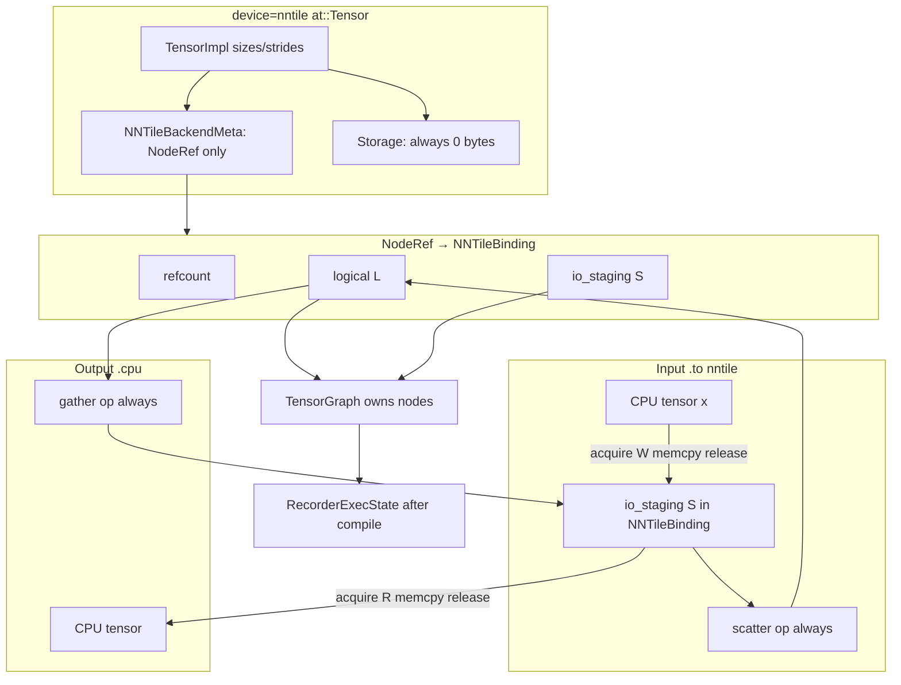

# Plan: `device=nntile` tensor reimplementation

**Parent context:** [torch_tensor_gc_investigation.md](torch_tensor_gc_investigation.md)  
**Delivery:** all spec and implementation work lands in PR
[#425](https://github.com/nntile/nntile/pull/425) only — branch
`cursor/pytorch-tensor-gc-investigation-94e3`, base `graph_api`. Do **not**
open follow-on PRs for this reimplementation.  
**Status:** agreed target architecture (conversation 2026-07); **implementation
in progress** on PR
[#425](https://github.com/nntile/nntile/pull/425) (branch
`cursor/pytorch-tensor-gc-investigation-94e3`, latest commit `87d1aa45`).

This document is the **canonical spec** for reimplementing `device=nntile`
PyTorch tensors. It replaces earlier “three tiers” and “seal at compile”
framing with the ownership model agreed in design review.

### Implementation status (audit 2026-07-07)

| Phase | Status | Notes |
|-------|--------|-------|
| **0** Spec & harness | **Partial** | Doc landed; `TORCH_NNTILE_ASSERT_NODE_REF` wired; §11 inventory incomplete |
| **1** `NNTileBinding` + meta | **Mostly done** | `nntile_tensor_meta.{h,cpp}`; dual-write with `g_tensor_nodes` remains |
| **2** Free reshape | **Mostly done** | `share_node_ref_for_reshape` on view path; dead `ensure_view_alias_locked` / `contiguous_view` helpers still in recorder |
| **3** Output marks (no seal) | **Mostly done** | Compile path does not call seal; `seal_output_marks_*` dead code remains; GC test passes |
| **4** Remove side map | **Not started** | `g_tensor_nodes`, tier sets, `ensure_host_staging`, `is_staged_input_tensor` still active |
| **5** Permute policy | **Not started** | `permute` still stride-aliases when contiguous-preserving; errors only when non-contiguous |
| **6** Autograd `NodeRef` | **Not started** | |
| **7** I/O scatter/gather | **Done** | Input scatter-at-`.to()`; `.cpu()` uses `gather(L→S)` + incremental `execute_range`; staging invalidated after scatter run and after `.cpu()` readout |

**Test snapshot** (`test_device_stub.py` + `test_graph_execution.py`): **18 passed**.

**Phase 7 acceptance (complete):**

1. `.cpu()` records **`gather(L → S)`** + compile + incremental `execute_range` run.
2. **`invalidate_staging_tile_buffer`** after scatter at run and after `.cpu()` readout.
3. **`execute_range`** incremental execution — no full `execute()` re-run of prior phases.

---

## 1. Executive summary

A `device=nntile` tensor is **one kind of object**:

> A PyTorch `at::Tensor` shell (shape, dtype, autograd) whose authoritative
> compute state is a `TensorGraph::TensorNode*` (tiles in StarPU after
> compile+run), held via refcounted `NodeRef` on the `TensorImpl`. **No host
> payload on `Storage`** (always 0-byte metadata). Data enters and leaves via
> bound single-tile `io_staging` + gather/scatter (§3.4–3.7).

**Core rules**

1. **`NodeRef`** (`shared_ptr` control block + `TensorNode*`) on every nntile
   `TensorImpl` — no side map as source of truth.
2. **`mark_output(true)`** when a node is first bound to a PyTorch tensor;
   **`mark_output(false)`** when the last `NodeRef` is released — **never** a
   compile-time seal pass.
3. **NNTile tensors are always contiguous** (by design). Same-numel
   `view`/`reshape` is **free** (same `NodeRef`, no graph op, no tile copy).
4. **Compile boundary is caller-controlled:** any recorded op sequence may be
   flushed with `compile_graph()` + `run()` when the user chooses. Examples:
   partial-iteration compile (forward then backward separately), or several
   full forward+backward passes in one capture. **Invariant:** one `run()` per
   `compile_graph()` — never multiple `run()` on the same compile.
5. **No graph epoch id** on `NodeRef`. Work with whatever graph is current;
   node pointers are valid for the lifetime of the owning `TensorGraph` object.

---

## 2. What is wrong today (“mid-way” design)

| Problem | Current code / behavior | Phase |
|---------|-------------------------|-------|
| Graph link off-tensor | `g_tensor_nodes[TensorImpl*] → MappedTensor` still primary alongside meta | 4 |
| Tensor categories | `g_metadata_only_impls`, `is_staged_input_tensor`, `is_persistent_input` still used | 4 |
| Lookup indirection | `canonical_tensor_impl_key` for node resolution | 4 |
| Output marks at compile | `seal_output_marks_*` **dead code**; compile path does not call seal | 3 ✓ |
| Reshape copies tiles | `record_view_alias` → `share_node_ref_for_reshape` (no `contiguous_view` on path) | 2 ✓ |
| Unwired views | `as_strided` rejects non-contiguous; contiguous shares `NodeRef` | 2 ✓ |
| Permute vs transpose | `permute` stride-alias when contiguous-preserving; error if non-contiguous | 5 |
| Post-compile node nulling | `clear_pending_graph_after_compile` still nulls `mapped.node` | 4 |
| Host staging on outputs/grads | Many ops still call `ensure_host_staging`; `.cpu()` uses gather via `S` | 7 ✓ (readout), 4 |
| `NntileAllocator` dense host bytes | Metadata-only path exists; legacy host staging not fully removed | 4, 7 |

The map mixes **ownership**, **compile binding**, and **GC** in one structure.
That makes views easy to forget and GC dependent on batch scans.

---

## 3. Target architecture

### 3.1 Object model



```cpp
// torch_nntile/csrc/nntile_tensor_meta.h (new)

//! Graph binding for one at::Tensor: logical node + I/O staging node.
//! io_staging is part of NNTileBinding (the NodeRef target), NOT a sibling
//! field on NNTileBackendMeta.
struct NNTileBinding {
    nntile::TensorGraph::TensorNode *logical = nullptr;     // L
    nntile::TensorGraph::TensorNode *io_staging = nullptr;  // S

    explicit NNTileBinding(nntile::TensorGraph::TensorNode *logical);
    ~NNTileBinding();  // last NodeRef released: logical->mark_output(false)

    NNTileBinding(const NNTileBinding &) = delete;
    NNTileBinding &operator=(const NNTileBinding &) = delete;
};

using NodeRef = std::shared_ptr<NNTileBinding>;

struct NNTileBackendMeta final : c10::BackendMeta {
    NodeRef binding;  // only field; { L, S } live inside NNTileBinding
};

// Accessors
NodeRef nntile_binding(const at::Tensor &);
nntile::TensorGraph::TensorNode *nntile_node(const at::Tensor &);
void attach_binding(at::Tensor &, NodeRef);
```

**No graph epoch id.** `TensorNode*` is valid while the owning `TensorGraph`
object that contains it is alive. The recorder keeps **one** growing
`TensorGraph`; each `compile_graph()` seals only **new ops** since the last
compile (`seal_phase` + `append_tensor_graph_phase`). `L` and `S` on
`NNTileBinding` are created once at attach and **never rebound**; libnntile
reuses StarPU tile nodes across phases when `layout_fingerprint` matches.

### 3.2 What is NOT a tensor property

| Rejected concept | Replacement |
|------------------|-------------|
| Three tiers (GraphHandle / Staged / Persistent) | One tensor kind; 0-byte Storage |
| `is_persistent_input` | Param alive in Python → `NodeRef` refcount > 0 |
| `g_metadata_only_impls` | All nntile tensors are metadata-only (`nbytes() == 0`) |
| `is_staged_input_tensor` | **Delete** — `io_staging` lives in `NNTileBinding` |
| Host `std::vector` on `Storage` | **Delete** — StarPU single-tile acquire/memcpy |
| Graph epoch id on `NodeRef` | Pointer valid for lifetime of owning graph object |

### 3.3 Zero host `Storage`

Every `device=nntile` tensor uses **0-byte** `Storage` (metadata-only). The
`NntileAllocator` does not hold tensor payload bytes. Authoritative data always
lives in StarPU tiles addressed by `TensorNode*`.

There is no optional host buffer for inputs, outputs, grads, or optimizer
state.

### 3.4 `NNTileBinding`: **L** (logical) + **S** (staging)

**Naming (canonical):** we keep **L** and **S** — **Logical** and **Staging** —
not layout aliases like “distributed/contiguous”. `L` is the graph node used by
ops; `S` is the single-tile PyTorch I/O seam. Optimizations belong **inside**
`scatter` / `gather` (no-op when tiling matches), not in alternate binding
shapes (§3.7).

**`io_staging` (`S`) is part of `NNTileBinding` (the `NodeRef` target), not a
sibling field on `NNTileBackendMeta`.** `NNTileBackendMeta` holds only
`NodeRef binding`; both `L` and `S` are members of `NNTileBinding`.

Each `device=nntile` `at::Tensor` has `NodeRef` → `NNTileBinding`:

| Node | Member | Name | Role |
|------|--------|------|------|
| `L` | `binding->logical` | **Logical** | Graph node for recorded ops (possibly multi-tile); `mark_output(true)` via `NodeRef` |
| `S` | `binding->io_staging` | **Staging** | Single-tile StarPU buffer for PyTorch I/O; `mark_output(false)` |

`S` is **not** a separate PyTorch tensor. It lives inside the binding so views
that share `NodeRef` also share `S`.

**One binding per `at::Tensor` object.** Each `x.to("nntile")` creates a **new**
`at::Tensor` → new `NodeRef` → new `L` and new `S`. You do **not** call
`.to("nntile")` repeatedly into the same nntile tensor; there is no “overwrite
`S` on second `.to()`” on one handle.

`S` is created when that tensor is born (at `.to("nntile")` for inputs) or
**lazily** before the first `.cpu()` (for op outputs). The same `S` graph node
and StarPU handle are **reused** for every later `.cpu()` on that tensor. After
each readout or input scatter (see §3.5–3.6), only the **tile buffer** behind
`S` is invalidated (`starpu_data_invalidate` / `invalidate_submit`) — the handle
is not deleted and `binding->io_staging` is **not** nulled.

**v1 policy (always copy):** regardless of how `L` is tiled:

| Direction | Steps |
|-----------|--------|
| **In** `.to("nntile")` | CPU `memcpy` → `S` (runtime bind); **`scatter(S → L)` recorded at init** (not compile prepend) |
| **Out** `.cpu()` | **`gather(L → S)` always**; compile + run; then `acquire(R)` → CPU `memcpy` → `release` |

This may copy redundantly when `L` is single-tile; that is accepted for v1.
Future work lowers cost inside `scatter` / `gather` when layouts match (§3.7),
without changing the always-emit graph structure.

### 3.5 Input: `x_nnt = x.to("nntile")`

Each `.to("nntile")` allocates a **new** nntile `at::Tensor` `x_nnt` with a
**new** binding `{ L, S }`. Copying a batch each step is `x_nnt =
x_cpu.to("nntile")` again — new handles, not refreshing an old one.

```text
1. Create new at::Tensor x_nnt (0-byte Storage) and new binding { L, S }
2. Create logical TensorNode* L in pending graph; attach NodeRef → mark_output(true) on L
3. Create single-tile io_staging* S in binding; mark_output(false) on S
4. Lower S to tile graph; bind CPU bytes into S runtime buffer (init_nntile_input_from_cpu)
5. Record scatter(S → L) in pending graph immediately — ALWAYS (v1)
6. compile_graph() + run() executes scatter; L holds authoritative tiled data for ops
```

**Implemented:** `init_nntile_input_from_cpu` in `nntile_graph_recorder.cpp` (steps
1–5). `insert_input_scatter_staging_locked` at compile is intentionally a no-op.

**Not yet:** invalidate `S` tile buffer after scatter at run.

**`mark_output` on `S`:** because v1 always records `scatter(S → L)`, the data
behind `S` is consumed and its StarPU buffer is **invalidated** during
`compile+run` (handle kept; no data behind it until the next host write).
Therefore `S` must **`mark_output(false)`** — it must not be treated as a
user-retained output. Only `L` carries the live `NodeRef` output mark.

Weights / params: `param = p.to("nntile")` once — that `nn.Parameter` keeps
the same binding for later iterations (no second `.to()` on the same object).

**No** `ensure_host_staging`, **no** host `Storage` on `x_nnt`.

### 3.6 Output: `.cpu()` readout

After `compile_graph()` + `run()`, values live in `L`'s tiles while `NodeRef` is
alive (`mark_output(true)` on `L`).

**Readout (v1 — always gather):**

```text
x_nnt.cpu()
  1. Resolve L and S from binding; create S only if this tensor never had one
  2. gather(L → S)   # always, even if L is single-tile
  3. compile_graph() + run()
  4. acquire(S, STARPU_R) → memcpy → CPU tensor Storage → release
  5. invalidate tile buffer on S (Runtime::invalidate_tile_buffer /
     Tile::invalidate_submit) — handle and binding->io_staging stay live
```

**Invalidate the buffer right after step 4** — mark the StarPU handle as having
no data behind it. Do **not** delete the handle and do **not** set
`binding->io_staging = nullptr`; the same `S` is reused on the next `.cpu()`.

Each `.to("nntile")` still creates a **new** tensor with a new binding (§3.5).

`L` tiles remain until last `NodeRef` released → `mark_output(false)` → later
compile+run reclaims them.

**Implemented (interim):** `copy_nntile_tensor_to_cpu` reads initialized `L`
tiles directly (`read_logical_to_host_locked`) — **does not** emit `gather(L → S)`
yet. Staging readout path exists only when `can_read_nntile_tensor_from_staging`.

**Target (v1):** replace direct `L` read with gather + compile + run + staging
read + invalidate (steps above).

### 3.7 Future optimization: no-op `scatter` / `gather`

v1 **always records** `scatter(S → L)` when the tensor is created (`.to("nntile")`)
and runs `gather(L → S)` on `.cpu()`, even when `L` is single-tile. The graph
shape stays uniform.

**Future:** optimize **inside** the libnntile `scatter` and `gather` ops (and
their tile lowering), not by omitting ops in the recorder:

- When staging layout and logical layout are **the same tiling** (e.g. both
  single-tile, same shape), `scatter` / `gather` become **no-ops** or alias
  copies at compile/lowering time — no extra tile traffic.
- `NNTileBinding` stays `{ L, S }`; no merge into one node, no alternate
  naming. Recorder and PyTorch binding code remain unchanged.

Benefits of this approach:

1. One code path in torch_nntile (always emit scatter/gather).
2. Optimization is local to ops that already understand tile maps.
3. **L** / **S** names remain meaningful: Logical = compute node, Staging =
   I/O node, regardless of whether the op copies.

v1 does **not** implement no-op scatter/gather; ops always run (or copy) even
when redundant.

---

## 4. Layout and views

### 4.1 Always contiguous

**Invariant:** every `device=nntile` tensor is C-contiguous for its current
`sizes()`.

Enforcement:

- `TORCH_CHECK(tensor.is_contiguous())` in kernels that require it (extend
  coverage).
- Reject non-contiguous `as_strided` results.
- `aten::contiguous` on nntile: remains **unsupported** (noop if already
  contiguous, else error) — layout is fixed at graph level.

### 4.2 Same-numel reshape is free

`view` / `reshape` with unchanged numel:

| Layer | Behavior |
|-------|----------|
| PyTorch | New `TensorImpl`, new `sizes()`, contiguous strides |
| Graph | **Same `NodeRef`** — no new `TensorNode`, no `CONTIGUOUS_VIEW` op |
| Execute | No tile work |

Rationale: nntile data is contiguous; reshape is reinterpretation of the same
flat tile sequence. Shape for ops comes from the **PyTorch tensor at record
time**; graph node identity is `(nelems, dtype)` for alias purposes.

**Remove** `contiguous_view` from the `view`/`reshape` path. Deprecate or
repurpose `record_view_alias` → `share_node_ref_for_reshape(base, view)`.

### 4.3 What is not a free view

| Op | Policy |
|----|--------|
| `view` / `reshape` (same numel) | Free — share `NodeRef` |
| `permute` | Breaks contiguity in general → **layout op** (materialize) or **error** in v1; remove stride-alias `permute` that produces non-contiguous tensors |
| `transpose` / `.t()` | Layout op — `swap_two_axes` (materialize in graph); document as layout conversion |
| `as_strided` (non-contiguous) | **Reject** |
| `expand` / `broadcast_to` | Existing broadcast graph ops (not storage alias) |

### 4.4 View implementation checklist

Every view-creating ATen stub must set meta on the **result**:

| Stub | Action |
|------|--------|
| `view` | `share_node_ref` if same numel |
| `reshape` / `_reshape_alias` | same |
| `as_strided` | contiguous only; share or reject |
| `detach` | share `NodeRef` (same node) |
| `slice` / `narrow` | audit; prefer free slice if contiguous rules allow |
| `permute` | v1: materialize or forbid (see §4.3) |

---

## 5. Output marks and GC

### 5.1 Event-driven `mark_output` (no seal at compile)

```text
create node + attach first NodeRef to at::Tensor  →  mark_output(true)
last NodeRef released                             →  mark_output(false)
compile_graph()                                   →  reads marks; does NOT rewrite them
```

**Delete:**

- `seal_output_marks_from_live_tensors_locked()`
- `mark_output_producer_closure_locked()` (inflating `is_output` on ancestors)

**Keep / refactor:**

- `clear_output_mark_if_unreferenced_locked` → logic in `NNTileBinding`
  destructor (refcount-based, not map scan).

### 5.2 What `is_output` means

> At least one live PyTorch tensor (or autograd-held `at::Tensor`) holds a
> `NodeRef` to this node.

It means **retain this node's tiles in the NNTile runtime** across compile+run
until the last handle is gone. It does **not** imply host `Storage` or a
separate staging buffer on the PyTorch tensor.
Intermediates whose Python handles were dropped before compile have
`is_output == false` but may remain in the **op graph** until DCE removes
unreachable ops.

### 5.3 DCE and tile GC

`Runtime::eliminate_dead_ops()` already traces from `is_input()` /
`is_output()` nodes through op connectivity. Under the new model:

- **Output marks** = retain StarPU tiles for live tensor handles; enable
  `.cpu()` readout via gather (§3.4).
- **Graph edges** = backward/forward dataflow (intermediate liveness without
  Python refs).

After `run()`, release StarPU buffers for tiles that are not inputs/outputs and
are not needed by the compiled session (existing / planned
`release_dead_tiles_after_op` work).

When refcount hits zero **before** compile, `mark_output(false)` allows DCE to
drop that node’s tiles on the **next** compile.

### 5.4 Autograd without Python

`NodeRef` refcount must reflect **all** live `at::Tensor` handles, including
C++ autograd `SavedVariable` packs (Python `weakref` may be dead while backward
still holds the tensor). Options:

- Autograd saves tensors that already share `NodeRef` (refcount bump), or
- Custom saved-tensor hook that pins `NodeRef` for backward.

Document in implementation phase; do not rely on Python GC alone.

---

## 6. Execution and compile boundaries

### 6.1 Invariant (only hard rule)

```text
compile_graph()  +  run()     # executes exactly what was captured before this compile
```

**Forbidden:**

```text
compile_graph()
run(); run(); run()            # NO — one run per compile
```

Everything else — how much you record before calling compile — is **user /
framework choice**. The recorder appends ops to the pending graph until the
next `compile_graph()`.

### 6.2 Capture → compile → run cycle

```text
[ capture ops into pending g_graph … ]  →  compile_graph()  →  run()
[ capture more ops …               ]  →  compile_graph()  →  run()
…
```

Each `compile_graph()`:

1. Seals **only uncompiled ops** in the persistent `g_graph`
   (`phase_seal_cursor` … `num_ops()`).
2. Appends the phase to `RecorderExecState::tile_graph` / `runtime` and
   recompiles (incremental; tile reuse via `layout_fingerprint`).
3. Clears **ephemeral recorder state** after `run()` (param-grad registry,
   pins, axis hints) — **not** tensor nodes or `NodeRef` bindings.

Live `at::Tensor` objects keep the same `binding->logical` / `binding->io_staging`
across compile boundaries.

### 6.3 Valid training patterns (examples)

#### A — Full step, one compile (common)

```text
forward + loss + backward + optimizer.step()
compile_graph()
run()
```

One capture segment; one compile; one run.

#### B — Partial-iteration compile (forward / backward split)

```text
forward + loss
compile_graph()
run()
backward (+ optimizer.step() if recorded here)
compile_graph()
run()
```

Two capture segments in one logical training step. Useful when forward results
must be materialized in tiles before backward is recorded, or when the framework
flushes forward and backward separately. After the first `run()`, backward ops
are captured into a **new** pending graph that consumes outputs from the
executed session (live tensors / adopted tiles).

#### C — Several logical iterations, one compile

```text
forward + loss + backward    # iteration 1
forward + loss + backward    # iteration 2
forward + loss + backward    # iteration 3
compile_graph()
run()
```

Multiple forward+backward passes appended to **one** pending graph before a
single flush. Microbatch grad accumulation is a special case (several
`backward()` without `optimizer.step()` between them, then one compile+run).

#### D — Several iterations, compile per iteration (also valid)

```text
# iteration 1
forward + loss + backward → compile → run
# iteration 2
forward + loss + backward → compile → run
```

This is pattern A repeated; not required, but allowed.

### 6.4 What the tensor model does *not* dictate

| Not fixed | Fixed |
|-----------|-------|
| How many forward/backward passes per capture | One `run()` per `compile_graph()` |
| Whether forward and backward share one compile | `NodeRef` / `mark_output` on every nntile tensor |
| Optimizer step before or after backward in capture | Pending graph cleared after each compile |

`train_full_batch_step` in `torch_nntile/training.py` implements pattern **A**
only; other patterns are equally first-class for the recorder design.

### 6.5 Across compile boundaries

After each `compile_graph()` + `run()`:

- Weight **PyTorch tensors** and their `NodeRef` bindings survive unchanged.
- `binding->logical` and `binding->io_staging` are **stable** for the tensor
  lifetime (set at `.to("nntile")` / first attach).
- The same `TensorGraph` accumulates more ops; `get_or_create_data_node` returns
  `binding->logical` — no per-segment nodes, no rebind.
- **No torch_nntile tile adoption** — libnntile `append_tensor_graph_phase`
  reuses tile nodes when layout fingerprints match.

### 6.6 `compile_graph()` responsibilities (revised)

| Step | Action | Status |
|------|--------|--------|
| 1 | **Do not** seal or rewrite `mark_output` | Done |
| 2 | `apply_pending_axis_tiling_locked` | Done |
| 3 | Input `scatter(S → L)` at `.to("nntile")` — **no compile prepend** | Done |
| 4 | `seal_phase()` on persistent graph; `append_tensor_graph_phase`; `runtime->compile()` | Done |
| 5 | `run()` — scatter + graph ops execute | Done |
| 6 | Clear ephemeral recorder state (not nodes / bindings) | Done |

---

## 7. Global / session state (what remains)

| Structure | Purpose |
|-----------|---------|
| `g_graph` | Persistent capture graph (grows across compiles; ops sealed incrementally) |
| `g_exec` (`RecorderExecState`) | `TileGraph` + `Runtime` + incremental lowering state + `pin_hold` |
| `g_pinned_tensors` | Pin holders during record window |
| `g_param_grad_registry` | Param → grad node for alias sync (may fold into `NodeRef` on `.grad`) |
| `g_relu_preactivation_stack` | Op-specific recording |

**Removed:** tile adoption pool, per-segment logical rebind, archived pending graphs.

**Remove as primary store:** `g_tensor_nodes`, `g_metadata_only_impls`,
`canonical_tensor_impl_key` for node lookup.

**Narrow `nntile_tensor_gc.cpp`:** storage destructor hook only; delete tier sets
and `ensure_host_staging`.

---

## 8. API surface (recorder helpers)

Replace map-backed helpers with meta-backed implementations:

| Current | Target |
|---------|--------|
| `get_or_create_data_node(tensor, shape, …)` | Ensure `node_ref`; create `TensorNode` in pending graph if null; `mark_output(true)` on first attach |
| `register_data_node(tensor, node)` | `attach_binding(tensor, make_binding(node))` |
| `lookup_data_node(tensor)` | `nntile_node(tensor)` |
| `record_view_alias(self, view)` | `share_node_ref_for_reshape(self, view)` or reject |
| `on_tensor_impl_released` | `NodeRef` refcount + storage hook |
| `refresh_staged_tensor_mapping` | **Delete** (no host ptr mapping) |

Executor files (`nntile_executor.cpp`, `nntile_linear.cpp`, …) keep calling the
same helper names; implementation moves to `nntile_tensor_meta.cpp`.

---

## 9. Implementation phases

### Phase 0 — Spec & harness

- [x] Land this document on `graph_api`.
- [x] Add `TORCH_NNTILE_ASSERT_NODE_REF=1` debug flag (`nntile_tensor_meta.cpp`).
- [ ] Inventory all `make_tensor` / `empty_metadata` / view stubs (table in §11).

**Acceptance:** no behavior change; inventory complete.

---

### Phase 1 — `NNTileBinding` + `NNTileBackendMeta`

- [x] Add `nntile_tensor_meta.h` / `.cpp` with `NNTileBinding` (`logical` +
      `io_staging`); `NodeRef = shared_ptr<NNTileBinding>`.
- [x] `NNTileBackendMeta` holds **only** `NodeRef binding` (no sibling
      `io_staging` field).
- [x] `NNTileBinding`: ctor `mark_output(true)` on `logical`, dtor
      `mark_output(false)` on `logical` when last `NodeRef` released.
- [x] Attach meta on nntile tensors; **all** use 0-byte `Storage` (metadata-only
      path; legacy `ensure_host_staging` still present in some ops).
- [~] Dual-write: meta + legacy `g_tensor_nodes` (temporary) — **still active**.

**Acceptance:** graph tests pass; assert flag passes on smoke tests.

---

### Phase 2 — Free reshape; remove `contiguous_view` on view path

- [x] `share_node_ref_for_reshape` for same-numel `view`/`reshape`.
- [x] Stop calling `ensure_view_alias_locked` / `contiguous_view` from
      `record_view_alias` (view path uses `share_node_ref_for_reshape`).
- [x] Wire `as_strided` (contiguous-only).
- [ ] Delete dead `ensure_view_alias_locked` / `contiguous_view` helpers in recorder.
- [x] Tests: view chain shares `NodeRef`; `test_graph_mode_mm_view_add_ndim` passes.

**Acceptance:** `test_graph_mode_mm_view_add_ndim` and view tests pass; no
`CONTIGUOUS_VIEW` op for reshape-only views.

---

### Phase 3 — Output marks: remove seal at compile

- [x] Remove `seal_output_marks_from_live_tensors_locked` from `compile_graph_locked`.
- [~] Remove `mark_output_producer_closure_locked` output-mark inflation (function
      remains but is unused on compile path).
- [x] Verify DCE still correct via op-graph connectivity tests.
- [x] Update `test_intermediate_output_mark_cleared_when_python_ref_dropped`.

**Acceptance:** `probe_tensor_lifetime.py --nntile` scenarios pass; dropping
Python ref clears `is_output` without compile seal.

---

### Phase 4 — Remove side map and tier flags

- [ ] Delete `g_tensor_nodes`; compile binds via meta on live tensors / session
      snapshot.
- [ ] Remove `g_metadata_only_impls`, `is_staged_input_tensor`,
      `is_persistent_input`, `ensure_host_staging`, `needs_host_copy`.
- [ ] Stop nulling `node` in `clear_pending_graph_after_compile` for live
      params; rebind on next capture.
- [ ] Tile adoption driven by live `NodeRef` on params, not flags.

**Acceptance:** full `pytest torch_nntile/tests`; pre-commit clean.

---

### Phase 5 — Layout ops (`permute` policy)

- [ ] Decide v1: materialize `permute` (like transpose) or restrict to contiguous-
      preserving cases.
- [~] Remove non-contiguous stride aliases from `permute` stub (errors if result
      non-contiguous; still aliases when permute preserves contiguity).
- [ ] Update README layout table (§10).
- [ ] Fix tests that use `permute` + `contiguous` on CPU reference only.

**Acceptance:** no nntile tensor exposes non-contiguous strides after layout ops.

---

### Phase 7 — `NNTileBinding` I/O (v1 always scatter/gather)

- [x] `io_staging` member inside `NNTileBinding` only (not on `BackendMeta`).
- [x] `.to("nntile")`: new tensor + new binding; runtime bind into `S`;
      record `scatter(S → L)` at init (not compile prepend); `S` →
      `mark_output(false)`.
- [x] `.cpu()`: always `gather(L → S)`; `compile_graph()` + incremental
      `execute_range` run; `acquire(R)`/`memcpy`/`release`; then **invalidate
      tile buffer on `S`** (keep `binding->io_staging` and the StarPU handle
      for reuse).
- [~] Remove host-bind paths (`bind_storage_to_runtime` from host ptr still used
      for legacy staging; `bind_pending_staging_inputs` removed).
- [x] `execute_range` incremental execution in `RecorderExecState` (no full
      `execute()` re-run of sealed phases).
- [x] Scatter staging invalidation after each phase `run_graph()`.

**Acceptance:** v1 always copies via `S`; no host `Storage` payload; `S`
invalidated after each `.cpu()` and after scatter at run (input path).

---

### Phase 6 — Autograd `NodeRef` lifetime

- [ ] Audit `.backward()` vs `autograd.grad` pinning (transpose, mm, linear).
- [ ] Ensure grad tensors get `NodeRef`; refcount covers autograd retention.
- [ ] Unskip backward tests blocked on grad policy.

**Acceptance:** transpose backward via `.backward()` without segfault; grad
accumulation test passes.

---

## 10. Documentation updates

| File | Changes |
|------|---------|
| `torch_nntile/README.md` | Graph-handle model; capture→compile→run; free reshape; permute policy |
| `docs/dev/torch_tensor_gc_investigation.md` | Remove seal-at-compile recommendation; point here |
| `docs/dev/nntile_tensor_impl_plan.md` | This file |

**README training loops (examples — all valid):**

```python
# Pattern A: one compile per step (train_full_batch_step style)
loss = model(x)
loss.backward()
optimizer.step()
torch_nntile.compile_graph()
torch_nntile.run()

# Pattern B: partial-iteration compile
loss = model(x)
torch_nntile.compile_graph()
torch_nntile.run()
loss.backward()
torch_nntile.compile_graph()
torch_nntile.run()

# Pattern C: several backwards, one compile (grad accumulation)
for x_mb, y_mb in microbatches:
    (loss / n).backward()
torch_nntile.compile_graph()
torch_nntile.run()
```

---

## 11. Callsite inventory (initial)

### Tensor creation

| File | Site |
|------|------|
| `nntile_tensor_gc.cpp` | `empty_metadata_tensor` only; delete `ensure_host_staging` |
| `nntile_kernels.cpp` | `empty`, `empty_strided`, `reshape_alias`, `transpose_int` |
| `nntile_executor.cpp` | all `get_or_create_data_node` / `register_data_node` |
| `nntile_add.cpp`, `nntile_broadcast.cpp`, … | op outputs |

### View / layout

| File | Site |
|------|------|
| `nntile_kernels.cpp` | `view`, `permute`, `as_strided`, `transpose_int`, `t` |

### Recorder / compile (delete or refactor)

| File | Site |
|------|------|
| `nntile_graph_recorder.cpp` | `g_tensor_nodes` (still primary), dead `seal_output_marks_*`, `RecorderExecState`, I/O helpers |

---

## 12. Testing matrix

| Test | Validates |
|------|-----------|
| `test_graph_execution.py` | capture → compile → run |
| `test_graph_mode_mm_view_add_ndim` | free reshape + add broadcast |
| `test_intermediate_output_mark_cleared_when_python_ref_dropped` | refcount → `mark_output(false)` |
| `probe_tensor_lifetime.py --nntile` | tile GC; zero host payload |
| Gather readout / scatter input overhead | Ephemeral single-tile nodes; invalidate after I/O |
| `test_grad_accumulation.py` | multi-backward one graph |
| `test_transpose_materialize.py` | layout ops; backward |
| `test_contiguous_raises_on_noncontiguous_nntile` | always contiguous |
| New: `test_to_nntile_scatter_input` | `.to("nntile")` creates S+L; scatter at init | **Not added** |
| New: `test_cpu_invalidates_staging_buffer` | after `.cpu()`, `binding->io_staging` unchanged; tile buffer invalidated | **Not added** |
| New: `test_view_shares_node_ref` | same `NodeRef` pointer across views | **Not added** |
| New: `test_no_contiguous_view_op_on_reshape` | op count / op names | **Not added** |
| New: `test_each_to_creates_new_binding` | two `x.to("nntile")` → distinct `L`/`S` | **Not added** |
| New: `test_scatter_always_even_single_tile` | v1 emits scatter when `L` is single-tile | **Not added** |

---

## 13. Risks and mitigations

| Risk | Mitigation |
|------|------------|
| DCE drops nodes still needed for backward without Python refs | Liveness via op graph from `is_input` + remaining `is_output` + consumers |
| `NodeRef` to old graph after new capture starts | Rebind on `get_or_create_data_node` for live params; tile adoption |
| `permute` breakage when stride alias removed | Phase 5; explicit materialize or CPU layout before `.to("nntile")` |
| Autograd holds tensor invisibly to Python | Refcount includes autograd saves |
| Tiling depends on axis lengths after free reshape | Record ops use `tensor.sizes()` at call site; node nelems invariant |
| Cross-graph weight identity | Tile pool + scatter input path; rebind `L`/`S` on next capture |
| `S` buffer invalidated after `.cpu()` readout | `invalidate_tile_buffer` after acquire release; `io_staging` pointer kept |
| `S` buffer invalidated when scatter runs (input) | `mark_output(false)` on `io_staging`; invalidate buffer at run, handle kept |
| Redundant scatter/gather when untiled | Accepted in v1; no-op inside ops when tiling matches (§3.7) |

---

## 14. Success criteria

1. Every `device=nntile` tensor has `NodeRef` on `TensorImpl`; no `g_tensor_nodes`. — **partial** (dual-write)
2. `mark_output` set at node attach, cleared at last `NodeRef` release; **no**
   seal pass at `compile_graph()`. — **done** (compile path)
3. Same-numel reshape shares `NodeRef`; no `CONTIGUOUS_VIEW` on view path. — **done**
4. All nntile tensors contiguous; non-contiguous aliases rejected. — **partial** (permute policy open)
5. Compile boundaries documented as caller-controlled (patterns §6.3); one `run()`
   per `compile_graph()`. — **done**
6. No graph epoch id; no tensor tier enums. — **partial** (tier flags remain)
7. **Zero host `Storage`**; bound `io_staging` node `S` for all I/O (§3.4–3.7). — **partial**
8. v1: `.to("nntile")` always `scatter(S → L)` at init; `.cpu()` always `gather(L → S)`;
   each `.to("nntile")` creates a new tensor and new `{ L, S }` binding. — **partial** (gather missing)
9. Full torch_nntile test suite green (modulo known CUDA skips). — **open** (3 graph training tests fail)

---

## 15. Delivery (single PR #425)

All phases (0–7) land via
[PR #425](https://github.com/nntile/nntile/pull/425) on branch
`cursor/pytorch-tensor-gc-investigation-94e3`. Use **incremental commits** on
that branch; do not split into separate PRs.

| Commit batch | Phases | Description | Status |
|--------------|--------|-------------|--------|
| 1 | 0–1 | `NodeRef` + meta; dual-write | **Done** (`9f979576`) |
| 2 | 2–3 | Free reshape; remove compile seal from path | **Mostly done** (`9f979576`) |
| 3 | 4 | Remove map and tier flags | **Not started** |
| 4 | 5–6 | Layout policy + autograd refcount | **Not started** |
| 5 | 7 | Symmetric I/O (scatter at `.to`, gather on `.cpu`) | **Partial** (`87d1aa45` — input path; gather + training parity open) |

---

## 16. Glossary

| Term | Meaning |
|------|---------|
| **NodeRef** | `shared_ptr` control block; refcount = live PyTorch/autograd handles for this node |
| **Capture** | Record ATen ops into pending `g_graph` until next compile |
| **Compile segment** | Ops captured since the previous `compile_graph()` |
| **Free reshape** | Same numel, same `NodeRef`, no graph op |
| **NNTileBinding** | `NodeRef` target: `{ logical L, io_staging S }`; `S` is not on `BackendMeta` |
| **NodeRef** | `shared_ptr<NNTileBinding>`; refcount drives `mark_output` on `L` |
| **Logical (`L`)** | `binding->logical`; graph/compute node; `mark_output(true)` via `NodeRef` |
| **Staging (`S`)** | `binding->io_staging`; single-tile I/O node; invalidated after scatter at run and after each `.cpu()` |
| **Scatter / Gather** | v1: always recorded / run; future no-op in libnntile when tiling matches (§3.7) |
| **Session** | `RecorderExecState`: archived graphs + compiled `TileGraph` + `Runtime` |

---

## References

- `torch_nntile/csrc/nntile_graph_recorder.cpp` — current recorder
- `torch_nntile/csrc/nntile_tensor_gc.cpp` — storage hooks
- `torch_nntile/csrc/nntile_kernels.cpp` — view/layout stubs
- `nntile/src/runtime.cc` — `eliminate_dead_ops`
- `nntile/tensor/ops/contiguous_view.hh` — to be removed from view path
