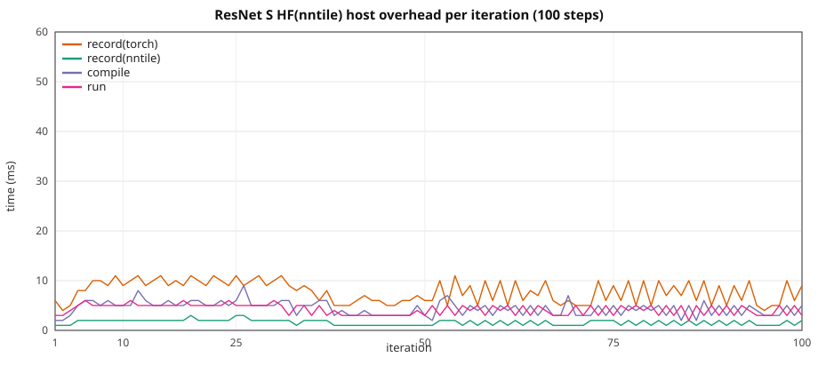

# ResNet HF: graph overhead vs width / spatial size

**Notation.** Each label is **implementation(backend)**.

- **HF** — stock PyTorch `torch.nn` CNN (`TinyResNet` in
  [`train_resnet_tiny.py`](../../torch_nntile/examples/train_resnet_tiny.py)).
  Not HuggingFace Transformers; the name matches the transformer overhead
  docs (implementation outside the brackets).
- **cuda** — PyTorch CUDA (`device=cuda`).
- **nntile** (as backend) — StarPU / nntile (`device=nntile`).

**There is no nntile(nntile) ResNet.** `torch_nntile.nn.model` has no CNN
ports; this study is only **HF(cuda)** vs **HF(nntile)**.

Two setups, same configs / 10 steps:

1. **HF(cuda)** — stock `TinyResNet`, `device=cuda`, no `torch_nntile` import.
2. **HF(nntile)** — same graph on `device=nntile` (aten / torch-native
   StarPU codelets: `convolution_overrideable`, `native_batch_norm`,
   residual `add`, AdaptiveAvgPool2d).

> **VRAM warning.** Nntile keeps extra graph buffers. Keep HF(cuda) well
> under the card limit so `device=nntile` stays on-device (no StarPU
> CPU↔GPU paging). If logs show D2H volume, shrink spatial size, channels,
> or `blocks` before collecting 10-repeat walls. GPUs are in exclusive mode
> — one process per GPU.

Configs: [`torch_nntile/examples/overhead_resnet/`](../../torch_nntile/examples/overhead_resnet/).
HF(cuda) / HF(nntile):
[`train_cnn_hf_overhead.py`](../../torch_nntile/examples/train_cnn_hf_overhead.py)
(`--model resnet`),
[`run_resnet_overhead_benchmark.py`](../../torch_nntile/tools/run_resnet_overhead_benchmark.py).

## Loss

Classification CE on synthetic RGB images vs class labels (new batch
seed per step: `42 + step`). Same `F.cross_entropy` on HF(cuda) and
HF(nntile). SGD **`lr=1e-4`** (JSON `lr`); `1e-2` / `1e-3` explode
B=1 BN so CE saturates to `0.0` when pred==label.

## Train wall

Same recipe as
[`gpt2_hf_overhead_scale.md`](gpt2_hf_overhead_scale.md): nntile
`record → compile → wait(prev) → run`, wall from first record through
final `wait()`; HF(cuda) synced per iter. Prefetch outside the wall.
Iter 1 nntile `wait=0`; iter 10 `wait` includes the final join.

## Recipe

Spatial size grows with `base_channels`. **XL** uses **4 blocks** and
192² (depth analog) so HF(nntile) fills an A40; XS–L stay at 8 blocks.

| | XS | S | M | L | XL |
|--|--:|--:|--:|--:|--:|
| Config | `resnet_xs.json` | `resnet_s.json` | `resnet_m.json` | `resnet_l.json` | `resnet_xl.json` |
| `blocks` | 8 | 8 | 8 | 8 | **4** |
| `base_channels` | 2560 | 3456 | 4608 | 5632 | 5760 |
| `height` × `width` | 32² | 48² | 64² | 80² | **192²** |
| Params (FP32) | 944 M (3.52 GiB) | 1.72 B (6.41 GiB) | 3.06 B (11.39 GiB) | 4.57 B (17.02 GiB) | 2.39 B (8.90 GiB) |

B=1, 10 steps, seed 42, `--no-shuffle`, HF(cuda) and HF(nntile)
`--disable-tf32 --disable-cudnn`, SGD **`lr=1e-4`** (JSON `lr` in the
overhead configs; `--lr 1e-2` explodes B=1 BN). `device=nntile`
`--ncpu 0 --ncuda 1 --restrict-cuda`. NVIDIA A40, one GPU per job.
Separate processes (`PYTHONNOUSERSITE=1`; never import `torch_nntile` in
the HF(cuda) process). **Do not overlap jobs on one GPU.**

HF(cuda) / HF(nntile): **10 repeats** (mean ± stdev), including **S HF(nntile) 100-step**.
`STARPU_LIMIT_CUDA_MEM=46000`.

## Two setups

### Loss

| Setup | HF(cuda) | HF(nntile) |
|-------|-----:|----------------:|
| XS 32² | 1.933359 | 1.933359 |
| S 48² | 1.741984 | 1.741984 |
| M 64² | 3.090929 | 3.090929 |
| L 80² | 3.560722 | 3.560722 |
| XL 192² | 2.045989 | 2.045989 |

### 10-step train wall

**10 repeats** (mean ± stdev), `STARPU_LIMIT_CUDA_MEM=46000`.

| Setup | HF(cuda) | HF(nntile) | HF(nntile) / HF(cuda) |
|-------|-----:|---------:|--------------:|
| XS 32² | 3.326 ± 0.120 s | 3.388 ± 0.152 s | **1.02×** |
| S 48² | 12.258 ± 0.117 s | 12.327 ± 0.192 s | **1.01×** |
| M 64² | 37.097 ± 0.356 s | 37.139 ± 0.215 s | **1.00×** |
| L 80² | 85.638 ± 0.207 s | 86.251 ± 0.445 s | **1.01×** |
| XL 192² | 273.878 ± 0.579 s | 274.654 ± 0.417 s | **1.00×** |

### Peak VRAM and bus

10-step overlap, NVIDIA A40, `STARPU_LIMIT_CUDA_MEM=46000`, B=1. Peak VRAM is `nvidia-smi memory.used` polled by a sidecar process (`watch_gpu_peak.py`) while the train child runs (`peak_vram_gib=`). H2D/D2H are StarPU bus stats at shutdown from the VRAM-fit probe. **D2H is 0 on every size**.

| Setup | HF(cuda) VRAM | HF(nntile) VRAM | H2D | D2H |
|-------|----------:|----------------:|----:|----:|
| XS 32² | 7.9 GiB | 4.8 GiB | 3.52 GB | **0** |
| S 48² | 14.7 GiB | 9.1 GiB | 6.41 GB | **0** |
| M 64² | 26.5 GiB | 16.5 GiB | 11.39 GB | **0** |
| L 80² | 36.6 GiB | 25.8 GiB | 17.02 GB | **0** |
| XL 192² | 35.2 GiB | 35.3 GiB | 8.90 GB | **0** |

## HF(nntile) vs HF(cuda) (10 repeats)

Overlap mode. Host = `record(nntile)+record(torch)+compile`.

| Setup | HF(cuda) wall | HF(nntile) wall | HF(nntile) / HF(cuda) | record(nntile) | record(torch) | compile | run | wait | host/wall | isolated |
|-------|----------:|------------:|------------:|---------------:|--------------:|--------:|----:|-----:|----------:|---------:|
| XS 32² | 3.326 ± 0.120 s | 3.388 ± 0.152 s | **1.02×** | 0.019 ± 0.002 s | 0.073 ± 0.005 s | 0.045 ± 0.004 s | 0.048 ± 0.004 s | 3.202 ± 0.155 s | **4.1%** | 0.313 ± 0.001 s |
| S 48² | 12.258 ± 0.117 s | 12.327 ± 0.192 s | **1.01×** | 0.018 ± 0.001 s | 0.076 ± 0.006 s | 0.045 ± 0.001 s | 0.049 ± 0.002 s | 12.136 ± 0.193 s | **1.1%** | 1.199 ± 0.003 s |
| M 64² | 37.097 ± 0.356 s | 37.139 ± 0.215 s | **1.00×** | 0.019 ± 0.002 s | 0.096 ± 0.005 s | 0.048 ± 0.005 s | 0.056 ± 0.003 s | 36.916 ± 0.227 s | **0.4%** | 3.690 ± 0.018 s |
| L 80² | 85.638 ± 0.207 s | 86.251 ± 0.445 s | **1.01×** | 0.019 ± 0.002 s | 0.092 ± 0.006 s | 0.047 ± 0.004 s | 0.056 ± 0.005 s | 86.035 ± 0.453 s | **0.2%** | 8.633 ± 0.029 s |
| XL 192² | 273.878 ± 0.579 s | 274.654 ± 0.417 s | **1.00×** | 0.012 ± 0.001 s | 0.070 ± 0.003 s | 0.029 ± 0.001 s | 0.034 ± 0.002 s | 274.507 ± 0.415 s | **0.0%** | 27.459 ± 0.029 s |

## Sequential HF(nntile)

`--wait-after-run`: record → compile → run → wait (no overlap).

| Setup | HF(cuda) | HF(nntile) overlap | HF(nntile) sequential | seq / cuda |
|-------|-----:|---------:|----------:|----------:|
| XS 32² | 3.326 ± 0.120 s | 3.388 ± 0.152 s | 3.443 ± 0.103 s | **1.03×** |
| S 48² | 12.258 ± 0.117 s | 12.327 ± 0.192 s | 12.364 ± 0.177 s | **1.01×** |
| M 64² | 37.097 ± 0.356 s | 37.139 ± 0.215 s | 37.265 ± 0.232 s | **1.00×** |
| L 80² | 85.638 ± 0.207 s | 86.251 ± 0.445 s | 86.235 ± 0.321 s | **1.01×** |
| XL 192² | 273.878 ± 0.579 s | 274.654 ± 0.417 s | 274.892 ± 0.516 s | **1.00×** |

## S HF(nntile) 100-step

Overlap, size S, 100 steps, 10 repeats (mean ± stdev). Complements the 10-step HF ladder above.

Loss **3.270159**.

| | Total | mean / step |
|--|--:|--:|
| record(nntile) | 0.214 ± 0.015 s | 2.1 ms |
| record(torch) | 0.936 ± 0.060 s | 9.4 ms |
| compile | 0.536 ± 0.033 s | 5.4 ms |
| run | 0.500 ± 0.032 s | 5.0 ms |
| wait | 119.952 ± 0.313 s | 1200 ms |
| **train wall** | **122.155 ± 0.265 s** | 1222 ms |

Host (record + compile) is **1%** of the wall.



CSV: [`resnet_hf_overhead_s_100.csv`](resnet_hf_overhead_s_100.csv) (median of 10 runs).

## How to reproduce

```bash
export TORCH_LIB_DIR="$(python3 -c 'import os, torch; print(os.path.join(os.path.dirname(torch.__file__), "lib"))')"
export NNTILE_BUILD_DIR=$PWD/build TORCH_NNTILE_BUILD_DIR=$PWD/build
export LD_LIBRARY_PATH="${CONDA_PREFIX}/lib:${TORCH_LIB_DIR}:$PWD/build/nntile:$PWD/build/torch_nntile:${CONDA_PREFIX}/lib"
export STARPU_SILENT=1 STARPU_FXT_TRACE=0 STARPU_WORKERS_NOBIND=1
export STARPU_LIMIT_CUDA_MEM=46000

# Probe
python3 torch_nntile/tools/run_resnet_overhead_benchmark.py \
  --logdir /tmp/resnet_overhead_probe --gpu 0 --repeats 1 --sizes xs --skip-long

# Full ladder, 10 repeats, one idle GPU
python3 torch_nntile/tools/run_resnet_overhead_benchmark.py \
  --logdir /tmp/resnet_overhead --gpu 0 --repeats 10 --long-steps 100
```

Equivalent with the shared runner:
`python3 torch_nntile/tools/run_cnn_overhead_benchmark.py --family resnet ...`.
