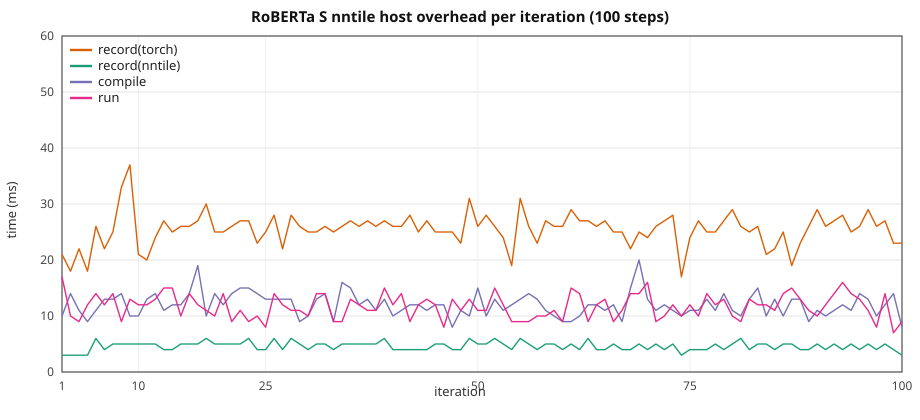

# RoBERTa HF: graph overhead vs width / seqlen

Ten-step stock HuggingFace **RobertaForMaskedLM** on **CUDA** vs **`device=nntile`**.
Depth is **12 layers** (XS–L); **XL** uses **6 layers** at similar param count.
Width and sequence length grow together with **`seq_len = hidden_size / 2`**.

> **VRAM warning.** Same as GPT-2: nntile keeps extra graph buffers. Keep CUDA
> well under the card limit on large configs so nntile stays on-device (no
> StarPU CPU↔GPU paging). GPUs are in **exclusive mode** — one process per GPU.

Configs: [`torch_nntile/examples/overhead_roberta/`](../../torch_nntile/examples/overhead_roberta/).  
Script: [`train_roberta_hf_overhead.py`](../../torch_nntile/examples/train_roberta_hf_overhead.py).  
Benchmark runner: [`run_roberta_overhead_benchmark.py`](../../torch_nntile/tools/run_roberta_overhead_benchmark.py).

## Attention backend

Stock HF RoBERTa (transformers **4.52**) uses **eager** `RobertaSelfAttention` (manual
`matmul` / `softmax`; no `sdpa` backend). This study uses
**`attn_implementation="eager"`** on both CUDA and nntile. CUDA runs with
`--disable-tf32`.

## Loss

MLM loss via stock **`F.cross_entropy`** on logits with **`ignore_index=-100`**
(same on CUDA and nntile; see `mlm_ce_loss` in `hf_tiny_train_common.py`).

## Train wall

Same recipe as
[`gpt2_hf_overhead_scale.md`](gpt2_hf_overhead_scale.md): nntile
`record → compile → wait(prev) → run`, wall from first record through final
`wait()`; CUDA synced per iter. Prefetch outside the wall. Iter 1 nntile
`wait=0`; iter 10 `wait` includes the final join.

## Recipe

| | XS | S | M | L | XL |
|--|--:|--:|--:|--:|--:|
| Config | `roberta_xs.json` | `roberta_s.json` | `roberta_m.json` | `roberta_l.json` | `roberta_xl.json` |
| `num_hidden_layers` | 12 | 12 | 12 | 12 | **6** |
| `hidden_size` / `num_attention_heads` | 1536 / 24 | 2048 / 16 | 3072 / 24 | 4096 / 32 | 5760 / 45 |
| `--seq-len` (`= hidden_size/2`) | **768** | **1024** | **1536** | **2048** | **2880** |
| Params (FP32) | 344 M (1.28 GiB) | 611 M (2.27 GiB) | 1.37 B (5.10 GiB) | 2.43 B (9.06 GiB) | **2.41 B (8.97 GiB)** |

B=1, 10 steps, seed 42, `--no-shuffle`, eager attention, CUDA `--disable-tf32`,
nntile `--ncpu 0 --ncuda 1 --restrict-cuda`. NVIDIA A40; **GPU 0** (XS/S/M/L),
**GPU 2** (XL), **GPU 1** (100-step S). Separate processes (`PYTHONNOUSERSITE=1`;
never import `torch_nntile` in the CUDA child). **Do not overlap jobs on one GPU.**

Rerun: 2026-08-27, **10 repeats per configuration** (XS: **3** repeats;
[`benchmark_logs/`](../../benchmark_logs/) `roberta_*_20260827_gpu*`).
Includes **S nntile 100-step** steady-state run.

## Overall (10-step train wall)

| Setup | CUDA wall | nntile wall | nntile/CUDA | record(nntile) | record(torch) | compile | run | wait | host/wall | CUDA loss | nntile loss |
|-------|----------:|------------:|------------:|---------------:|--------------:|--------:|----:|-----:|----------:|----------:|------------:|
| XS T=768 | 1.441 ± 0.035 s | 1.693 ± 0.053 s | **1.18×** | 0.043 ± 0.004 s | 0.274 ± 0.022 s | 0.111 ± 0.012 s | 0.112 ± 0.013 s | 1.152 ± 0.056 s | **25.3%** | 7.874904 | **7.874903** |
| S T=1024 | 2.888 ± 0.185 s | 3.091 ± 0.171 s | **1.07×** | 0.047 ± 0.003 s | 0.280 ± 0.030 s | 0.119 ± 0.008 s | 0.125 ± 0.005 s | 2.518 ± 0.184 s | **14.5%** | 7.866642 | **7.866641** |
| M T=1536 | 7.988 ± 0.191 s | 8.426 ± 0.148 s | **1.05×** | 0.043 ± 0.004 s | 0.280 ± 0.025 s | 0.107 ± 0.005 s | 0.118 ± 0.007 s | 7.875 ± 0.153 s | **5.1%** | 7.998516 | **7.998516** |
| L T=2048 | 17.901 ± 0.135 s | 18.745 ± 0.196 s | **1.05×** | 0.045 ± 0.004 s | 0.282 ± 0.024 s | 0.114 ± 0.007 s | 0.122 ± 0.008 s | 18.180 ± 0.219 s | **2.4%** | 8.006380 | **8.006380** |
| XL T=2880 | 24.991 ± 0.156 s | 26.138 ± 0.346 s | **1.05×** | 0.026 ± 0.003 s | 0.173 ± 0.029 s | 0.065 ± 0.007 s | 0.073 ± 0.007 s | 25.799 ± 0.380 s | **1.0%** | 8.060688 | **8.060687** |

Host = `record(nntile)+record(torch)+compile` (~0.29–0.51 s for 10 steps,
**flat**). Host **share** drops **25.3% → 14.5% → 5.1% → 2.4% → 1.0%**
as GPU work grows.

MLM loss matches CUDA vs nntile to printed 1e-4 at all ladder sizes (XS 7.874904 both). Resolves the historical BERT MLM mismatch in [`cuda_vs_nntile_2gb.md`](cuda_vs_nntile_2gb.md) when using shared `F.cross_entropy`.

Isolated GPU `run+wait` vs CUDA isolated wall:
XS 0.146 ± 0.002 vs 0.128 ± 0.000 s, S 0.280 ± 0.001 vs 0.259 ± 0.001 s, M 0.802 ± 0.004 vs 0.772 ± 0.003 s, L 1.826 ± 0.005 vs 1.770 ± 0.002 s, XL 2.560 ± 0.005 vs 2.491 ± 0.005 s.

## 100-step S (nntile steady state, mean ± stdev over 10 runs)

Same **S** config (`hidden_size=2048`, `T=1024`, B=1), **100 optimizer steps**, nntile
overlap only. Complements the 10-step ladder above.

Loss **7.763915**.

| | Total | mean / step |
|--|--:|--:|
| record(nntile) | 0.547 ± 0.095 s | 5.5 ms |
| record(torch) | 3.572 ± 0.948 s | 36 ms |
| compile | 1.357 ± 0.151 s | 14 ms |
| run | 1.316 ± 0.162 s | 13 ms |
| wait | 21.858 ± 1.500 s | 219 ms |
| **train wall** | **28.662 ± 0.241 s** | 287 ms |

Host (record + compile) is **19%** of the wall (~55 ms/step).



CSV: [`roberta_hf_overhead_s_100.csv`](roberta_hf_overhead_s_100.csv) (median of 10 runs).

## Comparison to GPT-2 (same ladder geometry)

See [`gpt2_hf_overhead_scale.md`](gpt2_hf_overhead_scale.md) for the GPT-2 10× run
(same A40 GPUs, Aug 2026, CUDA-parity matmul).

| Size | GPT-2 nntile/CUDA | RoBERTa nntile/CUDA |
|------|------------------:|-----------------:|
| XS | 0.99× | **1.18×** |
| S | 0.96× | **1.07×** |
| M | 0.94× | **1.05×** |
| L | 0.94× | **1.05×** |
| XL | — | **1.05×** |

### 100-step S (nntile)

| | GPT-2 | RoBERTa | Notes |
|--|------:|-----:|-------|
| train wall | 27.5 s | **28.7 s** | same ballpark |
| final loss | 7.734033 | **7.763915** | MLM CE, matches 10-step S |
| host share | 22% | **19%** | flat host, GPU-bound |

## Per iteration (mean ± stdev over 10 runs)

### XS (`hidden_size=1536`, `T=768`)

| Iter | CUDA wall | record(nntile) | record(torch) | compile | run | wait |
|-----:|----------:|---------------:|--------------:|--------:|----:|-----:|
| 1 | 0.291 ± 0.033 | 0.002 ± 0.000 | 0.020 ± 0.002 | 0.006 ± 0.002 | 0.007 ± 0.002 | 0.000 |
| 2 | 0.127 ± 0.000 | 0.002 ± 0.000 | 0.015 ± 0.002 | 0.005 ± 0.001 | 0.008 ± 0.003 | 0.275 ± 0.029 |
| 3 | 0.127 ± 0.001 | 0.003 ± 0.001 | 0.020 ± 0.004 | 0.009 ± 0.003 | 0.010 ± 0.003 | 0.108 ± 0.008 |
| 4 | 0.128 ± 0.000 | 0.004 ± 0.002 | 0.023 ± 0.004 | 0.011 ± 0.003 | 0.011 ± 0.002 | 0.101 ± 0.007 |
| 5 | 0.128 ± 0.000 | 0.004 ± 0.001 | 0.026 ± 0.002 | 0.011 ± 0.003 | 0.012 ± 0.002 | 0.097 ± 0.005 |
| 6 | 0.128 ± 0.000 | 0.005 ± 0.001 | 0.028 ± 0.003 | 0.013 ± 0.002 | 0.012 ± 0.003 | 0.094 ± 0.005 |
| 7 | 0.128 ± 0.000 | 0.005 ± 0.001 | 0.030 ± 0.006 | 0.013 ± 0.003 | 0.013 ± 0.002 | 0.091 ± 0.011 |
| 8 | 0.128 ± 0.000 | 0.006 ± 0.001 | 0.035 ± 0.006 | 0.014 ± 0.002 | 0.013 ± 0.002 | 0.085 ± 0.011 |
| 9 | 0.128 ± 0.000 | 0.006 ± 0.000 | 0.038 ± 0.007 | 0.015 ± 0.002 | 0.013 ± 0.001 | 0.081 ± 0.013 |
| 10 | 0.128 ± 0.000 | 0.005 ± 0.001 | 0.037 ± 0.009 | 0.013 ± 0.002 | 0.013 ± 0.002 | 0.221 ± 0.015 |

### S (`hidden_size=2048`, `T=1024`)

| Iter | CUDA wall | record(nntile) | record(torch) | compile | run | wait |
|-----:|----------:|---------------:|--------------:|--------:|----:|-----:|
| 1 | 0.530 ± 0.189 | 0.003 ± 0.001 | 0.023 ± 0.005 | 0.009 ± 0.003 | 0.011 ± 0.004 | 0.000 |
| 2 | 0.285 ± 0.062 | 0.003 ± 0.001 | 0.018 ± 0.004 | 0.010 ± 0.005 | 0.009 ± 0.002 | 0.462 ± 0.163 |
| 3 | 0.259 ± 0.001 | 0.003 ± 0.001 | 0.022 ± 0.004 | 0.009 ± 0.002 | 0.011 ± 0.002 | 0.237 ± 0.006 |
| 4 | 0.259 ± 0.001 | 0.004 ± 0.000 | 0.025 ± 0.002 | 0.011 ± 0.002 | 0.013 ± 0.001 | 0.231 ± 0.003 |
| 5 | 0.259 ± 0.000 | 0.005 ± 0.001 | 0.029 ± 0.005 | 0.012 ± 0.002 | 0.013 ± 0.002 | 0.224 ± 0.007 |
| 6 | 0.259 ± 0.001 | 0.006 ± 0.002 | 0.029 ± 0.005 | 0.013 ± 0.002 | 0.014 ± 0.002 | 0.223 ± 0.008 |
| 7 | 0.259 ± 0.000 | 0.005 ± 0.001 | 0.031 ± 0.006 | 0.013 ± 0.002 | 0.014 ± 0.002 | 0.221 ± 0.010 |
| 8 | 0.259 ± 0.001 | 0.005 ± 0.001 | 0.033 ± 0.008 | 0.013 ± 0.002 | 0.015 ± 0.002 | 0.219 ± 0.012 |
| 9 | 0.259 ± 0.001 | 0.006 ± 0.001 | 0.034 ± 0.009 | 0.015 ± 0.002 | 0.013 ± 0.003 | 0.216 ± 0.013 |
| 10 | 0.259 ± 0.001 | 0.006 ± 0.001 | 0.036 ± 0.009 | 0.013 ± 0.002 | 0.014 ± 0.002 | 0.486 ± 0.016 |

### M (`hidden_size=3072`, `T=1536`)

| Iter | CUDA wall | record(nntile) | record(torch) | compile | run | wait |
|-----:|----------:|---------------:|--------------:|--------:|----:|-----:|
| 1 | 1.055 ± 0.190 | 0.003 ± 0.001 | 0.022 ± 0.004 | 0.007 ± 0.001 | 0.009 ± 0.003 | 0.000 |
| 2 | 0.767 ± 0.001 | 0.003 ± 0.001 | 0.018 ± 0.005 | 0.007 ± 0.002 | 0.010 ± 0.003 | 1.097 ± 0.142 |
| 3 | 0.769 ± 0.002 | 0.004 ± 0.001 | 0.022 ± 0.003 | 0.009 ± 0.002 | 0.010 ± 0.002 | 0.757 ± 0.008 |
| 4 | 0.770 ± 0.001 | 0.004 ± 0.001 | 0.025 ± 0.002 | 0.011 ± 0.002 | 0.012 ± 0.002 | 0.754 ± 0.005 |
| 5 | 0.770 ± 0.001 | 0.005 ± 0.001 | 0.026 ± 0.002 | 0.011 ± 0.001 | 0.013 ± 0.001 | 0.750 ± 0.003 |
| 6 | 0.771 ± 0.001 | 0.005 ± 0.001 | 0.030 ± 0.005 | 0.012 ± 0.002 | 0.012 ± 0.002 | 0.748 ± 0.009 |
| 7 | 0.771 ± 0.002 | 0.005 ± 0.001 | 0.031 ± 0.007 | 0.013 ± 0.001 | 0.012 ± 0.002 | 0.746 ± 0.011 |
| 8 | 0.772 ± 0.001 | 0.005 ± 0.001 | 0.033 ± 0.008 | 0.012 ± 0.002 | 0.014 ± 0.002 | 0.745 ± 0.011 |
| 9 | 0.772 ± 0.001 | 0.005 ± 0.001 | 0.036 ± 0.008 | 0.013 ± 0.002 | 0.014 ± 0.002 | 0.741 ± 0.011 |
| 10 | 0.773 ± 0.001 | 0.006 ± 0.001 | 0.037 ± 0.011 | 0.012 ± 0.002 | 0.013 ± 0.001 | 1.535 ± 0.017 |

### L (`hidden_size=4096`, `T=2048`)

| Iter | CUDA wall | record(nntile) | record(torch) | compile | run | wait |
|-----:|----------:|---------------:|--------------:|--------:|----:|-----:|
| 1 | 1.982 ± 0.125 | 0.003 ± 0.001 | 0.022 ± 0.004 | 0.009 ± 0.004 | 0.012 ± 0.003 | 0.000 |
| 2 | 1.769 ± 0.008 | 0.003 ± 0.001 | 0.019 ± 0.005 | 0.009 ± 0.002 | 0.010 ± 0.003 | 2.206 ± 0.169 |
| 3 | 1.773 ± 0.007 | 0.004 ± 0.001 | 0.022 ± 0.004 | 0.009 ± 0.003 | 0.010 ± 0.001 | 1.783 ± 0.010 |
| 4 | 1.775 ± 0.008 | 0.004 ± 0.001 | 0.024 ± 0.002 | 0.011 ± 0.002 | 0.011 ± 0.002 | 1.785 ± 0.008 |
| 5 | 1.771 ± 0.007 | 0.005 ± 0.001 | 0.027 ± 0.004 | 0.010 ± 0.002 | 0.012 ± 0.002 | 1.781 ± 0.010 |
| 6 | 1.763 ± 0.002 | 0.005 ± 0.001 | 0.029 ± 0.004 | 0.012 ± 0.002 | 0.013 ± 0.002 | 1.776 ± 0.012 |
| 7 | 1.765 ± 0.002 | 0.005 ± 0.001 | 0.033 ± 0.004 | 0.013 ± 0.001 | 0.013 ± 0.001 | 1.760 ± 0.008 |
| 8 | 1.766 ± 0.001 | 0.006 ± 0.002 | 0.033 ± 0.009 | 0.013 ± 0.002 | 0.013 ± 0.003 | 1.760 ± 0.012 |
| 9 | 1.767 ± 0.001 | 0.006 ± 0.001 | 0.037 ± 0.009 | 0.015 ± 0.002 | 0.015 ± 0.003 | 1.758 ± 0.013 |
| 10 | 1.769 ± 0.002 | 0.006 ± 0.001 | 0.038 ± 0.008 | 0.013 ± 0.001 | 0.013 ± 0.002 | 3.570 ± 0.016 |

### XL (`hidden_size=5760`, `T=2880`, 6 layers, `head_dim=128`)

| Iter | CUDA wall | record(nntile) | record(torch) | compile | run | wait |
|-----:|----------:|---------------:|--------------:|--------:|----:|-----:|
| 1 | 2.684 ± 0.136 | 0.002 ± 0.001 | 0.014 ± 0.003 | 0.004 ± 0.002 | 0.008 ± 0.003 | 0.000 |
| 2 | 2.479 ± 0.014 | 0.002 ± 0.001 | 0.010 ± 0.002 | 0.005 ± 0.002 | 0.006 ± 0.002 | 3.129 ± 0.332 |
| 3 | 2.477 ± 0.013 | 0.002 ± 0.001 | 0.013 ± 0.002 | 0.005 ± 0.001 | 0.006 ± 0.001 | 2.522 ± 0.012 |
| 4 | 2.472 ± 0.009 | 0.002 ± 0.001 | 0.015 ± 0.003 | 0.006 ± 0.001 | 0.007 ± 0.002 | 2.518 ± 0.013 |
| 5 | 2.473 ± 0.005 | 0.003 ± 0.001 | 0.016 ± 0.002 | 0.006 ± 0.001 | 0.007 ± 0.001 | 2.512 ± 0.011 |
| 6 | 2.475 ± 0.002 | 0.003 ± 0.001 | 0.019 ± 0.003 | 0.008 ± 0.001 | 0.009 ± 0.001 | 2.509 ± 0.006 |
| 7 | 2.478 ± 0.003 | 0.003 ± 0.001 | 0.020 ± 0.006 | 0.008 ± 0.002 | 0.008 ± 0.002 | 2.511 ± 0.010 |
| 8 | 2.481 ± 0.004 | 0.003 ± 0.001 | 0.022 ± 0.007 | 0.009 ± 0.002 | 0.008 ± 0.002 | 2.511 ± 0.015 |
| 9 | 2.484 ± 0.003 | 0.003 ± 0.001 | 0.022 ± 0.006 | 0.008 ± 0.002 | 0.007 ± 0.002 | 2.515 ± 0.013 |
| 10 | 2.488 ± 0.004 | 0.003 ± 0.001 | 0.021 ± 0.007 | 0.007 ± 0.002 | 0.008 ± 0.001 | 5.072 ± 0.017 |

## Isolated extra step (mean ± stdev over 10 runs)

| Setup | record(nntile) | record(torch) | compile | run | wait | run+wait | CUDA isolated |
|-------|---------------:|--------------:|--------:|----:|-----:|---------:|--------------:|
| XS | 0.006 ± 0.002 | 0.041 ± 0.015 | 0.014 ± 0.003 | 0.013 ± 0.003 | 0.133 ± 0.005 | **0.146 ± 0.002** | 0.128 ± 0.000 |
| S | 0.005 ± 0.001 | 0.037 ± 0.012 | 0.013 ± 0.003 | 0.012 ± 0.003 | 0.268 ± 0.004 | **0.280 ± 0.001** | 0.259 ± 0.001 |
| M | 0.005 ± 0.001 | 0.038 ± 0.012 | 0.014 ± 0.002 | 0.012 ± 0.002 | 0.790 ± 0.004 | **0.802 ± 0.004** | 0.772 ± 0.003 |
| L | 0.005 ± 0.002 | 0.040 ± 0.012 | 0.013 ± 0.003 | 0.012 ± 0.003 | 1.814 ± 0.006 | **1.826 ± 0.005** | 1.770 ± 0.002 |
| XL | 0.003 ± 0.001 | 0.022 ± 0.009 | 0.007 ± 0.002 | 0.007 ± 0.001 | 2.553 ± 0.006 | **2.560 ± 0.005** | 2.491 ± 0.005 |

| Setup | Full isolated (record+compile+run+wait) | Hidden host (`run+wait`) | Saved |
|-------|----------------------------------------:|-------------------------:|------:|
| XS | 0.207 s | 0.146 s | 0.060 s (**29%**) |
| S | 0.336 s | 0.280 s | 0.055 s (**16%**) |
| M | 0.860 s | 0.802 s | 0.057 s (**7%**) |
| L | 1.885 s | 1.826 s | 0.059 s (**3%**) |
| XL | 2.592 s | 2.560 s | 0.033 s (**1%**) |

## Sequential prep vs compute (`--wait-after-run`)

| Setup | CUDA wall | sequential wall | prep | compute | compute/CUDA | prep/wall |
|-------|----------:|----------------:|-----:|--------:|-------------:|----------:|
| XS T=768 | 1.441 ± 0.035 s | 2.073 ± 0.142 s | 0.412 ± 0.058 s | **1.659 ± 0.168 s** | **1.15×** | 19.9% |
| S T=1024 | 2.888 ± 0.185 s | 3.464 ± 0.206 s | 0.418 ± 0.057 s | **3.045 ± 0.201 s** | **1.05×** | 12.1% |
| M T=1536 | 7.988 ± 0.191 s | 8.802 ± 0.155 s | 0.429 ± 0.054 s | **8.371 ± 0.187 s** | **1.05×** | 4.9% |
| L T=2048 | 17.901 ± 0.135 s | 19.146 ± 0.146 s | 0.428 ± 0.051 s | **18.716 ± 0.157 s** | **1.05×** | 2.2% |
| XL T=2880 | 24.991 ± 0.156 s | 26.464 ± 0.274 s | 0.272 ± 0.049 s | **26.190 ± 0.292 s** | **1.05×** | 1.0% |

Sequential nntile loss: XS 7.874903, S 7.866641, M 7.998516, L 8.006380, XL 8.060687.

### Per iteration (prep / compute, mean ± stdev)

#### XS (`T=768`)

| Iter | prep | compute | record(nntile) | record(torch) | compile | run | wait |
|-----:|-----:|--------:|---------------:|--------------:|--------:|----:|-----:|
| 1 | 0.031 ± 0.007 | 0.337 ± 0.141 | 0.003 ± 0.001 | 0.021 ± 0.004 | 0.007 ± 0.003 | 0.009 ± 0.004 | 0.328 ± 0.139 |
| 2 | 0.028 ± 0.004 | 0.145 ± 0.007 | 0.003 ± 0.001 | 0.018 ± 0.003 | 0.007 ± 0.001 | 0.007 ± 0.002 | 0.139 ± 0.006 |
| 3 | 0.034 ± 0.004 | 0.146 ± 0.006 | 0.004 ± 0.000 | 0.022 ± 0.003 | 0.008 ± 0.001 | 0.008 ± 0.002 | 0.138 ± 0.006 |
| 4 | 0.038 ± 0.003 | 0.147 ± 0.007 | 0.004 ± 0.001 | 0.024 ± 0.001 | 0.010 ± 0.002 | 0.009 ± 0.002 | 0.138 ± 0.007 |
| 5 | 0.040 ± 0.007 | 0.147 ± 0.006 | 0.005 ± 0.001 | 0.025 ± 0.005 | 0.011 ± 0.002 | 0.010 ± 0.001 | 0.137 ± 0.006 |
| 6 | 0.044 ± 0.008 | 0.148 ± 0.006 | 0.005 ± 0.001 | 0.028 ± 0.005 | 0.011 ± 0.002 | 0.013 ± 0.003 | 0.135 ± 0.006 |
| 7 | 0.046 ± 0.011 | 0.147 ± 0.006 | 0.005 ± 0.001 | 0.029 ± 0.008 | 0.012 ± 0.003 | 0.011 ± 0.001 | 0.135 ± 0.006 |
| 8 | 0.049 ± 0.012 | 0.147 ± 0.006 | 0.005 ± 0.002 | 0.031 ± 0.008 | 0.012 ± 0.002 | 0.011 ± 0.002 | 0.136 ± 0.006 |
| 9 | 0.051 ± 0.015 | 0.147 ± 0.005 | 0.006 ± 0.002 | 0.033 ± 0.010 | 0.013 ± 0.004 | 0.012 ± 0.002 | 0.135 ± 0.007 |
| 10 | 0.052 ± 0.015 | 0.148 ± 0.007 | 0.005 ± 0.001 | 0.034 ± 0.012 | 0.013 ± 0.002 | 0.012 ± 0.002 | 0.135 ± 0.006 |

#### S (`T=1024`)

| Iter | prep | compute | record(nntile) | record(torch) | compile | run | wait |
|-----:|-----:|--------:|---------------:|--------------:|--------:|----:|-----:|
| 1 | 0.033 ± 0.007 | 0.544 ± 0.194 | 0.003 ± 0.001 | 0.021 ± 0.004 | 0.009 ± 0.004 | 0.010 ± 0.006 | 0.534 ± 0.195 |
| 2 | 0.031 ± 0.005 | 0.277 ± 0.004 | 0.004 ± 0.001 | 0.019 ± 0.003 | 0.008 ± 0.002 | 0.008 ± 0.002 | 0.269 ± 0.003 |
| 3 | 0.036 ± 0.003 | 0.277 ± 0.002 | 0.005 ± 0.001 | 0.022 ± 0.002 | 0.010 ± 0.002 | 0.008 ± 0.001 | 0.269 ± 0.002 |
| 4 | 0.040 ± 0.004 | 0.278 ± 0.002 | 0.004 ± 0.001 | 0.024 ± 0.002 | 0.011 ± 0.002 | 0.010 ± 0.001 | 0.268 ± 0.003 |
| 5 | 0.043 ± 0.006 | 0.279 ± 0.003 | 0.005 ± 0.000 | 0.028 ± 0.003 | 0.011 ± 0.003 | 0.011 ± 0.001 | 0.268 ± 0.004 |
| 6 | 0.046 ± 0.008 | 0.277 ± 0.002 | 0.005 ± 0.001 | 0.029 ± 0.005 | 0.012 ± 0.002 | 0.010 ± 0.002 | 0.267 ± 0.003 |
| 7 | 0.044 ± 0.012 | 0.278 ± 0.002 | 0.005 ± 0.001 | 0.028 ± 0.008 | 0.011 ± 0.004 | 0.010 ± 0.003 | 0.268 ± 0.004 |
| 8 | 0.048 ± 0.013 | 0.278 ± 0.002 | 0.005 ± 0.001 | 0.031 ± 0.009 | 0.011 ± 0.003 | 0.011 ± 0.002 | 0.267 ± 0.003 |
| 9 | 0.048 ± 0.014 | 0.278 ± 0.002 | 0.005 ± 0.002 | 0.032 ± 0.010 | 0.011 ± 0.004 | 0.010 ± 0.003 | 0.268 ± 0.004 |
| 10 | 0.049 ± 0.014 | 0.278 ± 0.002 | 0.005 ± 0.002 | 0.033 ± 0.010 | 0.011 ± 0.003 | 0.010 ± 0.002 | 0.267 ± 0.003 |

#### M (`T=1536`)

| Iter | prep | compute | record(nntile) | record(torch) | compile | run | wait |
|-----:|-----:|--------:|---------------:|--------------:|--------:|----:|-----:|
| 1 | 0.035 ± 0.009 | 1.156 ± 0.174 | 0.003 ± 0.001 | 0.022 ± 0.004 | 0.009 ± 0.004 | 0.012 ± 0.007 | 1.144 ± 0.172 |
| 2 | 0.032 ± 0.004 | 0.800 ± 0.007 | 0.004 ± 0.000 | 0.020 ± 0.003 | 0.008 ± 0.001 | 0.008 ± 0.001 | 0.792 ± 0.006 |
| 3 | 0.037 ± 0.004 | 0.802 ± 0.005 | 0.005 ± 0.001 | 0.022 ± 0.003 | 0.010 ± 0.002 | 0.009 ± 0.001 | 0.793 ± 0.006 |
| 4 | 0.041 ± 0.003 | 0.800 ± 0.003 | 0.005 ± 0.001 | 0.025 ± 0.002 | 0.012 ± 0.001 | 0.009 ± 0.001 | 0.791 ± 0.004 |
| 5 | 0.044 ± 0.005 | 0.800 ± 0.002 | 0.005 ± 0.001 | 0.027 ± 0.004 | 0.011 ± 0.002 | 0.010 ± 0.002 | 0.790 ± 0.004 |
| 6 | 0.043 ± 0.010 | 0.803 ± 0.007 | 0.005 ± 0.001 | 0.026 ± 0.006 | 0.012 ± 0.003 | 0.011 ± 0.002 | 0.792 ± 0.007 |
| 7 | 0.047 ± 0.011 | 0.803 ± 0.004 | 0.005 ± 0.001 | 0.030 ± 0.007 | 0.012 ± 0.003 | 0.011 ± 0.002 | 0.792 ± 0.005 |
| 8 | 0.049 ± 0.014 | 0.802 ± 0.002 | 0.005 ± 0.001 | 0.031 ± 0.010 | 0.012 ± 0.003 | 0.011 ± 0.002 | 0.791 ± 0.003 |
| 9 | 0.051 ± 0.015 | 0.802 ± 0.002 | 0.005 ± 0.002 | 0.033 ± 0.011 | 0.013 ± 0.003 | 0.011 ± 0.002 | 0.791 ± 0.003 |
| 10 | 0.051 ± 0.013 | 0.802 ± 0.002 | 0.006 ± 0.002 | 0.033 ± 0.009 | 0.013 ± 0.003 | 0.011 ± 0.002 | 0.791 ± 0.003 |

#### L (`T=2048`)

| Iter | prep | compute | record(nntile) | record(torch) | compile | run | wait |
|-----:|-----:|--------:|---------------:|--------------:|--------:|----:|-----:|
| 1 | 0.032 ± 0.007 | 2.307 ± 0.148 | 0.003 ± 0.001 | 0.021 ± 0.004 | 0.008 ± 0.003 | 0.011 ± 0.003 | 2.296 ± 0.148 |
| 2 | 0.033 ± 0.005 | 1.822 ± 0.004 | 0.004 ± 0.001 | 0.020 ± 0.003 | 0.009 ± 0.002 | 0.008 ± 0.002 | 1.814 ± 0.004 |
| 3 | 0.036 ± 0.004 | 1.827 ± 0.003 | 0.005 ± 0.001 | 0.022 ± 0.003 | 0.009 ± 0.002 | 0.009 ± 0.002 | 1.819 ± 0.004 |
| 4 | 0.040 ± 0.004 | 1.830 ± 0.005 | 0.004 ± 0.001 | 0.025 ± 0.002 | 0.011 ± 0.002 | 0.009 ± 0.001 | 1.821 ± 0.005 |
| 5 | 0.044 ± 0.007 | 1.831 ± 0.003 | 0.005 ± 0.001 | 0.028 ± 0.005 | 0.011 ± 0.002 | 0.009 ± 0.002 | 1.822 ± 0.004 |
| 6 | 0.044 ± 0.009 | 1.820 ± 0.007 | 0.005 ± 0.001 | 0.029 ± 0.006 | 0.011 ± 0.003 | 0.011 ± 0.003 | 1.809 ± 0.008 |
| 7 | 0.046 ± 0.009 | 1.819 ± 0.005 | 0.005 ± 0.001 | 0.030 ± 0.007 | 0.011 ± 0.002 | 0.009 ± 0.002 | 1.809 ± 0.005 |
| 8 | 0.050 ± 0.013 | 1.819 ± 0.003 | 0.005 ± 0.001 | 0.033 ± 0.010 | 0.012 ± 0.003 | 0.010 ± 0.003 | 1.809 ± 0.004 |
| 9 | 0.051 ± 0.014 | 1.820 ± 0.003 | 0.005 ± 0.001 | 0.034 ± 0.011 | 0.013 ± 0.003 | 0.011 ± 0.002 | 1.808 ± 0.004 |
| 10 | 0.052 ± 0.013 | 1.822 ± 0.004 | 0.005 ± 0.001 | 0.036 ± 0.010 | 0.011 ± 0.003 | 0.011 ± 0.001 | 1.812 ± 0.005 |

Steady compute after iter 1 (mean over repeats): ~0.145 s (XS), ~0.277 s (S), ~0.800 s (M), ~1.822 s (L), ~2.545 s (XL).

## Takeaways

1. **`seq_len = hidden_size / 2`**, eager HF RoBERTa attention, MLM CE loss.
2. **Graph host overhead is flat** (~0.3–0.5 s / 10 steps); share falls as GPU
   work grows (25.3% → 1.0%).
3. **With VRAM headroom, nntile is within ~5–16% of CUDA on wall time**
   (XS 1.18×, S 1.07×, M 1.05×, L 1.05×, XL 1.05×).
4. **Sequential GPU time** (`run+wait`): **1.15× → 1.05× → 1.05× → 1.05× → 1.05×** CUDA.
5. Timings are **mean ± stdev** on the same GPU per size (XS: 3 repeats).
6. **MLM loss** matches CUDA vs nntile to ~1e-4 — see loss section above.
7. **100-step S** wall **28.662 ± 0.241 s** — see section above.

## How to reproduce

```bash
export TORCH_LIB_DIR="$(python3 -c 'import os, torch; print(os.path.join(os.path.dirname(torch.__file__), "lib"))')"
export NNTILE_BUILD_DIR=$PWD/build TORCH_NNTILE_BUILD_DIR=$PWD/build
export LD_LIBRARY_PATH="${CONDA_PREFIX}/lib:${TORCH_LIB_DIR}:$PWD/build/nntile:$PWD/build/torch_nntile:/opt/starpu/lib"
export STARPU_SILENT=1 STARPU_FXT_TRACE=0 STARPU_WORKERS_NOBIND=1

# One size per GPU; do not overlap on exclusive-mode GPUs.
python3 torch_nntile/tools/run_roberta_overhead_benchmark.py \
  --logdir /tmp/roberta_overhead_l_gpu0 --gpu 0 --repeats 10 --sizes l --skip-long
python3 torch_nntile/tools/run_roberta_overhead_benchmark.py \
  --logdir /tmp/roberta_overhead_xl_gpu2 --gpu 2 --repeats 10 --sizes xl --skip-long
python3 torch_nntile/tools/run_roberta_overhead_benchmark.py \
  --logdir /tmp/roberta_overhead_s100 --gpu 1 --repeats 10 --only-long

python3 torch_nntile/tools/update_roberta_overhead_doc.py \
  --summary benchmark_logs/roberta_sm_20260827_gpu0/results_summary.json \
  --results benchmark_logs/roberta_sm_20260827_gpu0/results.json \
  --merge-summary benchmark_logs/roberta_xs_loss_20260827_gpu0/results_summary.json \
  --merge-results benchmark_logs/roberta_xs_loss_20260827_gpu0/results.json \
  --merge-summary benchmark_logs/roberta_l_20260827_gpu0/results_summary.json \
  --merge-results benchmark_logs/roberta_l_20260827_gpu0/results.json \
  --merge-summary benchmark_logs/roberta_xl_20260827_gpu2/results_summary.json \
  --merge-results benchmark_logs/roberta_xl_20260827_gpu2/results.json \
  --merge-summary benchmark_logs/roberta_s100_20260827_gpu0/results_summary.json \
  --merge-results benchmark_logs/roberta_s100_20260827_gpu0/results.json
```
