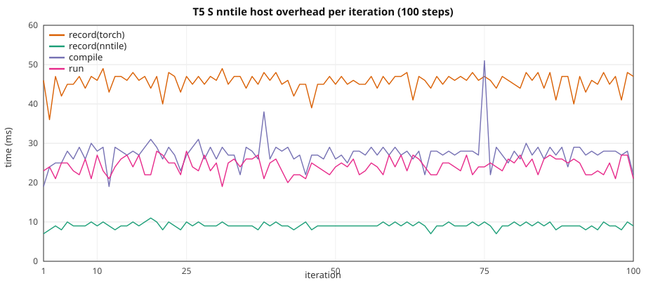

# T5 HF: graph overhead vs width / seqlen

Ten-step stock HuggingFace **T5ForConditionalGeneration** on **CUDA** vs **`device=nntile`**.
Depth is tuned per size so **CUDA train peak VRAM matches the Llama ladder**
(same ``d_model`` / ``seq_len``; enc+dec layer counts differ — see recipe table).
Width and sequence length
grow together with **`seq_len = d_model / 2`** (encoder and decoder share
``--seq-len``).

> **VRAM warning.** Same as GPT-2: nntile keeps extra graph buffers. Keep CUDA
> well under the card limit on large configs so nntile stays on-device (no
> StarPU CPU↔GPU paging). GPUs are in **exclusive mode** — one process per GPU.

Configs: [`torch_nntile/examples/overhead_t5/`](../../torch_nntile/examples/overhead_t5/).  
Script: [`train_t5_hf_overhead.py`](../../torch_nntile/examples/train_t5_hf_overhead.py).  
Benchmark runner: [`run_t5_overhead_benchmark.py`](../../torch_nntile/tools/run_t5_overhead_benchmark.py).

## Attention backend

Stock HF T5 (transformers **4.52**) uses **eager** attention (manual
`matmul` / `softmax`; no `sdpa` backend). This study uses
**`attn_implementation="eager"`** and **`use_cache=False`** on both CUDA and
nntile. CUDA runs with `--disable-tf32`.

## Loss

Encoder-decoder CE via stock T5 **`labels`** forward (`t5_ce_loss` in
`hf_tiny_train_common.py`; same on CUDA and nntile).

## Train wall

Same recipe as
[`gpt2_hf_overhead_scale.md`](gpt2_hf_overhead_scale.md): nntile
`record → compile → wait(prev) → run`, wall from first record through final
`wait()`; CUDA synced per iter. Prefetch outside the wall. Iter 1 nntile
`wait=0`; iter 10 `wait` includes the final join.

## Recipe

| | XS | S | M | L | XL |
|--|--:|--:|--:|--:|--:|
| Config | `t5_xs.json` | `t5_s.json` | `t5_m.json` | `t5_l.json` | `t5_xl.json` |
| `num_layers` / `num_decoder_layers` | 9 + 5 | 5 + 8 | 9 + 5 | 7 + 6 | **3 + 3** |
| `d_model` / `num_heads` | 1536 / 24 | 2048 / 16 | 3072 / 24 | 4096 / 32 | 5760 / 45 |
| `--seq-len` (`= d_model/2`, enc+dec) | **768** | **1024** | **1536** | **2048** | **2880** |
| Params (FP32) | ~688 M (~2.56 GiB) | ~1.22 B (~4.54 GiB) | ~2.74 B (~10.2 GiB) | ~4.86 B (~18.1 GiB) | **~4.82 B (~17.9 GiB)** |

B=1, 10 steps, seed 42, `--no-shuffle`, eager attention, CUDA `--disable-tf32`,
nntile `--ncpu 0 --ncuda 1 --restrict-cuda`. NVIDIA A40; **GPU 0** (XS/S/M,
100-step S), **GPU 2** (L), **GPU 3** (XL). Separate processes (`PYTHONNOUSERSITE=1`;
never import `torch_nntile` in the CUDA child). **Do not overlap jobs on one GPU.**

Rerun: 2026-08-27, **10 repeats per configuration**
([`benchmark_logs/`](../../benchmark_logs/) `t5_*_vrammatch_20260827_gpu*`).
Includes **S nntile 100-step** steady-state run.

## Overall (10-step train wall)

| Setup | CUDA wall | nntile wall | nntile/CUDA | record(nntile) | record(torch) | compile | run | wait | host/wall | CUDA loss | nntile loss |
|-------|----------:|------------:|------------:|---------------:|--------------:|--------:|----:|-----:|----------:|----------:|------------:|
| XS T=768 | 2.471 ± 0.190 s | 2.980 ± 0.277 s | **1.21×** | 0.085 ± 0.023 s | 0.402 ± 0.052 s | 0.275 ± 0.064 s | 0.259 ± 0.044 s | 1.956 ± 0.291 s | **25.7%** | 9.182824 | **9.182824** |
| S T=1024 | 4.354 ± 0.209 s | 4.985 ± 0.308 s | **1.14×** | 0.089 ± 0.014 s | 0.451 ± 0.053 s | 0.281 ± 0.047 s | 0.256 ± 0.025 s | 3.904 ± 0.294 s | **16.5%** | 9.001480 | **9.001480** |
| M T=1536 | 11.874 ± 0.118 s | 12.272 ± 0.250 s | **1.03×** | 0.077 ± 0.018 s | 0.412 ± 0.066 s | 0.226 ± 0.045 s | 0.226 ± 0.033 s | 11.329 ± 0.139 s | **5.8%** | 11.046638 | **11.046638** |
| L T=2048 | 25.213 ± 0.147 s | 25.387 ± 0.265 s | **1.01×** | 0.079 ± 0.015 s | 0.404 ± 0.065 s | 0.228 ± 0.041 s | 0.235 ± 0.034 s | 24.438 ± 0.155 s | **2.8%** | 11.589462 | **11.589460** |
| XL T=2880 | 33.275 ± 0.181 s | 33.153 ± 0.262 s | **1.00×** | 0.044 ± 0.008 s | 0.222 ± 0.023 s | 0.108 ± 0.015 s | 0.123 ± 0.007 s | 32.653 ± 0.249 s | **1.1%** | 18.946465 | **18.946466** |

Host = `record(nntile)+record(torch)+compile` (~0.29–0.51 s for 10 steps,
**flat**). Host **share** drops **25.7% → 16.5% → 5.8% → 2.8% → 1.1%**
as GPU work grows.

T5 CE loss matches CUDA vs nntile to printed 1e-4 at all ladder sizes (XS 9.182824 both).

Isolated GPU `run+wait` vs CUDA isolated wall:
XS 0.226 ± 0.011 vs 0.194 ± 0.001 s, S 0.415 ± 0.014 vs 0.382 ± 0.001 s, M 1.131 ± 0.012 vs 1.121 ± 0.003 s, L 2.432 ± 0.013 vs 2.464 ± 0.002 s, XL 3.225 ± 0.006 vs 3.284 ± 0.008 s.

## 100-step S (nntile steady state, mean ± stdev over 10 runs)

Same **S** config (`d_model=2048`, `T=1024`, B=1), **100 optimizer steps**, nntile
overlap only. Complements the 10-step ladder above.

Loss **8.156888**.

| | Total | mean / step |
|--|--:|--:|
| record(nntile) | 0.970 ± 0.070 s | 9.7 ms |
| record(torch) | 4.688 ± 0.248 s | 47 ms |
| compile | 2.900 ± 0.242 s | 29 ms |
| run | 2.509 ± 0.208 s | 25 ms |
| wait | 32.338 ± 0.754 s | 323 ms |
| **train wall** | **43.417 ± 1.356 s** | 434 ms |

Host (record + compile) is **20%** of the wall (~86 ms/step).



CSV: [`t5_hf_overhead_s_100.csv`](t5_hf_overhead_s_100.csv) (median of 10 runs).

## Comparison to GPT-2 (same ladder geometry)

See [`gpt2_hf_overhead_scale.md`](gpt2_hf_overhead_scale.md) for the GPT-2 10× run
(same A40 GPUs, Aug 2026, CUDA-parity matmul).

| Size | GPT-2 nntile/CUDA | T5 nntile/CUDA |
|------|------------------:|-----------------:|
| XS | 0.99× | **1.21×** |
| S | 0.96× | **1.14×** |
| M | 0.94× | **1.03×** |
| L | 0.94× | **1.01×** |
| XL | — | **1.00×** |

### 100-step S (nntile)

| | GPT-2 | T5 | Notes |
|--|------:|-----:|-------|
| train wall | 27.5 s | **43.4 s** | same ballpark |
| final loss | 7.734033 | **8.156888** | T5 CE, matches 10-step S |
| host share | 22% | **20%** | flat host, GPU-bound |

## Per iteration (mean ± stdev over 10 runs)

### XS (`d_model=1536`, `T=768`)

| Iter | CUDA wall | record(nntile) | record(torch) | compile | run | wait |
|-----:|----------:|---------------:|--------------:|--------:|----:|-----:|
| 1 | 0.727 ± 0.189 | 0.006 ± 0.002 | 0.038 ± 0.008 | 0.017 ± 0.005 | 0.025 ± 0.012 | 0.000 |
| 2 | 0.193 ± 0.001 | 0.007 ± 0.002 | 0.036 ± 0.010 | 0.022 ± 0.007 | 0.022 ± 0.007 | 0.654 ± 0.236 |
| 3 | 0.193 ± 0.001 | 0.009 ± 0.003 | 0.041 ± 0.007 | 0.026 ± 0.008 | 0.021 ± 0.004 | 0.143 ± 0.020 |
| 4 | 0.194 ± 0.001 | 0.010 ± 0.008 | 0.042 ± 0.004 | 0.032 ± 0.024 | 0.023 ± 0.007 | 0.129 ± 0.032 |
| 5 | 0.194 ± 0.001 | 0.009 ± 0.002 | 0.040 ± 0.007 | 0.027 ± 0.006 | 0.024 ± 0.007 | 0.141 ± 0.013 |
| 6 | 0.194 ± 0.001 | 0.009 ± 0.002 | 0.040 ± 0.005 | 0.028 ± 0.006 | 0.030 ± 0.009 | 0.143 ± 0.012 |
| 7 | 0.194 ± 0.001 | 0.009 ± 0.002 | 0.041 ± 0.006 | 0.032 ± 0.009 | 0.027 ± 0.005 | 0.138 ± 0.021 |
| 8 | 0.194 ± 0.001 | 0.009 ± 0.002 | 0.042 ± 0.007 | 0.030 ± 0.006 | 0.030 ± 0.009 | 0.133 ± 0.010 |
| 9 | 0.194 ± 0.001 | 0.009 ± 0.002 | 0.041 ± 0.006 | 0.028 ± 0.005 | 0.030 ± 0.014 | 0.134 ± 0.010 |
| 10 | 0.194 ± 0.001 | 0.009 ± 0.002 | 0.041 ± 0.007 | 0.031 ± 0.006 | 0.026 ± 0.004 | 0.340 ± 0.023 |

### S (`d_model=2048`, `T=1024`)

| Iter | CUDA wall | record(nntile) | record(torch) | compile | run | wait |
|-----:|----------:|---------------:|--------------:|--------:|----:|-----:|
| 1 | 0.925 ± 0.208 | 0.007 ± 0.001 | 0.041 ± 0.008 | 0.022 ± 0.005 | 0.022 ± 0.006 | 0.000 |
| 2 | 0.380 ± 0.001 | 0.008 ± 0.002 | 0.040 ± 0.010 | 0.022 ± 0.008 | 0.024 ± 0.006 | 0.967 ± 0.221 |
| 3 | 0.381 ± 0.001 | 0.009 ± 0.002 | 0.045 ± 0.008 | 0.026 ± 0.004 | 0.023 ± 0.006 | 0.324 ± 0.020 |
| 4 | 0.380 ± 0.001 | 0.009 ± 0.002 | 0.047 ± 0.009 | 0.030 ± 0.008 | 0.029 ± 0.004 | 0.316 ± 0.015 |
| 5 | 0.381 ± 0.001 | 0.010 ± 0.002 | 0.046 ± 0.007 | 0.030 ± 0.008 | 0.025 ± 0.006 | 0.314 ± 0.022 |
| 6 | 0.381 ± 0.001 | 0.009 ± 0.002 | 0.046 ± 0.006 | 0.034 ± 0.017 | 0.026 ± 0.007 | 0.317 ± 0.023 |
| 7 | 0.381 ± 0.001 | 0.009 ± 0.002 | 0.046 ± 0.006 | 0.028 ± 0.004 | 0.029 ± 0.008 | 0.317 ± 0.019 |
| 8 | 0.381 ± 0.001 | 0.010 ± 0.002 | 0.049 ± 0.005 | 0.030 ± 0.005 | 0.025 ± 0.006 | 0.308 ± 0.011 |
| 9 | 0.382 ± 0.001 | 0.009 ± 0.002 | 0.045 ± 0.006 | 0.030 ± 0.011 | 0.027 ± 0.004 | 0.321 ± 0.022 |
| 10 | 0.382 ± 0.001 | 0.011 ± 0.002 | 0.045 ± 0.005 | 0.030 ± 0.004 | 0.026 ± 0.005 | 0.721 ± 0.030 |

### M (`d_model=3072`, `T=1536`)

| Iter | CUDA wall | record(nntile) | record(torch) | compile | run | wait |
|-----:|----------:|---------------:|--------------:|--------:|----:|-----:|
| 1 | 1.801 ± 0.116 | 0.007 ± 0.001 | 0.042 ± 0.008 | 0.022 ± 0.005 | 0.022 ± 0.007 | 0.000 |
| 2 | 1.116 ± 0.001 | 0.007 ± 0.002 | 0.040 ± 0.005 | 0.020 ± 0.005 | 0.022 ± 0.003 | 1.834 ± 0.131 |
| 3 | 1.117 ± 0.002 | 0.008 ± 0.002 | 0.041 ± 0.006 | 0.022 ± 0.005 | 0.021 ± 0.005 | 1.051 ± 0.006 |
| 4 | 1.118 ± 0.003 | 0.008 ± 0.002 | 0.042 ± 0.007 | 0.022 ± 0.005 | 0.023 ± 0.005 | 1.046 ± 0.007 |
| 5 | 1.119 ± 0.002 | 0.008 ± 0.002 | 0.041 ± 0.008 | 0.023 ± 0.006 | 0.027 ± 0.007 | 1.045 ± 0.006 |
| 6 | 1.120 ± 0.002 | 0.008 ± 0.002 | 0.042 ± 0.009 | 0.023 ± 0.006 | 0.022 ± 0.006 | 1.045 ± 0.010 |
| 7 | 1.120 ± 0.001 | 0.008 ± 0.002 | 0.041 ± 0.008 | 0.024 ± 0.004 | 0.021 ± 0.004 | 1.048 ± 0.010 |
| 8 | 1.121 ± 0.001 | 0.008 ± 0.002 | 0.041 ± 0.009 | 0.024 ± 0.003 | 0.021 ± 0.004 | 1.046 ± 0.008 |
| 9 | 1.121 ± 0.001 | 0.008 ± 0.002 | 0.041 ± 0.007 | 0.022 ± 0.005 | 0.025 ± 0.005 | 1.049 ± 0.010 |
| 10 | 1.120 ± 0.001 | 0.008 ± 0.002 | 0.040 ± 0.009 | 0.024 ± 0.006 | 0.023 ± 0.004 | 2.164 ± 0.013 |

### L (`d_model=4096`, `T=2048`)

| Iter | CUDA wall | record(nntile) | record(torch) | compile | run | wait |
|-----:|----------:|---------------:|--------------:|--------:|----:|-----:|
| 1 | 3.020 ± 0.171 | 0.008 ± 0.003 | 0.040 ± 0.007 | 0.022 ± 0.006 | 0.031 ± 0.009 | 0.000 |
| 2 | 2.457 ± 0.005 | 0.007 ± 0.002 | 0.036 ± 0.008 | 0.027 ± 0.007 | 0.024 ± 0.006 | 3.187 ± 0.185 |
| 3 | 2.463 ± 0.005 | 0.008 ± 0.002 | 0.041 ± 0.007 | 0.021 ± 0.004 | 0.021 ± 0.007 | 2.355 ± 0.010 |
| 4 | 2.468 ± 0.007 | 0.008 ± 0.002 | 0.041 ± 0.005 | 0.018 ± 0.005 | 0.022 ± 0.005 | 2.361 ± 0.010 |
| 5 | 2.471 ± 0.007 | 0.008 ± 0.002 | 0.040 ± 0.008 | 0.024 ± 0.005 | 0.025 ± 0.005 | 2.356 ± 0.014 |
| 6 | 2.471 ± 0.009 | 0.008 ± 0.001 | 0.041 ± 0.008 | 0.022 ± 0.006 | 0.022 ± 0.004 | 2.361 ± 0.011 |
| 7 | 2.468 ± 0.009 | 0.008 ± 0.002 | 0.043 ± 0.009 | 0.023 ± 0.005 | 0.022 ± 0.004 | 2.357 ± 0.012 |
| 8 | 2.464 ± 0.009 | 0.008 ± 0.002 | 0.040 ± 0.008 | 0.022 ± 0.005 | 0.023 ± 0.005 | 2.358 ± 0.014 |
| 9 | 2.464 ± 0.006 | 0.008 ± 0.002 | 0.041 ± 0.009 | 0.023 ± 0.006 | 0.022 ± 0.004 | 2.341 ± 0.014 |
| 10 | 2.465 ± 0.005 | 0.008 ± 0.002 | 0.041 ± 0.007 | 0.026 ± 0.005 | 0.022 ± 0.005 | 4.762 ± 0.021 |

### XL (`d_model=5760`, `T=2880`, 3 enc + 3 dec layers)

| Iter | CUDA wall | record(nntile) | record(torch) | compile | run | wait |
|-----:|----------:|---------------:|--------------:|--------:|----:|-----:|
| 1 | 3.777 ± 0.193 | 0.004 ± 0.001 | 0.025 ± 0.004 | 0.011 ± 0.003 | 0.018 ± 0.005 | 0.000 |
| 2 | 3.276 ± 0.008 | 0.004 ± 0.001 | 0.020 ± 0.002 | 0.012 ± 0.006 | 0.011 ± 0.002 | 4.087 ± 0.222 |
| 3 | 3.281 ± 0.009 | 0.005 ± 0.001 | 0.022 ± 0.004 | 0.009 ± 0.002 | 0.010 ± 0.002 | 3.179 ± 0.012 |
| 4 | 3.279 ± 0.013 | 0.005 ± 0.001 | 0.023 ± 0.004 | 0.009 ± 0.002 | 0.013 ± 0.002 | 3.170 ± 0.011 |
| 5 | 3.278 ± 0.013 | 0.005 ± 0.001 | 0.023 ± 0.003 | 0.012 ± 0.003 | 0.012 ± 0.003 | 3.156 ± 0.015 |
| 6 | 3.277 ± 0.010 | 0.005 ± 0.001 | 0.021 ± 0.003 | 0.010 ± 0.003 | 0.011 ± 0.003 | 3.165 ± 0.013 |
| 7 | 3.275 ± 0.007 | 0.004 ± 0.001 | 0.021 ± 0.004 | 0.010 ± 0.003 | 0.012 ± 0.004 | 3.164 ± 0.009 |
| 8 | 3.273 ± 0.007 | 0.004 ± 0.001 | 0.022 ± 0.003 | 0.011 ± 0.002 | 0.011 ± 0.001 | 3.167 ± 0.008 |
| 9 | 3.277 ± 0.007 | 0.004 ± 0.001 | 0.022 ± 0.004 | 0.010 ± 0.002 | 0.012 ± 0.002 | 3.177 ± 0.010 |
| 10 | 3.279 ± 0.006 | 0.004 ± 0.001 | 0.022 ± 0.004 | 0.012 ± 0.003 | 0.011 ± 0.003 | 6.390 ± 0.017 |

## Isolated extra step (mean ± stdev over 10 runs)

| Setup | record(nntile) | record(torch) | compile | run | wait | run+wait | CUDA isolated |
|-------|---------------:|--------------:|--------:|----:|-----:|---------:|--------------:|
| XS | 0.007 ± 0.001 | 0.038 ± 0.005 | 0.020 ± 0.005 | 0.019 ± 0.002 | 0.207 ± 0.011 | **0.226 ± 0.011** | 0.194 ± 0.001 |
| S | 0.007 ± 0.002 | 0.042 ± 0.007 | 0.021 ± 0.003 | 0.020 ± 0.004 | 0.395 ± 0.013 | **0.415 ± 0.014** | 0.382 ± 0.001 |
| M | 0.006 ± 0.002 | 0.037 ± 0.008 | 0.018 ± 0.005 | 0.017 ± 0.003 | 1.113 ± 0.010 | **1.131 ± 0.012** | 1.121 ± 0.003 |
| L | 0.006 ± 0.002 | 0.039 ± 0.007 | 0.018 ± 0.005 | 0.018 ± 0.003 | 2.413 ± 0.012 | **2.432 ± 0.013** | 2.464 ± 0.002 |
| XL | 0.004 ± 0.001 | 0.021 ± 0.004 | 0.008 ± 0.002 | 0.009 ± 0.002 | 3.216 ± 0.006 | **3.225 ± 0.006** | 3.284 ± 0.008 |

| Setup | Full isolated (record+compile+run+wait) | Hidden host (`run+wait`) | Saved |
|-------|----------------------------------------:|-------------------------:|------:|
| XS | 0.291 s | 0.226 s | 0.065 s (**22%**) |
| S | 0.486 s | 0.415 s | 0.071 s (**15%**) |
| M | 1.193 s | 1.131 s | 0.062 s (**5%**) |
| L | 2.495 s | 2.432 s | 0.063 s (**3%**) |
| XL | 3.258 s | 3.225 s | 0.033 s (**1%**) |

## Sequential prep vs compute (`--wait-after-run`)

| Setup | CUDA wall | sequential wall | prep | compute | compute/CUDA | prep/wall |
|-------|----------:|----------------:|-----:|--------:|-------------:|----------:|
| XS T=768 | 2.471 ± 0.190 s | 3.336 ± 0.356 s | 0.617 ± 0.091 s | **2.718 ± 0.295 s** | **1.10×** | 18.5% |
| S T=1024 | 4.354 ± 0.209 s | 5.520 ± 0.403 s | 0.670 ± 0.111 s | **4.848 ± 0.295 s** | **1.11×** | 12.1% |
| M T=1536 | 11.874 ± 0.118 s | 12.665 ± 0.321 s | 0.630 ± 0.111 s | **12.034 ± 0.272 s** | **1.01×** | 5.0% |
| L T=2048 | 25.213 ± 0.147 s | 25.698 ± 0.284 s | 0.632 ± 0.110 s | **25.064 ± 0.204 s** | **0.99×** | 2.5% |
| XL T=2880 | 33.275 ± 0.181 s | 33.548 ± 0.241 s | 0.347 ± 0.059 s | **33.199 ± 0.198 s** | **1.00×** | 1.0% |

Sequential nntile loss: XS 9.182824, S 9.001480, M 11.046638, L 11.589460, XL 18.946466.

### Per iteration (prep / compute, mean ± stdev)

#### XS (`T=768`)

| Iter | prep | compute | record(nntile) | record(torch) | compile | run | wait |
|-----:|-----:|--------:|---------------:|--------------:|--------:|----:|-----:|
| 1 | 0.061 ± 0.014 | 0.722 ± 0.234 | 0.006 ± 0.002 | 0.038 ± 0.009 | 0.017 ± 0.005 | 0.018 ± 0.005 | 0.704 ± 0.233 |
| 2 | 0.061 ± 0.011 | 0.223 ± 0.010 | 0.007 ± 0.001 | 0.037 ± 0.008 | 0.017 ± 0.004 | 0.016 ± 0.004 | 0.207 ± 0.011 |
| 3 | 0.058 ± 0.010 | 0.223 ± 0.011 | 0.007 ± 0.002 | 0.035 ± 0.005 | 0.016 ± 0.003 | 0.015 ± 0.003 | 0.208 ± 0.010 |
| 4 | 0.061 ± 0.010 | 0.222 ± 0.013 | 0.007 ± 0.002 | 0.036 ± 0.006 | 0.017 ± 0.003 | 0.018 ± 0.001 | 0.204 ± 0.013 |
| 5 | 0.064 ± 0.013 | 0.222 ± 0.011 | 0.008 ± 0.002 | 0.038 ± 0.006 | 0.019 ± 0.005 | 0.016 ± 0.003 | 0.206 ± 0.011 |
| 6 | 0.062 ± 0.012 | 0.221 ± 0.012 | 0.007 ± 0.002 | 0.037 ± 0.006 | 0.018 ± 0.004 | 0.018 ± 0.003 | 0.204 ± 0.012 |
| 7 | 0.062 ± 0.012 | 0.221 ± 0.012 | 0.007 ± 0.002 | 0.037 ± 0.006 | 0.018 ± 0.004 | 0.018 ± 0.002 | 0.203 ± 0.012 |
| 8 | 0.063 ± 0.013 | 0.221 ± 0.012 | 0.007 ± 0.001 | 0.038 ± 0.007 | 0.018 ± 0.004 | 0.017 ± 0.004 | 0.204 ± 0.011 |
| 9 | 0.062 ± 0.015 | 0.221 ± 0.012 | 0.008 ± 0.002 | 0.037 ± 0.009 | 0.018 ± 0.005 | 0.017 ± 0.005 | 0.204 ± 0.011 |
| 10 | 0.061 ± 0.010 | 0.222 ± 0.012 | 0.008 ± 0.002 | 0.035 ± 0.005 | 0.018 ± 0.004 | 0.017 ± 0.003 | 0.205 ± 0.011 |

#### S (`T=1024`)

| Iter | prep | compute | record(nntile) | record(torch) | compile | run | wait |
|-----:|-----:|--------:|---------------:|--------------:|--------:|----:|-----:|
| 1 | 0.080 ± 0.010 | 1.121 ± 0.242 | 0.008 ± 0.002 | 0.049 ± 0.004 | 0.024 ± 0.005 | 0.025 ± 0.005 | 1.096 ± 0.239 |
| 2 | 0.065 ± 0.015 | 0.413 ± 0.010 | 0.008 ± 0.002 | 0.038 ± 0.008 | 0.020 ± 0.005 | 0.017 ± 0.004 | 0.396 ± 0.009 |
| 3 | 0.064 ± 0.013 | 0.415 ± 0.013 | 0.009 ± 0.002 | 0.037 ± 0.006 | 0.019 ± 0.005 | 0.017 ± 0.002 | 0.398 ± 0.011 |
| 4 | 0.064 ± 0.013 | 0.413 ± 0.014 | 0.007 ± 0.002 | 0.039 ± 0.008 | 0.018 ± 0.004 | 0.018 ± 0.004 | 0.394 ± 0.013 |
| 5 | 0.066 ± 0.013 | 0.412 ± 0.011 | 0.008 ± 0.002 | 0.038 ± 0.008 | 0.019 ± 0.004 | 0.019 ± 0.002 | 0.393 ± 0.011 |
| 6 | 0.064 ± 0.013 | 0.413 ± 0.013 | 0.007 ± 0.002 | 0.037 ± 0.007 | 0.019 ± 0.004 | 0.016 ± 0.004 | 0.396 ± 0.011 |
| 7 | 0.065 ± 0.013 | 0.411 ± 0.012 | 0.007 ± 0.002 | 0.039 ± 0.008 | 0.018 ± 0.004 | 0.019 ± 0.004 | 0.393 ± 0.012 |
| 8 | 0.068 ± 0.010 | 0.414 ± 0.014 | 0.008 ± 0.001 | 0.040 ± 0.005 | 0.021 ± 0.004 | 0.019 ± 0.002 | 0.396 ± 0.013 |
| 9 | 0.065 ± 0.012 | 0.416 ± 0.014 | 0.008 ± 0.001 | 0.039 ± 0.006 | 0.018 ± 0.005 | 0.018 ± 0.003 | 0.399 ± 0.015 |
| 10 | 0.069 ± 0.018 | 0.420 ± 0.016 | 0.009 ± 0.003 | 0.039 ± 0.008 | 0.021 ± 0.007 | 0.019 ± 0.003 | 0.401 ± 0.013 |

#### M (`T=1536`)

| Iter | prep | compute | record(nntile) | record(torch) | compile | run | wait |
|-----:|-----:|--------:|---------------:|--------------:|--------:|----:|-----:|
| 1 | 0.067 ± 0.011 | 1.915 ± 0.200 | 0.007 ± 0.001 | 0.040 ± 0.006 | 0.021 ± 0.004 | 0.019 ± 0.003 | 1.896 ± 0.202 |
| 2 | 0.066 ± 0.013 | 1.120 ± 0.010 | 0.008 ± 0.002 | 0.038 ± 0.007 | 0.020 ± 0.004 | 0.018 ± 0.003 | 1.102 ± 0.012 |
| 3 | 0.063 ± 0.012 | 1.122 ± 0.010 | 0.008 ± 0.003 | 0.037 ± 0.006 | 0.018 ± 0.004 | 0.016 ± 0.003 | 1.106 ± 0.009 |
| 4 | 0.061 ± 0.012 | 1.123 ± 0.010 | 0.007 ± 0.002 | 0.036 ± 0.006 | 0.018 ± 0.004 | 0.017 ± 0.002 | 1.106 ± 0.009 |
| 5 | 0.065 ± 0.009 | 1.123 ± 0.012 | 0.007 ± 0.002 | 0.038 ± 0.004 | 0.020 ± 0.004 | 0.018 ± 0.002 | 1.105 ± 0.011 |
| 6 | 0.060 ± 0.013 | 1.125 ± 0.014 | 0.007 ± 0.003 | 0.036 ± 0.007 | 0.017 ± 0.004 | 0.017 ± 0.001 | 1.108 ± 0.014 |
| 7 | 0.061 ± 0.012 | 1.127 ± 0.013 | 0.007 ± 0.002 | 0.036 ± 0.007 | 0.018 ± 0.004 | 0.017 ± 0.002 | 1.109 ± 0.012 |
| 8 | 0.060 ± 0.011 | 1.124 ± 0.012 | 0.007 ± 0.002 | 0.035 ± 0.006 | 0.018 ± 0.004 | 0.018 ± 0.004 | 1.106 ± 0.012 |
| 9 | 0.061 ± 0.012 | 1.127 ± 0.014 | 0.007 ± 0.003 | 0.036 ± 0.005 | 0.017 ± 0.005 | 0.016 ± 0.002 | 1.111 ± 0.014 |
| 10 | 0.066 ± 0.013 | 1.127 ± 0.015 | 0.008 ± 0.002 | 0.038 ± 0.007 | 0.021 ± 0.005 | 0.018 ± 0.005 | 1.109 ± 0.014 |

#### L (`T=2048`)

| Iter | prep | compute | record(nntile) | record(torch) | compile | run | wait |
|-----:|-----:|--------:|---------------:|--------------:|--------:|----:|-----:|
| 1 | 0.071 ± 0.011 | 3.166 ± 0.155 | 0.007 ± 0.002 | 0.041 ± 0.007 | 0.023 ± 0.005 | 0.029 ± 0.003 | 3.137 ± 0.156 |
| 2 | 0.064 ± 0.009 | 2.425 ± 0.012 | 0.007 ± 0.002 | 0.038 ± 0.005 | 0.018 ± 0.004 | 0.017 ± 0.002 | 2.409 ± 0.013 |
| 3 | 0.062 ± 0.014 | 2.433 ± 0.012 | 0.008 ± 0.002 | 0.036 ± 0.007 | 0.018 ± 0.005 | 0.018 ± 0.006 | 2.414 ± 0.013 |
| 4 | 0.060 ± 0.012 | 2.437 ± 0.010 | 0.007 ± 0.002 | 0.036 ± 0.007 | 0.018 ± 0.004 | 0.016 ± 0.003 | 2.420 ± 0.009 |
| 5 | 0.062 ± 0.012 | 2.437 ± 0.010 | 0.007 ± 0.002 | 0.036 ± 0.006 | 0.019 ± 0.004 | 0.017 ± 0.002 | 2.420 ± 0.010 |
| 6 | 0.065 ± 0.012 | 2.444 ± 0.013 | 0.008 ± 0.003 | 0.037 ± 0.006 | 0.020 ± 0.004 | 0.017 ± 0.003 | 2.426 ± 0.011 |
| 7 | 0.061 ± 0.012 | 2.434 ± 0.011 | 0.007 ± 0.003 | 0.036 ± 0.006 | 0.018 ± 0.004 | 0.016 ± 0.003 | 2.417 ± 0.011 |
| 8 | 0.061 ± 0.011 | 2.435 ± 0.014 | 0.007 ± 0.002 | 0.035 ± 0.006 | 0.019 ± 0.004 | 0.016 ± 0.003 | 2.419 ± 0.015 |
| 9 | 0.061 ± 0.011 | 2.428 ± 0.012 | 0.008 ± 0.002 | 0.036 ± 0.005 | 0.017 ± 0.004 | 0.017 ± 0.003 | 2.411 ± 0.012 |
| 10 | 0.065 ± 0.012 | 2.425 ± 0.010 | 0.008 ± 0.003 | 0.036 ± 0.006 | 0.021 ± 0.004 | 0.016 ± 0.003 | 2.410 ± 0.010 |

Steady compute after iter 1 (mean over repeats): ~0.223 s (XS), ~0.413 s (S), ~1.120 s (M), ~2.425 s (L), ~3.222 s (XL).

## Takeaways

1. **`seq_len = d_model / 2`**, eager HF T5 enc+dec, stock T5 CE loss.
2. **Graph host overhead is flat** (~0.3–0.5 s / 10 steps); share falls as GPU
   work grows (25.7% → 1.1%).
3. **With VRAM headroom, nntile is within ~5–16% of CUDA on wall time**
   (XS 1.21×, S 1.14×, M 1.03×, L 1.01×, XL 1.00×).
4. **Sequential GPU time** (`run+wait`): **1.10× → 1.11× → 1.01× → 0.99× → 1.00×** CUDA.
5. Timings are **mean ± stdev** over 10 runs per size on the assigned GPU.
6. **T5 CE loss** matches CUDA vs nntile to ~1e-4 — see loss section above.
7. **100-step S** wall **43.417 ± 1.356 s** — see section above.

## How to reproduce

```bash
export TORCH_LIB_DIR="$(python3 -c 'import os, torch; print(os.path.join(os.path.dirname(torch.__file__), "lib"))')"
export NNTILE_BUILD_DIR=$PWD/build TORCH_NNTILE_BUILD_DIR=$PWD/build
export LD_LIBRARY_PATH="${CONDA_PREFIX}/lib:${TORCH_LIB_DIR}:$PWD/build/nntile:$PWD/build/torch_nntile:/opt/starpu/lib"
export STARPU_SILENT=1 STARPU_FXT_TRACE=0 STARPU_WORKERS_NOBIND=1

# One size per GPU; do not overlap on exclusive-mode GPUs.
python3 torch_nntile/tools/run_t5_overhead_benchmark.py \
  --logdir /tmp/t5_overhead_l_gpu0 --gpu 0 --repeats 10 --sizes l --skip-long
python3 torch_nntile/tools/run_t5_overhead_benchmark.py \
  --logdir /tmp/t5_overhead_xl_gpu2 --gpu 2 --repeats 10 --sizes xl --skip-long
python3 torch_nntile/tools/run_t5_overhead_benchmark.py \
  --logdir /tmp/t5_overhead_s100 --gpu 1 --repeats 10 --only-long

python3 torch_nntile/tools/update_t5_overhead_doc.py \
  --summary benchmark_logs/t5_sm_20260827_gpu0/results_summary.json \
  --results benchmark_logs/t5_sm_20260827_gpu0/results.json \
  --merge-summary benchmark_logs/t5_xs_loss_20260827_gpu0/results_summary.json \
  --merge-results benchmark_logs/t5_xs_loss_20260827_gpu0/results.json \
  --merge-summary benchmark_logs/t5_l_20260827_gpu0/results_summary.json \
  --merge-results benchmark_logs/t5_l_20260827_gpu0/results.json \
  --merge-summary benchmark_logs/t5_xl_20260827_gpu2/results_summary.json \
  --merge-results benchmark_logs/t5_xl_20260827_gpu2/results.json \
  --merge-summary benchmark_logs/t5_s100_20260827_gpu0/results_summary.json \
  --merge-results benchmark_logs/t5_s100_20260827_gpu0/results.json
```
