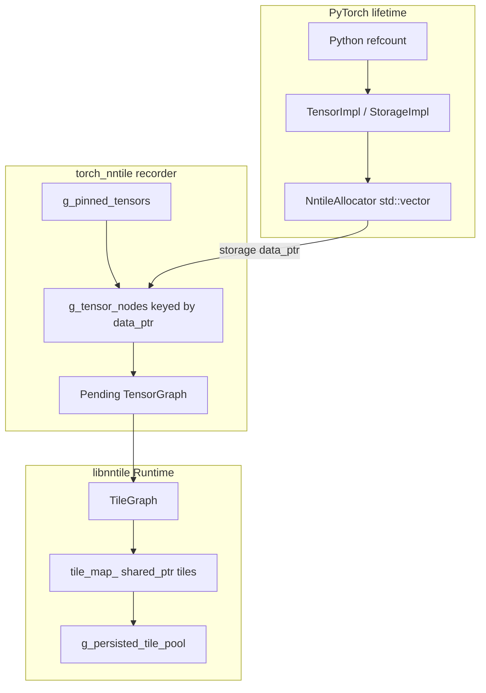

# PyTorch Tensor GC Investigation (torch_nntile)

This document records findings from investigating how PyTorch manages tensor
lifetime and how that interacts with torch_nntile's dual-memory model (host
`Storage` vs StarPU tiles). It supports future work to release intermediates
such as the temporary from `d = a + b + c` when they are no longer reachable
from Python and not required for backward.

**Probe script:** [`torch_nntile/tools/probe_tensor_lifetime.py`](../../torch_nntile/tools/probe_tensor_lifetime.py)

```bash
export LD_LIBRARY_PATH=$PWD/build/nntile:/opt/starpu/lib:$(python3 -c "import torch, os; print(os.path.join(os.path.dirname(torch.__file__), 'lib'))")
python3 torch_nntile/tools/probe_tensor_lifetime.py --nntile
```

Optional storage/pin tracing: set `TORCH_NNTILE_TRACE_STORAGE=1`.

---

## Architecture: two memory domains



| Layer | Owner | Freed when |
|-------|-------|------------|
| Host bytes | `NntileAllocator` (`std::vector`) | PyTorch `Storage` refcount → 0 |
| Recorder map | `g_tensor_nodes` | `reset_recorder_locked()` or shutdown |
| Pinned tensors | `g_pinned_tensors` | `clear_pending_graph_after_compile_locked()` |
| StarPU tiles | `Runtime::tile_map_` | Never shrunk today; session pool until shutdown/recompile |
| Tile adoption pool | `g_persisted_tile_pool` | `reset_recorder_locked()` / shutdown |

---

## PyTorch lifetime rules

### Reference counting

PyTorch tensors use C++ intrusive reference counting (`TensorImpl`,
`StorageImpl`). Python holds an additional reference. When all references drop,
`NntileAllocator::release_storage` deletes the host `std::vector` ([`nntile_allocator.cpp`](../../torch_nntile/csrc/nntile_allocator.cpp)).

Investigation API: `_C.storage_release_count()` increments on each host release.

### Autograd: values vs tensor objects

For `d = a + b + c` with `requires_grad=True`:

- **Output values** of `add` are **not** needed for backward (only `grad_output`
  and input metadata).
- **Built-in ops** do not use `save_for_backward`; they use internal
  `SavedVariable` packing at forward time.
- **`saved_tensors_hooks`** (PyTorch 2.x) fire only for tensors explicitly saved
  through the hook API, **not** for built-in `aten::add` internals. Probes
  recorded zero pack/unpack events for chained add on CPU.

**Important probe result:** for `t = a + b; d = t + c; del t`, the Python
`weakref` to `t` becomes dead immediately after `del t`, but `loss.backward()`
still succeeds. Autograd retains **packed C++ saved state**, not necessarily
the live Python `Tensor` wrapper.

Grad function chain for `d = a + b + c` (all inputs require grad):

```text
SumBackward0 → AddBackward0 → AddBackward0 → AccumulateGrad
```

When only `c` requires grad, the first add is outside the grad path:

```text
SumBackward0 → AddBackward0
```

### Explicit `save_for_backward`

Only [`_NntileCrossEntropy`](../../torch_nntile/torch_nntile/training.py) in
torch_nntile uses `ctx.save_for_backward(logits, target)`. All other ops rely
on PyTorch built-in autograd.

---

## Scenario matrix (`a + b + c` intermediate)

Validated with [`probe_tensor_lifetime.py`](../../torch_nntile/tools/probe_tensor_lifetime.py).

| Scenario | Python can drop unnamed intermediate | Autograd retains data for backward | Host storage freed (after pinning cleared) | NNTile tile reclaimable |
|----------|--------------------------------------|-----------------------------------|--------------------------------------------|-------------------------|
| `torch.no_grad()` | Yes, after `d` computed | No | Yes, when refcount → 0 | Yes (if not in live tile graph) |
| Training, all `requires_grad` | Yes (weakref dead) | Yes (packed SavedVariable) | After backward + refcount → 0 | Not until backward completes and session reset |
| Only `c` requires grad | Yes for `a+b` path | Partial (one `AddBackward0`) | Earlier for non-grad inputs | Partial |
| After `backward()` | Yes | No (saved vars released) | Yes | Yes (in principle; see gaps below) |
| Graph mode, before `compile_graph()` | Blocked by pinning | N/A | Blocked by `g_pinned_tensors` | N/A |

---

## torch_nntile recorder behavior (measured)

### Graph mode (`d = a + b + c`, training)

| Phase | `pinned_tensors` | `tensor_nodes` | `pending_ops` | `storage_releases` |
|-------|------------------|----------------|---------------|-------------------|
| After inputs created | 0 | 0 | 0 | 0 |
| After forward (`a+b+c`) | 6 | 5 | 2 | 0 |
| After backward (before execute) | 6 | 5 | 2 | 1 |
| After `compile_graph()` | 0 | 5 | 0 | 2 |
| After `run()` | 0 | 5 | 0 | 2 |
| After `del` all tensors + `gc` | 0 | 5 | 0 | 9 |
| After `shutdown_context()` | 0 | 0 | 0 | 9 |

Observations:

1. **Blanket pinning:** each add pins inputs and output (`pin_graph_op_output(out, true)` in [`nntile_add.cpp`](../../torch_nntile/csrc/nntile_add.cpp)). Six pinned tensors for two adds (2 inputs + 1 output per op).
2. **Pinning cleared at compile:** `g_pinned_tensors` drops to 0 after `compile_graph()`, allowing Python/autograd to drive host storage release.
3. **Host storage does free:** nine storage releases after deleting Python references post-run.
4. **`g_tensor_nodes` survives compile:** five entries remain (storage keys for weights/intermediates) until shutdown clears the map.
5. **`tile_pool` was 0** in this tiny untiled graph (first session; tiles may live only in `g_session->runtime->tile_map_` until a recompile triggers `capture_persisted_tiles_from_session`).

### Eager mode (baseline)

| Phase | `storage_releases` | `has_pending_graph` |
|-------|-------------------|---------------------|
| After forward | 1 | false |
| After `del` tensors | 5 | false |

Eager mode calls `execute_pending_graph_locked()` → `reset_recorder_locked()` per op batch ([`nntile_graph_recorder.cpp`](../../torch_nntile/csrc/nntile_graph_recorder.cpp)), fully resetting recorder state and releasing host storages promptly.

### Graph mode, `no_grad`

| Phase | `pinned_tensors` | `storage_releases` |
|-------|------------------|-------------------|
| After forward | 6 | 0 |
| After execute | 0 | 1 |

Intermediate host buffers can be released once pinning clears and Python drops refs.

---

## libnntile tile lifetime gaps

### Compile-time op DCE (implemented)

`Runtime::compile()` calls `eliminate_dead_ops()` ([`runtime.cc`](../../nntile/src/runtime.cc)), which removes unreachable tile **ops** from `execution_order_` based on marked inputs/outputs and dataflow liveness.

### Tile allocation ignores DCE (gap)

`allocate_missing_tiles()` iterates **all** `graph_.tile_nodes()` and inserts into `tile_map_`. Dead tiles from DCE are still allocated. `tile_map_` is never shrunk.

### Runtime `invalidate_submit()` (documented, not implemented)

[`graph.md`](../../graph.md) states intermediates are invalidated during execute via `Handle::invalidate_submit()`. The function exists in [`handle.cc`](../../nntile/src/starpu/handle.cc) but is **never called** from `Runtime::execute()` or related execution paths. A repo-wide search finds only the definition and the `graph.md` mention.

### Session tile pool (incremental training)

`capture_persisted_tiles_from_session()` pushes tiles into `g_persisted_tile_pool` to keep StarPU handles alive across recompiles ([`nntile_graph_recorder.cpp`](../../torch_nntile/csrc/nntile_graph_recorder.cpp)). This is intentional for weight/optimizer tile adoption but currently captures **all** session tiles.

### Intermediate host-bind policy (partial)

When an intermediate output storage is reused as a later op input, the recorder stops binding through that storage (`bind_at_execute = false`) because PyTorch may free or reuse it ([`nntile_graph_recorder.cpp`](../../torch_nntile/csrc/nntile_graph_recorder.cpp) L843–848). This decouples tile execution from host storage for intermediates but does not free tile memory.

---

## What blocks GC today

1. **`g_pinned_tensors` during graph recording** — prevents host collection until `compile_graph()` / `execute()`.
2. **`get_or_create_data_node(..., mark_as_input=true)` for all operands** in [`nntile_executor.cpp`](../../torch_nntile/csrc/nntile_executor.cpp) — treats every operand as a persistent bind candidate.
3. **`g_persisted_tile_pool`** — retains StarPU tile buffers across recompiles (needed for weights; overly broad for intermediates).
4. **`tile_map_` never shrinks** — `allocate_missing_tiles()` allocates for all tile nodes; DCE does not free buffers.
5. **No storage-free callback** — `g_tensor_nodes` keys on `data_ptr`; freed storage is not removed from the map (stale key risk if pinning were relaxed without invalidation).
6. **`invalidate_submit()` not wired** — runtime tile GC described in `graph.md` is not implemented.

---

## Design recommendations (follow-up implementation)

### 1. Selective pinning

Replace blanket `pin_graph_op_inputs` / `pin_graph_op_output(..., true)` with liveness-aware pinning:

- Pin only storages that are inputs to **pending** ops and not yet compiled.
- Unpin at `clear_pending_graph_after_compile_locked()` (already done globally).
- Do **not** pin backward grad outputs that autograd steals into `.grad` ([`nntile_graph_recorder_impl.h`](../../torch_nntile/csrc/nntile_graph_recorder_impl.h)).

### 2. Storage destructor hook

In `NntileAllocator::release_storage`, notify the recorder to remove or tombstone `g_tensor_nodes[data_ptr]`. Prevents stale pointer keys if host memory is reused by the allocator.

### 3. Autograd-aware retention

Use `torch.autograd.graph.saved_tensors_hooks` (or C++ saved-variable hooks) to extend tile lifetime **only** for tensors autograd actually packs/saves, instead of pinning every op output during recording.

### 4. Runtime tile GC

Implement liveness-driven `invalidate_submit()` during `Runtime::execute()` as documented in `graph.md`: after each op (or op range), invalidate tiles whose last consumer has executed. Inputs/outputs marked on tensor nodes must be exempt.

### 5. Compile-time tile liveness

After `eliminate_dead_ops()`, drop unreferenced entries from `tile_map_` (or skip allocating them in `allocate_missing_tiles()`). Restrict `g_persisted_tile_pool` to `is_persistent_input` / optimizer-state storages.

### 6. Distinguish persistent vs ephemeral in executor

Pass `mark_as_input=false` for intermediate operands that are outputs of prior ops in the same pending graph; reserve `mark_as_input=true` for user weights, activations explicitly moved to nntile, and optimizer state.

---

## Investigation tooling added

| API / tool | Purpose |
|------------|---------|
| `_C.storage_release_count()` / `reset_storage_release_count()` | Count host storage frees |
| `_C.debug_gc_stats()` → `GcDebugStats` | Snapshot `pinned_tensors`, `tensor_nodes`, `tile_pool`, pending graph |
| `TORCH_NNTILE_TRACE_STORAGE=1` | Log storage release and pin events to stderr |
| `probe_tensor_lifetime.py` | Reproducible CPU + nntile scenarios |

---

## Risks for future GC work

- **Stale `data_ptr` keys** if pinning is relaxed without storage-free invalidation.
- **Autograd vs NNTile mismatch** — host storage may be freed while StarPU tiles remain in `tile_map_` / `g_persisted_tile_pool`.
- **Grad stealing** — over-pinning backward grad buffers blocks `.grad` assignment.
- **Tile adoption** — aggressive tile free breaks `stage_persisted_tiles()` for weights across training steps.

---

## Out of scope

- NNGraph native autograd `buffers_` path ([`autograd_add_function.md`](autograd_add_function.md))
- Graph static execution / `execution.json` scheduling
- Implementing the recommendations above (separate implementation task)
