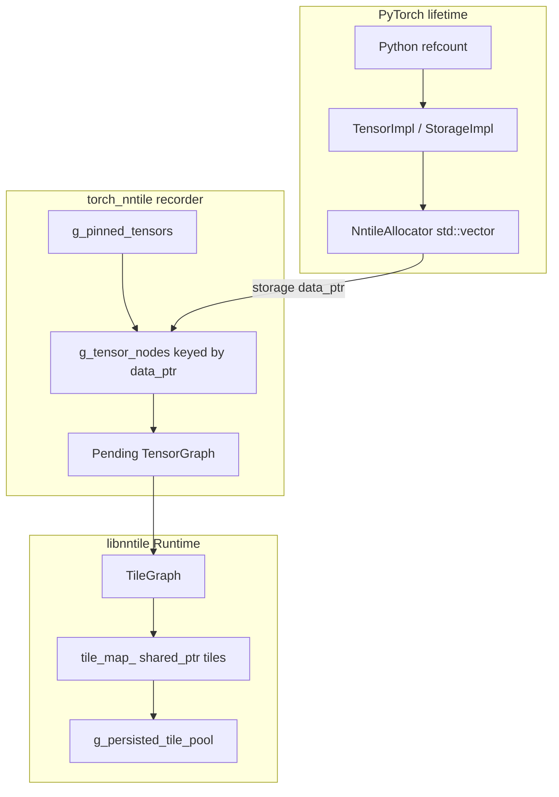
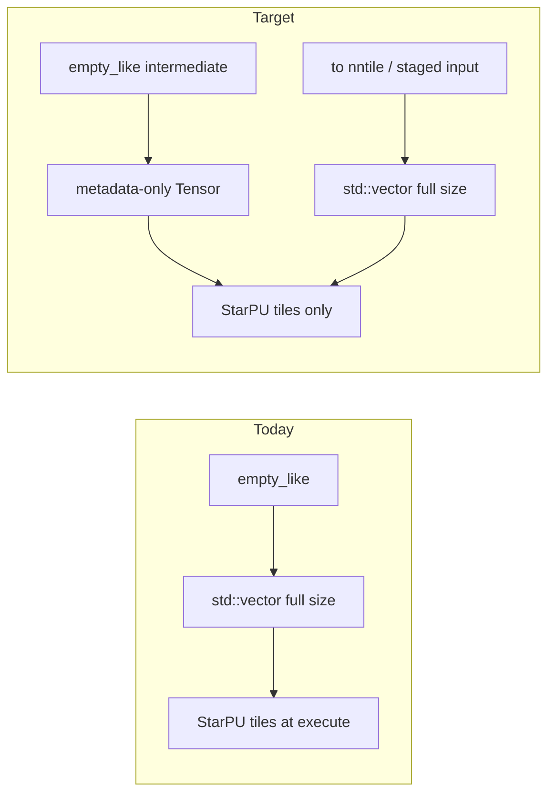

# PyTorch Tensor GC Investigation (torch_nntile)

This document records findings from investigating how PyTorch manages tensor
lifetime and how that interacts with torch_nntile's dual-memory model (host
`Storage` vs StarPU tiles). It supports future work to release intermediates
such as the temporary from `d = a + b + c` when they are no longer reachable
from Python and not required for backward.

**Probe script:** [`torch_nntile/tools/probe_tensor_lifetime.py`](../../torch_nntile/tools/probe_tensor_lifetime.py)

```bash
export LD_LIBRARY_PATH=$PWD/build/nntile:/opt/starpu/lib:$(python3 -c "import torch, os; print(os.path.join(os.path.dirname(torch.__file__), 'lib'))")
python3 torch_nntile/tools/probe_tensor_lifetime.py --nntile
```

Optional storage/pin tracing: set `TORCH_NNTILE_TRACE_STORAGE=1`.

---

## Architecture: two memory domains



| Layer | Owner | Freed when |
|-------|-------|------------|
| Host bytes | `NntileAllocator` (`std::vector`) | PyTorch `Storage` refcount → 0 |
| Recorder map | `g_tensor_nodes` | `reset_recorder_locked()` or shutdown |
| Pinned tensors | `g_pinned_tensors` | `clear_pending_graph_after_compile_locked()` |
| StarPU tiles | `Runtime::tile_map_` | Never shrunk today; session pool until shutdown/recompile |
| Tile adoption pool | `g_persisted_tile_pool` | `reset_recorder_locked()` / shutdown |

---

## PyTorch lifetime rules

### Reference counting

PyTorch tensors use C++ intrusive reference counting (`TensorImpl`,
`StorageImpl`). Python holds an additional reference. When all references drop,
`NntileAllocator::release_storage` deletes the host `std::vector` ([`nntile_allocator.cpp`](../../torch_nntile/csrc/nntile_allocator.cpp)).

Investigation API: `_C.storage_release_count()` increments on each host release.

### Autograd: values vs tensor objects

For `d = a + b + c` with `requires_grad=True`:

- **Output values** of `add` are **not** needed for backward (only `grad_output`
  and input metadata).
- **Built-in ops** do not use `save_for_backward`; they use internal
  `SavedVariable` packing at forward time.
- **`saved_tensors_hooks`** (PyTorch 2.x) fire only for tensors explicitly saved
  through the hook API, **not** for built-in `aten::add` internals. Probes
  recorded zero pack/unpack events for chained add on CPU.

**Important probe result:** for `t = a + b; d = t + c; del t`, the Python
`weakref` to `t` becomes dead immediately after `del t`, but `loss.backward()`
still succeeds. Autograd retains **packed C++ saved state**, not necessarily
the live Python `Tensor` wrapper.

Grad function chain for `d = a + b + c` (all inputs require grad):

```text
SumBackward0 → AddBackward0 → AddBackward0 → AccumulateGrad
```

When only `c` requires grad, the first add is outside the grad path:

```text
SumBackward0 → AddBackward0
```

### Explicit `save_for_backward`

Only [`_NntileCrossEntropy`](../../torch_nntile/torch_nntile/training.py) in
torch_nntile uses `ctx.save_for_backward(logits, target)`. All other ops rely
on PyTorch built-in autograd.

---

## Scenario matrix (`a + b + c` intermediate)

Validated with [`probe_tensor_lifetime.py`](../../torch_nntile/tools/probe_tensor_lifetime.py).

| Scenario | Python can drop unnamed intermediate | Autograd retains data for backward | Host storage freed (after pinning cleared) | NNTile tile reclaimable |
|----------|--------------------------------------|-----------------------------------|--------------------------------------------|-------------------------|
| `torch.no_grad()` | Yes, after `d` computed | No | Yes, when refcount → 0 | Yes (if not in live tile graph) |
| Training, all `requires_grad` | Yes (weakref dead) | Yes (packed SavedVariable) | After backward + refcount → 0 | Not until backward completes and session reset |
| Only `c` requires grad | Yes for `a+b` path | Partial (one `AddBackward0`) | Earlier for non-grad inputs | Partial |
| After `backward()` | Yes | No (saved vars released) | Yes | Yes (in principle; see gaps below) |
| Graph mode, before `compile_graph()` | Blocked by pinning | N/A | Blocked by `g_pinned_tensors` | N/A |

---

## torch_nntile recorder behavior (measured)

### Graph mode (`d = a + b + c`, training)

| Phase | `pinned_tensors` | `tensor_nodes` | `pending_ops` | `storage_releases` |
|-------|------------------|----------------|---------------|-------------------|
| After inputs created | 0 | 0 | 0 | 0 |
| After forward (`a+b+c`) | 6 | 5 | 2 | 0 |
| After backward (before execute) | 6 | 5 | 2 | 1 |
| After `compile_graph()` | 0 | 5 | 0 | 2 |
| After `run()` | 0 | 5 | 0 | 2 |
| After `del` all tensors + `gc` | 0 | 5 | 0 | 9 |
| After `shutdown_context()` | 0 | 0 | 0 | 9 |

Observations:

1. **Blanket pinning:** each add pins inputs and output (`pin_graph_op_output(out, true)` in [`nntile_add.cpp`](../../torch_nntile/csrc/nntile_add.cpp)). Six pinned tensors for two adds (2 inputs + 1 output per op).
2. **Pinning cleared at compile:** `g_pinned_tensors` drops to 0 after `compile_graph()`, allowing Python/autograd to drive host storage release.
3. **Host storage does free:** nine storage releases after deleting Python references post-run.
4. **`g_tensor_nodes` survives compile:** five entries remain (storage keys for weights/intermediates) until shutdown clears the map.
5. **`tile_pool` was 0** in this tiny untiled graph (first session; tiles may live only in `g_session->runtime->tile_map_` until a recompile triggers `capture_persisted_tiles_from_session`).

### Eager mode (baseline)

| Phase | `storage_releases` | `has_pending_graph` |
|-------|-------------------|---------------------|
| After forward | 1 | false |
| After `del` tensors | 5 | false |

Eager mode calls `execute_pending_graph_locked()` → `reset_recorder_locked()` per op batch ([`nntile_graph_recorder.cpp`](../../torch_nntile/csrc/nntile_graph_recorder.cpp)), fully resetting recorder state and releasing host storages promptly.

### Graph mode, `no_grad`

| Phase | `pinned_tensors` | `storage_releases` |
|-------|------------------|-------------------|
| After forward | 6 | 0 |
| After execute | 0 | 1 |

Intermediate host buffers can be released once pinning clears and Python drops refs.

---

## libnntile tile lifetime gaps

### Compile-time op DCE (implemented)

`Runtime::compile()` calls `eliminate_dead_ops()` ([`runtime.cc`](../../nntile/src/runtime.cc)), which removes unreachable tile **ops** from `execution_order_` based on marked inputs/outputs and dataflow liveness.

### Tile allocation ignores DCE (implemented in PR #425)

`allocate_missing_tiles()` now runs **after** `eliminate_dead_ops()` and skips
tiles outside the live set computed during DCE.

### Runtime `invalidate_submit()` (infrastructure added, execute hook deferred)

`Runtime::invalidate_tile_buffer()` and `release_intermediate_tiles_after_execute()`
are implemented but **not called** during `execute()` yet — enabling end-of-execute
invalidation triggered a StarPU handle assert in graph probes and needs more
coherency work. Compile-time liveness (skip dead tile allocation) is active.

### Session tile pool (incremental training, narrowed in PR #425)

`capture_persisted_tiles_from_session()` retains tiles only for
`is_persistent_input` storages (weights / optimizer state), not all session
tiles.

### Intermediate host-bind policy (partial)

When an intermediate output storage is reused as a later op input, the recorder stops binding through that storage (`bind_at_execute = false`) because PyTorch may free or reuse it ([`nntile_graph_recorder.cpp`](../../torch_nntile/csrc/nntile_graph_recorder.cpp) L843–848). This decouples tile execution from host storage for intermediates but does not free tile memory.

---

## What blocks GC today (after PR #425)

1. **Execute-time `invalidate_submit()`** — compile-time DCE skips dead tile
   allocation, but `tile_map_` is not shrunk during/after `execute()` yet.
2. **Autograd saved tensor hooks** — no `saved_tensors_hooks` integration; selective
   input pinning mitigates but does not cover all saved activations.
3. **Metadata output readout via `execute()`** — `torch_nntile.execute()` keeps
   the compiled session for `.cpu()` on metadata outputs; callers must use
   `compile_graph()` / `run()` / `shutdown_context()` explicitly in training loops.

**Addressed in PR #425:** blanket operand pinning, `data_ptr` recorder keys, full
host allocation for graph intermediates, unscoped `g_persisted_tile_pool`, and
executor `mark_as_input=true` for all operands.

---

## What blocked GC before PR #425 (historical)

---

## Proposition: host staging for inputs only

### Current behavior (problem)

**Every** new `device="nntile"` tensor gets a dense host `std::vector` via
[`NntileAllocator::allocate`](../../torch_nntile/csrc/nntile_allocator.cpp),
including:

- user-staged inputs (`x.to("nntile")`)
- op outputs (`at::empty_like` in [`nntile_add.cpp`](../../torch_nntile/csrc/nntile_add.cpp), [`nntile_relu.cpp`](../../torch_nntile/csrc/nntile_relu.cpp), backward buffers, etc.)

For `d = a + b + c` this means **five** host buffers (a, b, c, the `a+b`
intermediate, and d) even though compute runs on StarPU tiles and the recorder
already avoids binding intermediates from host after reuse.

### Target behavior

**Allocate host `std::vector` only for tensors staged as inputs** — tensors
that must hold host bytes for I/O or round-trip:

| Category | Host `std::vector` | Examples |
|----------|-------------------|----------|
| Staged input | Yes | `.to("nntile")` activations, parameters, labels |
| Persistent state | Yes | weights, optimizer velocity, in-place SGD params |
| User-visible output (optional) | Yes, on demand | loss/logits read via `.to("cpu")` when explicitly needed |
| Op intermediate | **No** | `a+b`, relu output, internal forward temps |
| Internal backward temp | **No** (tile-only) | non-leaf grad buffers not written to `.grad` |

Intermediates should be **graph/tile-only handles**: valid PyTorch
`Tensor` metadata (shape, dtype, device, autograd edge) with **no dense host
payload**. Values live in `TensorGraph` / `Runtime::tile_map_` until consumed or
read out.

### What already partially aligns

The recorder distinguishes inputs from intermediates at **execute** time, not at
**allocation** time:

| Mechanism | Staged / persistent | Intermediate |
|-----------|---------------------|--------------|
| `get_or_create_data_node(..., mark_as_input=true)` | operands marked input | outputs via `register_data_node` |
| `bind_at_execute` | `true` for staged inputs | cleared to `false` when storage is reused |
| `needs_host_copy` | `true` for weights / optimizer | `false` after reuse |
| `is_persistent_input` | weights, optimizer state | — |

So today we **do not bind** intermediates from host after reuse, but we still
**allocate** host storage when PyTorch creates the tensor.

### Implementation outline

1. **Metadata-only nntile tensors** — in graph mode (and optionally eager),
   op outputs from `empty` / `empty_like` get a `TensorImpl` with shape/dtype/
   device but **zero-byte or sentinel `Storage`** (no `resize(numel × itemsize)`).

2. **Stable identity without `data_ptr`** — `g_tensor_nodes` is keyed on
   `storage().data_ptr()` today; intermediates need an opaque recorder id
   (e.g. per-`TensorImpl` key or monotonic handle) so tile nodes are not tied
   to host buffer addresses.

3. **Explicit input staging** — `.to("nntile")` and copy-in paths allocate a
   full host buffer and set `is_persistent_input` / `bind_at_execute=true`.
   This is the only path that calls `NntileAllocator::allocate` with
   `nbytes > 0` for user data.

4. **Readout on demand** — `.to("cpu")` on a tile-only tensor syncs from
   runtime tiles into a **temporary** CPU tensor (or stages once if marked
   user-visible output). No standing host mirror for dead intermediates.

5. **Autograd grad buffers** — leaf `.grad` tensors and parameters still need
   staged host storage (or a dedicated grad-staging path). Internal backward
   temps (`grad_input` for non-leaf) can remain tile-only; keep
   `pin_graph_op_output(..., false)` for stolen grad buffers.

6. **Executor operand marking** — pass `mark_as_input=false` for operands that
   are outputs of a prior op in the same pending graph; reserve
   `mark_as_input=true` for staged storages only (complements recommendation 6
   below).

### Suggested first milestone

**Graph mode, forward only:** `empty_like` in op kernels returns metadata-only
tensors; `.to("nntile")` still allocates host bytes; `compile_graph()` +
`run()` executes without host mirrors for intermediates; `.to("cpu")` works for
marked outputs and staged inputs after sync.

Backward, eager mode, and SGD in-place updates follow in later milestones.



---

## Design recommendations (implementation status in PR #425)

### 1. Selective pinning (implemented)

`pin_graph_op_inputs` pins only staged/host-backed tensors;
`pin_graph_op_output(..., false)` is used for stolen grad buffers and
metadata-only intermediates.

### 2. Storage destructor hook (implemented)

`NntileAllocator::release_storage` calls `on_host_storage_released()`, which
removes the host pointer mapping and notifies the recorder via
`on_tensor_impl_released(TensorImpl*)`. `g_tensor_nodes` is keyed by
`TensorImpl*`, not `data_ptr`.

### 3. Autograd-aware retention (partial)

Selective input pinning reduces over-retention during recording. Full
`saved_tensors_hooks` integration is left as a follow-up for ops that save
unexpected tensors.

### 4. Runtime tile GC (partial)

`invalidate_tile_buffer()` is implemented; wiring it safely into `execute()`
remains follow-up work (see **Runtime `invalidate_submit()`** above).

### 5. Compile-time tile liveness (implemented)

See **Tile allocation ignores DCE** above. `capture_persisted_tiles_from_session()`
retains tiles only for `is_persistent_input` storages.

### 6. Distinguish persistent vs ephemeral in executor (implemented)

`mark_as_input_for_operand()` returns true for staged nntile inputs and CPU
label tensors only.

### 7. Input-only host staging (implemented)

Graph-mode `empty` / `empty_strided` return metadata-only tensors
(`empty_metadata_tensor`). `.to("nntile")` and `ensure_host_staging` allocate
host bytes. On-demand readout uses `copy_nntile_tensor_to_cpu()` while a
compiled session is active.

### 8. PyTorch-refcount output marks (implemented)

TensorGraph nodes linked to live nntile tensors are marked `mark_output(true)` at
creation. When the last Python reference dies, `on_tensor_impl_released` removes
only the stale `TensorImpl*` map entry and clears the output mark if no other
live tensor or param-grad registry entry still references that node — it does
**not** erase graph nodes or param-grad metadata for unrelated tensors.

`compile_graph()` calls `seal_output_marks_from_live_tensors_locked()`: clear
all output marks, re-mark live `g_tensor_nodes`, param grad nodes from
`g_param_grad_registry`, and their producer closure in the pending graph.
`sync_param_grad_aliases_locked()` runs after `run()` when copying results, not
at compile time.

`Runtime::execute()` calls `release_dead_tiles_after_op()` after each op so
intermediate tiles that are not graph inputs/outputs release StarPU buffers via
`invalidate_submit()`.

Users should `del` unneeded nntile tensors before `compile_graph()` to reduce
tile memory footprint (see `torch_nntile/README.md`).

## Investigation tooling added

| API / tool | Purpose |
|------------|---------|
| `_C.storage_release_count()` / `reset_storage_release_count()` | Count host storage frees |
| `_C.debug_gc_stats()` → `GcDebugStats` | Snapshot `pinned_tensors`, `tensor_nodes`, `tile_pool`, pending graph |
| `TORCH_NNTILE_TRACE_STORAGE=1` | Log storage release and pin events to stderr |
| `probe_tensor_lifetime.py` | Reproducible CPU + nntile scenarios |

---

## Risks for future GC work

- **Stale `data_ptr` keys** if pinning is relaxed without storage-free invalidation.
- **Autograd vs NNTile mismatch** — host storage may be freed while StarPU tiles remain in `tile_map_` / `g_persisted_tile_pool`.
- **Grad stealing** — over-pinning backward grad buffers blocks `.grad` assignment.
- **Tile adoption** — aggressive tile free breaks `stage_persisted_tiles()` for weights across training steps.

---

## Out of scope

- NNGraph native autograd `buffers_` path ([`autograd_add_function.md`](autograd_add_function.md))
- Graph static execution / `execution.json` scheduling
- Execute-time `invalidate_submit()` during long graphs (infrastructure exists;
  not enabled in `execute()` yet)
- Full `saved_tensors_hooks` autograd integration
