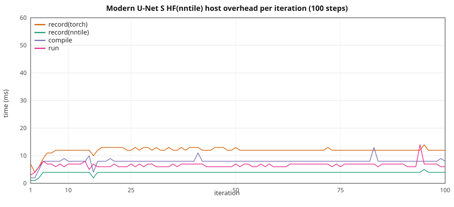

# Modern U-Net HF: graph overhead vs width / spatial size

**Notation.** Each label is **implementation(backend)**.

- **HF** — stock PyTorch `torch.nn` CNN (`TinyModernUNet` in
  [`train_unet_modern_tiny.py`](../../torch_nntile/examples/train_unet_modern_tiny.py)).
  Not HuggingFace Transformers; the name matches the transformer overhead
  docs (implementation outside the brackets).
- **cuda** — PyTorch CUDA (`device=cuda`).
- **nntile** (as backend) — StarPU / nntile (`device=nntile`).

**There is no nntile(nntile) modern U-Net.** `torch_nntile.models` has no
CNN ports; this study is only **HF(cuda)** vs **HF(nntile)**.

Two setups, same configs / 10 steps:

1. **HF(cuda)** — stock `TinyModernUNet`, `device=cuda`, no `torch_nntile`
   import.
2. **HF(nntile)** — same graph on `device=nntile` (aten / torch-native
   StarPU codelets: encoder / decoder, skip `cat`, `F.interpolate`
   bilinear `upsample_bilinear2d`, 1×1 reduce, pixel CE flattened to 1D).

Classic U-Net (`unet_hf_overhead_scale.md`) uses learnable
**`ConvTranspose2d`**. This modern variant upsamples with
**`F.interpolate(..., mode="bilinear")`** then a 1×1 reduce before the
skip `cat` — the common post-2018 pattern.

> **VRAM warning.** Same as classic U-Net: skip concatenations plus nntile
> graph buffers. Keep HF(cuda) well under the card limit so
> `device=nntile` stays on-device. Depth *d* needs `height` / `width`
> divisible by `2^d`. If logs show D2H volume, shrink `base_channels` or
> spatial size. GPUs are in exclusive mode — one process per GPU.

Configs: [`torch_nntile/examples/overhead_unet_modern/`](../../torch_nntile/examples/overhead_unet_modern/).
HF(cuda) / HF(nntile):
[`train_cnn_hf_overhead.py`](../../torch_nntile/examples/train_cnn_hf_overhead.py)
(`--model unet_modern`),
[`run_unet_modern_overhead_benchmark.py`](../../torch_nntile/tools/run_unet_modern_overhead_benchmark.py).

## Loss

Pixel-wise CE: NCHW logits vs NHW labels, flattened to 1D. New batch
seed per step: `42 + step`. `upsample_mode` is **bilinear** in every
overhead json.

## Train wall

Same recipe as
[`gpt2_hf_overhead_scale.md`](gpt2_hf_overhead_scale.md): nntile
`record → compile → wait(prev) → run`, wall from first record through
final `wait()`; HF(cuda) synced per iter. Prefetch outside the wall.
Iter 1 nntile `wait=0`; iter 10 `wait` includes the final join.

## Recipe

Spatial size grows with `base_channels`. **XL** uses **depth=3** and
192² (depth analog) so HF(nntile) fills an A40; XS–L stay at depth 4.

| | XS | S | M | L | XL |
|--|--:|--:|--:|--:|--:|
| Config | `unet_modern_xs.json` | `unet_modern_s.json` | `unet_modern_m.json` | `unet_modern_l.json` | `unet_modern_xl.json` |
| `depth` | 4 | 4 | 4 | 4 | **3** |
| `base_channels` | 256 | 384 | 480 | 576 | 1280 |
| `height` × `width` | 32² | 48² | 64² | 80² | **192²** |
| `upsample_mode` | bilinear | bilinear | bilinear | bilinear | bilinear |
| Params (FP32) | 463 M (1.72 GiB) | 1.04 B (3.88 GiB) | 1.63 B (6.06 GiB) | 2.34 B (8.73 GiB) | 2.87 B (10.69 GiB) |

B=1, 10 steps, seed 42, `--no-shuffle`, HF(cuda) and HF(nntile)
`--disable-tf32 --disable-cudnn`, `device=nntile` `--ncpu 0 --ncuda 1
--restrict-cuda`. NVIDIA A40, one GPU per job. Separate processes
(`PYTHONNOUSERSITE=1`; never import `torch_nntile` in the HF(cuda)
process). **Do not overlap jobs on one GPU.**

HF(cuda) / HF(nntile): **10 repeats** (mean ± stdev), including **S HF(nntile) 100-step**.
`STARPU_LIMIT_CUDA_MEM=46000`.

## Two setups

### Loss

Not bit-identical (unlike LeNet / VGG / MobileNet / classic U-Net). Means
differ by ~1e-5; per-run printed losses differ at ~1e-4. Likely bilinear
`interpolate` / extra D2D, not cuDNN BN.

| Setup | HF(cuda) | HF(nntile) |
|-------|-----:|----------------:|
| XS 32² | 1.136462 | 1.136498 |
| S 48² | 1.121675 | 1.121658 |
| M 64² | 1.135915 | 1.135917 |
| L 80² | 1.119733 | 1.119769 |
| XL 192² | 1.123983 | 1.123984 |

### 10-step train wall

**10 repeats** (mean ± stdev), `STARPU_LIMIT_CUDA_MEM=46000`.

| Setup | HF(cuda) | HF(nntile) | HF(nntile) / HF(cuda) |
|-------|-----:|---------:|--------------:|
| XS 32² | 0.606 ± 0.164 s | 0.634 ± 0.130 s | **1.05×** |
| S 48² | 1.028 ± 0.150 s | 1.063 ± 0.024 s | **1.03×** |
| M 64² | 1.664 ± 0.142 s | 1.708 ± 0.173 s | **1.03×** |
| L 80² | 2.614 ± 0.170 s | 2.685 ± 0.187 s | **1.03×** |
| XL 192² | 26.037 ± 0.097 s | 26.523 ± 0.236 s | **1.02×** |

### Peak VRAM and bus

10-step overlap, NVIDIA A40, `STARPU_LIMIT_CUDA_MEM=46000`, B=1. Peak VRAM is `nvidia-smi memory.used` polled by a sidecar process (`watch_gpu_peak.py`) while the train child runs (`peak_vram_gib=`). H2D/D2H are StarPU bus stats at shutdown from the VRAM-fit probe. **D2H is 0 on every size**.

| Setup | HF(cuda) VRAM | HF(nntile) VRAM | H2D | D2H |
|-------|----------:|----------------:|----:|----:|
| XS 32² | 3.8 GiB | 4.5 GiB | 1.73 GB | **0** |
| S 48² | 8.3 GiB | 9.7 GiB | 3.88 GB | **0** |
| M 64² | 12.8 GiB | 15.1 GiB | 6.06 GB | **0** |
| L 80² | 18.3 GiB | 21.8 GiB | 8.73 GB | **0** |
| XL 192² | 27.2 GiB | 35.6 GiB | 10.70 GB | **0** |

## HF(nntile) vs HF(cuda) (10 repeats)

Overlap mode. Host = `record(nntile)+record(torch)+compile`.

| Setup | HF(cuda) wall | HF(nntile) wall | HF(nntile) / HF(cuda) | record(nntile) | record(torch) | compile | run | wait | host/wall | isolated |
|-------|----------:|------------:|------------:|---------------:|--------------:|--------:|----:|-----:|----------:|---------:|
| XS 32² | 0.606 ± 0.164 s | 0.634 ± 0.130 s | **1.05×** | 0.031 ± 0.003 s | 0.094 ± 0.004 s | 0.058 ± 0.003 s | 0.056 ± 0.003 s | 0.395 ± 0.128 s | **29.6%** | 0.042 ± 0.001 s |
| S 48² | 1.028 ± 0.150 s | 1.063 ± 0.024 s | **1.03×** | 0.029 ± 0.002 s | 0.094 ± 0.006 s | 0.063 ± 0.006 s | 0.062 ± 0.003 s | 0.814 ± 0.029 s | **17.6%** | 0.089 ± 0.001 s |
| M 64² | 1.664 ± 0.142 s | 1.708 ± 0.173 s | **1.03×** | 0.029 ± 0.003 s | 0.094 ± 0.005 s | 0.057 ± 0.005 s | 0.059 ± 0.003 s | 1.468 ± 0.167 s | **10.5%** | 0.146 ± 0.001 s |
| L 80² | 2.614 ± 0.170 s | 2.685 ± 0.187 s | **1.03×** | 0.029 ± 0.001 s | 0.095 ± 0.003 s | 0.059 ± 0.004 s | 0.061 ± 0.003 s | 2.440 ± 0.191 s | **6.8%** | 0.240 ± 0.001 s |
| XL 192² | 26.037 ± 0.097 s | 26.523 ± 0.236 s | **1.02×** | 0.023 ± 0.005 s | 0.087 ± 0.012 s | 0.042 ± 0.007 s | 0.049 ± 0.009 s | 26.320 ± 0.248 s | **0.6%** | 2.609 ± 0.008 s |

## Sequential HF(nntile)

`--wait-after-run`: record → compile → run → wait (no overlap).

| Setup | HF(cuda) | HF(nntile) overlap | HF(nntile) sequential | seq / cuda |
|-------|-----:|---------:|----------:|----------:|
| XS 32² | 0.606 ± 0.164 s | 0.634 ± 0.130 s | 0.852 ± 0.189 s | **1.41×** |
| S 48² | 1.028 ± 0.150 s | 1.063 ± 0.024 s | 1.277 ± 0.143 s | **1.24×** |
| M 64² | 1.664 ± 0.142 s | 1.708 ± 0.173 s | 1.880 ± 0.163 s | **1.13×** |
| L 80² | 2.614 ± 0.170 s | 2.685 ± 0.187 s | 2.806 ± 0.168 s | **1.07×** |
| XL 192² | 26.037 ± 0.097 s | 26.523 ± 0.236 s | 26.706 ± 0.285 s | **1.03×** |

## S HF(nntile) 100-step

Overlap, size S, 100 steps, 10 repeats (mean ± stdev). Complements the 10-step HF ladder above.

Loss **1.114198**.

| | Total | mean / step |
|--|--:|--:|
| record(nntile) | 0.349 ± 0.025 s | 3.5 ms |
| record(torch) | 1.153 ± 0.040 s | 12 ms |
| compile | 0.755 ± 0.052 s | 7.5 ms |
| run | 0.641 ± 0.038 s | 6.4 ms |
| wait | 6.327 ± 0.126 s | 63 ms |
| **train wall** | **9.237 ± 0.051 s** | 92 ms |

Host (record + compile) is **24%** of the wall.



CSV: [`unet_modern_hf_overhead_s_100.csv`](unet_modern_hf_overhead_s_100.csv) (median of 10 runs).

## How to reproduce

```bash
export TORCH_LIB_DIR="$(python3 -c 'import os, torch; print(os.path.join(os.path.dirname(torch.__file__), "lib"))')"
export NNTILE_BUILD_DIR=$PWD/build TORCH_NNTILE_BUILD_DIR=$PWD/build
export LD_LIBRARY_PATH="${CONDA_PREFIX}/lib:${TORCH_LIB_DIR}:$PWD/build/nntile:$PWD/build/torch_nntile:${CONDA_PREFIX}/lib"
export STARPU_SILENT=1 STARPU_FXT_TRACE=0 STARPU_WORKERS_NOBIND=1
export STARPU_LIMIT_CUDA_MEM=46000

# Probe
python3 torch_nntile/tools/run_unet_modern_overhead_benchmark.py \
  --logdir /tmp/unet_modern_overhead_probe --gpu 0 --repeats 1 --sizes xs --skip-long

# Full ladder, 10 repeats, one idle GPU
python3 torch_nntile/tools/run_unet_modern_overhead_benchmark.py \
  --logdir /tmp/unet_modern_overhead --gpu 0 --repeats 10 --long-steps 100
```

Equivalent with the shared runner:
`python3 torch_nntile/tools/run_cnn_overhead_benchmark.py --family unet_modern ...`.
