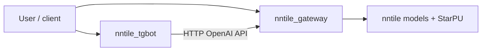

# Inference

NNTile inference spans three layers:

1. **Library** — the installable [`torch_nntile`](../../torch_nntile/README.md)
   wheel, which registers PyTorch `device="nntile"` and model helpers under
   [`torch_nntile/models/`](../../torch_nntile/models/)
2. **Examples** — [`torch_nntile/examples/`](../../torch_nntile/examples/)
3. **Services** — production-style **HTTP gateway** and **Telegram bot** in [`infra/`](../../infra/)



The bot never loads weights or uses a GPU; only the gateway process needs CUDA.

## Python library

The former Python bindings provided `nntile.model.generation` and
`nntile.inference` helpers. Current Python work should use `torch_nntile` as
the user-facing package and install it from a wheel built by the
CMake/cibuildwheel flow documented in [build/README.md](../build/README.md).

### Model helpers

`torch_nntile.models` includes PyTorch modules and Hugging Face loaders for
families such as BERT, RoBERTa, GPT-2, GPT-Neo, GPT-NeoX, Llama, T5, and
MLP-Mixer. Tests under [`torch_nntile/tests/`](../../torch_nntile/tests/)
cover model parity and supported `device="nntile"` operators.

Example:

```python
import torch
import torch_nntile

torch_nntile.init_context(ncpu=1, ncuda=1, verbose=0)

model = ...  # PyTorch or Hugging Face module using supported ops
model = model.to("nntile")
with torch.no_grad():
    output = model(input_ids.to("nntile"))
torch_nntile.wait()
```

### Standalone example scripts

Under [`torch_nntile/examples/`](../../torch_nntile/examples/):

| Script | Purpose |
|--------|---------|
| `train_gpt2_hf.py` | Tiny GPT-2 Hugging Face training/parity entrypoint |
| `train_bert.py`, `train_roberta.py` | Encoder model training examples |
| `train_gpt_neo.py`, `train_gpt_neox.py`, `train_llama.py`, `train_t5.py` | Decoder and seq2seq training examples |
| `simple_matmul.py`, `train_deep_relu_mnist.py` | Small operator/model smoke examples |

These scripts initialize `torch_nntile`, move tensors or modules to
`device="nntile"`, and run through PyTorch dispatch.

---

## NNTile HTTP gateway (`nntile_gateway`)

Package: [`infra/gateway/`](../../infra/gateway/). Installed editable in the Docker `nntile` image (`pip install -e infra/gateway`).

Multi-model, multi-user **OpenAI-compatible** HTTP service over NNTile inference engines.

### Features

- **Admin API** (`/admin/*`) — register models, issue API keys (Bearer `NNTILE_ADMIN_TOKEN`)
- **User API** (`/v1/*`) — per-key Bearer auth with in-process TTL cache
- **One** `nntile.Context` per gateway process; models registered into a shared registry
- **Storage:** in-memory (default) or SQLite (`NNTILE_GATEWAY_STORAGE=sqlite`) for persistence across restarts
- Generation serialized with a process-wide lock (shared StarPU/GPU state)

### HTTP endpoints

| Route | Auth | Purpose |
|-------|------|---------|
| `GET /healthz` | none | Health check |
| `POST /admin/models` | admin | Register and load a model (`ModelSpec` JSON) |
| `DELETE /admin/models/{id}` | admin | Unload model |
| `GET /admin/models` | admin | List registered models |
| `POST /admin/keys` | admin | Create API key |
| `GET /admin/keys` | admin | List keys |
| `DELETE /admin/keys/{id}` | admin | Revoke key |
| `GET /v1/models` | API key | OpenAI-style model list (+ `family`, `task`, `max_seq_len`) |
| `POST /v1/completions` | API key | Text completion |
| `POST /v1/chat/completions` | API key | Chat completion (template from tokenizer when available) |
| `POST /v1/embeddings` | API key | Encoder embeddings (BERT/RoBERTa, `task=embeddings`) |
| `POST /v1/fill_mask` | API key | Masked LM fill-mask (BERT/RoBERTa, `task=fill_mask`) |

### Model registration (`ModelSpec`)

| Field | Description |
|-------|-------------|
| `id` | Public name used in `/v1/*` requests |
| `family` | `llama`, `gpt2`, `gpt_neo`, `gpt_neox`, `t5`, `bert`, `roberta` |
| `hf_name` | Hugging Face repo id or local path |
| `dtype` | e.g. `fp32`, `bf16` |
| `max_seq_len` | Static sequence cap (must not be exceeded in requests) |
| `batch_size` | Batch size for loading |
| `task` | `completions`, `embeddings`, or `fill_mask` (default depends on family) |
| `cache_dir` | HF cache directory (e.g. `cache_hf`) |
| `extra` | Family-specific tiling knobs for the loader |

Example:

```bash
curl -s -X POST http://localhost:14000/admin/models \
  -H "Authorization: Bearer $NNTILE_ADMIN_TOKEN" \
  -H "Content-Type: application/json" \
  -d '{
    "id": "gpt2",
    "family": "gpt2",
    "hf_name": "gpt2",
    "max_seq_len": 256,
    "dtype": "fp32",
    "batch_size": 1,
    "cache_dir": "cache_hf"
  }'
```

### Gateway environment variables

| Variable | Default | Description |
|----------|---------|-------------|
| `NNTILE_ADMIN_TOKEN` | *(required)* | Bearer token for `/admin/*` |
| `NNTILE_GATEWAY_HOST` | `127.0.0.1` | Bind address (`0.0.0.0` in containers) |
| `NNTILE_GATEWAY_PORT` | `12224` | Listen port |
| `NNTILE_GATEWAY_NCPU` | `-1` | StarPU CPU workers (`-1` = all) |
| `NNTILE_GATEWAY_NCUDA` | `-1` | StarPU CUDA workers |
| `NNTILE_GATEWAY_STORAGE` | `memory` | `memory` or `sqlite` |
| `NNTILE_GATEWAY_SQLITE_PATH` | `gateway.sqlite3` | DB path when storage is `sqlite` |
| `NNTILE_GATEWAY_AUTH_CACHE_TTL` | `60` | API key cache TTL (seconds) |
| `NNTILE_GATEWAY_AUTH_CACHE_SIZE` | `1024` | API key cache size |

### Run the gateway

```bash
export NNTILE_ADMIN_TOKEN="$(openssl rand -hex 32)"
export NNTILE_GATEWAY_HOST=0.0.0.0
export NNTILE_GATEWAY_PORT=14000

python -m nntile_gateway
```

Docker (GPU):

```bash
docker run -d --rm --name nntile-gw --gpus all -p 14000:14000 \
  -e NNTILE_ADMIN_TOKEN="$NNTILE_ADMIN_TOKEN" \
  -e NNTILE_GATEWAY_HOST=0.0.0.0 \
  -e NNTILE_GATEWAY_PORT=14000 \
  -v "$HOME/.cache/nntile-hf:/workspace/nntile/cache_hf" \
  nntile:latest \
  python -m nntile_gateway
```

### Gateway tests

```bash
pip install -e infra/gateway[test]
pytest infra/gateway/tests

# Optional live test (CUDA + transformers + network/cache):
pytest infra/gateway/tests/test_live.py --live
```

Package details: [`infra/gateway/README.md`](../../infra/gateway/README.md).

---

## Telegram bot (`nntile_tgbot`)

Package: [`infra/tgbot/`](../../infra/tgbot/). **No GPU** — HTTP client to the gateway only.

### Architecture

| Module | Role |
|--------|------|
| `core.py` | Pure async logic (testable without Telegram) |
| `handlers.py` | aiogram v3 router → Telegram messages |
| `client.py` | httpx client for `/v1/models`, `/v1/chat/completions` |
| `state.py` | Per-chat model selection and rolling history |
| `config.py` | `BotConfig` from environment |

### Bot commands

| Command | Action |
|---------|--------|
| `/start`, `/help` | Usage |
| `/models` | List gateway models (inline buttons) |
| `/select <id>` | Select model by id |
| `/current` | Show selected model |
| `/reset` | Clear chat history (keeps model) |

Other messages are sent to `/v1/chat/completions` with a bounded history (`NNTILE_TGBOT_HISTORY_TURNS`).

### Bot environment variables

| Variable | Default | Description |
|----------|---------|-------------|
| `NNTILE_TGBOT_TOKEN` | *(required)* | Token from [@BotFather](https://t.me/BotFather) |
| `NNTILE_TGBOT_GATEWAY_URL` | `http://127.0.0.1:8000` | Gateway base URL |
| `NNTILE_TGBOT_API_KEY` | *(required)* | Key from `POST /admin/keys` |
| `NNTILE_TGBOT_ALLOWED_USERS` | *(empty)* | Comma-separated Telegram user IDs; empty = open |
| `NNTILE_TGBOT_HISTORY_TURNS` | `8` | Max history turns per chat |
| `NNTILE_TGBOT_MAX_TOKENS` | `128` | Generation cap (capped per model from `/v1/models`) |
| `NNTILE_TGBOT_REQUEST_TIMEOUT` | `120` | HTTP timeout (seconds) |
| `NNTILE_TGBOT_TELEGRAM_PROXY` | falls back to `HTTPS_PROXY` / `HTTP_PROXY` | Outbound proxy for Telegram API |

The gateway client uses `trust_env=False` so Docker-internal gateway URLs are not sent through the proxy.

### Run the bot

```bash
pip install -e infra/tgbot

export NNTILE_TGBOT_TOKEN="..."
export NNTILE_TGBOT_GATEWAY_URL="http://127.0.0.1:14000"
export NNTILE_TGBOT_API_KEY="nnt_..."

python -m nntile_tgbot
```

### Bot tests

```bash
pip install -e infra/tgbot[test]
pytest infra/tgbot/tests
```

Uses `httpx.MockTransport` — no live Telegram or gateway required.

Package details: [`infra/tgbot/README.md`](../../infra/tgbot/README.md).

---

## Two-container deployment

Full step-by-step recipe (network, register models, issue key, start bot): [`infra/README.md`](../../infra/README.md).

Summary:

1. Build image: `docker build -t nntile:latest .`
2. Start **gateway** on a Docker network with `--gpus all`, register models via `/admin/models`, create key via `/admin/keys`
3. Start **bot** on the same network with `NNTILE_TGBOT_GATEWAY_URL=http://<gateway-hostname>:<port>`

Use `NNTILE_GATEWAY_STORAGE=sqlite` and a mounted volume if admin state must survive gateway restarts.

---

## See also

- [build/README.md](../build/README.md) — Docker image includes both `infra` packages
- [python/models.md](../python/models.md) — loading models for inference
- [python/training.md](../python/training.md) — training vs inference entry points
